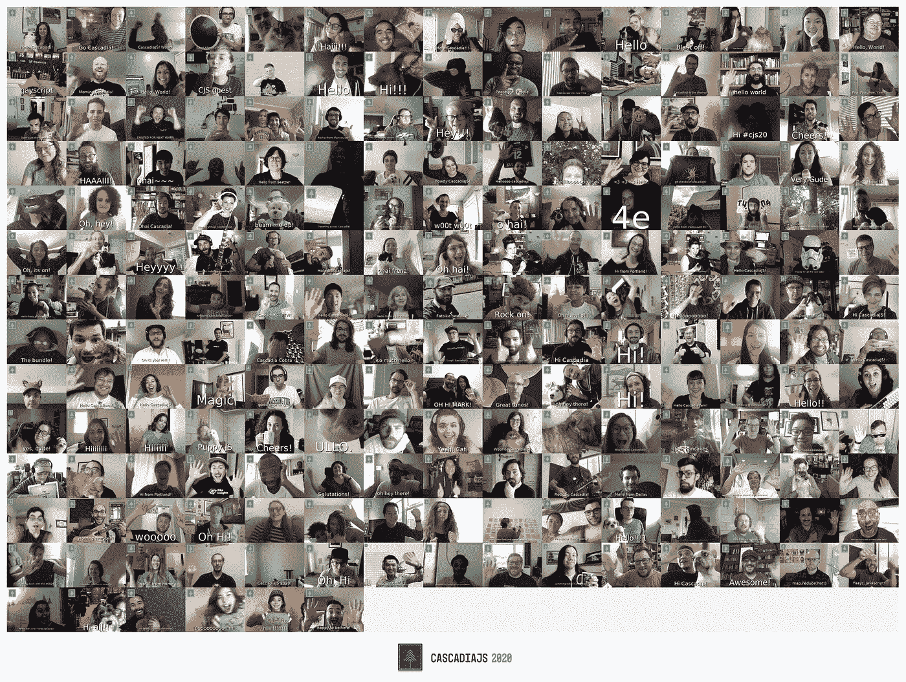
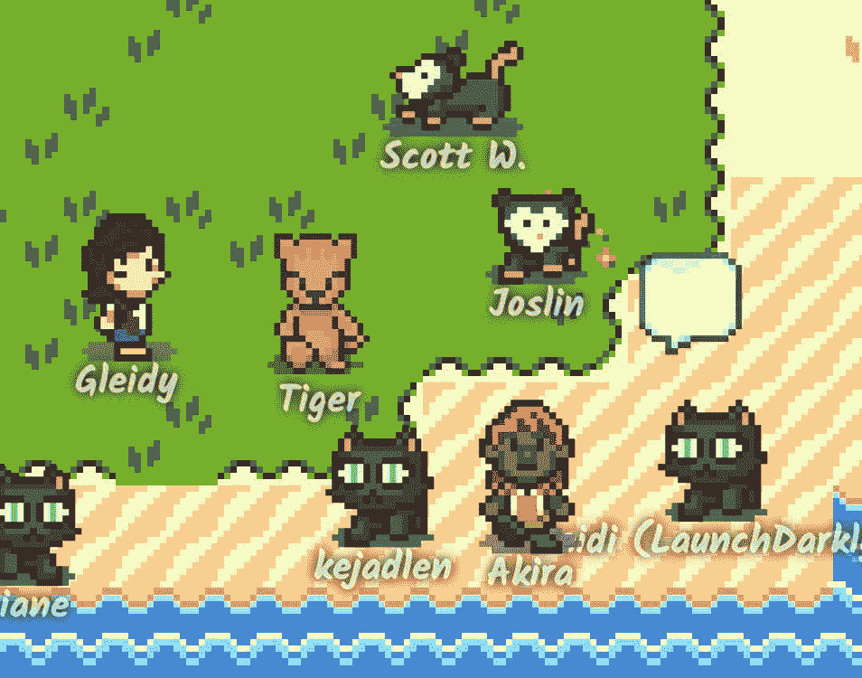
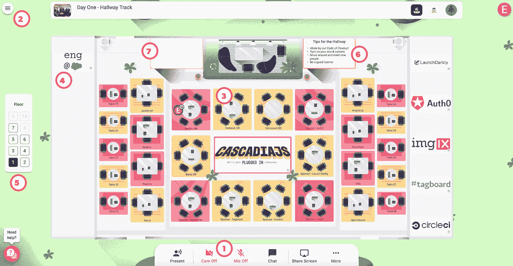
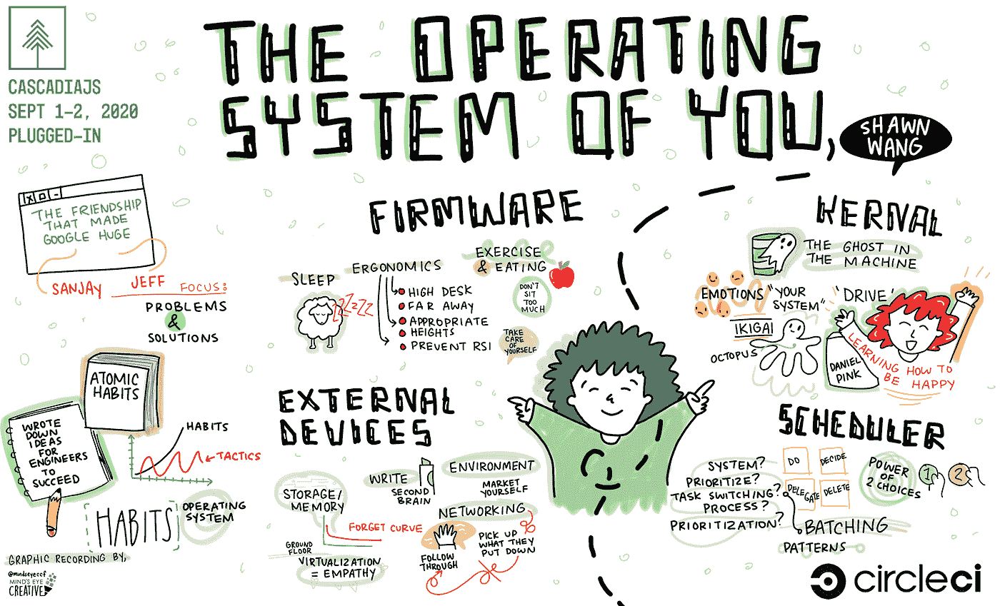
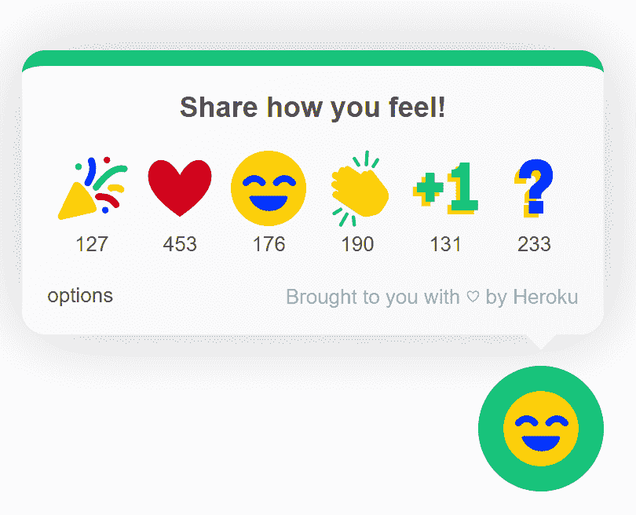
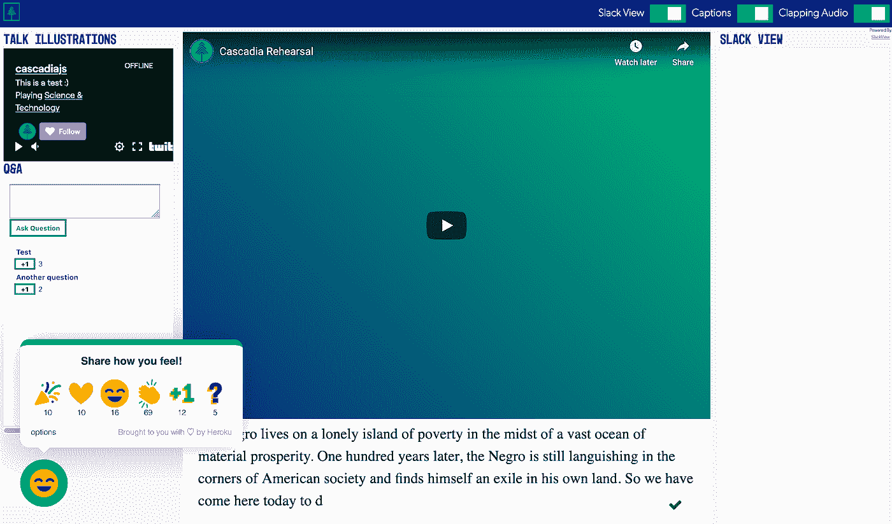
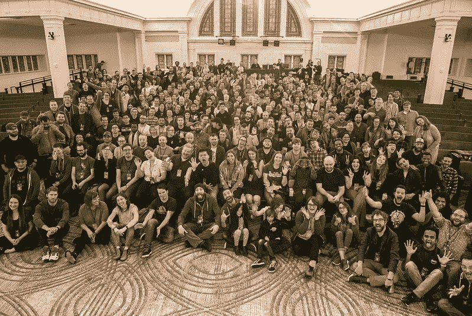
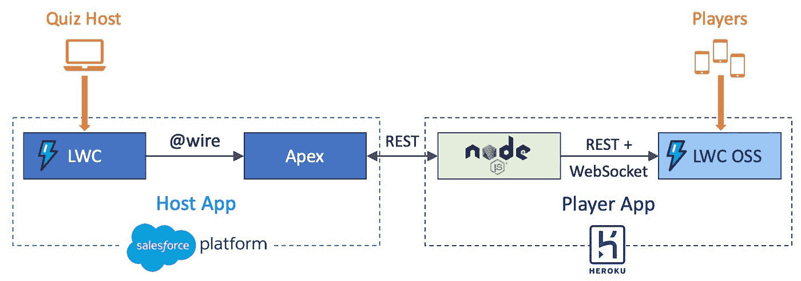
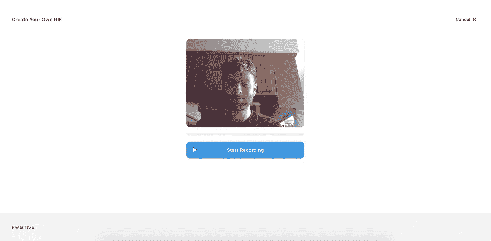

# 我们需要让虚拟开发会议变得更好

> 原文：<https://betterprogramming.pub/we-need-to-make-virtual-dev-conferences-better-ef4803b6fe76>

## 虚拟会议还有很长的路要走

图片来源:作者

在可预见的未来，我们都将受困于虚拟会议。虽然这种形式并不理想，我们都很怀念面对面的互动，但我们还是尽可能把这些活动做到最好。我们都想要比另一个 Zoom 直播更有趣的东西。

最近，我参加了 CascadiaJS 会议——这是一个在美国太平洋西北部为网络开发者举办的会议。和今年的大多数会议一样，这次会议是虚拟召开的。和今年的大多数会议一样，组织者承诺这次会议将更少虚拟，更多互动。

但是卡斯卡迪亚斯实际上*通过让他们的会议比你典型的在线活动更有趣，实现了他们的承诺。我印象深刻。因此，我想谈一谈他们是如何做到这一点的，他们有哪些独特的功能，然后看看他们使用的开源项目(称为 [FOSTIVE](https://github.com/fostive) ),旨在为每个人创造更好的虚拟会议。我希望未来的活动将继续(并扩展)这种更有趣、互动的虚拟体验的趋势。*

# 卡斯卡迪亚斯会议

首先，我们来看看卡斯卡迪亚斯会议。正如我上面提到的，我印象深刻。组织者不仅在必要的会议基础知识方面做得很好(他们召集了一群关于有趣和独特主题的演讲者，如[你的操作系统](https://2020.cascadiajs.com/speakers/shawn-wang)和[酸/碱难题](https://2020.cascadiajs.com/speakers/sangeetha-kp))，而且他们还提供了一个非常棒的互动体验。

该会议结合了我预期的特点:

*   直播
*   宽松的房间
*   基本问答
*   一个礼品袋(在会议前及时邮寄给你)

还有一些面对面会议的典型特征，但为远程体验进行了现代化:

*   更多的赃物，但数字(像定制的[快照镜头](https://snapcamera.snapchat.com/)
*   数字职业之夜
*   预发布 [Arduino 物联网](https://www.arduino.cc/)套件的在线抽奖(以及与 Arduino 和 Heroku 参加[研讨会)](https://dev.to/heroku/interested-in-iot-dev-want-a-jumpstart-with-the-new-arduino-explore-iot-soon-to-be-released-kit-tell-us-more-228a)

接下来，大会通过一些我以前从未见过的功能真正提升了他们的水平:

*   一场比赛，看谁能在 TwilioQuest(一款受 16 位时代经典作品启发的电脑角色扮演游戏)中跑得最远
*   [漫步者](https://rambly.app/)，一个“8 位宇宙，你可以选择一个虚拟形象，四处走动，进行纯音频对话”

来自 Rambly 的屏幕截图

*   有 DJ 的远程开幕晚会
*   在走廊轨道上，你可以使用 [Remo](https://2020.cascadiajs.com/remo) 和其他几个人坐在虚拟的桌子旁

卡斯卡迪亚斯的走廊痕迹

*   [卡拉 ok 之夜](https://2020.cascadiajs.com/karaoke)！

但给我印象最深的是整个会议仪表盘。仪表板将几个不同的元素整合到一个易于使用的单一界面中。用户界面包含:

*   会议的现场直播
*   问答小部件
*   艺术家的独特[实时流](https://www.mindseyecreative.ca/)“实时演示”每个演讲:

令人惊叹的直播插图示例

*   一个自定义的“表情”按钮，显示你在任何特定时刻的感受

表情按钮

*   松散进料
*   字幕
*   和会谈时间表

你可能会认为这么多信息同时出现在一个视图中，你会被信息过载弄得不知所措——但这确实有效！仪表板设计得很好，感觉很自然。

会议仪表板

通过仪表盘上的功能组合，我感觉不太像是在一个缩放的直播流中，而更像是在与整个会议进行互动。当然，我仍然很遥远，但我有各种渠道进行互动，就像在面对面的会议上一样。这是我用过的最好的会议界面。

# 家庭照片应用

我喜欢的另一个功能是家庭照片应用程序。通常在会议上，组织者会给每个与会者拍一张“全家福”。

CascadiaJS 2019 全家福

由于今年不可能，他们开发了一个名为家庭照片应用的虚拟版本。

该应用程序在浏览器中运行，拍摄参与者的三秒钟视频，并将视频转换为动画 GIF(带有可选的文本行)。

然后，它将所有的动画 gif 组合成一个视图，供每个人查看。太棒了！

更好的是，Family Photo 应用程序和 dashboard 的 emote widget 都是开源应用程序，包含在 FOSTIVE 项目中。

# 什么是 FOSTIVE？

FOSTIVE(不可思议的虚拟活动免费开源工具)是一个虚拟活动开源应用的集合。它是由 Heroku 和 T2 的 Salesforce 开发者关系团队创建的。

该项目包含几个应用程序，都是为了让虚拟活动更具互动性和趣味性。这个想法是，未来的项目可以采用这些应用程序，改进它们，添加更多，等等。，帮助我们在受限于虚拟活动的世界中获得更多乐趣。FOSTIVE 项目非常新，是与 CascadiaJS 活动同时启动的，所以它才刚刚开始。让我们简单看一下回购中当前的每个应用程序。

## 表情小部件

该应用程序“允许观看活动流的虚拟活动参与者与其他参与者和演示者实时分享他们的情绪。这是一种更高逼真度、虚拟的拍手方式。”这是你在会议仪表板左下方看到的表情符号部件。它允许参与者“表情化”——然后记录每场演示中这些表情的数量。

客户端是使用 [Lightning Web Components](https://lwc.dev/) (一个开源的 Web 组件框架)编写的，可以很容易地插入到你的网页中。它使用 [anime.js](https://animejs.com/) 制作表情动画。

服务器用 [Node.js](https://nodejs.org/en/) 编写，使用 [Redis](https://redis.io/) 进行消息传递和内存数据存储，部署到 Heroku 进行托管。

## 多人问答游戏应用

多人竞猜 app，顾名思义，是一个多人竞猜节目，有一个主持人和一群远程参赛者。参赛者正确回答每个问题的速度越快，得分越高。该应用程序包括一个排行榜，显示参赛者的当前得分和排名。

这里有一个应用程序运行的视频[。](https://www.youtube.com/watch?v=vLTZ_jdwhRo)

该应用程序有一个客户端和一个服务器，需要 Salesforce 才能运行(Salesforce 的[免费开发者版](https://developer.salesforce.com/signup)工作正常)。

主机应用程序运行在 Salesforce 之上，绑定到 Salesforce 组织来加载测验的问题。

播放器应用程序是用 LWC 构建的移动应用程序。它运行在部署到 Heroku 的节点上。(你可以和一小群玩家免费运行。然而，像大型会议这样规模的活动需要付费计划。)

## 家庭照片应用程序

最后，我最喜欢的:家庭照片应用程序(回购中称为“gif-booth”)。

正如我上面提到的，家庭照片应用程序会拍摄参与者的三秒钟视频，并将其转换为动画 GIF。

创建你的动画 GIF

然后应用程序将他们添加到所有 gif 的视图中，这样你就可以看到其他与会者了！

我在会议上制作的视频中看到了很多创意。有一句口头禅是“哦，你好！”惊喜 gif，几个基本波，当然，自由包容狗猫。

家庭照片应用程序使用 Node with [FFmpeg](https://ffmpeg.org/) 来处理视频，并使用亚马逊 S3 桶进行存储。客户端是用 React 写的。

## 其他想法

回购中还有一系列很酷但尚未实施的想法(包括实时评论讲座、赠品和 Twilio 的[可黑客攻击的像素艺术板](https://www.twilio.com/blog/2017/06/drawing-pixel-art-text-messages-signal-video-wall.html))。欢迎任何人给这个列表贡献未来项目的可能想法，或者在列表上抓住一个并开始实施它。

# 未来会有更好的活动

那么，未来的事件如何才能取得 CascadiaJS 的成功并推动其向前发展呢？

首先，我认为卡斯卡迪亚斯将传统的 T4 和新的 T7 结合得恰到好处。他们关注正确的内容、正确的内容交付以及参与者互动的新方式。他们挖掘了一些开发者喜欢的东西——复古(具有 8 位和 16 位应用外观和感觉的应用)、我们可以舒适地表达自己的动画 gif、开源项目(FOSTIVE)和免费的东西。他们在一个设计良好的界面中完成了这一切——停止了所有的用户界面/UX 抱怨(我们喜欢抱怨用户界面/UX，对吗？)在他们的轨道上。他们乐在其中！

未来的会议应该效仿这种结合。我提出这一点是因为我喜欢参加更多这种类型的活动，并认为我们都可以通过想法或代码为回购做出贡献，并不断使虚拟活动变得更加令人兴奋。