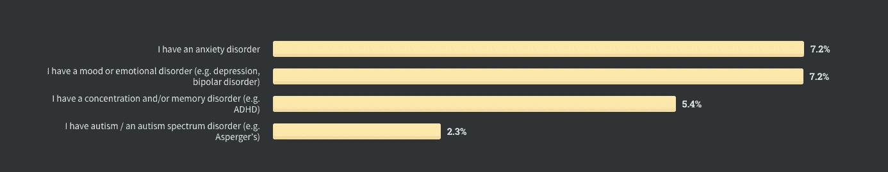

# 我们需要谈谈软件开发人员的心理健康

> 原文：<https://betterprogramming.pub/we-need-to-talk-about-mental-health-for-software-developers-65bfa00e2356>

## 五个主要风险因素和四个解决方案

来自 [Pexels](https://www.pexels.com/photo/woman-in-white-crew-neck-t-shirt-and-blue-denim-jeans-working-on-a-laptop-3987025/?utm_content=attributionCopyText&utm_medium=referral&utm_source=pexels) 的 [Anna Shvets](https://www.pexels.com/@shvetsa?utm_content=attributionCopyText&utm_medium=referral&utm_source=pexels) 的照片

在 [Stack Overflow 的 2020 年开发者调查](https://insights.stackoverflow.com/survey/2020)——一个包括超过 6.5 万名开发者参与的研究项目——中，15%的受访者承认有某种类型的精神问题，焦虑和抑郁是最常见的问题。这些结果表明，在编码专业人员中，心理问题非常普遍。

关于精神健康和差异的结果 [Stack Overflow 的 2020 年开发者调查](https://insights.stackoverflow.com/survey/2020)

是的，编程技能需求很大，而且有很多机会建立一个稳定的职业生涯，有高薪和丰厚的福利。对许多人来说，这足以让他们过上满意而幸福的生活。然而，这并不是心理健康的工作方式。

编程可能是一个充满压力、孤独和耗费生命的职业，许多开发人员都在与情绪和精神障碍作斗争。由于五月是心理健康宣传月，我认为这是解决这个问题的最佳时机。

# 开发人员职业生涯中精神问题的风险因素

## 隔离

与“社交笨拙的书呆子”的刻板印象可能让你相信的相反，成功的编程生涯需要一些社交技能。程序员需要能够与他们的团队讨论解决方案，指导初级开发人员，向经理报告，并扩展他们的网络以在工作中取得进展。

然而，编码本身仍然是一项孤独的活动。很简单:当你的大脑专注于调试，你的眼睛向下滚动文档，你的手指打字时，你没有在情感上与任何人联系。

因此，开发人员不得不依靠同事关系或维持工作之外的友谊来满足他们的社交需求。这可能不像看起来那么简单。

与同事交流是一项挑战。虽然一些内向的人可能不认同“啤酒和乒乓球桌”的创业氛围，但他们也可能不会被企业界的外交对话逗乐。对于来自少数民族的人来说，融入社会更加困难。另一方面，工作之外的关系往往成为纯粹的牺牲品，因为拥有一份全职工作可能会超出朝九晚五的典型工作时间。

这是一个令人担忧的话题，因为[孤独不仅会增加自杀风险，而且从长远来看还会对健康产生严重影响](https://www.cdc.gov/aging/publications/features/lonely-older-adults.html)。我们是[天生的群居动物](https://www.forbes.com/sites/nickmorgan/2015/09/01/we-humans-are-social-beings-and-why-that-matters-for-speakers-and-leaders/?sh=69858536abda)，即使是最内向的程序员也需要归属感。

## 久坐主义

编程是一项办公室活动。即使是站着的桌子，编码也不需要高强度的身体活动，这带来了严重的健康问题。

有广泛的研究表明久坐与肥胖、心血管疾病、糖尿病和高死亡率等健康问题有关。但是，每天花 40 个小时坐在办公桌前的危险超出了生理范围。大脑活动需要氧合，这是通过有效的呼吸和血液循环来实现的。这就是为什么久坐与[较低的精神敏锐度](https://www.medicaldaily.com/pulse/risks-sitting-all-day-sedentary-lifestyle-affects-muscle-movement-brain-activity-327154)，增加的[压力](https://www.sciencedirect.com/science/article/abs/pii/S1755296613000252)，[焦虑](https://www.eurekalert.org/pub_releases/2015-06/bc-iaa061615.php)，[抑郁](https://pubmed.ncbi.nlm.nih.gov/23953353/)，以及[降低的幸福感](https://pubmed.ncbi.nlm.nih.gov/22065302/)联系在一起。

编程是一项密集的脑力活动，但却是一项久坐不动的活动。因此，开发人员必须在工作时间之外保持积极的生活方式，以避免他们的健康受到威胁。

## 高屏幕时间

开发人员的工作日主要是在屏幕前度过的。这令人担忧，不仅因为这是久坐不动的行为，还因为长时间看屏幕与严重抑郁有关。原因之一是电子屏幕发出的光干扰了褪黑激素的产生和自然的昼夜节律，[扰乱了睡眠](https://www.pnas.org/content/112/4/1232.abstract)。晚上工作的开发人员，无论是因为他们在做额外的工作，自由职业，还是为不同时区的人工作，都特别容易因为使用屏幕而睡眠不足。

睡眠是幸福的支柱之一。当一个人感到疲劳时，他是不可能达到最高效率的。睡眠剥夺还会形成一个危险的循环，促使人们进行久坐不动的活动，并消耗兴奋剂(如咖啡因和尼古丁)，这将进一步降低睡眠质量。

这就是为什么[专家强烈推荐睡前进行](https://www.healthline.com/nutrition/block-blue-light-to-sleep-better#tinted-glasses)线下活动，这对于在线工作的人来说并不总是可能的。

## 强调

紧迫的截止日期。跟上最新技术趋势的压力。那个不停寻求帮助的小戴夫。第三次未被批准的拉式请求。嘈杂的开放空间，经理在晚上 8 点后发邮件。所有这些都是那个(不)著名的词的一部分:压力。

虽然低水平的压力实际上有利于创造动力来满足最后期限，并鼓励为出色的交付付出额外的努力，但长时间暴露在高强度的压力下是耗尽精力的最佳条件。

如果压力是一种状况，那么焦虑、抑郁和倦怠就是后果。在漫长而痛苦的旅程中，开发人员要应对频繁的头痛、睡眠中断、低能量、消极和注意力不集中等症状。没有人在这些条件下有好的表现，最终都崩溃了。

## 非包容性环境

虽然科技行业一直在努力增加行业的多样性，但数据显示，要实现平等还有很长的路要走。

[平等报告](http://marketing.dice.com/pdf/2021/Equality_in_Tech_Report.pdf)揭示了性别和种族歧视如何影响工资、福利和职业发展，如领导和晋升机会。[在科技行业，黑人和西班牙裔毕业生在人际交往和招聘方面有更多的困难。](https://www.nytimes.com/2016/02/26/upshot/dont-blame-recruiting-pipeline-for-lack-of-diversity-in-tech.html)[女性仍然被迫在产假期间重返工作岗位，并担心生完孩子后会失业。而且在 LGBTQ+人群方面，看起来有](https://www.indeed.com/lead/report-diversity-equality)[的数据差距](https://techcrunch.com/2016/02/24/bullish-lgbtq-people-in-tech/)。然而,[评价](https://www.geekwire.com/2015/out-in-tech-what-its-like-to-be-lgbt-in-an-industry-struggling-with-diversity/)让我们了解了 LGBTQ+开发者在工作场所必须面对的偏见类型。

一篇文章不足以准确地详细描述非白人、cis、异性恋男性的开发人员如何更有可能面临让他们感到孤立、被误解、被搁置、被贬值和工作被贬低的情况——这极大地影响了他们的心理健康。

# 开发者如何预防心理健康问题？

## 自知

预防精神问题的第一步是意识到它们的症状。易怒、疲劳、压力、食欲不振、缺乏动力、注意力不集中——所有这些都是令人担忧的信号。不要陷入“每个人在我的工作中都有压力”或“现在每个人都很累”的误区。如果你感觉不舒服，并且你的表现受到任何这些症状的影响，你应该认真对待它们。

## 将你的担忧带到社区中

你的生活和你的问题肯定是独特的。但这并不意味着你必须独自面对他们。无论你对新的职业变动感到焦虑，对经理的决定感到担忧，感觉与同事脱节，或者只是在管理个人生活和工作方面遇到困难，都可以和某人谈谈。

如果你不知道可以和谁交谈，或者你觉得分享它很尴尬，尝试一些在线社区。例如，Reddit 有多个社区，你可以和他们谈论你的生活。你可以匿名发帖，并收到来自不同群体的公正反馈。这些社区可以是特定于技术的(如 [r/webdev](https://www.reddit.com/r/webdev/) )，也可以不是(如/askMenOver30)。

你也可以寻找与你的个人资料相匹配的技术社区。例如，我最近加入了葡萄牙妇女科技公司，该公司经营着一个在线论坛，我可以在任何时候联系到任何人。他们会组织一些活动，让我成为其他科技专业人士网络中的一员，这些人了解作为葡萄牙劳动力中的女性开发人员的特殊性。

## 保持健康的习惯

健康的身体是迈向健康心智的关键一步。充足的睡眠、健康的饮食和体育锻炼是每个人的重要习惯。是什么阻碍了你保持健康的生活方式？也许是时候在睡觉前开始阅读，而不是在电脑屏幕上狂看电视节目了。也许是时候停止给你的咖啡加糖了。[当然，是时候戒烟了](https://byrslf.co/stop-smoking-now-10-unexpected-benefits-of-quitting-c59745e163dd)。如果你没有时间锻炼，请注意每小时走五分钟的路会有所不同。

## 向专业人士报到

本文中的每一条信息和建议都必须持保留态度，因为我不是心理健康专家。为你的具体问题找到正确答案的唯一方法是寻求专业帮助。对精神问题进行治疗或服用药物仍然是一种耻辱，但这只是一种耻辱，而不是事实。值得重复的是，几乎每个人都能从治疗中受益。即使你是一个健康的人，但想改善自己的某些方面，治疗师或私人教练肯定能帮助你更快、更有效地达到目标。

# 外卖

每个职业都有其特殊性，会引发心理健康问题，编程也不例外。编程是一项久坐的、个人的、压力大的活动，需要大量的屏幕时间。这些是导致低质量睡眠、难以集中注意力、缺乏动力和易怒的主要风险因素，仅举几个焦虑、抑郁和倦怠的症状。

保持健康的生活方式，融入一个支持性的社区，一旦出现令人担忧的迹象，获得专业帮助，是防止严重精神问题发展的关键措施。

保重！