# 我们过度加工了一个茶壶

> 原文：<https://betterprogramming.pub/we-overengineered-a-teapot-c718251ce897>

## 过度工程很有趣，但是它会欺骗你和你的团队，让他们认为实际的价值已经实现了

> 过度设计(Overengineering)是指将产品设计得比其预期用途所需的功能更强大或更多，或者将流程设计得不必要的复杂或低效(https://en.wikipedia.org/wiki/Overengineering)。

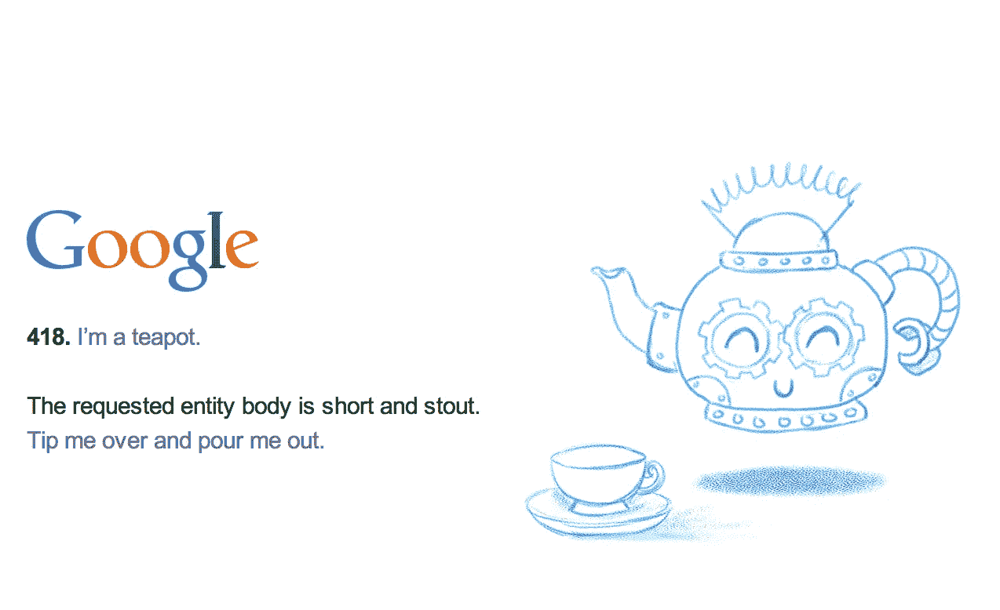

# 为什么我们过度工程化？

除非你正在开发一艘宇宙飞船、导弹制导系统、民航客机或者一台[昂贵的豪华搅拌机](https://www.nisbets.co.uk/santos-kitchen-blender/dn636?vatToggle=incvat&gclid=1&gclid=Cj0KCQjw8svsBRDqARIsAHKVyqFyh4kCR6ImaAJgNo7Qlg6ksS545QdXLNmBppRRgr4-OJtdQ7v94rQaAmWJEALw_wcB&cm_mmc=PLA-_-1665275020-_-63901013906-_-DN636&cm_mmca1=go_1665275020_63901013906_321523756480_pla-599979252945_c_)，否则过度工程通常被视为一件坏事。

我认为在软件工程中，我们都怀着良好的愿望出发，但是在这个过程中的某个地方，我们可以(并且很可能会)，在关键时刻，做出一个小而昂贵的决定。

这个决定给我们工作的组织以及我们现在和未来的同事带来了一系列可怕的、不可挽回的事件。

这一时刻在当时可能看起来不明显，但仔细想想，它往往真的很清楚…

我们**选择**过度工程师，这个选择引发了一系列事件，让下一个工程师的日子不好过，再下一个也不好过；很快，几乎不可能做出最小的改变(没有破损)。

下面是鲍勃叔叔的[拍摄:](https://en.wikipedia.org/wiki/Robert_C._Martin)

> 经济放缓的程度可能非常严重。在一两年的时间里，在项目开始时进展非常快的团队可能会发现自己进展缓慢。他们对代码所做的每一个更改都会破坏代码的两到三个其他部分。没有变化是微不足道的。对系统的每一次添加或修改都需要“理解”缠结、扭曲和结，以便可以添加更多的缠结、扭曲和结。随着时间的推移，混乱变得如此之大，如此之深，如此之高，他们无法清理。一点办法都没有。
> 
> 随着混乱的建立，团队的生产力继续降低，逐渐接近零(Martin，r .，Clean Code，2008)。

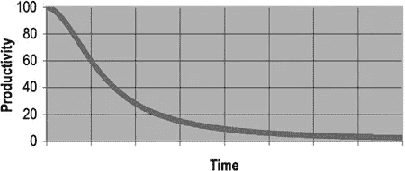

《清洁守则》(2008)——图 1–1——“拥有一个烂摊子的总成本”

有几个原则可以帮助指引我们，指引我们，拯救我们脱离这可怕的命运:

*   [亲吻](https://www.interaction-design.org/literature/article/kiss-keep-it-simple-stupid-a-design-principle):“保持简单-愚蠢”
*   [YAGNI](https://www.martinfowler.com/bliki/Yagni.html) :“你不会需要的”
*   [奥卡姆剃刀](https://www.britannica.com/topic/Occams-razor):“最简单的解决方案最有可能是正确的”

这些原则并非不为人知，但是过度工程仍然发生在软件工程中。这伤害了团队，也伤害了公司… **那么我们为什么还要这样做呢？**

# 一个高科技茶壶(告诉你这是一个茶壶)

我的公司定期举办公司黑客日:给所有员工分配两天时间，让他们做一些有助于他们更熟悉某项技术的事情，练习一项技能，或者从事他们感兴趣的项目。

主题总是不同的；这个黑客日的挑战:**过度设计一些简单的东西**。

这是一个非常有趣的挑战。我们的一个同事决定使用微服务设计来实现“Hello World”。

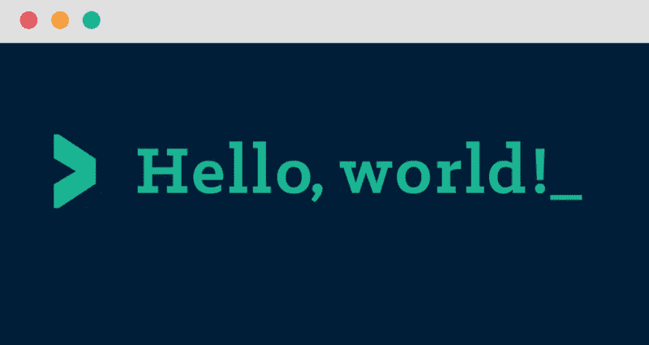

我们决定过度设计一个茶壶来帮助我们理解我们过度设计的原因。

我们提出了自己的想法，组建了一个团队，买了一个茶壶，然后开始工作。

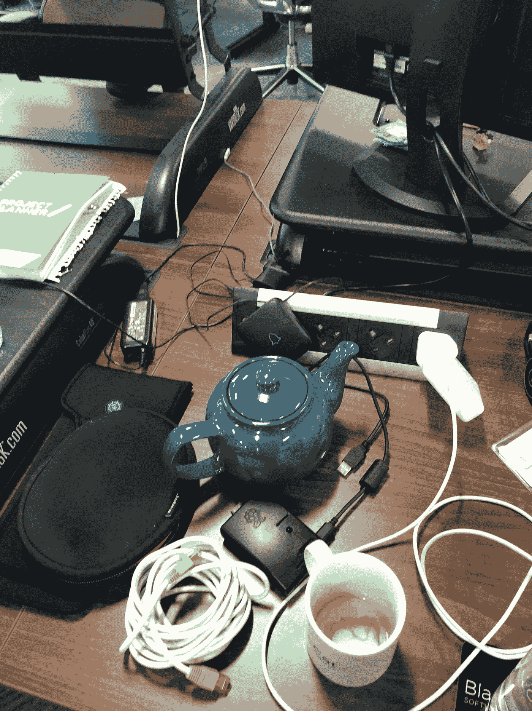

最简单地说，最初的设想是将一个 **Raspberry Pi** 附加到一个茶壶上，当有人调用我们的一个 REST 端点时，让 Pi 播放“我是一个小茶壶”。

YouTube 上的儿童视频是噩梦的燃料。

我们将利用微服务和企业软件模式来实现这一点。

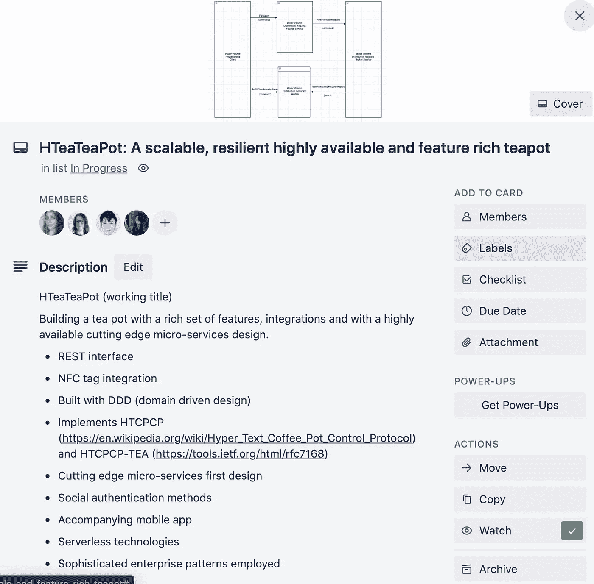

不幸的是，项目的范围迅速扩大。

## 问题陈述

我们最终作为一个团队就**问题陈述**达成一致，以引导我们走向解决方案 **:**

```
*If you are in a dark room with only a REST client and a teapot*, **how do you identify which object in the room is a teapot?**
```

这个问题陈述成为我们架构的最终基础:

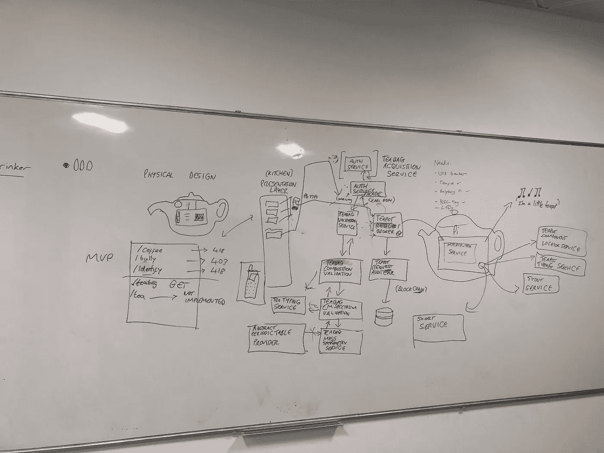

我们还找到了一个解决方案，解决了我们的**茶壶认证系统**不够“以茶为主题”的问题。身份验证令牌变成了“袋泡茶”，有一个复杂的系统来验证它们。

我们将我们的架构分成故事和任务，这成为我们的 *backlog，*考虑我们在两天内实际上可以实现的东西。

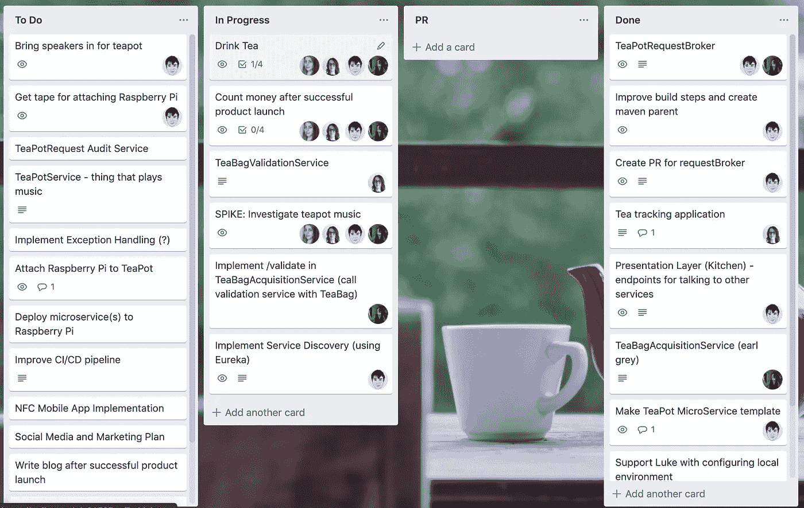

# 我们的流程

我们决定作为一个团队真正融入过度工程的精神:确保我们不仅过度工程化我们的软件，而且过度工程化我们团队的过程。

## 每小时站立

为了确保所有团队成员充分了解彼此的行动和计划(接下来的一个小时)，我们实施了**每小时站立**。

每个小时，我们都去站立的房间，解释下一个小时我们要做什么。


我们最终把茶壶传了一圈，以示谁被允许发言。

这个过程在很大程度上是围绕着茶壶进行的，我们按照仪式把茶壶拿到房间里，在茶壶前面完成站立。

## …我们的单口相声变得很奇怪。

在某个时候，有人提到茶壶里可能有一个精灵🧞……这有点升级了。

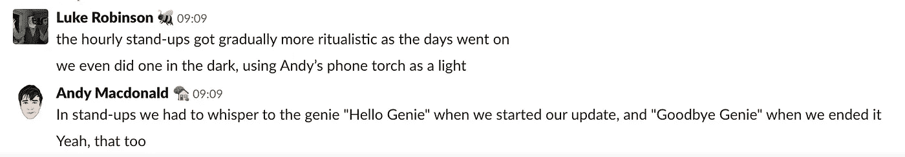

继续前进…

# 我们的开发流程

## 我们首先关注关键路径

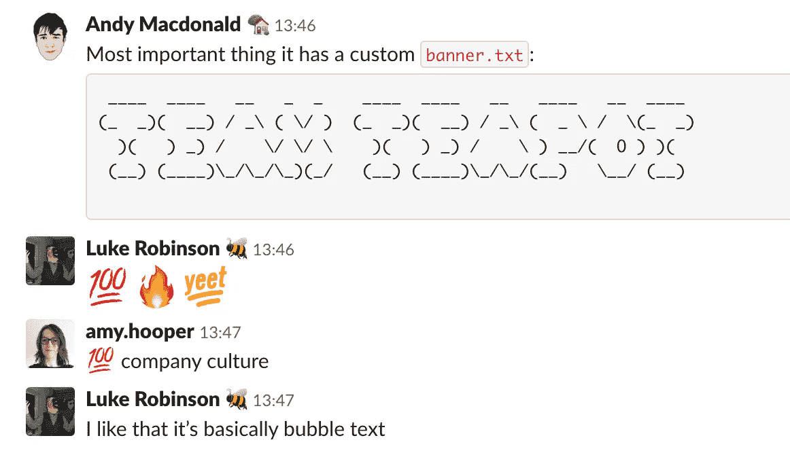

正确理解公司文化非常重要。

## 我们实现了高质量的代码

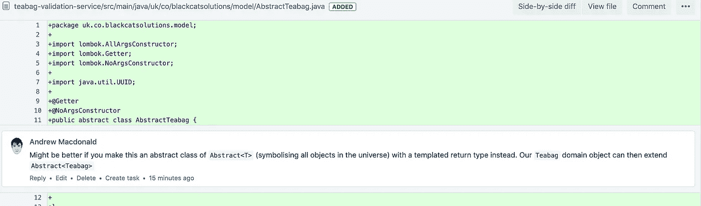

扩展 Abstract <universe>可能会更好。</universe>

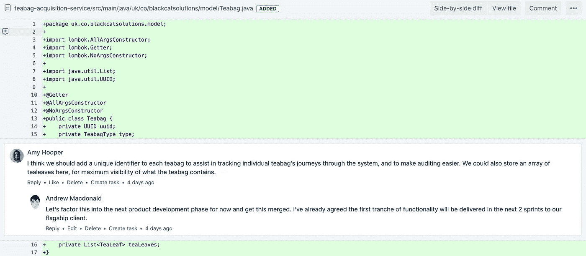

我们最终加入了一个向量，这样每片茶叶在茶叶袋中都有一个已知的位置。

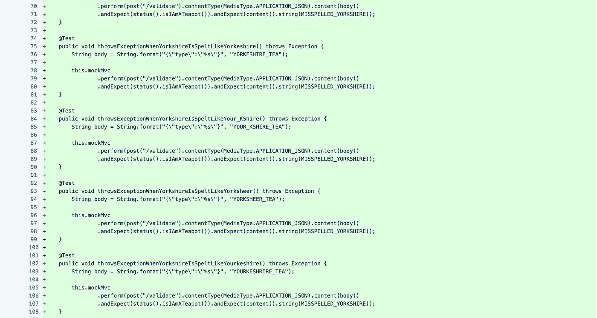

我们发现了一个“关键错误”。在 YORKSHIRE_TEA 中拼错 YORKSHIRE 导致了一个不好的请求和一个不太优雅的错误消息。

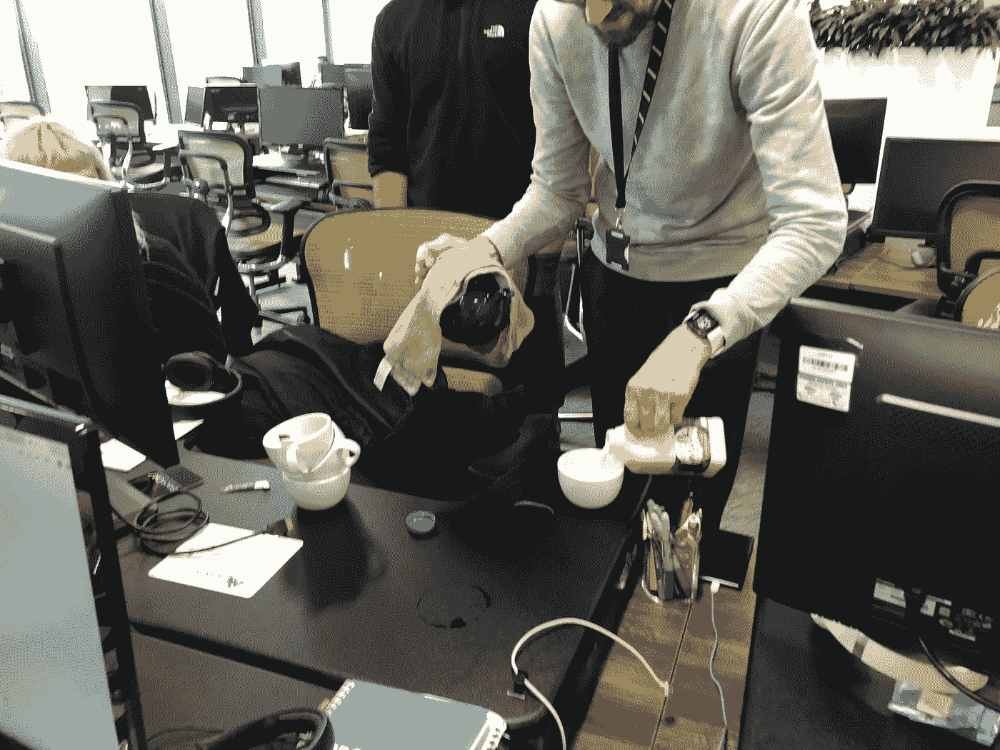

我们喝了很多茶。

# (技术上)我们实现了什么？

## 六项“尖端”微服务

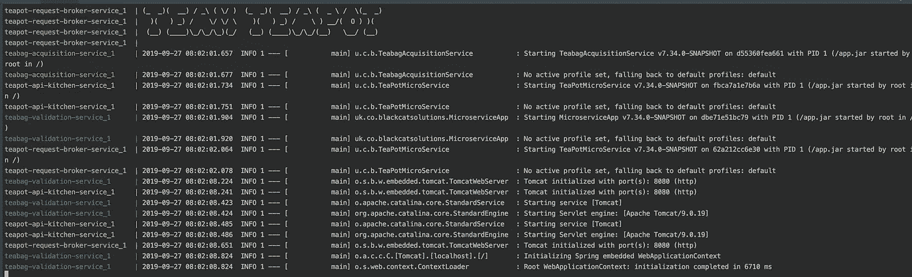

团队茶壶横幅= +100 代表公司文化

每个人都做得非常非常好。

## 快速创建可部署微服务的一个很酷的小模式

虽然有点粗糙，但在很短的时间内，我们已经有了一个创建和本地测试微服务的既定模式🐋Docker，docker-compose 和 [Fabric8 docker-maven 插件](https://fabric8.io/)。

**Docker 撰写文件**

```
version: "2"
services:
  teabag-acquisition-service:
    image: blackcatsolutions/teabag-acquisition-service
    environment:
      JAVA_OPTS: "-Dteabag.validation-service.uri=[http://teabag-validation-service:8080](http://teabag-validation-service:8080/)"
    ports:
      - "8080:8080"
  teapot-api-kitchen-service:
    image: blackcatsolutions/teapot-api-kitchen-service
    environment:
      JAVA_OPTS: "-Dteabag.acquisition-service.uri=[http://teabag-acquisition-service:8080](http://teabag-acquisition-service:8080/) -Dteapot.request-broker-service.uri=[http://teapot-request-broker-service:8080](http://teapot-request-broker-service:8080/)"
    ports:
      - "8082:8080"
  teapot-request-broker-service:
    image: blackcatsolutions/teapot-request-broker-service
    environment:
      JAVA_OPTS: "-Dteapot.uri=[http://teapot-service:8080](http://teapot-service:8080/) -Dteabag.acquisition-service.uri=[http://teabag-acquisition-service:8080](http://teabag-acquisition-service:8080/)"
    ports:
      - "8083:8080"
  teapot-service:
    image: blackcatsolutions/teapot-service
    ports:
      - "8085:8080"
  teabag-validation-service:
    image: blackcatsolutions/teabag-validation-service
    ports:
      - "8084:8080"
```

**Fabric8 Docker Maven 插件**

```
<plugin>
                <groupId>io.fabric8</groupId>
                <artifactId>docker-maven-plugin</artifactId>
                <version>0.25.2</version>
                <configuration>
                    <images>
                        <image>
                                           <name>${docker.image.prefix}/${project.artifactId}</name>
                            <alias>${project.artifactId}</alias>
                            <build>
                                <dockerFileDir>${project.basedir}/src/main/docker</dockerFileDir>
                                <assembly>
                                    <descriptorRef>artifact</descriptorRef>
                                </assembly>
                            </build>
                            <run>
                                <namingStrategy>alias</namingStrategy>
                                <ports>
                                    <port>8080:8080</port>
                                </ports>
                            </run>
                        </image>
                    </images>
                </configuration>
            </plugin>
```

**Dockerfile**

```
FROM openjdk:8-jdk-alpineVOLUME /tmpADD maven/app.jar app.jarENV JAVA_OPTS=""ENTRYPOINT [ "sh", "-c", "java $JAVA_OPTS -Djava.security.egd=file:/dev/./urandom -jar /app.jar" ]
```

## 80%以上的模块代码覆盖率(在每次提交时，针对我们的微服务的测试容器运行单元测试、集成测试和黄瓜验收测试)

我们还将 bitbucket 管道集成到我们的**# team-茶壶** slack 通道中，这样我们就可以全面了解我们的进度。

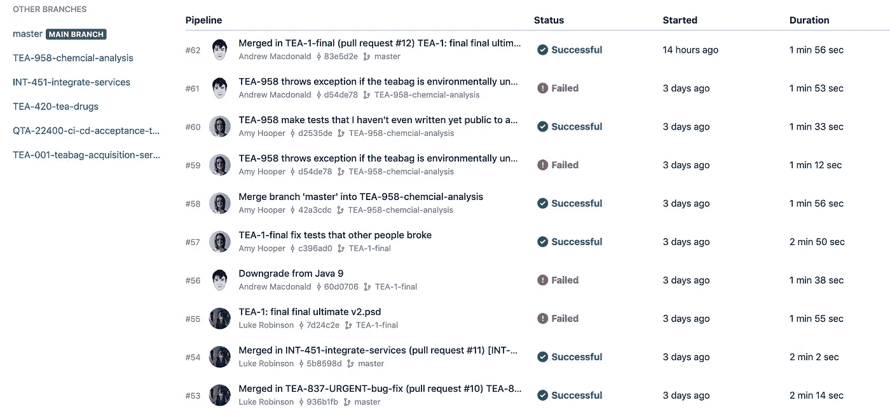

## 带有“茶主题”认证的茶壶的 RESTful 服务

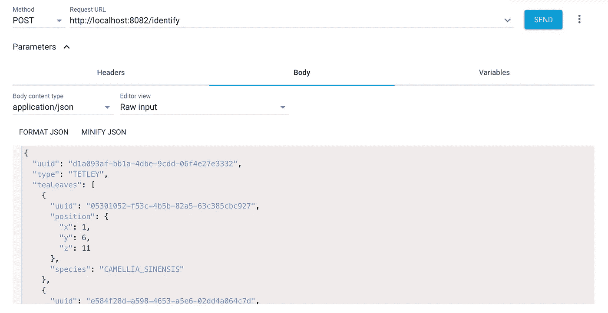

## 讨论冲刺阶段出现的重要问题的回顾

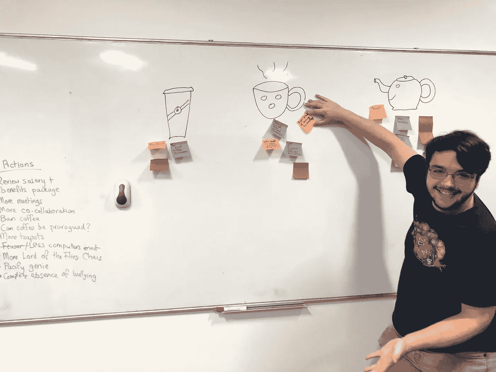

我们都同意需要更多的“合作”


“太多咖啡讨论”。

# 我们交付了什么？

在两天结束时，(尽管没有把整件事看得太重)，我们都由衷地感到我们已经非常努力了。我们也觉得我们在很短的时间内完成了很多。

事实上，尽管我们在第一天就创建了荒谬但简单的问题陈述，我们所实现的甚至还没有接近我们开始要做的。

# 这到底有什么意义？

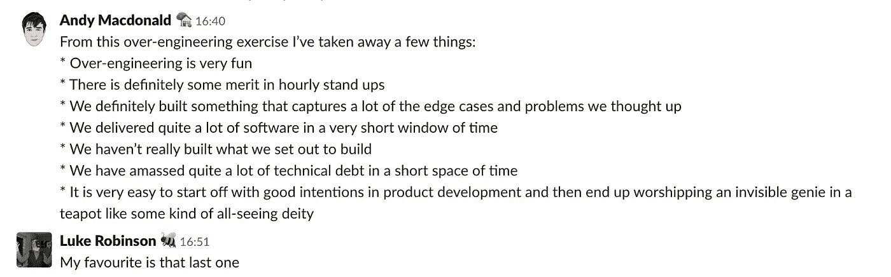

尽管取得了众多的技术成就，但我们并没有达到预期的目标。练习之后，我们作为一个团队得出了一个简单的结论:

过度工程之所以会发生，是因为为复杂的技术障碍提供解决方案是一项艰巨的工作，我们这样做是因为如果这感觉像是一项艰巨的工作，那么它肯定是有价值的？

# 为什么我们会有这种感觉？

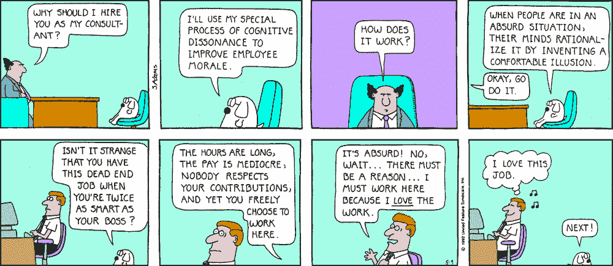

斯科特·亚当斯的《呆伯特》

## 努力证明

努力正当化是一个源于心理学家费斯汀格及其认知失调理论的理论。

认知失调本质上是这样的:我们故意避免在思维过程上花费精神能量，这可能会潜在地导致我们*双重思维*:同时持有两种冲突的观点。

努力证明是这一理论的延伸。如果我们觉得好像为了得到某样东西我们已经付出了一些代价，我们就歪曲和夸大了那件东西的价值——甚至对我们自己。


**再比如:**

一个人花了一大笔钱买票去看他们最喜欢的艺术家。

即使表演本身相对平庸，但这个人通常会夸大别人对表演的感知质量，并且也会相信自己表演的夸大质量。

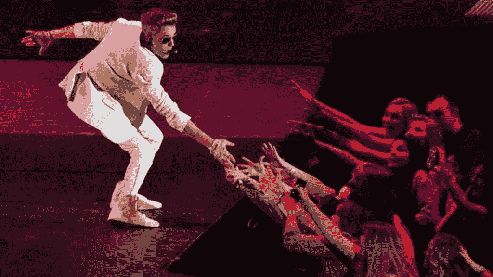

“太棒了。他用他的声音和一切唱歌！”

这是为了让这个人能够避免花了很多钱在最终不是那么好的东西上的认知失调。

# 摘要

我们觉得好像我们都非常努力地工作，因此，我们的工作**必然**具有内在的价值，对吗？

**错了**。不要落入这个陷阱。

*   有时候最简单最短的路径也可以。
*   有时候，做更少的工作可以获得更多的价值。

记得亲吻你的下一个项目*保持简单愚蠢* 😘。

1.  [https://en.wikipedia.org/wiki/Effort_justification](https://en.wikipedia.org/wiki/Effort_justification)