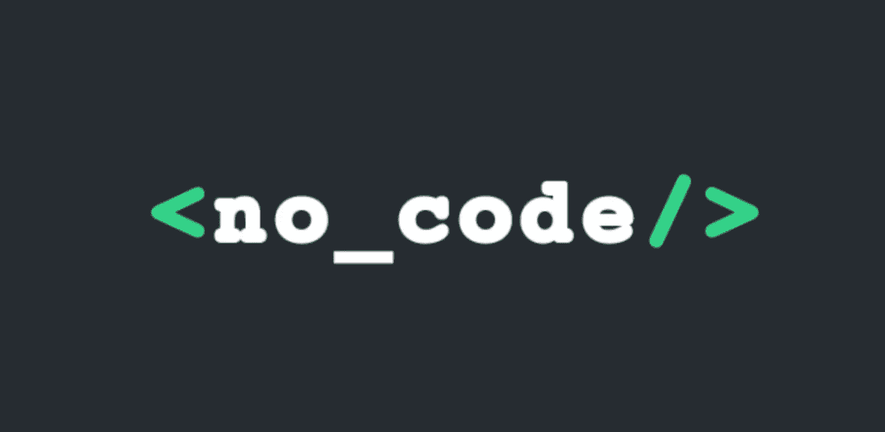
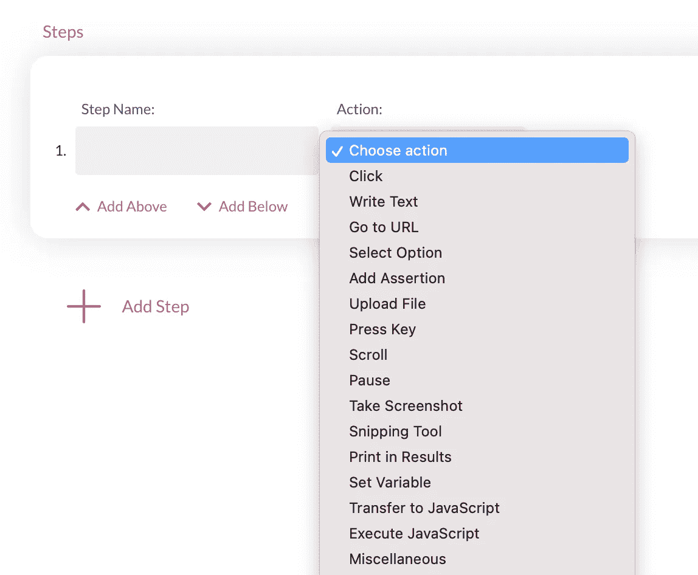
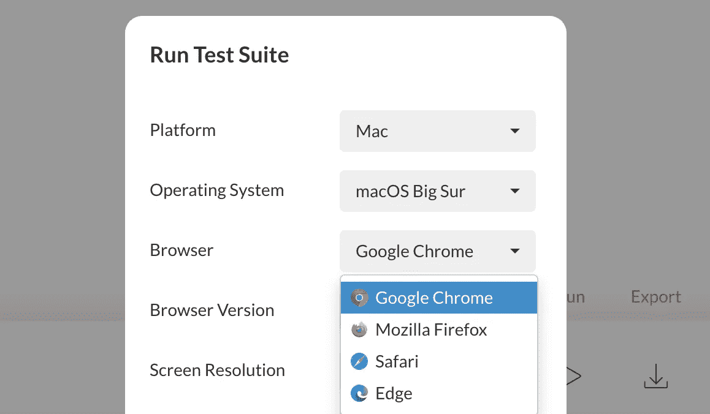
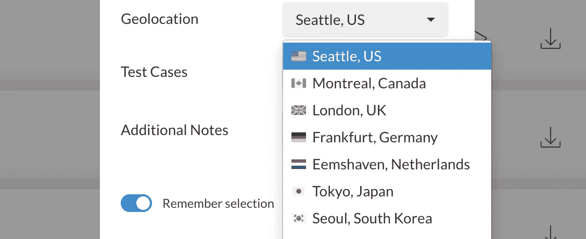

# 我们尝试了无代码自动化测试——结果如下

> 原文：<https://betterprogramming.pub/we-tried-codeless-automated-testing-7840ca67675e>

## 无代码自动化工具 Endtest 的最初印象

无代码技术也称为无代码技术

我们的一贯目标是提高效率。

这意味着消除瓶颈。

软件开发中最常见的瓶颈之一是测试。

这也是为什么每个人都开始做自动化测试的众多原因之一。

但是自动化测试的过程本身会成为一个瓶颈。

# 1.经典的测试自动化有什么问题？

并不像我们最初想象的那么顺利。

当你写第一个 Selenium/剧作家/Cypress 测试的时候，感觉很棒。

这就是我们的感受。

但是后来，我们开始遇到问题:

*   来自测试的代码变得难以维护
*   它需要将不同的开源库缝合在一起
*   因为这些图书馆中存在的问题，我们陷入了困境
*   与 CI/CD 系统的集成需要在我们的测试中进行大量的改变
*   让测试在不同的浏览器上运行需要一些技巧

有些人通过解决这些问题来建立自己的事业。

但是我们团队中没有人想成为将 Selenium 与 TestNG 和其他库缝合在一起的专家，我们只是想要稳定可靠的测试。

# 2.什么是无代码自动化测试？

顾名思义，这项技术允许您构建和执行自动化测试，而无需编写代码。

如果你是一名开发人员，不必写代码的想法可能会让你感到有点不舒服，这也是我们的感受。

但是如果你仔细想想，有一些活动通过 UI 来完成比写代码和发送命令更有效。

比如电子邮件。

我可以不用微软的 Outlook，只需 SSH 进入 SMTP 电子邮件服务器，用一个命令就可以获取我的电子邮件。

这样做我会觉得更酷吗？是的。

我这样做会更有效率吗？
我不这么认为。

我们希望无代码测试自动化会让我们更有效率。

# 3.我们的无代码自动化测试体验如何？

我们用一堆工具做了概念验证。

我们最终使用了 [Endtest](https://endtest.io) 。

我惊讶地发现这个平台是如此的多功能。

您可以添加变量、重用组件、添加 if 语句、else 语句、循环和其他技巧。

您只需在 UI 中创建指令，而无需处理代码:

该平台还包括一个跨浏览器云，你可以在所有主流浏览器和设备上运行测试。

Endtest.io 中的跨浏览器云选项

与 Cypress 不同，它还支持 Safari 和 Internet Explorer 11。

另一个惊喜是地理定位测试，您可以从世界各地的不同端点运行您的测试:

Endtest 中的地理位置选项

还有一个 [Endtest API](https://endtest.io/guides/docs/how-to-use-the-endtest-api/) ，您可以使用它来启动测试并从您的 CI/CD 系统中获取结果。

其他简洁的功能:

*   发送 API 请求的能力
*   计算机视觉(截图对比的别称)
*   连接到 DBs 并执行 SQL 查询的选项
*   访问和测试电子邮件的选项(通过 Endtest 邮箱)
*   访问和测试短信的选项
*   基于角色的测试访问(协作者)
*   调度器(像 cron 作业编辑器一样，直接在 UI 中)

# 4.我们是如何进行评估的？

每当我们尝试一个新工具时，我们都会建立一些度量标准。

我们密切关注这些指标，以确定新工具是否发挥了作用，是否让我们的生活变得更加轻松。

这也是避免偏见的好方法。

在某些情况下，你还需要一个基线。

我们是这样做的:

1.  我们定义了一组测试(简单场景和复杂场景)。
2.  我们通过使用:Endtest、Selenium(使用 Python)、Puppeteer、剧作家和 Cypress 来自动化它们。
3.  主要目标是让这些测试在 Chrome、Firefox 和 Safari 上运行。
4.  最终目标是将这些测试集成到我们的 GitHub CI/CD 流程中。

Cypress 是第一个倒下的，因为它无法处理多个浏览器标签。它也不支持 Safari，但我们从来没有达到这一点。

木偶师和剧作家是相似的，第二个有更好的跨浏览器支持。在线资源的缺乏导致我们在某些方面停滞不前。

Selenium 非常棒，我们能够自动化所有场景，并在所有 3 种浏览器上运行它们。但是花了 62 个小时，比预期的要长，处理这个[从呈现器](https://bugs.chromium.org/p/chromedriver/issues/detail?id=3657)接收消息超时的错误有点烦人，但是我们找到了一个解决方法。

为了将一些 Selenium 测试与 CI/CD 流集成，您要么必须在一个无头浏览器上运行测试(糟糕的做法)，要么需要连接到一个外部 Selenium 网格。

与在本地运行 Selenium 测试相比，通过 Selenium Grid 运行测试，即使是在最新版本上，也非常慢。

至于 Endtest，我们只花了 3 个小时来自动化这些测试，这比我们用 Selenium 实现的快 20 倍。

与 GitHub 的集成很顺利，主要是因为我们使用了 [Endtest GitHub 动作](https://github.com/marketplace/actions/run-endtest-functional-tests)。

# 最后的想法

Endtest 现在是我们堆栈的一部分。

我们的堆栈每年都在变大，但是我们发布的速度越来越快，问题也越来越少。

我推荐无代码自动化测试吗？

视情况而定，如果您想以编写 Selenium 测试为职业，这些无代码测试自动化工具可能不是您正在寻找的答案。

如果您对构建自己的内部测试自动化框架没有感情，我建议您尝试一下。