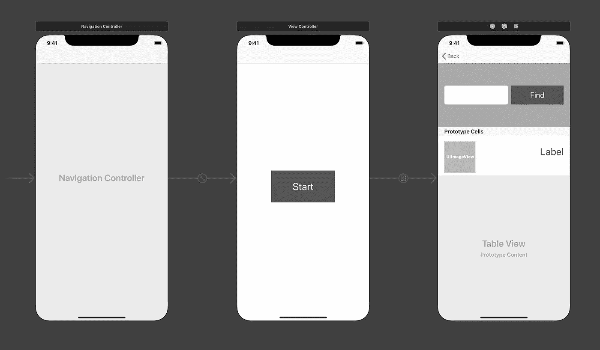
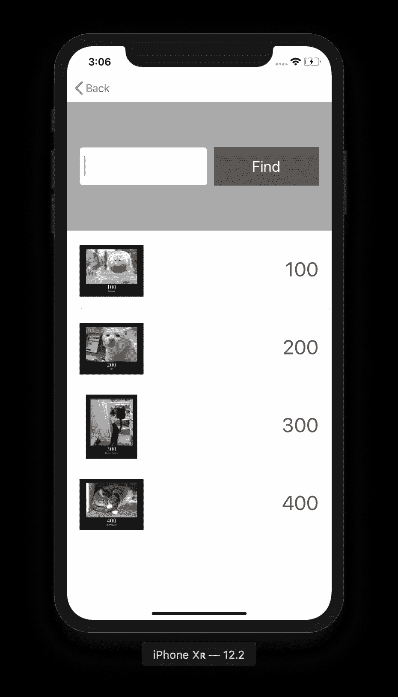
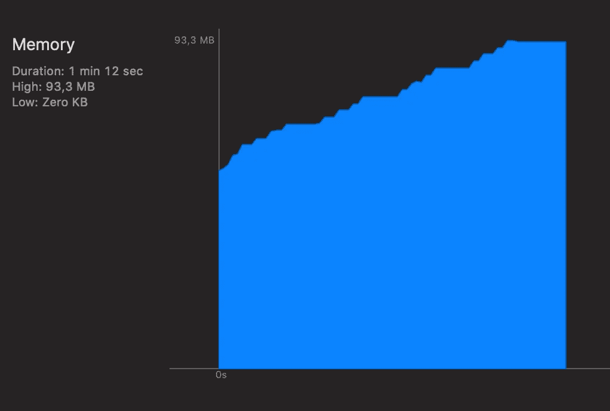
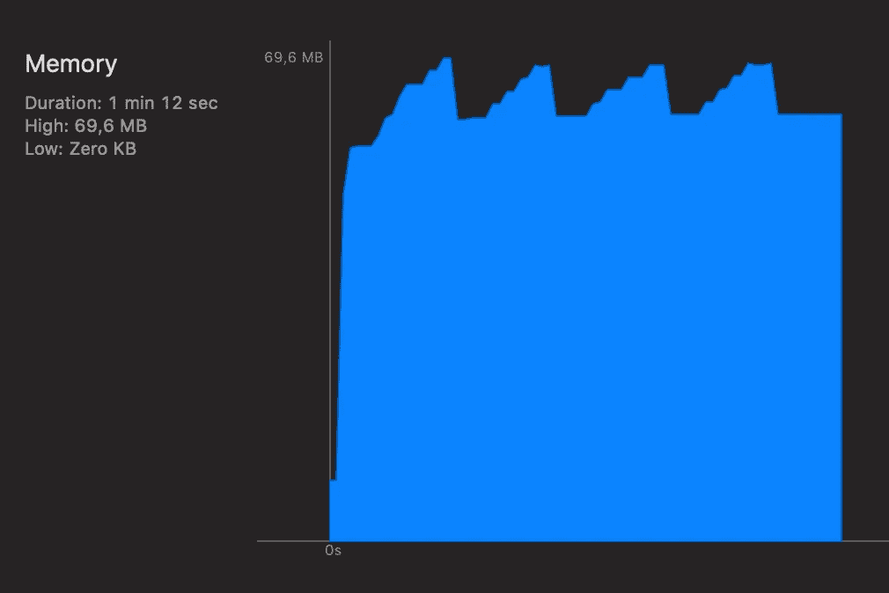

# Swift 中的弱关键字和无主关键字

> 原文：<https://betterprogramming.pub/weak-and-unowned-keywords-in-swift-7bda8bdd97c4>

## 为什么在闭包中使用它们很重要—一个例子


如果你熟悉 Swift，你应该听说过关键字*无主*和*弱*。如果你没有听说过他们，现在就去查查吧。我不会解释关于关键词的一切，但我会告诉你为什么你应该知道和使用它们。

如果我们在闭包中不使用无主或弱关键字，会发生什么？
简而言之就是:内存泄露！最长的答案是:让我给你看…

# 让我们看看它是如何工作的！

为了演示不使用无主或弱关键字如何会造成内存泄漏，我编写了一个简单的应用程序，让您输入 web 请求状态代码，然后在一个`tableview`中显示它们以及相应的猫图片。

我没有想到将状态代码和猫图片配对的惊人想法，但我确实发现了这个伟大的、易于使用的 API，它:

[](https://http.cat/) [## HTTP 猫

### 一个 API 为可怕的 HTTP 猫！在你的网站中使用它来显示有趣的错误信息。

http.cat](https://http.cat/) 

在示例应用程序中使用它似乎是一个有趣的 API。

# 应用程序设置



设置非常简单。打开应用程序时，首先会出现一个带有“开始”按钮的屏幕。按下按钮，出现主视图。在主视图中，您可以输入一个三位数的状态代码，然后按“查找”。所有输入的状态代码都显示在下面的`tableview`中。如果可以从 [http.cat/【状态代码】](https://http.cat/404)查询图像，则该图像会显示在相应状态代码的旁边。

# 数据模型

数据模型相当简单。我们有一个班——`CatStatus`。有`value`(状态码值)`imageData`的变量，还有一个名为`updated`的函数，当 API 请求完成并且`imageData`已经更新时调用。

```
import Foundation

class CatStatus {
    let value: String
    var imageData: Data?
    var updated: (()->())?

    init(value: String) {
        self.value = value
    }

    func makeRequest() {
        DispatchQueue.global().async {
            if let url = URL(string: "https://http.cat/\(self.value)") {
                if let data = try? Data(contentsOf: url) {
                    self.imageData = data

                    if let updated = self.updated {
                        updated()
                    }
                }
            }
        }
    }
}
```

函数`makeRequest()`向 http.cat API 发出请求，向 cat 映像查询给定的状态代码。

# 视图控制器

当用户点击“查找”按钮时，在视图控制器中执行以下功能:

```
@IBAction func didSubmit() {
        if let text = self.textField?.text {
            if text.count == 3 {
                self.textField?.textColor = .black // status code is valid
                self.textField?.text = nil

                let newCat = CatStatus(value: text)
                self.cats.append(newCat)

                let indexPath = IndexPath(row: cats.count - 1, section: 0)
                tableView?.insertRows(at: [indexPath], with: .automatic)

                newCat.updated = { [unowned self] in
                    DispatchQueue.main.async {
                        self.tableView?.reloadRows(at: [indexPath], with: .automatic)
                    }
                }
                newCat.makeRequest()
            } else {
                self.textField?.textColor = .red // status code has more or less than 3 digits
            }
            if text.count == 0 {
                self.textField?.textColor = .black // status code is empty
            }
        }
    }
```

我们首先检查文本是否不为 nil，文本长度是否为 3——这意味着我们可能有一个有效的状态代码，应该向`tableview`添加一个新行。我们创建一个新的`CatStatus`实例，并将其添加到我们的`cats`列表中。然后我们告诉`tableview`应该插入新的一行。

现在有趣的部分来了:我们想告诉新的`CatStatus`发出一个 API 请求。我们首先设置`updated`变量，这样当`imageData`更新时我们会得到通知。如果`imageData`已经更新，我们希望`tableview`重新加载相应的行。

然后我们开始请求。

# `**Unowned and Weak Keywords**`

这是有趣的部分。可以看到`[unowned self]` 目前被注释掉了。但是我们写`[unowned self]` 和不写有什么区别呢？让我们运行应用程序，你会看到。然后我会解释关键字的作用。

```
newCat.updated = { // [unowned self] in
    DispatchQueue.main.async {
        self.tableView?.reloadRows(at: [indexPath], with: .automatic)
    }
}
```

# 实验



我运行了两次应用程序。先用`[unowned self]` 注释掉再不用。代码中没有其他变化。您将看到内存使用的差异。

应用程序运行由以下步骤组成:

1.  打开应用程序
2.  点击“开始”
3.  填写“100”作为状态代码，点击“查找”
4.  填写“200”作为状态代码，点击“查找”
5.  填写“300”作为状态代码，点击“查找”
6.  填写“400”作为状态代码，点击“查找”
7.  点击“返回”
8.  重复步骤 2。-7.再来三次

## 第一次排练

第一次运行时`[unowned self]` 被注释掉，导致内存使用情况如下:



如您所见，内存使用量稳步增长。每次查询图像时，都会使用更多的内存。需要注意的是，并非所有图像都同时显示。当我们返回到第一个屏幕时，先前查询的数据会被忘记，但不会被释放。

## 第二次排练

未注释掉`[unowned self]`的第二次运行:



正如您所看到的，每次我们返回主屏幕时，分配给查询图像的内存都会被释放。

# 说明

为什么第一次运行时没有释放内存？

```
newCat.updated = { // [unowned self] in
    DispatchQueue.main.async {
        self.tableView?.reloadRows(at: [indexPath], with: .automatic)
    }
}
```

Swifts magic 具有自动内存管理功能:

*   每当我们创建一个强引用，引用计数就增加一
*   每当我们释放一个强引用，引用计数就减一

这样，swift 就知道一个对象是否仍被另一个对象引用，是否应该保持活动状态。如果引用计数为零，则对象被释放。

在这样的闭包中发生的事情是，由于我们引用了`self`，我们创建了一个新的强引用，因此引用计数增加了 1。现在当我们回到第一个观点时，应该发生的是:

*   视图控制器实例被释放，因为我们不再引用它
*   所有的`CatStatus`实例都被释放，因为我们不再引用它们
*   所有的`imageData`变量都被释放，因为我们不再引用它们

这不会发生，因为这个闭包仍然保存着对`ViewController`实例的引用(这里:`self`)。这意味着`ViewController`没有被释放。因此，仍然有对`CatStatus`实例的引用，因此也有对`imageData`变量的引用。

结果是我们无法访问大量使用中的内存。

解决方案:在封口中使用`[unowned self]`或`[weak self]`。这样我们仍然可以引用自我，但是没有创建强引用。

# 无主还是弱小？

当我们不使用强引用时，调用闭包时 self 可能已经被释放了。

当我们使用`unowned`并且`self`已经被释放时，应用程序崩溃。因此，如果你 100%确定这种情况不会发生，只使用无主是很重要的。

当我们使用`wea**k**`并且`self`已经被释放，那么 self 将为零。这意味着当使用`weak`时，`self`将是可选的。这使我们有可能在`self`被解除分配时处理该情况。

在大多数情况下，使用`weak`是有意义的，因为它更安全。我在这个例子中使用了`unowned`,因为这意味着我需要修改更少的代码。

# 结论

尽管 swift 使内存管理比 Objective-C 早期要容易得多，但深入研究它并理解引用计数是如何工作的仍然很重要。

我使用了一个有限而简单的应用程序来展示内存泄漏是如何发生的，在这种情况下，没有被释放的图像数据会非常快地增加已用内存。在现实世界中，应用程序可能会运行很长时间，即使很小的泄漏也会在很长时间内造成问题。

如果你还没有了解`unowned`和`weak`的话，就把这个当作学习的动力吧。

您可以在此处找到示例应用程序代码:

[](https://github.com/kristiinara/MemoryleaksTestApp) [## kristiinara/memoryleaktestapp

### 创建这个 TestApp 是为了演示为什么我们应该在 swift 中使用无主和弱关键字

github.com](https://github.com/kristiinara/MemoryleaksTestApp) 

有很棒的文章详细解释了`unowned`和`weak`，比如:

[](https://blog.bobthedeveloper.io/swift-retention-cycle-in-closures-and-delegate-836c469ef128) [## 关闭和委托中的快速保留周期

### 我们来理解一下【弱自我】、【无主自我】，弱 var

blog.bobthedeveloper.io](https://blog.bobthedeveloper.io/swift-retention-cycle-in-closures-and-delegate-836c469ef128)