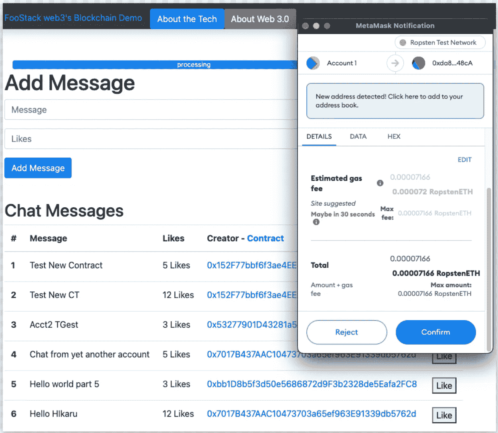
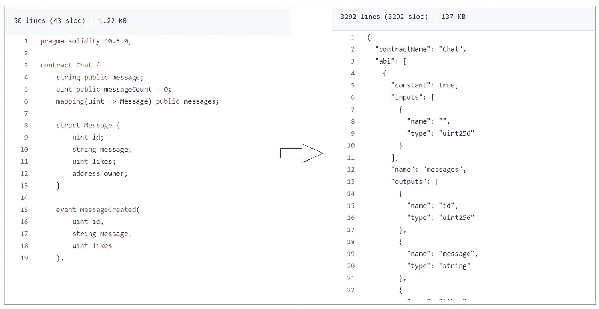
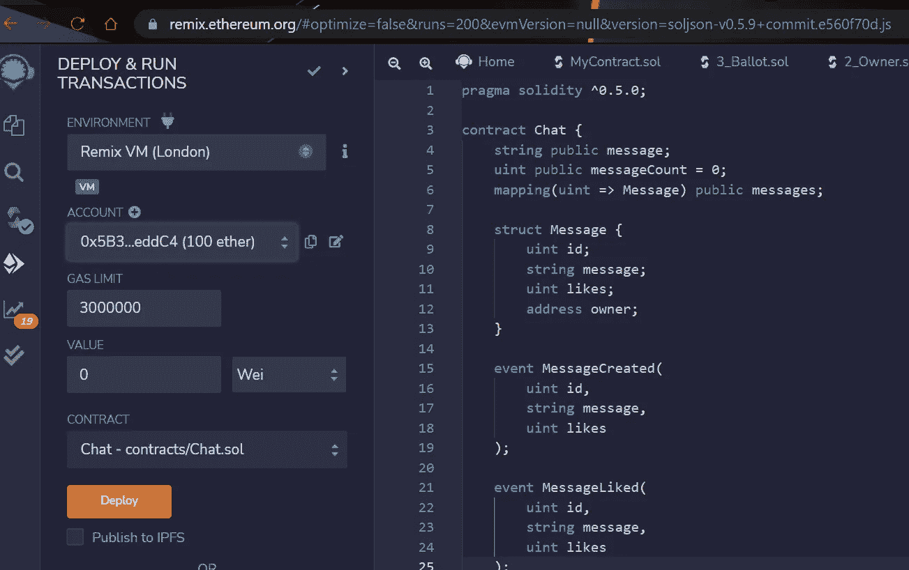
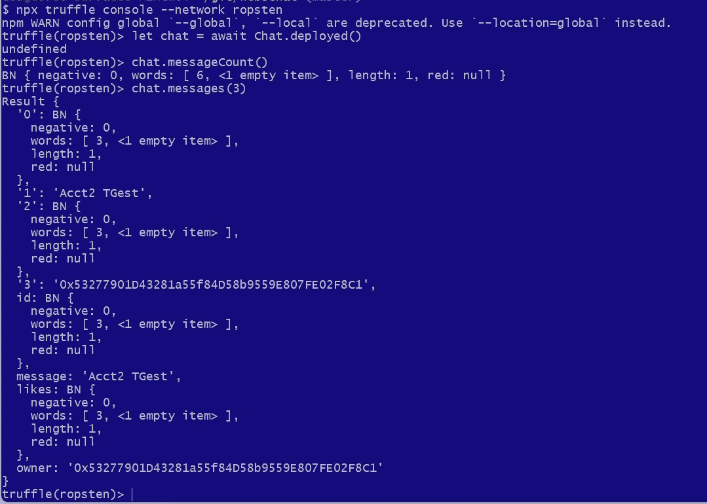
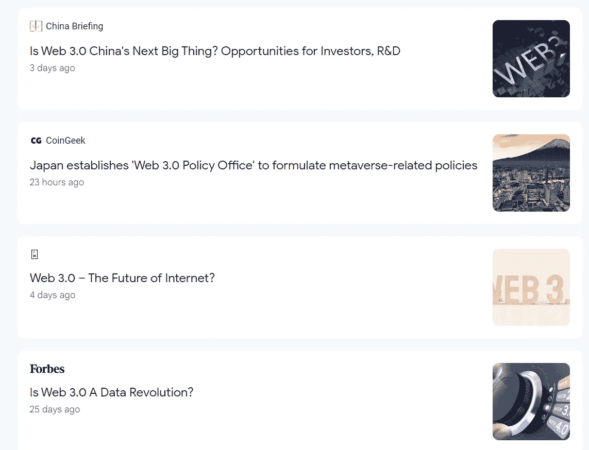

# Web 3.0 —用世界上最慢的数据库构建应用程序

> 原文：<https://betterprogramming.pub/web-3-0-building-apps-with-the-slowest-database-in-the-universe-879629a79219>

## 为什么将区块链用作通用数据库是速度最慢、可伸缩性最差、私密性最低且成本最高的解决方案

[Braňo](https://unsplash.com/@3dparadise?utm_source=medium&utm_medium=referral) 在 [Unsplash](https://unsplash.com?utm_source=medium&utm_medium=referral) 上拍照

# 超简史(Web 1–2–3 和 5)

以防不清楚:

*   Web 1.0 大多数人认为是 Netscape 和 HTML 时代的 HTML 和数据检索(直到 90 年代末)
*   Web 2.0 正在随着 JS/DHTML 和 React.js 等现代动态框架而发展。
*   Web 3.0 正在使用区块链作为后端事务和数据存储来构建 Web 应用程序(由 Etherium 驱动)
*   Web 4.0 被含糊地称为“共生网络”
*   Web 5.0 被杰克·多西称为基于 BTC 的 Web 3 版本

# 区块链适合哪里

Web 3.0 中有一些核心思想，包括以下内容:

1.  使用区块链存储和处理任意数据(例如智能合同)
2.  通过基于区块链的数据存储分散网络，因此单个实体不能完全拥有数据和平台
3.  使用区块链招标作为交易、数据存储和站点管理的“权益”和“支付”媒介，从而实现分散控制的乌托邦状态(DAO——分散自治组织)

将它结合在一起的是一些技术，如 JavaScript 中的 web3 库，Solidity 等契约元语言，以及 MetaMask 等基于浏览器的硬币钱包。

# 我建立了一个应用程序，以确保我没有错过任何东西

去 https://github.com/dougfoo/web3chat[http://web 3 . foo stack . ai](http://web3.foostack.ai)—code @[试试吧](https://github.com/dougfoo/web3chat)

我从 DAP university[拿了一个初学者工具包，重写了一部分，创建了我自己的 Web3 应用。这个想法是为了一个新的在线聊天服务，比如 Reddit:](https://www.dappuniversity.com/)

*   人们可以发布消息
*   人们可以喜欢消息
*   人们可以回复信息

我没有完成第三个特性，但是前两个需要创建一个新的智能契约定义，弄清楚如何编译和注册它，然后构建从 UI 到 web3 APIs 的接口。

技术堆栈非常简单:

*   在前端使用 web3 库操作区块链合同
*   MetaMask 钱包与区块链互动并为合同写作付费
*   Ropsten 测试 ETH 网络免费注册和测试应用程序
*   用于开发支持的其他一些工具，如 Truffle、Infurio 和 Ganache

# 智能合同

使用 Solidity 写合同很容易。代码看起来像任何定义接口/契约的 IDL。它可能是一种“图灵完整语言”(不喜欢滥用这个花哨的术语)，但它的功能相当原始。您可以存储标量和结构，但不能这么容易地做简单的事情，如遍历集合。

原[聊天合同](https://github.com/dougfoo/web3chat/blob/master/src/contracts/Chat.sol)和[编制 ABI](https://github.com/dougfoo/web3chat/blob/master/src/abis/Chat.json) 准备部署到区块链联邦理工学院

编译和部署可以用 [Remix](https://remix.ethereum.org/) 在线完成，也可以直接通过 [Truffle](https://trufflesuite.com/docs/truffle/getting-started/truffle-with-metamask/) ，一个开发者工具链来完成。

与 [Remix](https://remix.ethereum.org/) 的在线方式—添加您的代码并注册您的合同

使用 Truffle 更加简单，但是需要更多的设置——将你的钱包链接到像 [Infura.io](https://infura.io/) 这样的区块链节点，这意味着要在另一个系统上创建账户(用 [Ganache](https://trufflesuite.com/ganache/) 在本地设置一个节点)。设置完成后，您可以使用 Truffle CLI 编译、部署、检查和测试区块链合同。

松露控制台检查几条聊天信息

# **Web 3 API**

JavaScript 中的 web3 API 允许您加载聊天契约并执行 API，以直接在网页上查找、创建和喜欢消息。每次写入交易都需要支付少量 ETH (gas)。因此，需要链接到元掩码钱包。

上面的例子不言自明；它允许访问您的 ETH wallet(通过 MetaMask)，获取一个对聊天契约的引用，然后允许直接 API 访问来进行类似于`messageCount()`、`messages(id)`的读取，并执行类似于`createMessage(msg, id)`和`likeMessage(id)`的区块链写入。

# 区块链数据库发臭的地方

构建这个演示很有趣，就像任何只是为了学习的黑客开发项目一样(与生产软件相反，生产软件中超过 50%的工作是错误处理和测试)。我认为有问题的几个方面是:

1.  阅读真的很慢——仅仅阅读区块链上的十条合同信息就需要几秒钟。
2.  写作真的很慢——ETH 比 BTC 快得多，但仍然很慢。在 Ropsten 上，我的契约对象上的“like counter”增加需要 5-10 秒。
3.  数据库规模——正如我之前的观点所传达的，ETH 合同操作太慢了，因此需要一个重要的基础架构来在原始区块链之上构建缓存和性能层。
4.  交易成本——每次写入都要花费 ETH，这对 Ropstein 来说没问题，因为它是免费的，但我无法想象每次用户写东西时都要支付真正的 ETH。
5.  没有隐私——区块链最大的优点是透明，但是我怎么能写任何隐私数据呢，比如我写了一个 P2P 聊天应用程序？我想你可以在上面加上你自己的加密层？
6.  契约 API 是原始的——在区块链上查找和迭代对象似乎很麻烦，并且设想需要一个更健壮的版本来支持索引、快速散列查找等。
7.  工具链是原始的——虽然我确信它在一年内增长了 500%,但要了解如何将 Truffle 连接到 Infurio 以及安装什么版本的工具，还需要进行大量的谷歌搜索。

我想真正的应用程序不会有客户端 Web3 API 调用和客户端钱包，而是有 Web3 应用服务器来管理你的钱包，并在基本的区块链 API 之上实现健壮的缓存层。

Web3 是 Web +区块链的有趣合并，但我怀疑这是 Web 的唯一演变——因此我更喜欢将名称从 Web 3.0 改为 Web 2.21b，以免误导公众。

谷歌搜索“web 3.0”