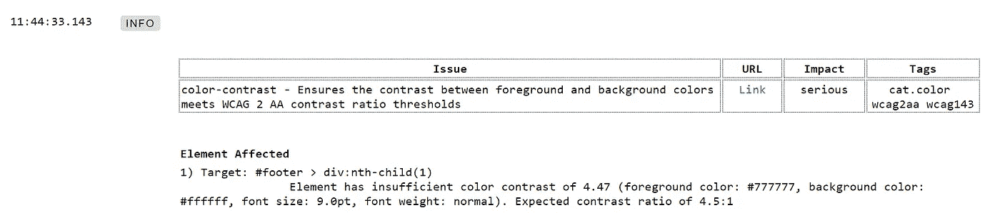

# 实际操作网页可访问性测试

> 原文：<https://betterprogramming.pub/web-accessibility-testing-with-robotframework-and-axe-163bfab6dadc>

## 使用机器人框架和斧头


格伦·卡斯滕斯-彼得斯在 [Unsplash](https://unsplash.com?utm_source=medium&utm_medium=referral) 拍摄的照片

围绕易访问性测试的关注正在迅速增长。在本文中，我将对可访问性测试做一个简短的解释，并演示如何使用`robotframework`在常规测试管道中执行可访问性测试。

# 什么是易访问性测试？

一般而言，无障碍是一个用来描述产品、设备、服务、设施或环境适合为残疾人服务的程度的术语。

该系统的无障碍程度越高，越多的残疾人可以从中受益。

另一种看待可访问性的方式是，与非残疾人相比，残疾人享受产品的程度。

网页可访问性更具体地用于网站以及网站的可访问性。

[网页内容可访问性指南(WCAG)](https://www.w3.org/TR/WCAG21/) 是公认的 W3C 网页可访问性标准，它列出了几个重要的可访问性指南。本文档中提到的主要原则是:

1.  可感知——信息和用户界面组件必须以用户可以感知的方式呈现给用户。
2.  可操作—用户界面组件和导航必须是可操作的。
3.  可理解—信息和用户界面的操作必须是可理解的。
4.  健壮—内容必须足够健壮，能够被各种各样的用户代理(包括辅助技术)可靠地解释。

网络无障碍针对几类残疾，如视力残疾、运动残疾、听力障碍、认知或智力残疾以及癫痫等神经障碍。

# 为什么我应该在网页可访问性上投入时间？

有 3 个主要原因:

1.  这样做是对的！我知道，这听起来很老套，自以为是，沾沾自喜，但我相信这是真的。让我们的产品变得更容易接近，会让世界变得更美好，在大多数情况下，这并不需要付出太多努力。
2.  有利可图。根据世界卫生组织的统计，全世界有超过 10 亿人患有某种形式的残疾，这几乎是全世界人口的 13%。疾病预防控制中心估计，美国每四个成年人中就有一个患有某种残疾。不管真实数字是多少，我们谈论的是一个非常大的人群。确保我们的应用对他们具有包容性，可以立即扩大我们的潜在客户群。
3.  法律处罚。我真的不希望这是理由，但事实就是如此。在世界各地的许多州，都有关于网页可访问性的法律规定。不遵守网页可访问性法规可能会导致诉讼和罚款。

# 但是…怎么做？

## 介绍 aXe

[Axe](https://github.com/dequelabs/axe-core) 是由 dequelabs 开发和维护的开源项目。
它使用 WCAG 提供的规则创建一个 [linter](https://en.wikipedia.org/wiki/Lint_(software)) ，该 linter 运行在网站页面上，并为可访问性问题提供“提示”。

Axe 有许多针对不同语言的实现，其中之一是 aXe selenium python ，它将 aXe 和 selenium 结合起来，形成了一个完全自动化的解决方案。

最重要的是，`[robotframework-axelibrary](https://github.com/adiralashiva8/robotframework-axelibrary)`已经被开发来集成`aXe` selenium python 和`robotframework`。

## 机器人框架简介

我在[之前的一篇文章](https://eldadu1985.medium.com/extend-robotframework-using-the-robotframework-python-lib-core-bf73e09160d3)里讲过`robotframework`。`Robotframework`是一个基于 python 的开源软件验收测试框架。

凭借其关键字驱动的方法和表格语法，它可以用于快速生成验收测试，并在测试代码和最终报告上提供了很好的可读性。

它提供了一个 reach 生态系统，其中包含许多可轻松用于多种测试目标的工具，从 web 测试到 API 测试，再到数据库、移动设备或物联网。

## 机器人框架简介-axel library

`aXe`库允许我们从我们的`robotframework`测试套件中用 selenium 运行`aXe`。

这将产生一个可供我们阅读的可访问性报告，或者拒绝导致可访问性冲突的代码更改的断言。

首先，我们需要安装依赖项:

```
pip install robotframework==4.1.3 selenium==4.1.0 robotframework-seleniumlibrary==6.0.0 robotframework-axelibrary==0.1.5
```

现在我们可以为我们的网站编写一个简单的可访问性测试:

在这个测试中，我们使用 selenium 导航到我们的演示站点的登录页面，然后我们执行 aXe 来检测可访问性问题，这将生成一个包含所有发现的可访问性问题的 JSON 文件，然后我们使用 JSON 文件将可读格式记录到我们的测试结果中。



正如我们在报告中看到的，我们有几个违反可访问性规则的地方，在这个例子中，元素和背景之间的对比度太低(推荐 4.47 而不是 4.5)，我们可以点击附件中的链接，在这里阅读有关这个违反[的更多信息。](https://dequeuniversity.com/rules/axe/3.1/color-contrast?application=axeAPI)

我们还可以为断言添加另一行，例如，断言发现的可访问性冲突不超过 1 个:

```
Should Be True    ${results.violations} < 1
```

现在，当这个限制被突破时，我们的自动化管道将会失败。

# 结论

可访问性成为测试的一个重要主题，自动化过程可以帮助您提前发现可访问性问题。

例如，英国政府能够通过自动化流程跟踪 30–40%的可访问性问题— ( [供进一步阅读](https://accessibility.blog.gov.uk/2017/02/24/what-we-found-when-we-tested-tools-on-the-worlds-least-accessible-webpage/))

将可访问性测试添加到您的管道中不仅可以帮助您的企业避免诉讼和处罚，还可以帮助让世界变得更美好。