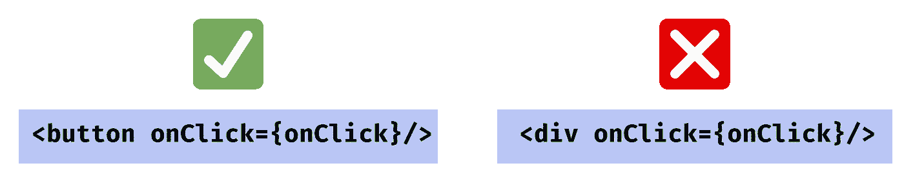
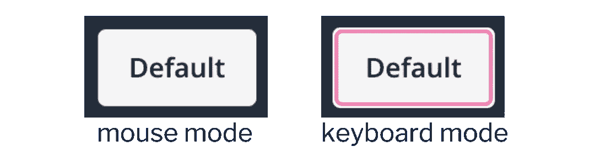
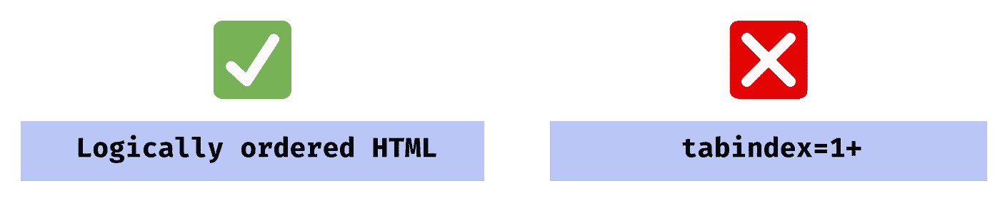
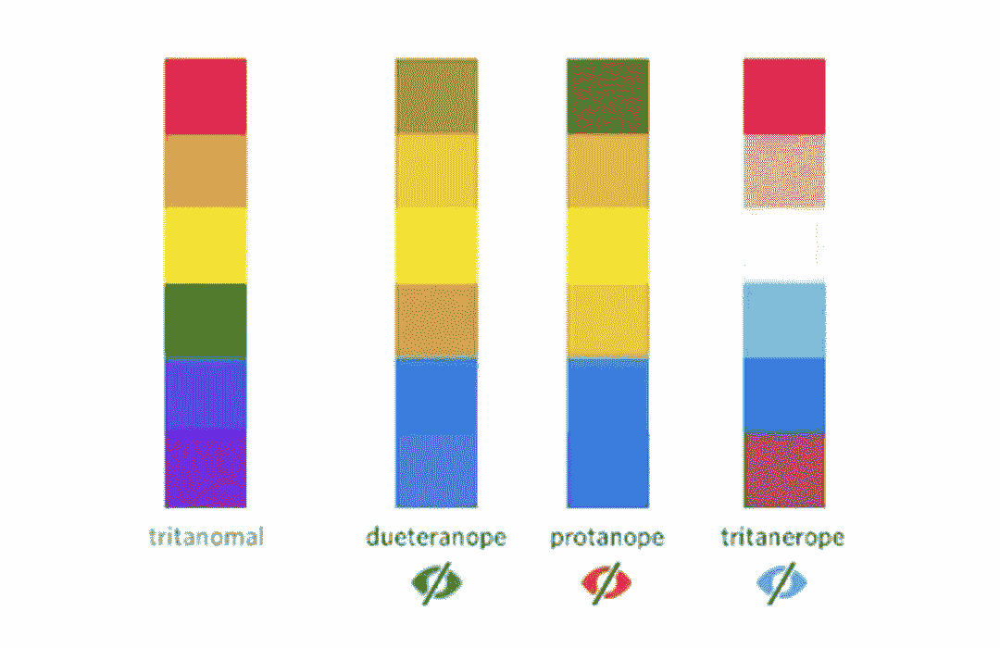
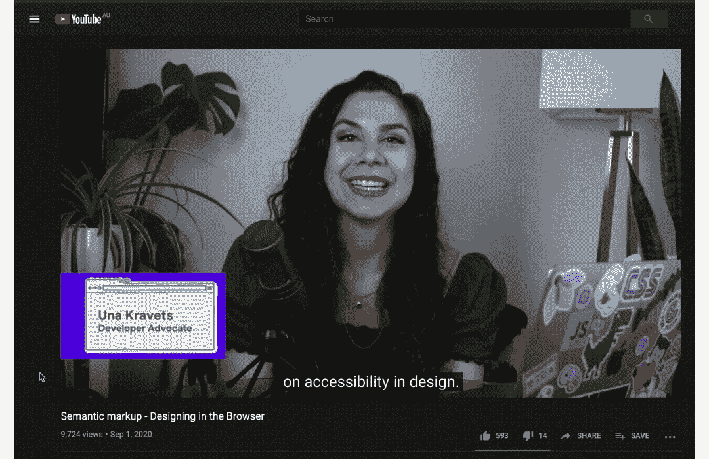

# 网页可及性的基础

> 原文：<https://betterprogramming.pub/web-accessibility-the-basics-281ffa4f4a3d>

## 改善我们的网站并使其更易访问的技巧和工具


# 什么是网页可访问性？

Web 可访问性是设计和构建应用程序的过程，以便每个人都可以感知、理解它们并与之交互。当我们谈论网页可访问性时，有 5 个个人特征是我们应该考虑的:

*   言语障碍
*   听力障碍
*   视觉障碍(失明、色盲和其他视觉障碍)
*   电机控制限制
*   认知局限

当我们建立网站和应用程序时，我们希望确保任何具有这些个人特征的人都能使用它们。

# 如何知道我的网站是否可以访问？

那么我们如何评估我们网站的可访问性呢？WCAG(网页内容可访问性指南)是一系列成功标准，我们可以用它来评估网页的文本、图像、声音和 HTML 结构/标记。WCAG 包含了一系列我们应该努力达到的成功标准。一个简单的成功标准示例是“所有功能都可以通过键盘界面操作”。

WCAG 有 3 个认证等级:

*   **A 级是最低级别。**达到这一水平需要满足所有标准，这些标准是网页可访问性的基线、显示阻止标准。
*   **AA 级包括所有 A 级和 AA 级要求**。许多组织努力达到这一水平。
*   **AAA 级包括所有 A 级、AA 级和 AAA 级要求。**这一级别通常保留给面向残疾人市场的网站和应用程序，例如，所有视频都包含手语翻译

一份分析网页的 WebAIM 报告发现，97.8%的网页都自动检测到 WCAG 2 AA 故障。这说明我们都有很长的路要走！

有许多工具可以用来分析您的网页及其 WCAG 合规性。工具是将良好的可访问性实践嵌入到您的日常开发中的一种非常有用的方式。我会在文章底部分享其中的一些！

我们已经了解了什么是网页可访问性，并了解了 WCAG —
现在我们来看看如何改进我们的网站，让它们更容易访问。

# **为屏幕阅读器构建**

首先，我们将看看如何建立您的网站，以配合屏幕阅读器。

屏幕阅读器是为视力受损的用户设计的工具。它们将网页上显示的文本和内容转换成可以大声朗读的音频。有一些流行的屏幕阅读器，如 Mac 上的 *VoiceOver* 和 Windows 上的 *JAWS* 。我强烈建议您尝试使用这些工具之一来了解它们是如何工作的，因为这将帮助您感受一些用户的痛苦，并了解什么类型的信息对提供给屏幕阅读器是有用的。

以下是构建网站以与屏幕阅读器完美配合的一些技巧:

## **1。确保你使用了正确的 HTML 标签**

Web 开发人员通常会创建自己的元素，而不是使用原生 HTML 元素——一个常见的例子是使用`<div>`而不是`<button>`:

```
// Custom <div> with styling to look like a button
<div style={...} onClick={fn}/>// Native HTML button
<button onClick={fn}/>
```

然而，原生 HTML 元素带有许多屏幕阅读器所依赖的语义。例如:

*   `checkbox`有一个关于盒子是否为`checked`的属性，该属性被读取给屏幕阅读器
*   一个`link`有一个属性，表示它是否是`visited`，这个属性也被读出给屏幕阅读器

让您的元素在屏幕阅读器上看起来很好的最简单的方法是使用原生 HTML 元素，而不是尝试创建自己的元素，如果您愿意，您可以随时覆盖默认样式。



## **2。使用 aria 标签**

ARIA(Accessible Rich Internet Applications)是一个可以添加到标记中的属性集合。ARIA 属性将信息添加到您的网页中，并与辅助工具进行交流，但不会改变其外观或行为。

`aria-label`是一个属性，用于为元素添加标签，并传递给屏幕阅读器。例如，当您有一个只有图标的按钮时，这对于屏幕阅读器用户很有用:

```
<button aria-label="Copy"><CopyIcon/></button>
```

## **3。使用 ARIA 地标角色**

ARIA landmark 角色是一个为屏幕阅读器用户提供即时价值的特性，并且添加起来非常简单。向元素添加`role="..."`意味着屏幕阅读器用户可以快速跳转到这些地标之一。共有 8 个 ARIA 标志性角色:

```
role=”banner”
role=”navigation” (e.g. a menu)
role=”main” (the main content of the page)
role=”complementary” (e.g. a sidebar)
role=”contentinfo”
role=”search”
role=”form”
role=”application”
```

## **4。隐藏装饰内容**

屏幕阅读器的最后一个技巧是隐藏装饰性内容。如果你的页面上有些东西只是为了装饰的目的*(比如一张图片)*，与其让屏幕阅读器把它读出来，最好是对屏幕阅读器完全隐藏起来。您可以通过向元素添加 aria-hidden 属性来实现这一点:

```

```

# 运动控制障碍

运动控制障碍通常会影响人们与物理设备互动的能力。运动控制障碍的一些例子是震颤或肌肉无力。

有运动控制障碍的用户可能无法使用鼠标，或者他们可能难以按下移动设备上的小按钮。

## **规则 1:网页上的所有功能都应该可以通过键盘操作**

有些用户可能无法使用鼠标，因此网页应该可以通过键盘导航和操作，这意味着:

*   使用 tab 键在元素之间导航
*   按下`enter`或`space`按钮，勾选复选框，或展开下拉菜单

## **规则 2:活动元素需要可见**

键盘交互的第二个规则是活动元素应该是可见的。默认情况下，浏览器会在活动的按钮上(以及所有可聚焦的元素上)添加红色轮廓。



常见的模式是在“键盘模式”下只显示红色轮廓

## **规则 3: Tab 键顺序应该合理**

对于键盘用户来说，以一种合乎逻辑的方式构建 HTML 也很重要。当你浏览一个页面时，它应该按照有意义的顺序突出显示元素。实现这一点的最简单的方法是用一种有意义的方式来组织你的 HTML。

Web 开发人员可能经常以随机顺序放置 DOM 元素，并使用 CSS 来放置它们，但是，这使得通过键盘浏览页面更加混乱。

另一种方法是使用积极的`tabindex`——然而，这通常不是一个好主意，因为它会导致维护问题。例如，假设您想在 HTML 页面中间添加一个元素，您需要重新排列所有的索引。



使用逻辑有序的 HTML 是一种比正制表符索引更好的方法

## **规则 4:避免触摸小目标**

在移动设备上，重要的是避免按钮和交互元素的小触摸目标。WCAG 规则规定目标应该至少是 44x 44 的 CSS 像素。

## **规则 5:手机上的一切都应该能够用一个简单的手势*来完成***

有运动控制障碍的用户需要考虑的另一件事是避免复杂的手势。 ***简单手势*** 定义为任何只使用一个手指，不依赖于滑动距离的动作，例如:

*   ✅ 1 指轻敲
*   ✅单指连按两次
*   ✅ 1 指长按
*   ❌ 1 指滑动
*   ❌两指轻敲

# 视觉障碍建筑

现在让我们来看看视觉障碍，以及我们如何为盲人和色盲用户创建可访问的网页。

## **颜色对比**

就视觉障碍而言，首先要考虑的是颜色对比。颜色对比度是以元素的颜色与其背景的比率来计算的。

WCAG 对元素或文本的颜色对比度有标准，因为如果元素或文本的对比度低，弱视用户通常很难看清它们。这些标准是:

*   正文文本的 **4.5:1**
*   **3:1** 用于页眉文本*(页眉文本已经比较大了，所以允许有稍微小一点的对比度)*
*   **3:1** 用于其他类型的元件

这些规则有一些例外，例如:

*   标识不需要遵守
*   禁用的元素(例如禁用的按钮)不需要遵从

为了计算色彩对比度，有一个有用的工具叫做 [CCA(色彩对比度分析器)](https://developer.paciellogroup.com/resources/contrastanalyser/)。该工具允许您手动或通过颜色选择器输入颜色代码，并将告诉您颜色对比。它还会告诉您对比度是否符合 WCAG AA 和 AAA 要求。


色彩对比分析工具(CCA)

## **色觉障碍**

除了颜色对比，为色盲用户设计也很重要。根据人们看不到的不同颜色，有多种类型的色盲，下图显示了其中几种类型:



一些不同类型的色盲

在上图中，你可以看到在 Duerteranope 中，绿色和红色看起来几乎无法区分——所以在构建我们的 UI 时，记住这一点很重要。

为色觉障碍用户构建 UI 的一种方式是*使用颜色和符号*来交流信息。例如，在下面显示的错误状态中，出错字段上有一个错误符号和红色轮廓:


对错误状态使用颜色和符号

[NoCoffee](https://chrome.google.com/webstore/search/NoCoffee%20Vision%20Simulator?hl=en&gl=US) 是一个 Chrome 扩展，模拟不同的色觉障碍，帮助你测试你的网页。

## **缩放级别和字体大小**

对于视力有障碍的用户来说，还有一点需要考虑的是，如果用户增加了*或 ***字体大小*** ，你的网页应该不会断裂。浏览器缩放级别是许多有视力障碍的用户使用的一项功能，因此 ***200%测试*** 是一种确保当您放大时没有任何东西损坏的方法——当放大到 200%时:*

*   *页面上的元素不应该重叠*
*   *不应该有任何不必要的滚动条*
*   *内容的顺序应该还是有意义的*

## *听力障碍建筑*

*针对听力障碍，我们应该考虑的首要问题是*任何重要信息都不应该通过纯音频方式传达*。如果网页上的音频没有传达重要的信息，那么它是可以的，但是对于一个有对话的视频，我们应该有字幕。*

**

*视频应该为听力受损的用户提供字幕——例如 YouTube*

# *认知障碍建筑*

*最后，让我们看看如何让有认知障碍的用户能够访问我们的网页。*

## ***避免基于工期的任务***

*首先，你的网站不应该假设用户会在一项任务上花费多长时间。例如，错误消息或弹出窗口不应该在几秒钟后自动隐藏，因为你应该给用户时间来阅读内容。同样，表单不应该有超时，除非它们非常慷慨——我们不应该假设用户需要多长时间阅读或完成一项任务。*

## ***简单表格和自动填充***

*其次，表格应该填写简单，易于理解，并且应该有明确的错误信息。自动填充是一个有用的工具，因为它意味着用户不需要记住他们的信用卡号码或邮政编码，这可以很容易地使用 HTML 自动填充属性来添加:*

```
*autofill="off"
autofill="name"
autofill="email"
autofill="organization"
autofill="street-address"
autofill="country"
autofill="postal-code"
autofill="cc-number"
autofill="bday"
autofill="tel"*
```

*当让有认知障碍的用户访问网页时，还有很多事情要记住，但这里有一些提示:*

*   *保持文本简单*
*   *尽量减少外围和分散注意力的内容，如广告或弹出窗口*
*   *尝试使用熟悉的元素，例如，一个链接元素应该有一个下划线，点击时应该改变颜色*
*   *目标是在你的网站的页面之间有一个一致的布局*

# *一些有用的工具和资源*

## *用斧砍*

*[**Axe**](https://www.deque.com/axe/) 是一个工具和 chrome 扩展，静态分析你的网页并标记可访问性问题。*注意:Axe 是静态运行的，所以如果你有一个多页面的网站，你需要在每个页面上运行它**

## *Axe 反应*

*[**@ axe-core/react**](https://www.npmjs.com/package/@axe-core/react)是一个 npm 包，用于测试 React 代码的可访问性问题——这与 Axe 类似，但可以帮助您在编码时更早地发现错误。*

## *其他工具和资源*

*以下是一些其他有用的工具和资源，包括上面文章中提到的:*

*   *[辅助功能扫描仪](https://play.google.com/store/apps/details?id=com.google.android.apps.accessibility.auditor&hl=en_AU)—Android a11y 评估工具*
*   *[WAVE](https://chrome.google.com/webstore/detail/wave-evaluation-tool/jbbplnpkjmmeebjpijfedlgcdilocofh) —浏览器 a11y 评估工具*
*   *[可访问性洞察](https://accessibilityinsights.io/docs/en/web/overview)*
*   *[NoCoffee](https://chrome.google.com/webstore/search/NoCoffee%20Vision%20Simulator?hl=en&gl=US) —色觉障碍模拟器 Chrome 扩展*
*   *[CCA(色彩对比分析仪)](https://developer.paciellogroup.com/resources/contrastanalyser/)*
*   *[ARIA MDN 文档](https://developer.mozilla.org/en-US/docs/Web/Accessibility/ARIA)*
*   *[Windows JAWS](https://www.freedomscientific.com/products/software/jaws/) —屏幕阅读器软件*
*   *[MacOS VoiceOver](https://www.disability.illinois.edu/academic-support/assistive-technology/mac-os-x-voiceover) —屏幕阅读器软件*

**感谢阅读，希望对您有所帮助！**