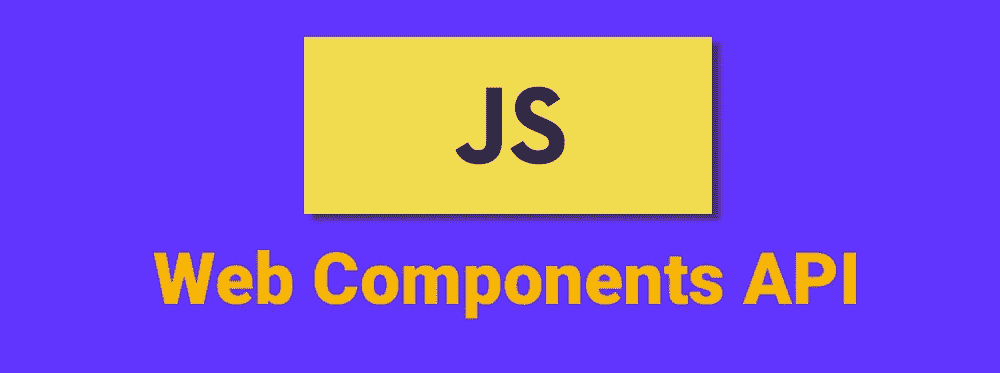
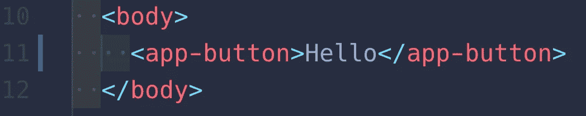
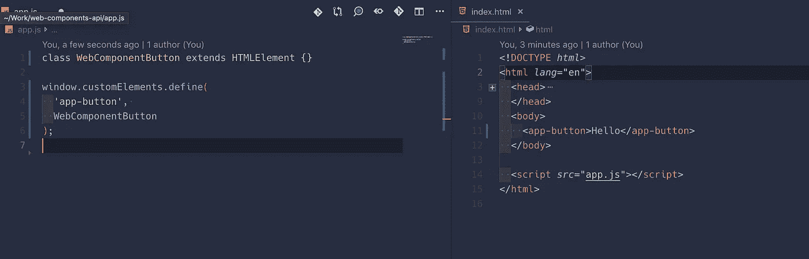
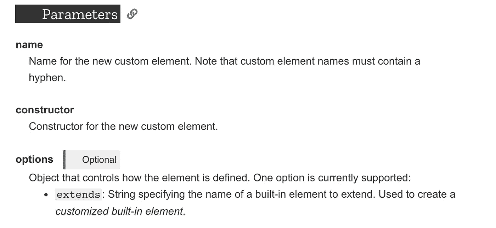
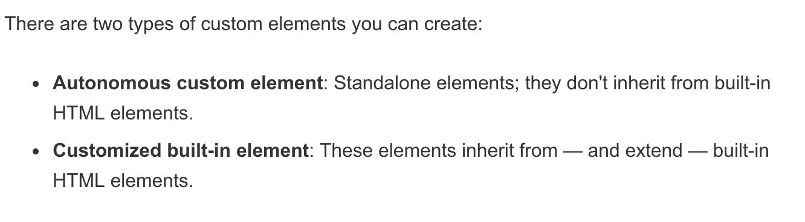
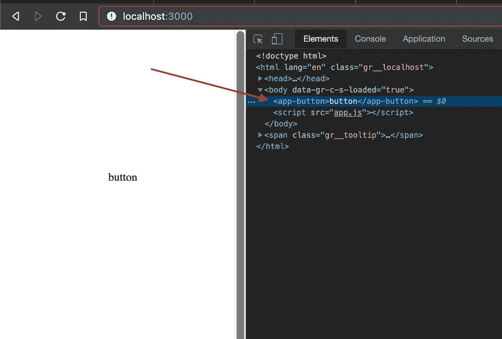
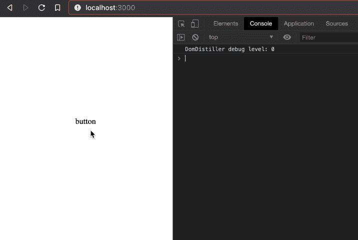
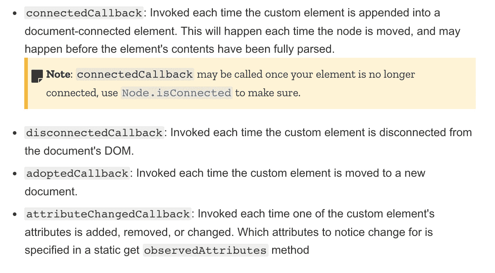
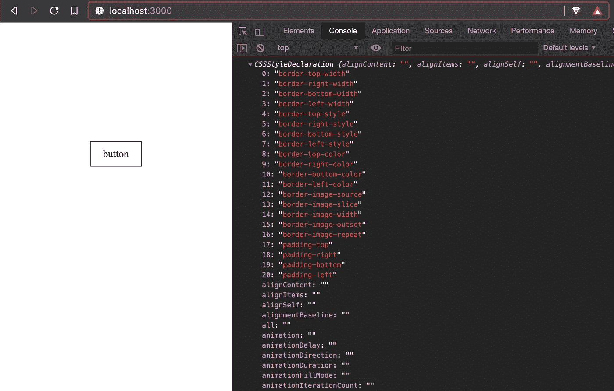
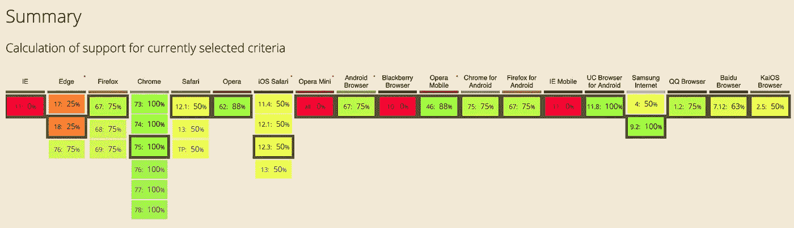

# 简而言之，Web 组件 API

> 原文：<https://betterprogramming.pub/web-components-api-in-a-nutshell-c409127d563a>

## 本机 Web 组件 API 的内容和原因

我们都知道尽可能多地重用代码通常是一个好主意。在组件之间共享代码为我们节省了金钱、精力，最重要的是，节省了时间。

对于复杂的 HTML 来说，重用代码并不容易。有时你不得不编写自定义 UI 控件，如果不小心的话，多次使用它们会使你的页面变得一团糟。

这就是 [Web 组件](https://www.webcomponents.org/)的用武之地。Web Components 是一套不同的技术，它允许您创建可重用的自定义元素(将它们的功能封装在代码的其余部分之外)，并在您的 Web 应用程序中使用它们。

例如，web 组件让我们在`HTML`文件中定义定制元素。

自定义 HTML 元素(非 JSX)

*注；我们没有使用*[*webpack*](https://webpack.js.org/)*[*roll up*](https://rollupjs.org/)*，或者*[*bundler*](https://bundler.io/)*以上。HTML5 和 JavaScript 支持该语法。如果想学习原生 JavaScript，我推荐阅读“* [口才 JavaScript](https://www.amazon.com/Eloquent-JavaScript-3rd-Introduction-Programming-ebook/dp/B07C96Q217/ref=as_li_ss_tl?keywords=javascript+book&qid=1564573443&s=books&sr=1-2&linkCode=ll1&tag=thegeniusde07-20&linkId=788a6ff50f5075cf57e905ba4306b695&language=en_US) ”这本书。*

*每个 JS 框架都有自己的可重用组件 API。一个`react-video-player`在 Ember 里不行，一个`ember-preload`在 Vue 里也不行。比如 [Matrix.org 的 JavaScript SDK 绑定了 React](https://github.com/matrix-org/matrix-react-sdk) 。其他 JS SDK 使用 iframe(像脸书的 Button 和其他 ad-tech SDK 通常走这条路)或者根本不提供任何 UI 功能(像 WebTorrent)。*

*Web 组件，因为它们的行为完全像内置的 HTML 元素，应该可以在任何框架中工作。如果你的框架可以呈现任意的 HTML 元素，那么它可以呈现一个定制的 HTML 元素。如果你只是搭建一个 app，那没关系；只需用你的模板语言呈现你想要的 HTML。作为一个*库的作者*，仅使用浏览器内置 API 来提供带有某种程度封装的 JavaScript 小部件的能力看起来确实不错。— [未解之谜](https://lobste.rs/s/xfeqvu/web_components_api_nutshell#c_vnrvzz)*

# *入门指南*

*我们只需要`index.html`和`app.js`文件。确保将`app.js`文件包含在您的`index.html`中。*

**

*注意浏览器全局窗口对象有一个名为`customElements`的属性——我们调用属性上的 define 方法来创建我们的定制 HTML 元素。它有三个参数，最后一个是可选的。*

*定义自定义 HTML 语法— [Mdn](https://developer.mozilla.org/en-US/docs/Web/API/CustomElementRegistry/define#Syntax)*

*第一个参数是定制元素的名称，在上面的例子中是`app-button`。第二个参数是元素的构造函数。我们使用构造函数来构建自定义元素，比如附加事件侦听器和逻辑。*

**

*[来源](https://developer.mozilla.org/en-US/docs/Web/API/CustomElementRegistry/define#Syntax)*

*注意我们的`WebComponentButton`类是如何扩展`HTMLElement`类的。简单来说，我们继承并扩展了内置的 HTML 元素。*

**

*[来源](https://developer.mozilla.org/en-US/docs/Web/API/CustomElementRegistry/define)*

*如果我们在浏览器中打开`index.html`文件，我们应该会看到以下内容:*

**

*注意我们的 DOM 中有一个类似 JSX 的节点元素吗？非常酷，考虑到我们在这里没有使用任何捆绑器或框架。*

*不出所料，如果我们点击按钮，什么都不会发生。我们需要告诉按钮点击后要做什么。为了实现这一点，让我们为按钮添加一个事件监听器。*

*将单击事件侦听器附加到我们的按钮实例*

*现在，如果我们点击按钮，我们应该看到一个`click` 登录到控制台。*

**

*点击按钮*

*让我们给按钮添加样式。我们该怎么做？*

*类有现成的生命周期。如果你从[反应过来](https://reactjs.org/)、 [Vue](https://vuejs.org/) 、 [Angular](https://angular.io/) 等等。，你可能已经很熟悉了。生命周期方法让我们控制当某些行为发生时会发生什么。例如，当浏览器呈现按钮时，我们希望为其附加样式。*

*按钮组件的生命周期事件*

**

*[使用生命周期回调](https://developer.mozilla.org/en-US/docs/Web/Web_Components/Using_custom_elements#Using_the_lifecycle_callbacks)*

*我们可以通过标准的`[**CSSStyleDeclaration**](https://developer.mozilla.org/en-US/docs/Web/API/CSSStyleDeclaration)` API 来设计我们的按钮。例如，`
`使用的是`CSSStyleDecleration` API。*

*向按钮添加样式*

*`This`引用我们的类，在这种情况下`WebComponentButton`。上面的代码会给我们的按钮一个带填充的深色边框。*

**

*样式按钮*

# *浏览器支持*

*大多数现代浏览器都有不错的 web 组件支持。考虑到 IE11 无关紧要，您应该可以在生产中使用 web 组件。*

**

*[Web 组件 API 浏览器支持](https://caniuse.com/#search=web%20components)*

# *从这里去哪里*

*Web 组件 API 可以为您做很多事情。请阅读下面的文章，更好地了解它的用处。*

*如果你足够好奇，我推荐你通读一下 [Mozilla Developers](https://developer.mozilla.org/en-US/docs/Web/Web_Components) 和 [Google Web Fundamentals](https://developers.google.com/web/fundamentals/web-components/customelements) 来更好地理解 Web 组件 API。还有一本名为《[*Web Component Essentials*](https://amzn.to/2YyR8rx)》的书，里面有很多关于如何利用 web components API 的例子。*

* [## Web 组件

### 作为开发人员，我们都知道尽可能多地重用代码是一个好主意。传统上不是这样的…

developer.mozilla.org](https://developer.mozilla.org/en-US/docs/Web/Web_Components)  [## 定制元素 v1:可重用的 Web 组件| Web 基础| Google 开发者

### 自定义元素允许 web 开发人员定义新的 HTML 标记，扩展现有的标记，并创建可重用的 web 组件。

developers.google.com](https://developers.google.com/web/fundamentals/web-components/customelements)  [## Web 组件介绍| CSS-技巧

### 前端开发以惊人的速度前进。无数的文章、教程和 Twitter 证明了这一点…

css-tricks.com](https://css-tricks.com/an-introduction-to-web-components/) 

如果你想玩源代码，请随意[点击这里的例子](https://github.com/indreklasn/js-web-components-nutshell)。

 [## indreklasn/js-web-组件-果壳

### 通过在 GitHub 上创建一个帐户，为 indreklasn/js-we B- components-坚果壳开发做出贡献。

github.com](https://github.com/indreklasn/js-web-components-nutshell) 

感谢阅读。保持对信息的渴望！❤*