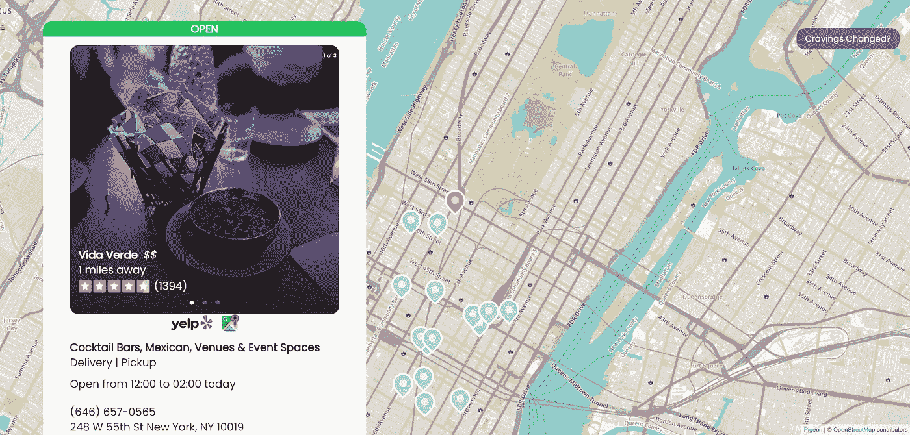
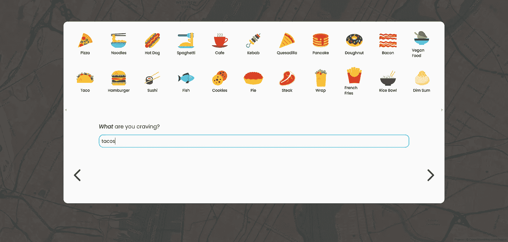
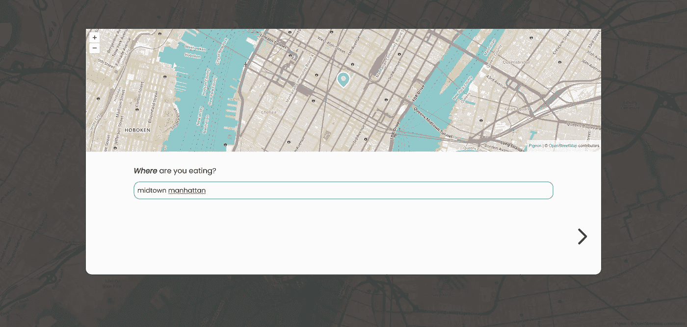
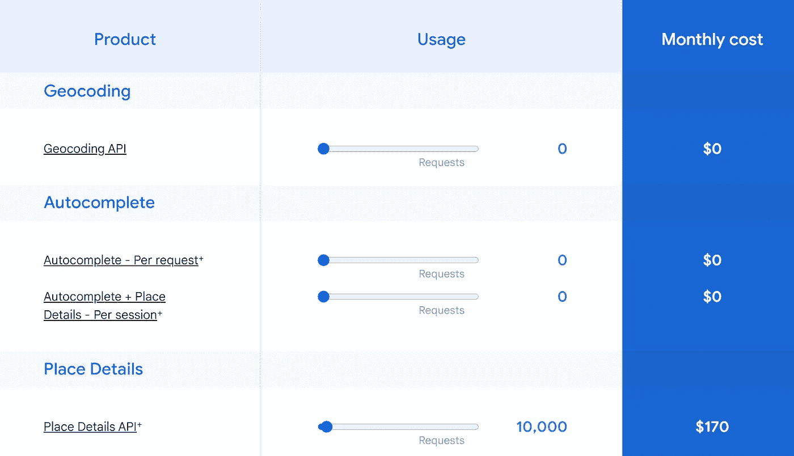

# 我开发了一个餐馆应用程序——下面是我学到的一些网络开发技术

> 原文：<https://betterprogramming.pub/web-dev-tips-i-learned-from-building-the-tinder-of-finding-a-restaurant-974612e1c0a0>

## 找到适合自己的食物应该很容易。对吗？

我应该在哪里吃饭的结果页面([https://Where Should ieat . app](https://whereshouldieat.app)

本周，我旨在解决一个古老的问题:[我应该在哪里吃](https://whereshouldieat.app)？

一路走来，我学到了关于 web 开发的三个重要技巧，我将把它们带到我决定要做的任何事情上。

我将首先谈论我制作的应用程序，以便为您提供一些背景信息，然后我将深入研究我遇到的问题以及通过解决这些问题我学到了什么。

你可以在[的 whereshouldieat.app](https://whereshouldieat.app) 上亲自试用这个网站，和往常一样，所有代码都可以在 [GitHub](https://github.com/jordantwells42/whereshouldieat) 上找到。

# **应该去哪里吃饭？**

在([https://where should ieat . app](https://whereshouldieat.app))搜索渴望

当然，这个问题的解决方案已经存在。你可以打开谷歌搜索，快速搜索“[我附近的寿司](https://www.google.com/search?q=sushi+near+me)”或者查找一篇关于“[曼哈顿顶级餐厅”的文章。然而，这两种解决方案都通过迫使你在许多选择中做出更艰难的决定来回答这个问题，有些选择你可能从未听说过。](https://www.malaproject.nyc/)

我的网站通过一次只给你一个决定来缓解这个问题:你是否想在这家餐馆吃饭。如果你不想在那里吃饭，你应该不需要再考虑它了。如果你想在那里吃饭，你应该立即被带到如何到达那里的方向。

这些选择被编码成手势。向左滑动意味着忽略该餐馆，不再考虑它。向右滑动会进入那家餐馆的谷歌地图页面，在那里你可以很容易地找到方向。你一次只需要做一个决定，对于像我这样优柔寡断的人来说，让整个过程变得精简。

# 降低应用程序的速度可以加快用户体验

在([https://where should ieat . app](https://whereshouldieat.app))上搜索位置

有反应的输入会让人感觉很棒。一旦您开始在输入字段中键入内容，自动建议就会弹出，其他查询也会开始发生。然而，有些事情不应该在每次击键时发生。

对于我的应用程序，我最初设置了文本输入，以便每次按键都可以从 Yelp API 中获取，找到并设置位置和企业，并更改地图上的位置。这导致地图拥挤不堪，并根据部分输入加载了几个城镇。尝试搜索“midtown Manhattan”将导致搜索“m”、“mi”和“mid”以及从头开始的所有其他可能的子字符串。

我对此的解决方案是一个叫做[去抖](https://www.freecodecamp.org/news/javascript-debounce-example/)的概念。这使得该函数在一定时间间隔内不可能被多次调用，从而有效地抑制了输入与其效果之间的关系。现在，只有当用户冷静下来输入他们的输入，给出预期的结果时，搜索才会启动。

就实现而言，我发现[这篇文章](https://blog.logrocket.com/how-and-when-to-debounce-or-throttle-in-react/)在用 React 原语实现方面非常有帮助。当然，有人为去抖动输入字段做了一个库，叫做 [react-debounce-input](https://www.npmjs.com/package/react-debounce-input) ，所以我用了这个库。实现就像用`DebounceInputs`替换输入一样简单。

# 您的第一个用户不应该随部署一起提供

照片由[雅各布·久巴克](https://unsplash.com/@jckbck?utm_source=medium&utm_medium=referral)在 [Unsplash](https://unsplash.com?utm_source=medium&utm_medium=referral) 上拍摄

这听起来可能是显而易见的，但你是第一个使用你的网站的人。根据雅各布定律，除了你昨天刚开始开发的网站，你已经花了更多的时间在其他网站上。你能很好地判断网站如何工作，以及你的新网站应该如何表现。所以，用吧！

即使你在开发，也要成为用户，不断地与你的网站互动。如果有些东西让你的用户感到困惑，戴上你的开发者帽子，解决它！

在“我应该在哪里吃饭”的例子中，我发现这在我处理 URL 的方式中表现得最为明显。每当我和朋友出去的时候，我都使用这个几乎没有开发过的网站版本，每当我试图按下浏览器上的后退按钮时，我都发现自己很困惑，它完全把我从这个网站引开了。互联网教会了我，如果我想撤销，我可以导航回去，期待改变被撤销。

为了解决这个问题，[我将我的状态提升到 URL](https://www.youtube.com/watch?v=sFTGEs2WXQ4) 中。现在，每当搜索位置或用户渴望的食物发生重大变化时，这将反映为一个 [URL 参数。](https://www.botify.com/learn/basics/what-are-url-parameters)因此，如果用户不想吃玉米卷，想回到之前选择的寿司，他们可以通过导航回到浏览器来实现。

说句题外话:如果你使用 Next.js 和它的路由器来处理把状态放入 URL，我建议你使用[浅层路由](https://nextjs.org/docs/routing/shallow-routing)，如果你发现状态改变使你的站点滚动或数据晃动，把滚动选项设置为 false。

使用 Next.js 的浅层无滚动路由

# 狡猾地妥协

相对适中的每月 10，000 次请求的定价

本来想用[谷歌地图 API](https://mapsplatform.google.com/pricing/) 。我很快就看到了一张信用卡表格和一个定价方案，这让我有点害怕，因为我希望我的应用一夜成名。这甚至不包括使用他们的地图平铺来生成动态地图。(他们提供 200 美元/月的免费请求，但我是在开始我的网站后才知道的。)

相反，我找到了免费的替代品。 [Yelp Fusion API](https://fusion.yelp.com/) 为我提供评论、位置和营业时间等位置信息，每天有 5000 个请求，而无需升级到企业计划。此外，[鸽子地图](https://www.npmjs.com/package/pigeon-maps/v/0.16.1)包利用免费的平铺解决方案，如 [OpenStreetMap](http://OpenStreetMap.org) 为 React 提供动态的、工具完善的地图。

当然，最终我还是想使用谷歌地图。为了实现这种集成，我简单地使用 Yelp 中查询到的纬度、经度和地名来构建一个 Google Maps URL，它会将我带到正确的地方。我找到了一个[有用的指南](https://moz.com/blog/new-google-maps-url-parameters)来做这件事。

现在，我可以获得类似的功能，而不用倾家荡产，也不会对用户体验造成明显影响。我坚持不使用谷歌地图 API，但我的应用程序没有失去任何主要功能！

# **结论**

随着我继续构建更多的项目，我发现我面临的问题变得越来越微妙。一开始，我是冲着 JavaScript 喊的。然后，我被钩子和“状态”搞糊涂了。最后，我对着打字稿大喊大叫。现在，我发现我的问题更像是打造一个干净的用户体验，以一种防止[瀑布](https://en.wikipedia.org/wiki/Waterfall_chart#:~:text=A%20waterfall%20chart%20is%20a,time%20based%20or%20category%20based.)的方式获取数据，或者做出一个美观的设计。

我希望提高我的发展水平，所以我唯一的问题是提出下一个[独角兽创业](https://en.wikipedia.org/wiki/Unicorn_(finance))的想法！我希望与我所有的读者分享我一路走来学到的一些智慧！

感谢阅读！