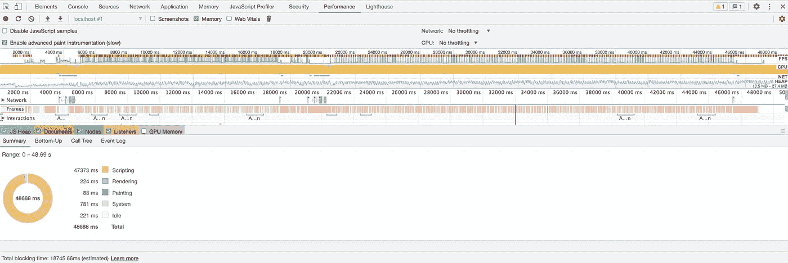
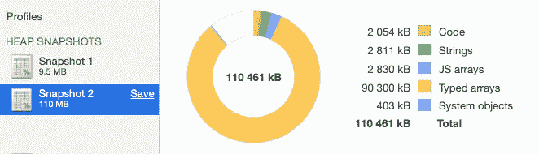
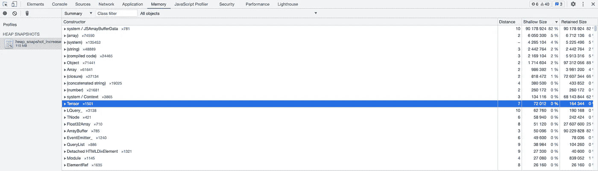
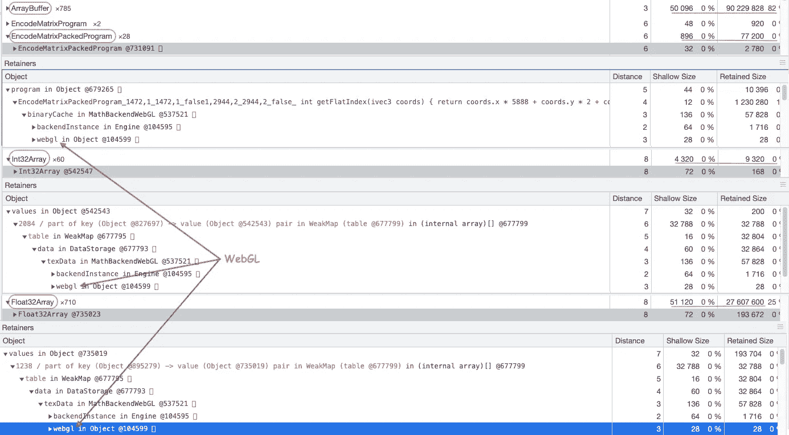
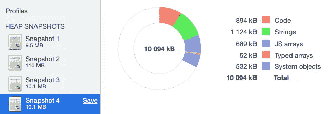

# TensorFlow.js 如何成为我的应用程序的性能瓶颈

> 原文：<https://betterprogramming.pub/web-performance-and-tensorflow-js-3db05b1de958>

## [网页表现](https://rakiabensassi.medium.com/list/software-engineering-7a179a23ebfd)

## 当你的应用程序变成一个 CPU 吸盘和性能猪

亚历山大·安德鲁斯在 [Unsplash](https://unsplash.com?utm_source=medium&utm_medium=referral) 拍摄的照片

# 第一天:找一个案例研究

凌晨时分，我开始了第一天的准备工作，准备一份关于识别和修复内存泄漏的报告。网上有许多博客和视频展示如何实现这样一个目标，但开发人员已经实现了一些应用程序，他们有意做到了以下几点:

*   添加了事件侦听器，但从未删除它们
*   将对象设置为 DOM 元素上的数据
*   故意不从全局缓存中清除失效的项目
*   让开发工具通过`console.log`对象来保存对它的引用。

但我的计划不同。我不想在演示中实现一个虚拟的应用程序来显式地泄漏内存，我想使用一个真实的案例研究，这样这个挑战将尽可能地接近我们作为软件开发人员在日常工作中所面临的挑战。

我已经开始分析像 der-sack.de 和 wetter.de 这样的网站，然后回到我在过去几个月中实现的一个应用程序，并用它来展示:

*   如何建立一个[动态步进器](/angular-library-dynamic-stepper-2ba05ab40228)作为角度库
*   如何实现带有搜索功能的[自动完成](/angular-custom-autocomplete-7ffb479477e7)
*   如何利用机器学习，用[手势而不是鼠标点击](/build-a-hand-pose-detector-web-app-powered-by-machine-learning-62131ec43db5)在订单创建步骤之间导航
*   如何记录真实用户[网络重要指标](/web-vitals-guide-b56e28798e7f)绩效指标

当我试图创建一个新订单并编辑现有订单时，令我惊讶的是，我发现这个应用程序运行缓慢，用户体验非常缓慢和糟糕。虽然这可能是一个好消息，因为这个应用程序是我的演讲的一个很好的候选对象，但我很困惑，因为我在实现中使用了 Angular 良好实践，并取消了所有事件侦听器的订阅。

作为研究内存使用的起点，我检查了性能时间线记录:

1.  打开 Chrome DevTools 上的性能面板
2.  启用内存复选框
3.  录制一段录音

**注意:**最好在记录开始和结束时点击**收集垃圾**按钮。

垃圾收集按钮

结果如下:

Chrome DevTools 中我的应用程序的性能时间线记录(图片由作者提供)

*   代表每秒帧数(FPS)的线条几乎完全是红色的。
*   CPU 消耗大约为 100%(黄色矩形)。
*   脚本量非常大——浏览器在脚本任务上忙碌了 47 秒(从 48 秒的记录开始)。
*   总阻塞时间(TBT)超过 18 秒(18745.66 毫秒)。

在我的职业生涯中，我目睹过一些 web 性能很差的应用程序，但我从未见过如此糟糕的性能时间线。

为了直观地显示内存是如何在应用程序的 JavaScript(对象、原语、字符串、函数、DOM 节点等)之间分配的，我生成了两个堆快照:第一个是在启动应用程序之后，第二个是在执行一个简短的场景之后。以下是创建快照的方法:

1.  打开内存面板。
2.  启用堆快照复选框。
3.  点击“拍摄快照”按钮。

第一个堆快照的大小是 9.5MB，但是令我惊讶的是，第二个堆快照的大小是 110 MB——增加了超过 **100 MB** ！

执行简单场景后，堆快照增加了 100MB(图片由作者提供)

使用 Chrome DevTools 内存分析器拍摄并比较两个堆快照

在那之后，当我试图记录“分配时间线”时，应用程序崩溃了不止一次。

这是我第一天的成果。目前，我不知道是哪个问题导致了这个问题，所以我将在第二天看到您的结果。

# 第二天:罪犯

您可能已经注意到，在显示 110MB 堆快照统计信息的图表中，有超过 90MB 的类型化数组。

如果你很想知道它们是什么，它们来自哪里，下面是答案:

JavaScript 的类型化数组允许我们在内存缓冲区中读写原始的二进制数据。它们是类似阵列的物体，可以 be⁸:

*   *Int8Array* ， *Int16Array* ， *Int32Array*
*   *Uint8Array* ， *Uint8ClampedArray*
*   *浮动 t32 阵列*，*浮动 64 阵列*
*   *数组缓冲器*
*   *数据视图*
*   以及其他等等

它们由以下人员使用:

*   WebSockets
*   网络工作者
*   XMLHttpRequests
*   获取 API
*   文件 API
*   网络音频 API
*   WebGL
*   帆布
*   媒体源 API

在我的应用程序中，我没有 WebSockets、Web Workers 和 XMLHttpRequests，也没有使用 Fetch API、File APIs 或 Web Audio API。但是我确实有一个`canvas`和一个 DOM 元素在`dynamic-stepper.component.html`中，用来显示用户给应用程序在步骤之间导航的实时视频:

HTML5 画布和视频标签

我不知道 WebGL 是什么，但是稍微搜索了一下，了解到它是一个利用电脑的显卡(GPU)的浏览器 API。它于 2011 年推出，具有革命性，因为它允许在没有插件的情况下在网络上发布 3D 内容，并且具有高水平的安全⁰.

我继续对 110 MB 堆快照进行分析，发现张量——这让我想起了我为实现手势功能而添加到应用程序中的`tensor.js`库——是拥有较大“浅尺寸”和较大“保留尺寸”的元素之一，如下所示:

堆快照中的张量流(图片由作者提供)

## 浅尺寸

对象本身拥有的内存大小被称为“浅大小”通常，只有数组和字符串具有有效的浅 size⁸.

但是由于一个对象可以通过保存对其他对象的引用来间接保存内存，所以即使是小对象也可以通过防止被引用的对象被垃圾收集器(GC)自动释放来保留大量内存。

浏览器的`window`对象或者 Node.js 模块的`Global`对象代表内存图的根。所有不能从根到达的对象都被 GC。(图片 source⁸)

## 保留尺寸

一旦对象本身及其相关对象被删除，所释放的内存大小就代表“保留的大小”

## 距离

在上面的内存分析器的 distance 列中，有一些数字表示到 GC 根的距离。

因此，考虑到这一点，让我们继续我们的调查。堆分析器显示了更多的洞察力:

*   **ArrayBuffer** (类型化数组):shallow 大小 50.096B，retained 大小 90.229.828B(距离 3) → retained memory 是 shallow 大小的 1801 倍，它代表总 retained memory 大小的 82%。
*   **Float32Array** (类型化数组):浅大小 51.120B，保留大小 27.607.600B(距离 8) →保留内存是浅大小的 540 倍，它代表总保留内存大小的 25%。
*   **Int32Array** (类型化数组):浅层大小 4.320B，保留大小 9.320B(距离 8)。
*   **EncodeMatrixPackedProgram:***浅尺寸 896B，保留尺寸 77.200B(距离 6) →保留内存是浅尺寸的 86 倍。*

原来 EncodeMatrixPackedProgram 是来自 WebGL 和 TensorFlow.js，我在 GitHub 里发现了一个与之相关的[问题](https://github.com/tensorflow/tfjs/issues/3551)。根据 DevTools 的说法，WebGL 也使用 710 个 Float32Array 对象和 60 个 Int32Array 对象。下面的图片展示了它们的用法:

DevTools 中的堆分析器分析(图片由作者提供)

有了这个结果，我回到我的应用程序，删除了我使用过`TensorFlow.js`库的代码行。

你能猜出结果吗？

性能得到了显著提高，在执行相同的场景后，堆快照几乎没有增加，而在 TensorFlow.js 存在时，堆快照增加了 100 MB 以上。该视频展示了性能的提升:

使用和不使用 TensorFlow.js 时我的应用程序性能

使用 tensor.js 删除后堆快照没有增加(图片由作者提供)

这是一个经验证据，证明导致性能灾难的罪魁祸首是`TensorFlow.js`。

但是，我很好奇，为什么？为什么这个库会造成这么可怕的性能？我想知道我的情况是否是个例外？

# 第三天:为什么 TensorFlow.js 扼杀了我的表现

第三天，我看了一系列教程，了解了图书馆的工作原理。这是我的发现。

> “TensorFlow.js 是 Google 创建的一个开源框架，用于在浏览器中训练和使用机器学习模型。它帮助 JavaScript 开发人员在客户端应用程序中构建和部署 ML 模型，而无需设置服务器甚至数据库。
> 
> 该库也是与其同名的 TensorFlow(与 Python 一起使用的 ML 库)的伴侣，这意味着你可以使用 TensorFlow.js 转换任何 TensorFlow 机器学习模型以在浏览器中运行。”

由于浏览器是一个交互式空间，提供了对不同传感器的访问——如网络摄像头和麦克风——它可以提供视觉和声音作为任何机器学习模型的输入。这为企业和开发者打开了一系列令人兴奋的可能性。

许多开发人员正在从在后端服务器上使用 ML 转向前端应用程序。

## TensorFlow.js 和 WebGL

与 TensorFlow 仅支持 NVIDIA GPUs 不同，TensorFlow.js 通过使用 WebGL 浏览器 API，可以与任何显卡(GPU)配合工作。这是 TensorFlow.js 相对 TensorFlow 的一个优势。

因此，您会损失一些性能，因为只能通过一些技巧让 WebGL 执行 TensorFlow.js 所需的矩阵乘法。

以下是 WebGL 应用程序的剖析:

1.  创建一个`<canvas>`元素
2.  获取绘图上下文
3.  初始化视口
4.  创建一个或多个缓冲区
5.  创建一个或多个矩阵
6.  创建一个或多个着色器，这些着色器是在屏幕上绘制东西并在图形处理单元(GPU)上运行的函数。
7.  初始化着色器
8.  绘制一个或多个图元

下面是来自 [Tony Parisi](https://medium.com/u/c58181bd823e?source=post_page-----3db05b1de958--------------------------------) 的一些见解，解释了为什么将 TensorFlow.js 与 WebGL 一起使用可以呈现性能 challenge⁶:

*   WebGL 通过在类型化数组中加载 JSON 或 JSON+二进制数据开创了类型化数组的先河。
*   WebGL 没有 DOM，没有 CSS，也没有布局影响。要在屏幕上看到任何东西，API 需要大量的脚本代码——很多！
*   WebGL 使用着色器，这会导致额外的请求和客户端加载/ [编译](/compiler-vs-interpreter-d0a12ca1c1b6)时间。
*   WebGL 会通过管道传输更多的内容。
*   由于大量的计算，WebGL 应用程序可能会成为 CPU 吸血虫。

因此，与 TensorFlow 相比，当使用 TensorFlow.js 时，我们必须在性能方面做出一些权衡。当这变得至关重要时，建议改用 Python。

# 最后的想法

我在应用中实现的最后一个功能需要添加两个库:

*   `web-vital`收集关于用户体验的现场数据
*   `tensor.js`通过结合[机器学习](https://medium.com/geekculture/how-to-get-started-with-chatbots-9f7769b7c786)和前端开发来使用手势。

但是，除了确保正确记录性能指标以及成功检测和执行我用手给出的指令之外，我还没有检查我的应用程序对执行旧场景的响应性。

如果您有一个应用程序在生产中，这是一个错误，因为性能监控是一个过程，而不是一个事件。持续的测试和从中收集的信息是应用程序整体成功的关键因素。

感谢阅读！如果你更喜欢看这里的[一段视频](https://www.youtube.com/watch?v=4ja6OQYbEaI)。我如何解决这个问题的下一部分在本文中:[我如何在使用 TensorFlow.js 而不泄漏内存的战斗中获胜](https://levelup.gitconnected.com/how-to-use-tensorflow-js-without-memory-leaks-273ad16196be)。

🧠💡我为一群聪明、好奇的人写关于工程、技术和领导力的文章。 [**加入我的免费电子邮件简讯独家访问**](https://rakiabensassi.substack.com/) 或在此注册媒体。

# 参考

[修复内存问题](https://developer.chrome.com/docs/devtools/memory-problems/)

[性能比较:JavaScript 与 Python 用于机器学习](https://dlabs.ai/blog/performance-comparison-javascript-vs-python-for-machine-learning/)

[使用 JavaScript 进行机器学习的利弊](https://dlabs.ai/blog/the-pros-and-cons-of-using-javascript-for-machine-learning/)

⁴ [TensorFlow 开发者峰会](https://docs.google.com/presentation/d/1QsaLOsl82tQUDxkqbuVg3jS_NhFUkHnuagi8NpR66mM)

⁵ [WebGL 和网站性能](https://www.slideshare.net/auradeluxe/webgl-and-web-site-performance)

⁶ [WebGL:下一代](https://www.slideshare.net/auradeluxe/webgl-the-next-generation)

⁷ [JavaScript 类型化数组](https://developer.mozilla.org/en-US/docs/Web/JavaScript/Typed_arrays)

⁸[JavaScript 中的类型化数组简介](https://www.youtube.com/watch?v=UYkJaW3pmj0)

⁹ [记忆术语](https://developer.chrome.com/docs/devtools/memory-problems/memory-101/)

⁰ [为什么 WebGL 2.0 是更好的 3D 网络图形之路](https://viscircle.de/why-webgl-2-0-is-the-way-to-even-better-3d-web-graphics/?lang=en)