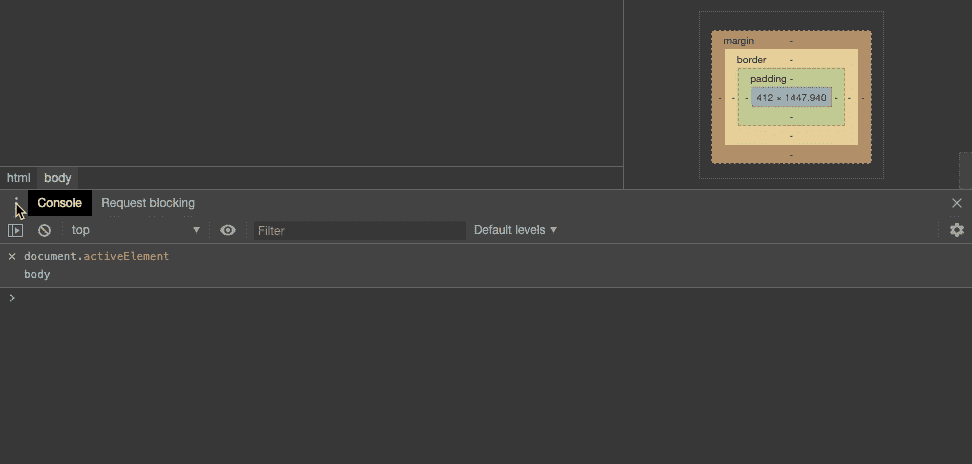
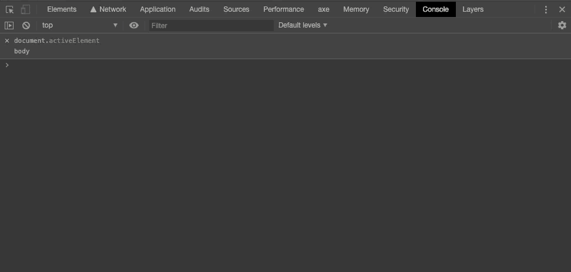
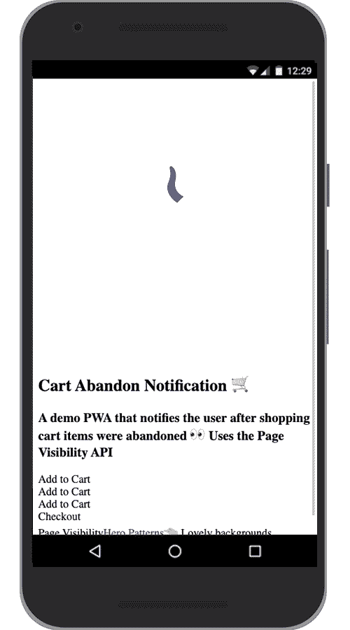
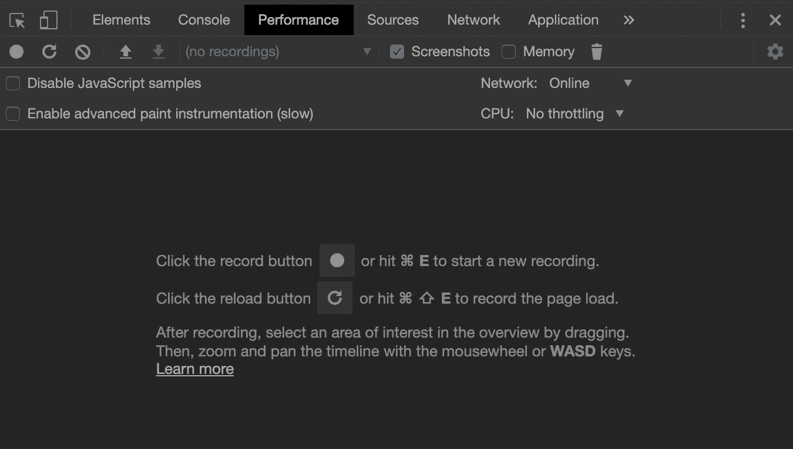
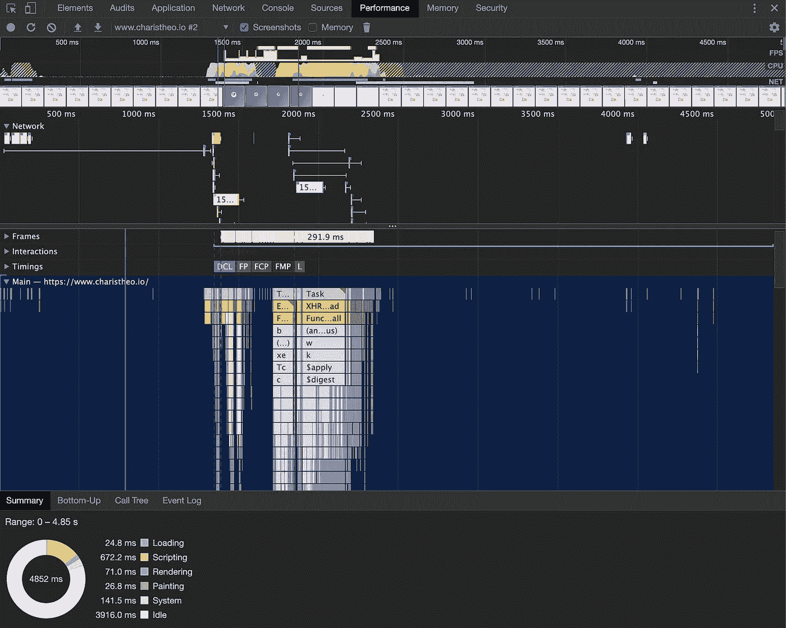

# Web 性能:最小化 DOM 重排/布局偏移

> 原文：<https://betterprogramming.pub/web-performance-dom-reflow-76ac7c4d2d4f>

照片由[哈尔·盖特伍德](https://unsplash.com/@halgatewood?utm_source=medium&utm_medium=referral)在 [Unsplash](https://unsplash.com?utm_source=medium&utm_medium=referral) 上拍摄

> **本文已更新！最新内容请关注** [**此链接**](https://www.charistheo.io/blog/2021/09/dom-reflow-and-layout-thrashing/) **。**

在这篇文章中，我将列出 DOM reflow / layout shift 事件可能发生的几种方式，为什么它是坏的，如何跟踪这些事件，以及如何最小化它的发生以减轻它的影响。

对于本文的其余部分，我将假设您熟悉前端开发组件，如 CSS、浏览器 DOM 和使用 JavaScript 访问 HTML 元素。

现在让我们开始吧。

# 什么是 DOM 回流/布局偏移？

重要的事情先来。我将要解释的过程有两个名称:

*   火狐中的 DOM 回流
*   在 Chrome/Safari/Opera/IE 中*布局*或*布局移位*

两者都是指同一个过程，那么为什么同一个东西会有两个名字呢？我想这就是 web 开发世界的样子。

无论如何，为了避免混淆，我将在本文的其余部分使用术语*回流*。对！那么什么是回流呢？

简单地说，重排是一种用户阻止的操作，它计算文档的布局。元素上的重排是对其在文档中的尺寸和位置的计算。

## 当它发生时

DOM reflow 发生的频率比您预期的要高。它发生在以下情况:

*   在 DOM 中插入/移除/更新元素
*   修改页面上的内容，例如输入框中的文本
*   移动 DOM 元素
*   制作 DOM 元素的动画
*   测量元素(`offsetHeight`或`getComputedStyle`)
*   更改 CSS 样式
*   设置`style`属性的一个属性
*   改变元素的`class`
*   添加/移除样式表
*   调整窗口大小
*   卷动
*   更改字体
*   激活 CSS-伪类，如`:hover`

要获得更详细的列表，请查看触发回流、绘画和合成的 CSS 属性的[列表和触发回流的 JavaScript 代码的](https://csstriggers.com)列表。

## 回流雪崩效应

请注意，在元素上触发的回流很可能会在它周围的元素上触发后续回流，因为这也会改变它们的位置/布局。

## 为什么不好

*   需要 CPU 能力
*   增加[第一次有意义的绘画](https://developers.google.com/web/tools/lighthouse/audits/first-meaningful-paint)时间
*   增加[第一次内容绘制](https://developers.google.com/web/tools/lighthouse/audits/first-contentful-paint)时间
*   因为这是一个阻塞操作，所以造成了糟糕的用户体验

我知道。如果你以前没有听说过这个回流的事情，你现在一定很恐慌。几乎每次与 DOM 的交互都会触发这种阻塞操作。如果你在想，“哦，对了，所以我不能使用任何 CSS，也不能操作 DOM，所以我怎么才能让自己有用呢？”

别担心，我的朋友。总会有回流。

作为 web 开发人员，我们的工作是通过降低事件数量和减轻其影响来优化速度。

## 这叫工程，我的朋友

就像 f1 工程师通过测量、校准和重复来优化速度一样，我们作为 web 开发人员需要测量性能、识别瓶颈、进行修复，并再次重复。

确保每次做出改变时，在新的修正之前，再次测量并比较结果。在某个网站上有效的不一定在另一个网站上有效。

现在让我们来看看一些方法，通过这些方法我们可以写出更好的代码并尽可能少地触发回流。

# 最小化回流事件的方法

因此，让我们来看看一些优化速度的方法。希望在这一部分之后，你会感觉自己更像一名超人 f1 工程师。

## 批量编辑 HTML 元素

如果要在 JavaScript 代码中的某个地方多次更改 DOM 元素，请在将它从 DOM 中移除后再做。

批量编辑移除的元素，并将其添加回 DOM。

或者，您可以隐藏元素，编辑它，然后再次显示它。

请注意，在这两种情况下，回流都会被触发两次，所以请确保在回流过多的情况下使用这种技术。

## 编辑树中尽可能低的元素

由于回流螺旋效应，建议在树中尽可能低的位置触发回流，以最小化可能在子元素上触发的后续回流。

假设您想要切换一个类以应用一组 CSS 样式，那么总是在您想要更改的元素上这样做，而不是在父元素上。如果在整个 HTML 文件中使用较少的包装器元素，您还可以获得一些性能改进。

## 测量一次

检查您的代码是否重复计算了元素的宽度，如`element.offsetWidth`或`$('element').width()`。将该值存储在一个变量中，并使用该变量。

**未优化代码:**

代码是未优化的，因为它在循环中计算元素的高度

**优化代码:**

代码得到了优化，因为它存储元素的高度值，并在循环中使用该值。同样，在将子元素再次添加到 DOM 之前，删除子元素以进行批量编辑。

**注意:**你可能会冒写更多代码的风险，结果代码不可读。因此，一定要用一个合理的名字将这个过程包装在一个函数中，并添加一个注释来解释这个函数是性能优化的。

您可能已经注意到，优化后的代码在编辑其子代之前也会删除列表，因为每次添加一些边距时，它都会导致重排。如果您正在处理许多类似上述的情况，fastdom 库可能会有所帮助。该库将允许您批量处理所有的测量或变异过程。

## 经常改变的固定/绝对位置元素

如果你的站点中有任何元素过于频繁地改变它们的布局，它们可能也会影响其他元素的布局，从而触发级联回流效应。

例如，当动画元素的尺寸(宽度和高度)时，最好用`position: fixed`或`position: absolute`定位该元素。这样，当改变宽度和高度时，动画元素将不会影响它周围的元素，从而减少不必要的回流的数量。

## 对布局使用伸缩框

从 Google 开发者的比较中可以看出，使用 flex box 代替 floats 时，性能略有提高(3.5 毫秒对 14 毫秒)。然而，如果考虑到渲染了 1，300 个元素，这种比较可能不会透露太多信息——这是一个在普通网站上不常见的庞大数字。

即使这样，也要确保尝试不同的布局技术，看看哪一种更适合您的情况。记住:测量、识别、修正和重复。

无论如何，您应该记住的是尽可能设置固定的宽度和高度，并确保在容器中添加或删除新元素时布局不会改变。

## 改变可见性而不是显示

如果可能，使用`visibility: hidden`和`visibility: visible`而不是`display: none`和`display: block`隐藏或显示元素。

关键在于，当将`visibility`设置为`hidden`时，元素仍然会占用 DOM 布局中的空间。这样，与改变`display`属性相反，元素的宽度和高度不会改变，所以浏览器不需要重新计算(重排)布局。

因此，如果没有必要从布局中删除元素，只需使用`visibility: hidden`，您将省去几次重排版。

## 对多个布局更改使用 cssText

如果您正在更改元素的内联样式，并且更喜欢从 JavaScript 动态添加它们，而不是切换 CSS 类，您可能会导致更多您可能理想想要的重排。

**未优化代码:**

**优化代码:**

相反，你可以利用这个漂亮的 HTML 元素`style`属性`cssText`，一次添加多个样式。在上面的例子中，我们触发了一次回流，而不是两次(一次是针对`left`属性，另一次是针对`top`属性)。

**注意:**确保在 MDN Web 文档中检查[浏览器兼容性](https://developer.mozilla.org/en-US/docs/Web/API/CSSStyleDeclaration/cssText#Browser_compatibility)。

## 使用 textContent 而不是 innerText

当请求 HTML 元素的文本时，有两种方法可以做到: `element.textContent`，它返回一个元素中所有隐藏的或可见的文本，或者你可以通过使用`element.innerText`得到它，它在返回可见文本之前需要在计算布局时进行回流。

你应该从中得到的是`innerText`比`textContent`有更多的性能含义，如果你能避免在你的代码中使用它，它将会减少重排版的数量，提高你的站点的性能。

# 衡量绩效

正如我前面提到的，测量是优化过程中的一个重要步骤。识别哪些元素/进程导致了回流和重绘是非常棘手的。因此，在对代码进行任何更改之前和之后，测量您的站点的性能可以证明有助于跟踪什么工作，什么不工作。

为此，我建议使用 Chrome DevTools，它将帮助你可视化并跟踪浏览器中发生的几乎每一个进程。

## 绘制布局转换区域

首先，你可能会发现在你的网站上描绘那些不断变化的区域是很有用的。Chrome Dev tools 有一个非常强大的功能，当它打开时，你可以看到布局的变化。

*   **方法 1**

*   **方法二**

当你启用了这个功能后，你应该会看到在你的网站上每一个发生布局变化的地方都有蓝色的方框。

现在，为了深入了解导致此类事件的核心过程，您必须进入 Chrome 浏览器内的 DevTools，然后导航至“性能”选项卡。

Chrome DevTools 中的性能选项卡

单击“重新加载”按钮。这将刷新您的站点并测量其性能，直到 CPU 空闲。您应该会得到这样的结果:

是的，看起来就像有人在屏幕上随机扔了无数个彩色的盒子，同时大喊，“这就是你的表演！”

不过，别担心。一旦你掌握了窍门，你很快就会明白这是一个多么华丽的工具。试着花点时间看看——这个性能标签会给你很多关于你的网站行为的见解。

在最上面，我们可以看到一条时间线，上面用不同的颜色记录了每个事件的每种类型。在下面的主要部分中，我们可以看到所有正在发生的过程以及每个过程的触发因素。

主要部分代表浏览器的主线程，并列出我们在优化回流时感兴趣的所有流程。例如，在主线程中执行的进程有脚本评估、HTML 解析、布局和绘制。

解释 performance 选项卡中的所有内容超出了我们的范围。不如专注于手头的任务:布局流程。找到标有**紫色**的块，并通过查看底部选项卡上的**调用树**、的底部，尝试找到导致它们的原因。

尝试在**自下而上**和**调用树**选项卡中挖掘，您应该能够提取一些有价值的信息，了解哪些流程耗时太长，它们从哪里开始，以及如何优化它们。

# 结论

为了提高性能和提供流畅、无阻塞的用户体验，DOM 重排或布局偏移应该总是保持在最低限度。本文中描述的技术更多的是一种编码风格和常见的实践，而不是一个待办事项列表。因此，在进行网络开发时，一定要记住这些。👨‍💻

希望这篇文章对你有用，你可以让你的酷网站变得更酷。

# 资源

*   [CSS 触发器](https://csstriggers.com)
*   [触发回流的 JavaScript 代码](https://gist.github.com/paulirish/5d52fb081b3570c81e3a)
*   [fastdom](https://github.com/wilsonpage/fastdom) -批处理 dom 测量和变异任务库
*   [flexbox 优于旧布局型号](https://developers.google.com/web/fundamentals/performance/rendering/avoid-large-complex-layouts-and-layout-thrashing#use_flexbox_over_older_layout_models)
*   [文本内容与内部文本](https://kellegous.com/j/2013/02/27/innertext-vs-textcontent/)
*   [cssText 浏览器兼容性](https://developer.mozilla.org/en-US/docs/Web/API/CSSStyleDeclaration/cssText#Browser_compatibility)
*   [Chrome 开发工具性能标签视频](https://youtu.be/5fLW5Q5ODiE?t=596)