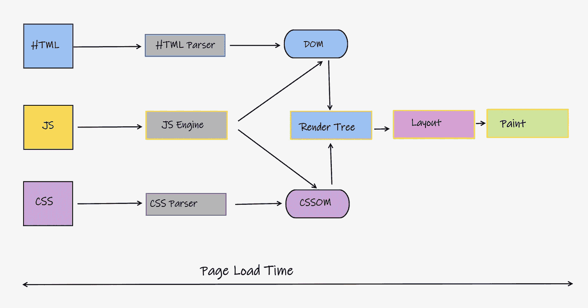
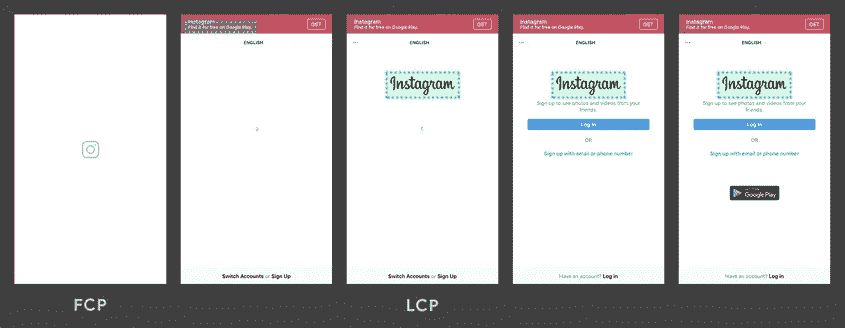
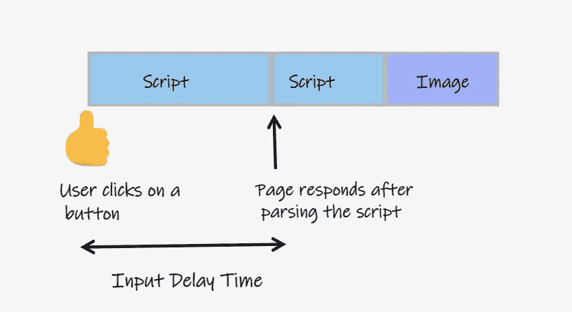
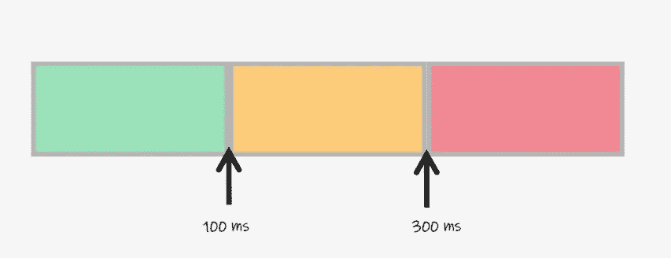
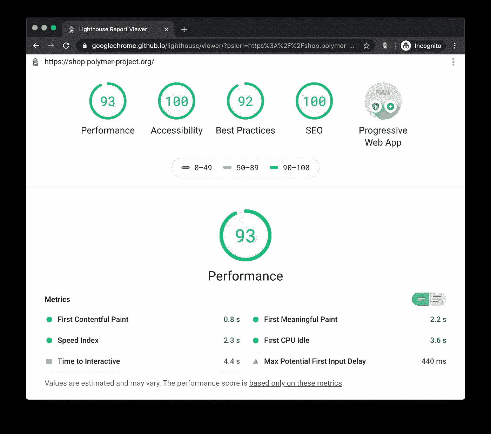

# 软件工程团队的 4 个 Web 性能要素

> 原文：<https://betterprogramming.pub/web-performance-essentials-for-software-engineering-teams-95e7e3c2b7ae>

## 你的网络应用足够快吗？


迈克·范·登博斯在 [Unsplash](https://unsplash.com?utm_source=medium&utm_medium=referral) 上的照片

在这个移动优先的世界里，每个应用都在争夺用户的注意力。

如果你的公司想要经营一个成功的在线业务，即使在带宽和/或 CPU 受限的环境下，你的网站也要快速吸引用户，这一点很重要。

对于大多数在线企业来说，糟糕的网络性能是迫使他们失去潜在客户的主要原因。

事实上，根据 Akamai 进行的一项调查，在 3G 网络上，多达 50%的移动访问者希望网站在 2 秒内加载。如果你不能满足他们的期望，几乎有一半的移动访问者会离开。

团队中有一种普遍的误解，认为 web 性能只对电子商务应用程序重要。任何面向客户的 web 应用程序都应该将性能作为一项要求，而不是一项功能(尤其是现在谷歌的排名算法将网站的性能考虑在内)。我个人认为:

*   性能主要是关于用户体验。它为工程团队提供了一种传达他们关心客户生产力和体验的方式。
*   优秀的性能很少是团队编写优秀代码的副作用。它几乎总是要求团队花费专门的精力来度量和改进重要的度量标准。
*   优秀的团队应该客观地衡量关键指标，并且应该洞察性能对用户参与度的影响。

根据我与各种团队合作和指导团队的经验，我将通过这篇博客分享:

*   如何思考和分类 web 性能
*   要跟踪和衡量的核心指标
*   改进核心指标要考虑的最佳实践
*   在工程团队中建立基于绩效的文化的过程

# Web 性能分类

性能可以大致分为三类:

*   **负载性能**:客户端多快能收到你网站所需的资源
*   **解析性能**:浏览器解析接收到的资源，构造对象模型，进而生成渲染树的速度有多快。
*   **渲染性能**:浏览器对构建的渲染树渲染的好坏。布局重新流动的频率有多高，浏览器重新绘制的频率有多高？



页面呈现步骤

这三个性能方面中的每一个对于最终用户如何看待 web 应用程序的性能都很重要。

用户可能已经非常快地从附近的 CDN 接收了所有资源，但是如果浏览器需要时间来解析接收到的资源，用户体验将会受到影响。

类似地，如果浏览器可以非常快速地解析资源，但不能在 60 fps 内正确地呈现内容，并且必须不断地重新流动布局，那么用户体验也会受到影响。

# 确定关键的 Web 性能指标

提高绩效从识别您的团队关心的指标开始。这些指标可能因您的业务需求而异。在一项标准化性能指标的倡议中，谷歌发布了网络生命指标。Web Vitals 是一组基于 [RAIL 性能模型](https://web.dev/rail/)的指标，为在 Web 上创建卓越的用户体验提供统一的指导。

核心网站生命指标是适用于所有网页的网站生命指标的子集，这些指标应该由所有网站所有者来衡量，因为它们代表了用户体验您的 Web 应用程序的不同方面，并用于搜索排名算法中。

## 最大含量涂料(LCP)

这报告了在用户的视口中渲染最大的图像或文本块元素所花费的时间。我通常认为它是用户看到超过一半的视口所需的时间。



Instagram 最有内容的绘画(来源:web.dev)

*   测量站点的负载性能。
*   为了获得良好的用户体验，LCP 应该在 2.5 秒内发生


LCP —装载

最佳实践:

*   使用`**preload**`和`**preconnect**`属性预加载关键资源。如果适用，利用 HTTP/2 服务器推送。

```
<link rel="preload" as="style" href="css/style.css">
```

*   使用服务人员和/或 CDN 来缓存资产，并在后台替换任何新的可用版本。这为用户消除了任何首次加载延迟。
*   [避免在代码中使用 CommonJS](https://web.dev/commonjs-larger-bundles/) 模块。移除对任何使用 CommonJS 模块的外部库的依赖。
*   使用像 Webpack 这样的捆绑器来 [tree shake](https://webpack.js.org/guides/tree-shaking/) 死代码并将资源分割成可以按需加载的块。
*   缩小和压缩资源，像 Webpack 这样的捆绑软件也能帮上忙。
*   惰性或延迟加载非关键但相关的资源。对于图像，使用 [LazySizes 库](https://github.com/aFarkas/lazysizes)

```
/* Defers download and execution till the entire DOM is rendered */
<script src="defer.js" defer></script>/* Downloads after all the initial resources are downloaded, starts immediate execution */<script src="async.js" async></script>
```

## 第一输入延迟(FID)

报告 web 应用程序响应第一次用户交互(可能是单击按钮/链接或在输入字段中输入文本)所需的时间。这是用户对你网站的第一印象。



经过的时间是输入延迟

*   测量事件处理中的延迟，因为浏览器的主线程正忙于其他操作，如解析一个巨大的 JavaScript 文件。
*   为了获得良好的用户体验，FID 应该小于 100 毫秒



首次输入延迟—交互性

最佳实践:

*   解析和编译从网络接收的 JavaScript/CSS 时，浏览器的主线程被阻塞。为了减少这一阻塞时间，将资源分成< 300 KB chunks and lazy load them on demand. As discussed above (in the RAIL Performance Model), it is a good practice to ensure the browser has more than 50 ms to respond to user input in a 100 ms time span.
*   The browser’s main thread is also blocked when executing the JavaScript. Again, the first step here is to make sure the browser does minimal work by serving it chunks of resources to process. Ensure your JavaScript code doesn’t hold onto lot of references in memory. Memory leaks can cause your page to freeze completely.
*   If your app has a dependency on 3rd party JavaScript or CSS, preconnect and preload or defer load them based on the critical nature of these resources.
*   Audit JavaScript execution time and memory usage using browser developer tools like Lighthouse.

## Cumulative Layout Shift (CLS)


Click me button shifts the entire page layout (Source:web.dev)

To understand CLS better, let’s define a few terms:

1.  Layout Shift: A layout shift occurs anytime a visible element changes its position from one rendered from to the next.
2.  Unexpected Layout Shift: Not all layout shifts are bad, some of the layout shifts are needed (for example: Showing a loading spinner or opening a pane in response to a user action). Layout Shift is bad if the user isn’t expecting it. Any time content moves abruptly and unexpectedly especially after 500 ms of a recent user input is considered bad.
3.  Session Window: This is a measuring window that starts with first layout shift and continues to expand until there is a gap of at least 1 second with no layout shifts.

CLS reports the largest score of unexpected layout shifts across all session windows in a 5 second period, where each session window should have at least a 1-second gap.

*   Measures the visual stability of your web application
*   It helps quantify how often users experience unexpected layout shifts, a low CLS score of 0.2 and below the ensures the experience is delightful.

Best Practices:

*   Use responsive images with srcset attribute, if not include size attributes on image and video elements or use [个未调整大小的媒体属性](https://github.com/w3c/webappsec-permissions-policy/blob/main/policies/unsized-media.md)
*   预加载字体并缓存在浏览器中，使用[字体显示:可选](https://developer.mozilla.org/en-US/docs/Web/CSS/@font-face/font-display)，这样如果初始加载很慢，我们可以直接渲染后备字体。
*   静态地为动态添加或调整大小的内容保留空间，并在该空间中加载内容。
*   避免[基于表格的布局](https://stackoverflow.com/questions/83073/why-not-use-tables-for-layout-in-html)
*   不要在现有内容上插入内容，除非是为了响应用户交互
*   总是更喜欢“变换”动画而不是属性动画(因为它们会触发布局更改)

# 测量网络生命周期

大多数现代浏览器都在他们的开发工具中包含了对这些方面的测量，比如加载时间、交互时间、动画帧。

基于 Chromium 的浏览器包括 Lighthouse，它在各种约束条件下审计您的 web 页面的性能，并提供关于您的站点可以执行的改进的信息。



Chrome 灯塔报告

如果你使用的是基于 Chrome 的浏览器(Chrome/Edge)，只需打开你的浏览器开发工具-> Lighthouse 标签->点击生成报告

下面你可以看到一个使用 Lighthouse(在微软 Edge 开发工具中)的渐进式网络应用程序的网络生命测量的样本运行

如果您使用其他浏览器:

*   进入页面 speed insights [门户](https://pagespeed.web.dev/)并输入你的网站 URL。
*   火狐有一个你可以安装的 Lighthouse 扩展

如果您希望在 CI 渠道中包括指标测量:

*   你可以运行一个独立的[灯塔](https://github.com/GoogleChrome/lighthouse-ci)实例

# 建立绩效预算的流程

web 应用程序的性能不是一个特性，而是一个需求。就像任何其他功能需求一样，在 OKRs 中建立性能预算，测量它们，并跟踪它们，对于在工程团队中引入基于性能的文化是至关重要的。

可以作为 OKRs 的一部分进行跟踪的可量化绩效预算的几个例子是:

*   确保关键路径块大小小于 200 KB 的 JavaScript
*   灯塔绩效审计得分应大于 90
*   主页必须在 3 秒内加载
*   页面应该加载有用的数据，并在 50 毫秒内响应用户交互
*   首字节时间(TTFB)应小于 500 ms。

以下是团队为实现这些目标而采用的一些最佳实践:

*   建立一个早期调查回归和识别损害性能的反模式的过程。实现静态代码分析来消除这些反模式。
*   在 CI 管道中强制执行性能预算，每当拉取请求违反这些约束时，它将被发回进行修复。
*   投资建立性能实验室，模拟具有真实约束的环境。它们帮助开发人员测试和修复在开发环境中难以重现的问题。
*   使用 CDN 为不经常变化的资产提供服务，在接近高比例客户的区域部署服务器
*   采用受控的滚动升级策略，将任何新的更改部署到流量较低的区域，监控性能指标，并在满足设定预算的情况下继续部署到下一个区域。
*   设置合成监视器，并对生产中的任何指标违规发出警报。

迭代性能的能力是最好的团队区别于其他团队的地方。

俗话说:“你不必事事出众，但你必须擅长那些必不可少的东西。”

如果您的团队没有通过定期的迭代来构建他们的性能肌肉，那么您很可能会失去性能为您的业务带来的机会，无论是现在还是长期。

我希望这篇文章中分享的过程和知识能够为你的团队开始这个 Web 性能之旅打下坚实的基础。