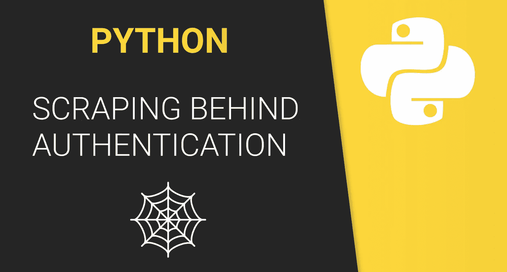
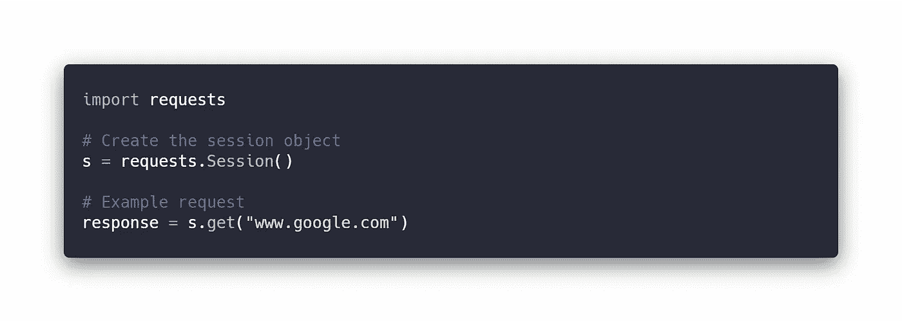
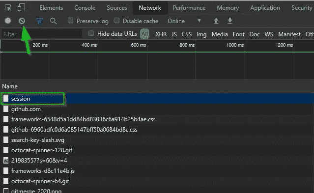
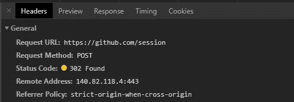
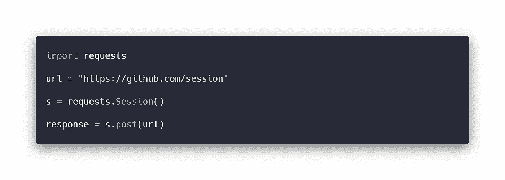
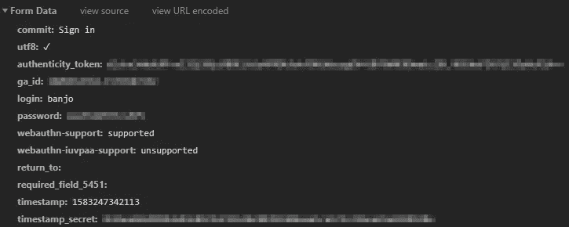
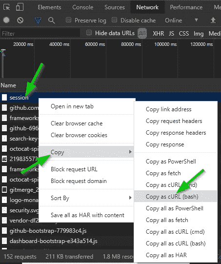
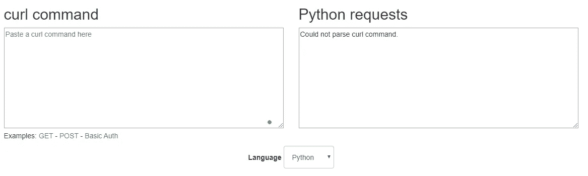
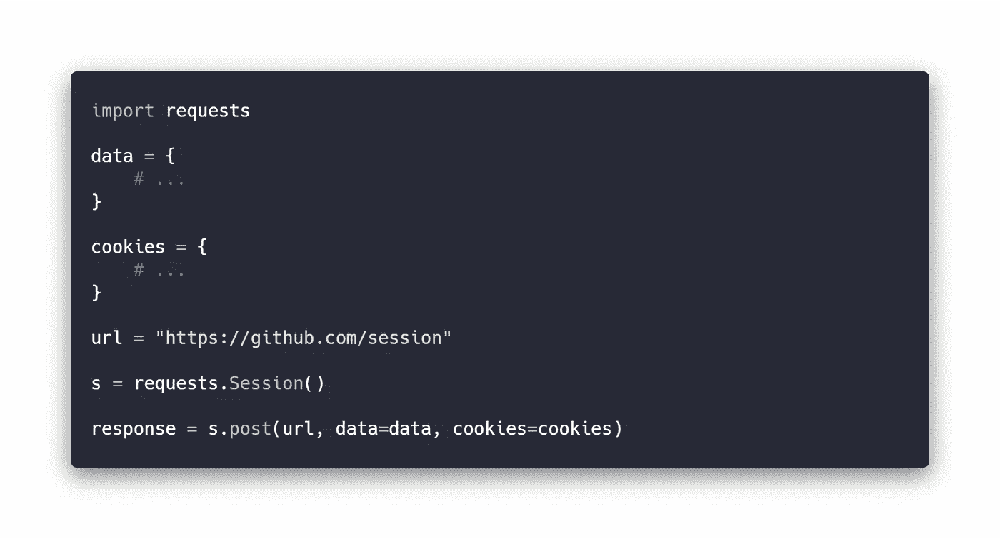
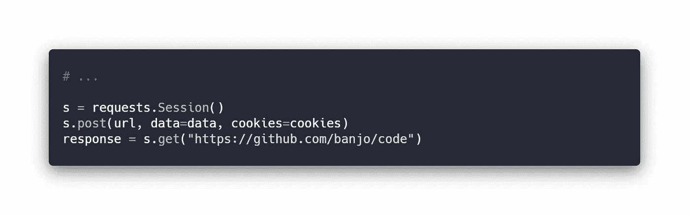

# 使用 Python 进行身份验证后的 Web 抓取

> 原文：<https://betterprogramming.pub/web-scraping-behind-authentication-with-python-be5f82eb85f0>

## 如何登录您的自动化并继续刮擦

# 目标

这个简短指南的目标是在登录网页时进行刮擦。我将使用 GitHub 网页作为本指南，因为它可能是大多数阅读本文的人所熟悉的。

这种方法并不适用于所有的网页，而且每个站点的身份验证都是不同的，但是如果您自己尝试的话，这可能是一个好的开始。

# 准备文件

如前所述，我将使用 Python 和`requests`库来完成这个任务。在本指南中，我将只关注这一点。

创建一个文件，我暂且称之为`scrape.py`。安装必要的需求(嗯，只有`requests`)并导入它们。

用`pip install requests`安装`requests`，用`import requests`导入到你的文件中。

# 会议

我们将在请求中使用一个`Session`对象来持久化用户会话。该会话稍后用于发出请求。

然后，对于每个即将到来的请求，所有 cookies 都将在会话中保持不变。也就是说，如果我们登录，会话将会记住我们，并将其用于我们未来的所有请求。

# 获取我们需要的数据

好了，基本上，我们需要知道什么数据传递给哪个 URL。这将在 Chrome 中完成。

我们需要知道两件事:

*   `POST`请求(登录)将被发送到的 URL。
*   将发送的有效负载或数据。

让我们打开开发人员工具，转到`Network`选项卡并登录，这样我们就可以获取 URL。

一个小技巧是转到登录网址，清除网络标签，这样所有以前的请求都会消失，这样你的登录请求可能会出现在顶部。

箭头指向`clear`按钮，而正方形标记登录请求。单击它以获取有关它的信息。

URL 清楚地显示为`[www.github.com/session](http://www.github.com/session)`，所以让我们保存它。这是我们的第一个请求。

这是行不通的，因为我们没有发送正确的数据。让我们向下滚动之前捕获的会话请求，查看发送的数据。

我确实删除了一些我的个人数据。但是这是我们在发出请求时需要传递的大量数据。然而，有一个很好的工具可以使用。你可以在 curl.trillworks.com[找到它。](https://curl.trillworks.com/)

有了这个，您就可以复制请求，并获得发出请求所需的所有数据。

复制请求数据并将其粘贴到链接的左侧字段中。您将得到一个完整的请求，包括标题和 cookies，都在右边。

所以我们需要两样东西，T0 和 T1。让我们把这两个粘贴到我们的 Python 文件中。你也可以拿头球，但我现在不会。

所以，我们基本上只是把它们传递到请求中。我们现在不会对这个响应做太多，所以如果你不想的话，你甚至不需要把它保存到一个变量中。

现在你基本上完成了第一部分。您已请求登录。您在同一脚本中提出的所有其他请求将被视为已登录。

# 已登录

因此，现在我们已经登录，例如，我们可以向私有回购发出请求。我将向这个特定博客的存储库发出请求，因为它在我的 GitHub 上是私有的。

# 擦

现在，真正的刮削。本指南不会涉及这一点。但是如果你愿意，你可以看看我的[其他指南](https://www.banjocode.com/web-scraping/)关于如何用[美汤](https://www.crummy.com/software/BeautifulSoup/doc)刮痧。很容易从你离开的地方重新开始。