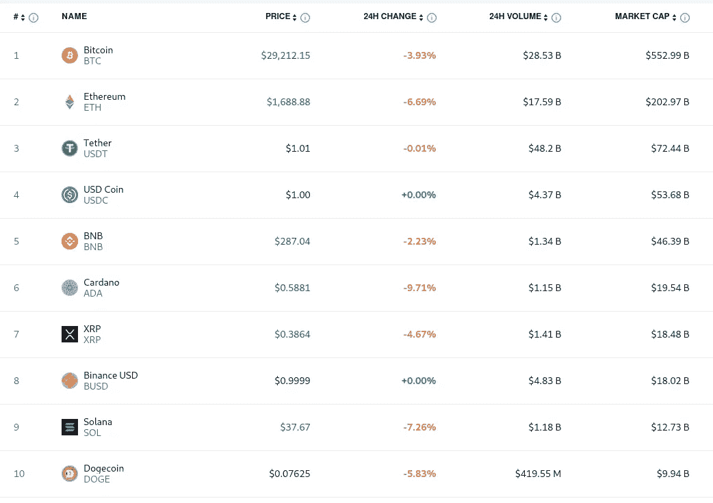
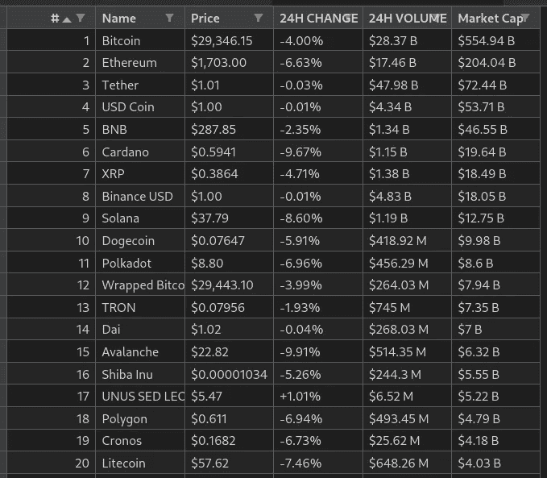
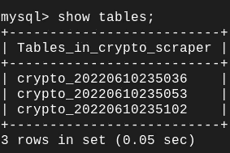
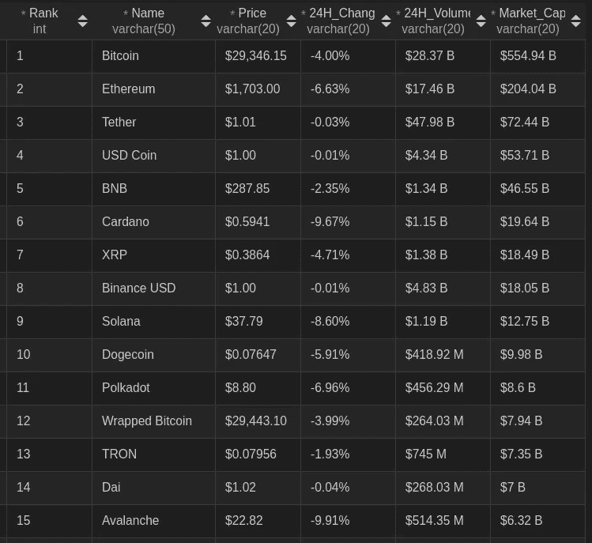

# 如何抓取加密货币数据并将其存储在 MySQL 数据库中

> 原文：<https://betterprogramming.pub/web-scraping-for-cryptocurrency-6ae78bc8c48>

## 不用每次打开网站就能知道加密货币的价格何时会降低


加密货币

在这个项目中，我们将刮[crypto.com](https://crypto.com/price)网站获得前 500 名表演加密货币和存储在 MySQL 数据库中的所有数据与时间戳作为表名。

# 介绍

网络抓取是如今必备的技能。我们可以将网站名称抓取到有价值数据的表格中，并自动完成任务。如果价格降低，我们可以简单地抓取网站并设置一个电子邮件，而不是重复打开一个网站来检查价格是否降低。

我们将从 crypto.com/price 和 T4 中挑选出 500 种性能最好的加密货币。下面是来自网站的截图。



[https://crypto.com/price](https://crypto.com/price)

# 先决条件

在开始这个项目之前，我们需要设置一个 python 虚拟环境。请访问import requests
from bs4 import BeautifulSoup4# getting HTML code from webpage and formatting
URL = '[https://crypto.com/price](https://crypto.com/price)'
response = request.get(URL)
soup = BeautifulSoup4(response.text)# scraping table element from HTML code
table = soup.find('table')

## 密码

HTML 代码总是填充有多个嵌套元素，有时我们需要手动执行一些任务来获取文本数据。在第 28–29 行，我们需要过滤更多的内容来获得文本值。

执行上述代码后，我们将得到两个列表。第一个将存储表中的标题，第二个将以元组格式存储表行。此数据可以格式化为数据帧，并存储为 CSV 文件。

## 将原始数据转换为数据帧并存储为 CSV 文件

```
from pandas import DataFramecrypto_df = DataFrame(crypto_data, columns=heading)
crypto_df.to_csv(<path>, index=False)
```



CSV 文件

# MySQL 连接

请参考下面的代码将 MySQL 数据库连接到 Python。

## 创建命令

```
CREATE TABLE `crypto_scraper`.`{table_name}` (
    `Rank` INT NOT NULL,
    `Name` VARCHAR(50) NOT NULL,
    `Price` VARCHAR(20) NOT NULL,
    `24H_Change` VARCHAR(20) NOT NULL,
    `24H_Volume` VARCHAR(20) NOT NULL,
    `Market_Cap` VARCHAR(20) NOT NULL,
    PRIMARY KEY (`Name`)
);
```

我们将表名作为变量，因为将创建一个新表来存储从网站上抓取的新数据。

文件名格式:`crypto_%Y%m%d%H%M%S`



## 插入命令

```
INSERT_COMMAND = \
    'INSERT INTO {table} VALUES(%s, %s, %s, %s, %s, %s);'.format(
        table=table_name)
```

## 在 Python 中执行 SQL 命令

```
try:
    cursor.execute(CREATE_COMMAND)
    database.commit() cursor.executemany(INSERT_COMMAND, crypto_data)
    database.commit()except Error as e:
    print(e)
```

上述代码将把所有加密数据传递给数据库。


表格描述



MySQL 数据

GitHub 回购:[https://github.com/arabind-meher/Crypto-Scraping.git](https://github.com/arabind-meher/Crypto-Scraping.git)