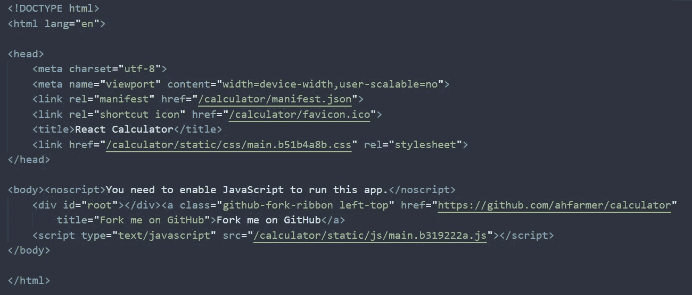
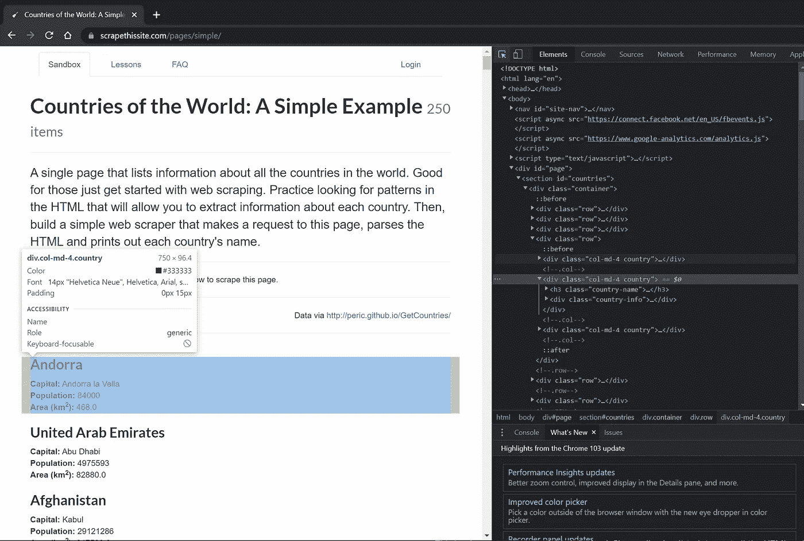
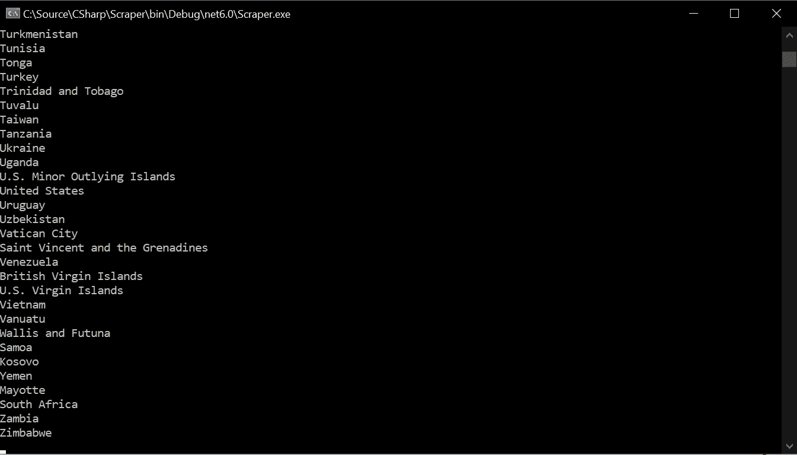

# 使用 C#和。网

> 原文：<https://betterprogramming.pub/web-scraping-using-c-and-net-d99a085dace2>

## 将网页转换成结构化数据


Maksym Kaharlytskyi 在 [Unsplash](https://unsplash.com?utm_source=medium&utm_medium=referral) 上拍摄的照片

尽管 C#已经成为一种可靠的编程语言，主要是在后端应用领域，但它并不是当你想构建一个 web scraper 时首先想到的语言。

虽然 C#的刚性类型系统在处理大多数网页中似乎任意的结构时可能会感觉不灵活，但它实际上是一个非常好的高性能选择。

在本文中，我们将深入探讨如何使用 C#通过发送 HTTP 请求来检索内容，以及如何将响应解析为类型化对象。

# 入门指南

如果您正在使用 Visual Studio，只需创建一个新的控制台应用程序，并将其命名为您喜欢的任何名称。如果您使用的是`dotnet`命令行，为您的项目创建一个文件夹并运行:

```
dotnet new console
```

现在，您将拥有一个空的 *Hello World* 应用程序作为起点。

# 正在检索内容

您选择的检索内容的方法在很大程度上取决于您要抓取的页面类型。虽然你对静态页面使用标准的`HttpClient`完全没问题，但它对 SPA 的 React、Angular 之类的构建没有太大帮助。

为了从 SPA 获取数据，我们需要模拟一个浏览器，让它为我们呈现页面返回的 JavaScript。这方面的内容稍微多一点，所以让我们先深入一个简单的静态页面。

首先，我们需要一个`HttpClient`实例。我们将使用它来发出请求，然后读取响应:

```
var httpClient = new HttpClient();
var response = await httpClient.GetAsync("https://www.scrapethissite.com/pages/simple/");
var content = await response.Content.ReadAsStringAsync();
```

请注意，我们在这里使用的网站明确允许抓取。确保你总是尊重网站的速率限制，以及它不想要的页面。

因为这个页面上没有多少 JavaScript 魔法，所以我们能够在我们的`content`变量中检索页面的所有 HTML。`HttpClient`方法适用于每一个页面，你可以通过*右键>查看页面源代码*来查看页面的 HTML，你可以直接看到页面的内容。

## 使用无头浏览器

如前所述，如果我们抓取的页面是一个更加动态的应用程序，使用 JavaScript 在客户端呈现页面的一部分，仅仅使用`HttpClient`是不行的。

如果不评估服务器提供的 JavaScript，我们只能得到如下的响应:



这是相当无用的。要评估 JavaScript，我们可以做两件事。要么我们自己托管一个 JavaScript 运行时，并通过它运行页面返回的 JavaScript，要么我们模拟一个浏览器。

这两种选择都相对复杂。托管像 v8 这样的 JavaScript 运行时——谷歌 Chrome 的 JavaScript 运行时——并不特别困难，但我们不能保证获得与浏览器相同的结果。因此，通过真正的浏览器实际运行 JavaScript 几乎总是更可取的。

控制另一个进程和模拟用户输入也是一个很大的挑战。幸运的是，我们不必如此。 [WebDriver](https://webdriver.io/docs/automationProtocols/) 协议使得编程驱动浏览器实例成为可能，这正是我们想要做的。

该协议已经在 Chrome 和 Firefox 中实现，并允许这些浏览器的所谓*无头*操作。也就是说，它们没有用户界面。

两个最流行的无头浏览器库实现是由谷歌维护的[木偶师](https://github.com/puppeteer/puppeteer)和由微软维护的[剧作家](https://playwright.dev/)。它们原本是用来自动化 web 测试的，但是它们也能很好地满足我们的目的。


Puppeteer 最初是 NodeJS 库的一个控制 Chromium 的端口。幸运的是，有人已经将这个库移植到了. NET。它被称为*puppetersharp*，让我们可以从 C#代码中控制 Chromium 浏览器。让我们安装它并使用它来查找一些内容:

```
nuget install PuppeteerSharp
```

之后，让我们使用 Puppeteer 启动一个 headless Chrome 实例，并从我们以前使用过的同一个页面中检索内容:

这一次，我们不是简单地向远程主机发送请求，而是启动了整个 Chrome 实例，将它指向我们指定的地址，并让它为我们读取页面内容。

网页的 HTML 现在作为一个字符串放在`content`变量中，准备就绪。最大的区别是，任何 JavaScript 都可以被渲染。这使我们能够观察 SPA 的内容，这是我们用以前的方法无法做到的。

有趣的事实:如果你把`Headless = true`改成`false`，再次运行代码，你可以看到整个浏览器被启动，自己导航。试试吧！

# 解析 HTML

现在，我们确实有一些内容，但仍然相当松散。我们当然不希望用原始 HTML 填充数据库，所以在实际使用数据之前，我们需要做一些处理。

首先想到的可能是“正则表达式！”。这是有意义的，除了 HTML 是非常不规则的，这篇文章比我更好地解释了为什么不应该使用正则表达式来解析 HTML。

我们能做的是使用一个库来帮助我们有效地解析 HTML。另一个稍微保守一点的选择是 **HtmlAgilityPack** 。两者都工作得很好，但由于 AngleSharp 更现代一些，我们将尝试一下:

```
dotnet nuget install AngleSharp
```

现在，AngleSharp 首先需要的是一个浏览上下文和一个可以填充的文档:

```
var context = BrowsingContext.New(Configuration.Default);
var document = await context.OpenAsync(req => req.Content(content));
```

在这个上下文中，`content`是我们前面捕获的`string`变量中的原始 HTML。

## 查找元素

现在我们有了一个包含所有原始 HTML 的`document`，由原始页面的节点构成。我们可以通过搜索这些节点来找到我们需要的确切信息。

让我们看看我们是否能把这个页面组织成充满国家。

首先，我们需要知道我们在找什么。如果我们使用 Chrome 开发工具来检查一个元素(CTRL / CMD + Shift + C):



我们可以看到，我们正在寻找的元素是带有`col-md-4 country`类的`div`——这应该不难找到！

使用一些简单的 LINQ，我们可以获得匹配这个类的所有元素:

```
var countries = document.QuerySelectorAll("*")
    .Where(e => e.LocalName == "div" && e.ClassName == "col-md-4 country")
    .ToList();
```

我完全知道这也可以通过使用 *QuerySelector* 来完成，但是我们现在保持它非常简单并且使用 C#-y。

运行这段代码将返回 250 个元素——这正好是该页面上列出的国家的数量！我们一定有所发现。现在让我们开始提取这些信息。

## 提取信息

让我们从创建一个保存我们国家信息的`record`开始。我们提前了解了这些领域，它们是:

```
public record Country(string Name, string Capital, int Population, int Area);
```

好的，都很好。现在是有趣的部分，老实说，这是 C#感觉有点粗糙的部分。

为了提取数据，我们必须应用一些非常基本的字符串拆分技巧:

它可能不是最漂亮的，但它完成了任务:



# 结论

我们已经构建了一个非常非常基础的 scraper，它使用一个无头 Chrome 实例来访问一个页面，返回原始 HTML 并将其解析为我们可以使用的格式。下面是最终的代码:

拿着它，看看你是否可以用它来抓取你需要的信息。

如果处理无头浏览器、代理和验证码对你来说不太有吸引力，那么有一些服务可以为你处理所有这些东西，比如 [ScrapeShark](https://scrapeshark.com) 。充分披露:我是 ScrapeShark 的创造者，它是免费的。

起初，建造铲运机可能看起来令人生畏且耗时，但从长远来看，它们将在您运营业务时为您节省大量时间！