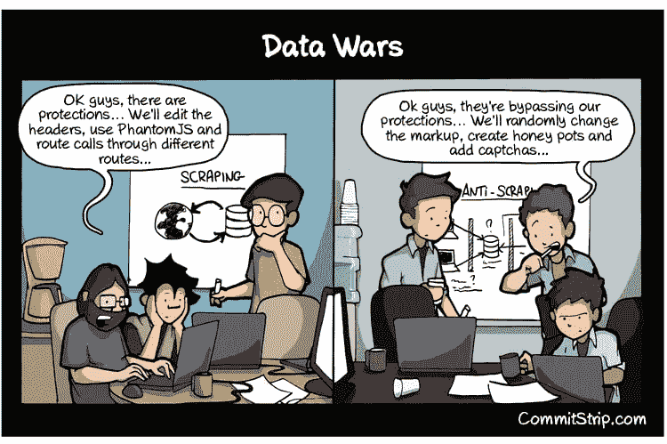
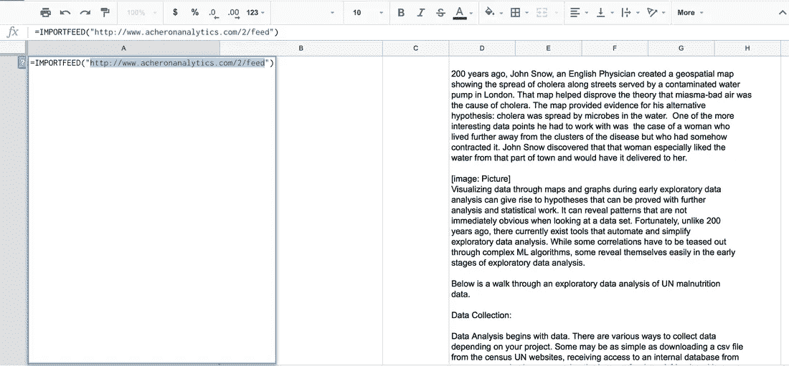

# 使用 Google Sheets 进行网页抓取

> 原文：<https://betterprogramming.pub/web-scraping-with-google-sheets-20d0dce323cc>

## 四个不同的功能，你可以用谷歌工作表来抓取网页

照片由[爆发](https://www.pexels.com/photo/man-using-ballpoint-pen-374820/)在[像素](https://www.pexels.com/)上拍摄

网络抓取和利用各种 API 是从网站和应用程序收集数据的好方法，这些数据随后可以用于[数据分析](http://www.acheronanalytics.com/acheron-blog/a-guide-to-data-wrangling-for-data-science-projects)。一些公司的整个商业模式都集中在网络抓取上。HiQ 抓取各种“公共”网站来收集数据，并为公司提供关于其员工的分析。他们帮助公司利用不同网站的数据，如 LinkedIn 和其他公共资源，找到顶尖人才，以获得他们算法所需的信息。

然而，当 LinkedIn 要求他们停止使用某些技术方法来减缓 HiQ 的网络爬虫时，他们遇到了法律问题。 [HiQ 随后起诉 Linkedin 并胜诉！](https://www.theregister.co.uk/2017/08/14/hiq_linkedin_bots_scraping/)法官说只要数据公开，刮就 OK！

来源: [CommitStrip](http://www.commitstrip.com/en/2015/05/19/data-wars/)

Web 抓取通常需要对 HTTP 请求、伪造标题、复杂的 Regex 语句、HTML 解析器和数据库管理技能有复杂的理解。

有一些编程语言可以让这变得容易得多，比如 Python。Python 提供了像 Scrapy 和 BeautifulSoup 这样的库，使得抓取和解析 HTML 更加容易。

然而，它仍然需要适当的设计和对编程和网站架构的理解。

Google Sheets 提供了几个有用的功能，可以帮助那些没有时间学习编程的人搜集 web 数据。如果你想看我们网上研讨会的视频，请在下面查看。如果没有，你可以继续阅读并弄清楚如何使用 Google Sheets 来抓取网站。

# 用于网页抓取的 Google Sheet 函数

**您可以使用 Google Sheets 进行网页抓取的功能有:**

*   导入 XML
*   进口
*   进口饲料
*   导入数据

所有这些功能将根据提供给该功能的不同参数来抓取网站。

# 使用 ImportFeed 的网页抓取

ImportFeed Google Sheets 功能是比较容易使用的功能之一。它只需要访问 Google Sheets 和一个 RSS 提要的 URL。这是一个通常与博客相关联的提要。

例如，你可以使用这个 RSS 源:"http://www.acheronanalytics.com/2/feed"。

你如何使用这个功能？下面给出一个例子:

*" = import feed(" http://www . acheronalanalytics . com/2/feed ")*

这就是我们所需要的！还有一些其他提示和技巧可以帮助清理数据馈送，因为您将获得不止一列信息。目前，这是网络抓取的一个良好开端。

## Google 工作表导入功能更新了吗？

所有这些导入功能每两个小时自动更新一次数据。可以设置触发功能来增加更新的频率。然而，这需要更多的编程。

在这种情况下就是这样！从这里开始，一切都取决于您的团队如何使用它！确保你设计了一个可靠的数据收集系统。

上图是使用 ImportFeed 函数的一个例子。

# 使用 ImportXML 进行网页抓取

Google Sheets 中的 ImportXML 函数用于提取使用 HTML ids 和类的特定数据点。这需要对 HTML 和解析 XML 有所了解。这可能有点令人沮丧。所以我们创建了一个 HTML 网页抓取的分步指南。

以下是来自 Eventbrite 页面的一些示例:

1.  前往 https://www.eventbrite.com/d/wa-埃弗雷特的[/events/](https://www.eventbrite.com/d/wa--everett/events/)。
2.  右键单击“检查元素”
3.  找到您感兴趣的 HTML 标签
4.  我们在这里寻找的一些文字。
5.  所以这是棘手的部分。您需要从这个 HTML 标记中提取的第一部分是类型。这就像、、、等等。可以使用“//”调用第一个标签，然后调用标签名。比如“//div”，“//a”或者“//span。”
6.  现在，如果你真的想得到“这里的一些文本”，你需要调用这个类。
7.  这是在步骤 5 所示的方法中完成的。您会注意到它将“//div”与“[@class="class name here"]结合使用。
8.  xml 字符串是"**//div[@ class = ' list-card _ _ body ']**"
9.  还有一个数据值您可能想得到。
10.  我们想得到所有的网址。
11.  在这种情况下，需要提取第一个 HTML 标记本身的特定值。例如，[点击这里](”https//www.google.com")。
12.  那就像第七步。
13.  xml 字符串是" **//a/@href** "
14.  ImportXML(URL，XML 字符串)。
15.  import XML("[https://www.eventbrite.com/d/wa-埃弗雷特/事件/](https://www.eventbrite.com/d/wa--everett/events/) "，"**//div[@ class = ' list-card _ _ body ']**")。

使用这个函数的真相是它需要很多时间。因此，它需要规划和设计一个好的谷歌表单，以确保你从使用它中获得最大的利益。否则，你的团队将会花费时间维护它，而不是开发新的东西。如下图所示:

来源: [Xkcd](https://xkcd.com/)

# 使用 ImportHTML 进行网页抓取

最后，我们将讨论 ImportHTML。这将从网页导入表格或列表。例如，如果您想从一个包含[股票价格](http://www.nasdaq.com/symbol/snap/real-time)的网站中抓取数据，该怎么办？这一页有一个表格，上面有过去几天的股票价格。

类似于过去的函数，需要使用 URL。在 URL 的顶部，你必须提到你想要抓取网页上的哪个表格。你可以通过利用可能的数字来做到这一点。

例如:importtml("【http://www.nasdaq.com/symbol/snap/real-time】"，6)。这将从上面的链接中抓取股票价格。

在上面的视频中，他们还展示了如何收集上面的股票数据，并将其与当天的股票行情融合在一起。一个团队可以创建一个算法，利用过去的股票价格、新文章和 Twitter 信息来选择是购买还是出售股票。

你有什么好主意可以用网络抓取来做什么吗？你的网页抓取项目需要帮助吗？让我们知道！