# 使用 Python 进行网络抓取—获取 Spotify 上播放量最高的 100 首歌曲

> 原文：<https://betterprogramming.pub/web-scraping-with-python-top-100-most-streamed-songs-on-spotify-5cddb95d4175>

## 音乐的一个好处是:当它击中你时，你感觉不到疼痛！


你好！首先，我想建议你戴上耳机，听你最喜欢的专辑，因为音乐让一切变得更好。

今天，我们将在来自[维基百科](https://en.wikipedia.org/wiki/List_of_most-streamed_songs_on_Spotify)的数据集中进行网络搜集，其中有 Spotify 上 2022 年播放量最高的 100 首歌曲，以及它们的排名、播放量(十亿)、艺术家和歌曲的发布日期。

让我们导入将要工作的库:

```
from bs4 import BeautifulSoup
import requests
```

现在，连接到网站并获取数据:

```
URL = '[https://en.wikipedia.org/wiki/List_of_most-streamed_songs_on_Spotify'](https://en.wikipedia.org/wiki/List_of_most-streamed_songs_on_Spotify')headers = {'User-Agent': 'Mozilla/5.0 (Windows NT 10.0; Win64; x64) AppleWebKit/537.36 (KHTML, like Gecko) Chrome/105.0.0.0 Safari/537.36'}page = requests.get(URL, headers=headers)
```

你可以在这个[网站](https://httpbin.org/get)上获得你的用户代理。

现在我们已经连接到了网站的数据，让我们使用 Beautiful Soup 来获取页面内容，并使用`.prettify`以“漂亮”的 html 设计来构建 HTML:

```
soup1 = BeautifulSoup(page.content, 'html.parser')soup2 = BeautifulSoup(soup1.prettify(),'html.parser')
```

我们可以看到`soup1`和`soup2`的区别:

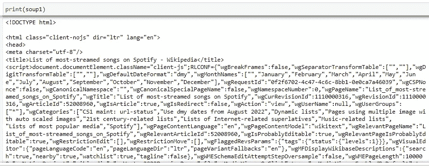

`soup2`的结构比`soup1`更加直观，因为。美化功能用于方便分析。

让我们来看看维基百科上的数据:

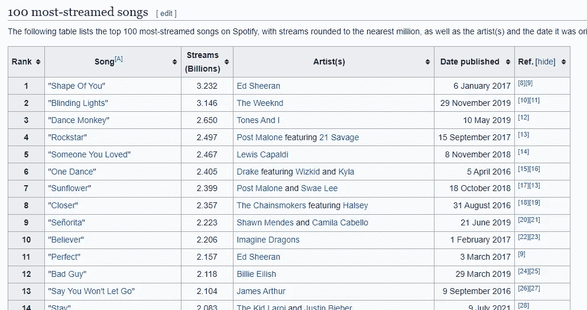

所以，我们首先要的是得到`Rank` 的值。为此，我按下 F12 打开 DevTools，查看页面的 html 结构并选择 Inspect 函数:

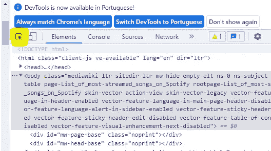

然后检查排名元素:

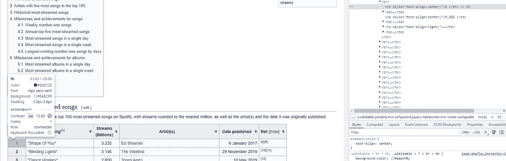

仔细观察 html 函数:

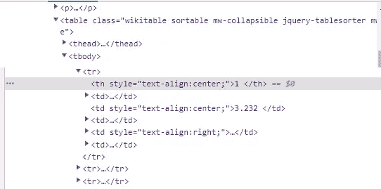

可以看到排名文本在一个带有属性的`th`函数中:`style=”text-align:center;`

因此，让我们创建一个列表，从`ranking`中获取范围为 1-100 的所有值，使用`.find_all` 来搜索上面提到的引用:

```
ranking = []
for i in range (0,100):
    rank = soup2.find_all('th', attrs = {'style': 'text-align:center;'})[i].text
    rank = rank.replace('\n','')
    rank = rank.strip()
    ranking.append(rank)
```

请注意，我还做了一些清理工作，使用`.replace` 去掉了字符串' **\n** ' ，并使用`.strip()` **，**去掉了字符串开头和结尾的空格，如果没有这样做，结果将是这样的:

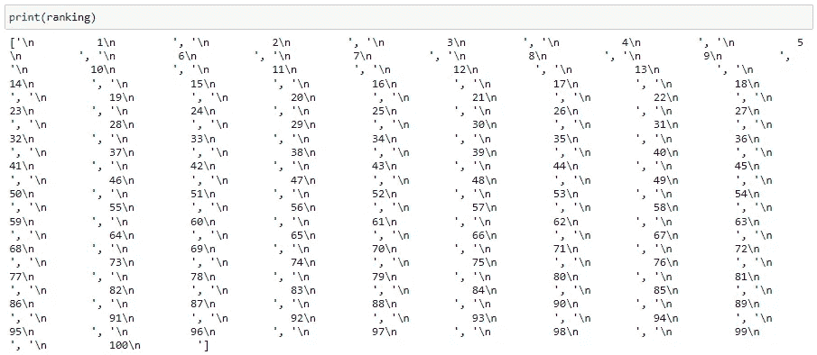

因此，在清理之后，我们有了这个`ranking`列表:

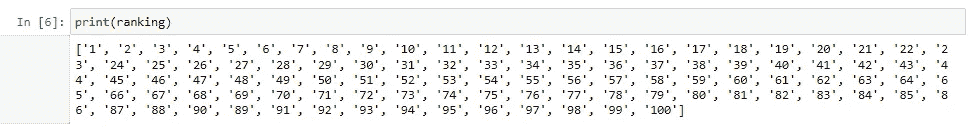

不错！现在排名列表做好了，我们要看下一个变量:`songs` **。**

我试着在**歌曲**中用同样的方法给**排名**，但是没用。所以我发现最有效的方法是检查歌曲音域之间的音程数:

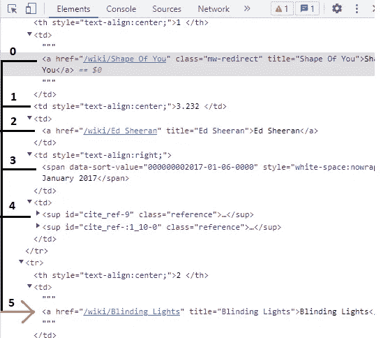

因此，在看到歌曲的寄存器每 5 行出现一次，并且寄存器在一个`td`函数中之后，我创建了`song`变量:

```
song_list = []
for i in range(0,500,5) :
    song = soup2.find_all('td')[i].text
    song = song.replace('\n','')
    song = song.replace('"','')
    song = song.strip()
    song = ' '.join(song.split())
    song_list.append(song)
```

注意，如果我们不使用 join()和 split()函数的组合，歌曲'**I take a Pill in Ibiza(Seeb Remix)'**就会有许多重复的空格，就像这样:

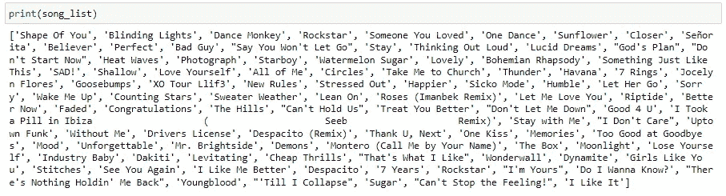

所以，在清洗之后，我们有了这个`song_list`:

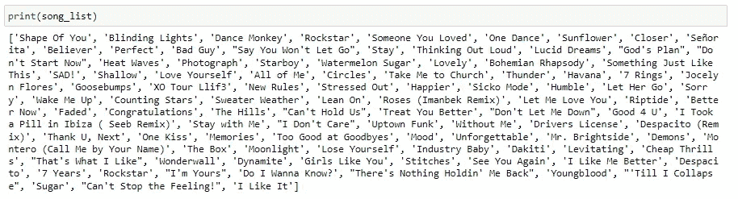

现在我们来看看`streams`的数量，以十亿为单位:

```
streams_list = []
for i in range(1,500,5) :
    streams = soup2.find_all('td')[i].text
    streams = streams.replace('\n','')
    streams = streams.strip()
    streams_list.append(streams)
```

注意范围模式继续(每 5 行)，并且在一个`td`函数中。对于`streams_list`，我们有:


在`streams`之后，我们需要得到`artists`:

```
artist_list = []
for i in range(2,500,5):
    artist = soup2.find_all('td')[i].text
    artist = artist.replace('\n','')
    artist = artist.strip()
    artist = ' '.join(artist.split())
    artist_list.append(artist)
```

这里我们还必须使用`join()`和`split()`函数的组合，否则`artist_list`将是这样的:

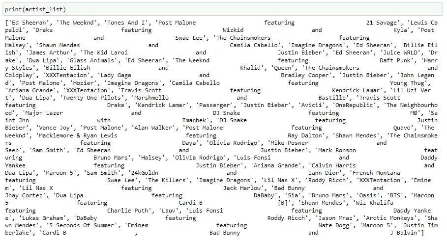

并且，在所有的清洗之后，`artist_list` 的结果是:

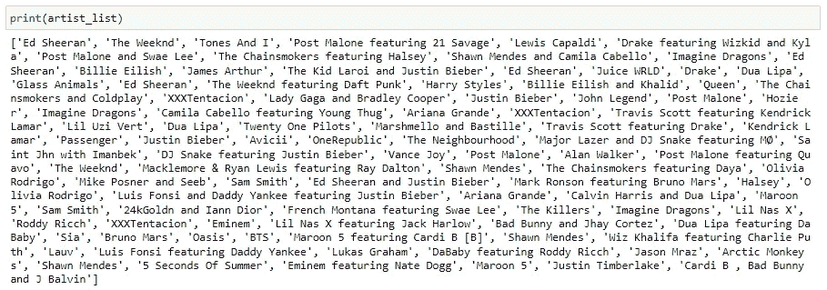

最后，让我们看看歌曲的`publish date`:

```
date_list = []
for i in range(3,500,5):
    date = soup2.find_all('td')[i].text
    date = date.replace('\n', '')
    date = date.strip()
    date_list.append(date)
```

`date_list`的结果是:

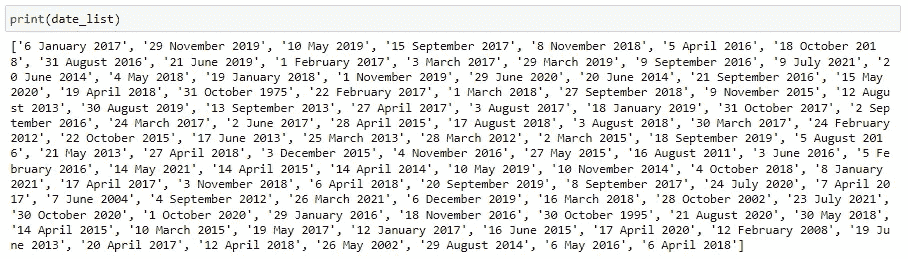

那就好！！我们现在要做的就是将这些`lists`放入`dictionary`中，以便将数据转换成`dataframe`:

```
data = {
    'Rank' : ranking,
    'Song' : song_list,
    'Streams' : streams_list,
    'Artist' : artist_list,
    'Date' : date_list
}
```

现在，让我们用`import pandas`把`dictionary`变成一个数据帧:

```
import pandas as pd
df = pd.DataFrame(data)
```

真好！现在我们有了我们的`dataset`:

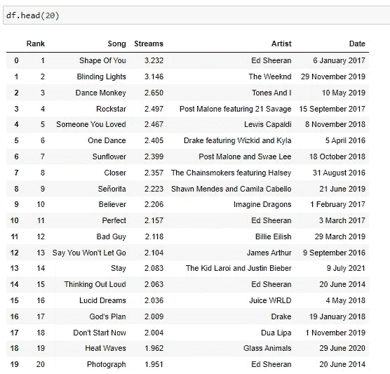

我们还可以将这个`dataframe`导入到一个 CSV 文件中，并为 Web 抓取定义一个函数，这样我们就可以在每次设置该函数工作时从网站更新数据(CSV)。

要导入 CSV，我们要做的就是:

```
df.to_csv('Top100-MostStreamedSongs-Spotify.csv')
```

现在，我们准备分析数据集，并从中获得一些见解。

但是让我们把分析部分留到将来的另一个时间，因为这个项目的主要目标是展示我们如何进行 web 抓取。

重要的是要知道，如果你想从一个网站得到的数据没有显示在一个页面上，你也可以通过循环访问 URL 来获得所有这些数据(记住一定要获得模式)。

如果你想获得我们在这里使用的全部代码，你可以在我的 [GitHub](https://github.com/vitorxavierg/Portfolio_Projects/blob/09a2351211a7008db98d6ed8df6d97eb161dfde6/Python_WebScraping_TOP100Songs) 查看。

那都是乡亲们！

```
**Want to Connect?**You can also find me at [Linkedin](https://www.linkedin.com/in/vitor-xavier-guilherme-6866a3204/) and of course, on [Spotify](https://open.spotify.com/user/12165962578?si=4da67c6b1ce2486d) :).
```