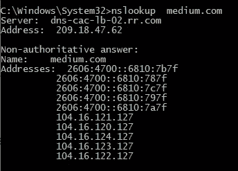
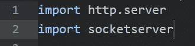
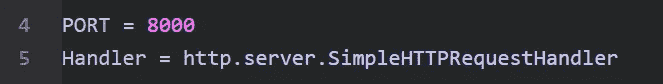
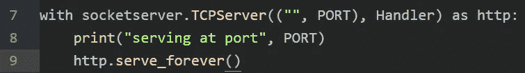
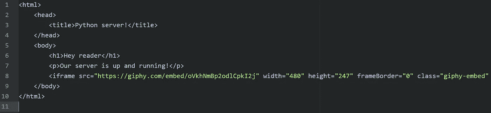
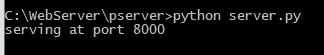
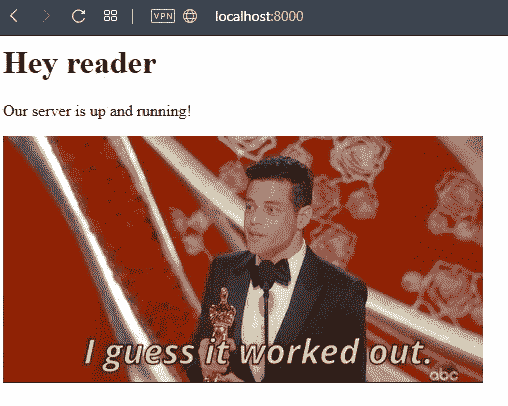

# 用 Python 构建一个简单的 Web 服务器

> 原文：<https://betterprogramming.pub/web-server-with-python-cde3a9911a0f>

## 创建并运行一个简单的服务器，您可以根据自己的需要进行定制


约翰尼斯·格罗尔在 [Unsplash](https://unsplash.com?utm_source=medium&utm_medium=referral) 拍摄的照片。

网络服务器就在我们周围。每个应用程序、每个框架都使用 web 服务器。这听起来可能很奇怪，但是每个 web 服务器都做三件事:监听 HTTP 请求，处理这些请求，并向用户发回响应。让我们试着用 Python 构建自己的服务器。

# **HTTP 服务器的性质**

当您尝试打开 [Medium，](http://medium.com)您的浏览器会以 HTTP 请求的形式创建一条网络消息。请求将通过互联网一路传送到一台计算机，在那里 Medium 有一个正在运行的服务器，该服务器将通过使用 Medium 主页的 HTML 进行响应来处理该请求。当您的浏览器收到响应时，它将呈现 HTML，这样我们就可以在出错时看到呈现的错误消息的网页。

每次与网页的交互都会发送一个新的请求，服务器会用新的 HTML 来响应。

让我们看看请求是如何到达服务器的。

# **倾听的重要性**

为了获得目的地，每个 HTTP 消息都包含目的地 TCP 地址。TCP 地址是 IP 地址和端口号。

让我们看看 Medium 在哪里托管他们的网站:



现在我们知道了 IP 地址，让我们来看看端口。默认情况下，HTTP 的端口号为 80，HTTPS 的端口号为 443。如果 web 服务器监听非常规端口，您必须指定 HTTP 消息应该去往何处。

# **网络服务器**

现在我们或多或少地了解了请求是如何在互联网上传播并找到它们的目的地的，让我们用 Python 构建一个简单的 web 服务器。

首先，我们需要导入两个库来帮助我们运行服务器和处理请求:



接下来，我们将声明服务器监听请求的端口，并创建 HTTP 请求的处理程序:



最后，让我们在我们声明的端口上运行服务器:



# **服务器 HTML**

我们的服务器已经准备好了，但是我们没有任何东西可以回馈给用户。让我们创建一个简单的 HTML 文档来在浏览器中呈现一些内容:



不要忘记将 HTML 文档和 Python 文件放在同一个目录下，并将 HTML 文件命名为`index.html`。

# **运行服务器**

现在是时候启动引擎并运行我们的服务器了。让我们转到 Python 文件和 HTML 文档所在的目录。运行以下命令:

```
python server.py
```

或者这个(取决于你用哪个版本的 Python):

```
python3 server.py
```

我们可以在控制台上看到什么？该服务器的端口为 8000:



现在让我们打开浏览器，导航到 [http://localhost:8000](http://localhost:8000) 。我们的 HTML 文档已经送达:



## **服务器片段**

# **结论**

虽然我们的服务器很简单，但它能够提供 HTML 文档。当然，处理 Medium 请求的服务器要复杂得多，但原理是一样的。它监听请求并做出相应的响应。

不断学习，不断成长！