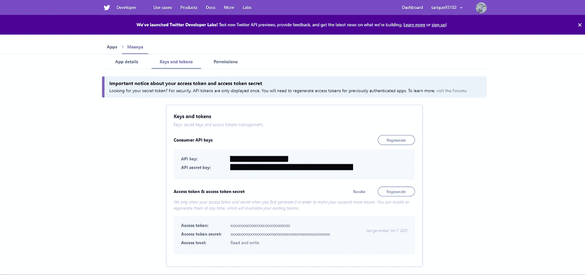
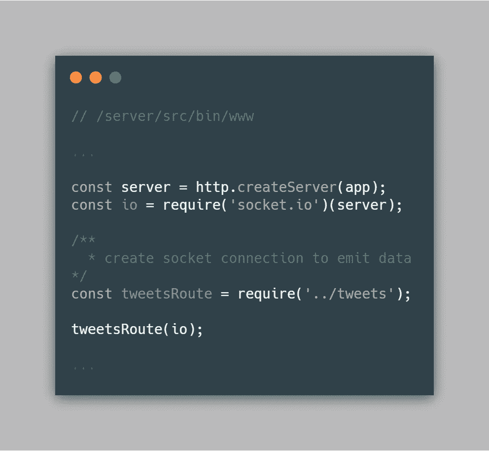
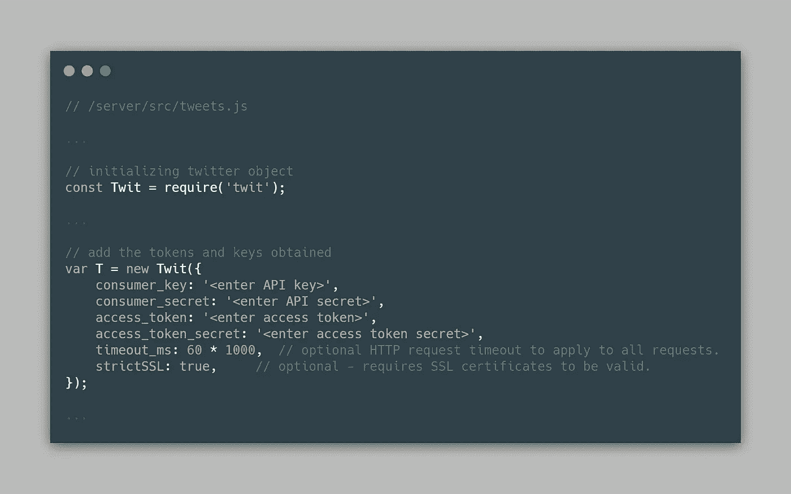
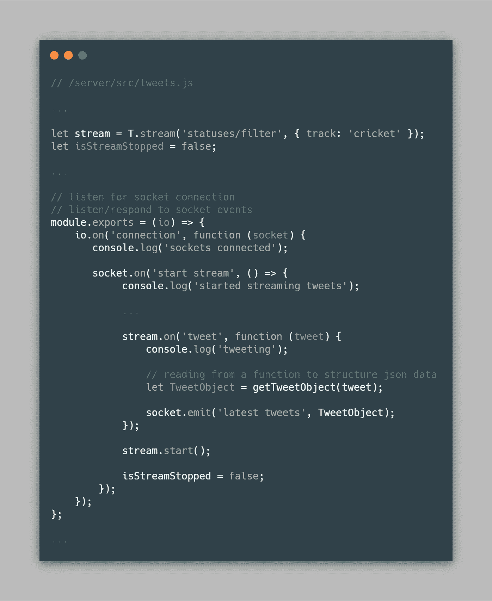
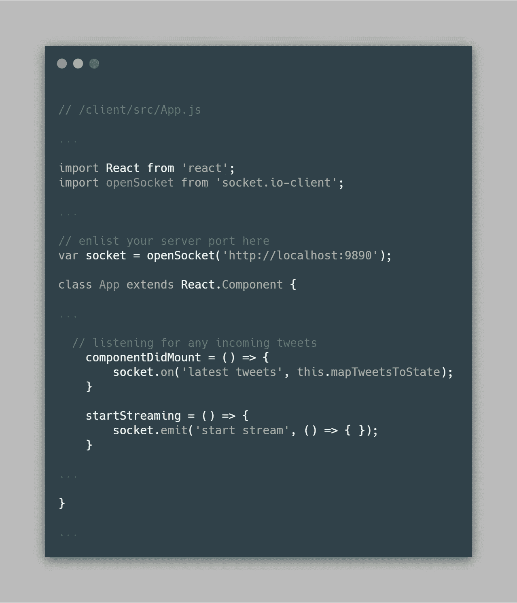

# Web Sockets:实时流畅地发送推文

> 原文：<https://betterprogramming.pub/web-sockets-streaming-tweets-in-real-time-with-no-fuss-fcb4749c2078>

## 构建自己的实时 Twitter 客户端


由 [Unsplash](https://unsplash.com/s/photos/data?utm_source=unsplash&utm_medium=referral&utm_content=creditCopyText) 上的 [Pietro Jeng](https://unsplash.com/@pietrozj?utm_source=unsplash&utm_medium=referral&utm_content=creditCopyText) 拍摄

我们生活在一个数据被认为比石油更有价值的时代。

鉴于这种说法，任何可以帮助我们挖掘和分析数据的工具或机制都成为一种强大的资源。数据可以帮助我们理解人们的普遍行为，并帮助企业设计更好的用例。

Twitter 是一个丰富的数据来源。我们可以从那里得到的数据，任何话题，都是令人着迷的。

还有一件事:我们将实时获取数据。

# web Sockets——触手可及的实时优势

我们都用过聊天应用。发送实时消息的魔力是通过一种叫做 web 套接字的东西实现的。这是我们将在用例中使用的神奇调味汁。如果我必须用简单的门外汉术语来描述什么是 web 套接字，我会这样说:

*Web sockets 是一种网络技术，能够在用户的浏览器和服务器之间进行实时双向通信。也就是说，您可以发送和接收消息/信息，而不必不断地点击 API。*

如果你想了解更多，你可以在这里了解它们[。除了 web sockets，我们将使用 React 作为我们的客户机，使用 Express 作为我们的服务器节点。](https://developer.mozilla.org/en-US/docs/Web/API/WebSockets_API)

说得够多了，让我们开始吧。

# 少说多做

在我们看到实际应用之前，代码部分有四个部分需要处理:

1.获取 Twitter 开发者应用证书
2。设置服务器
3。配置客户端
4。见证应用的诞生

## 获取 Twitter 开发人员应用程序凭据

在我们开始编写任何可操作的代码之前，您应该登录或注册 [Twitter 开发者](https://developer.twitter.com/)网站。完成后，您可以在这里创建一个新的个人应用程序[。从那里获取您的凭证，并将它们复制到某个地方以保证它们的安全。](https://developer.twitter.com/en/apps)



***注:*** *Twitter 在注册开发者账户时采用了审核流程。在你准备好之前，你可能需要和评审小组交换一系列的电子邮件。*

您已经有了凭证，是时候启动服务器了。

## **设置服务器**

为了在服务器端传输 twitter 数据，我们需要两个库:`Twit` (处理 Twitter 的流和连接)和`Socket.io` (帮助在服务器上创建套接字连接)。

将它们安装在您的 express 应用程序中:

```
npm install --save twit socket.io
```

安装完所需的依赖项后，是时候调用`socket.io`模块，并用它将我们创建的服务器包装在`./bin/www`文件中。我们调用`tweetsRoute`并发送`socket`模块作为要使用的参数。



服务器:调用 socket.io 并将其传递给 tweetsRoute

在`tweets`路径中，我们导入`Twit`库，并用从我们之前创建的应用程序中获得的凭证初始化它。



服务器:用获得的凭证创建一个 Twit 实例

我们已经到达了应用程序的有趣部分，在这里我们开始从 twitter 读取信息，并将获取的 tweets 发送给指定的客户端。

代码非常简单。使用初始化的`Twit`对象，我们创建一个用于连接 Twitter APIs 的流。我们开始监听来自客户端的连接，一旦我们得到一个连接，我们就创建一个结果`socket`对象。

我们主要使用来自`socket`对象的两个函数。`on`函数监听来自客户端的任何事件，而`emit`函数将任何消息/信息发送回客户端。`stream`对象本身使用其`on`函数来监听任何传入的 tweet，而`stream.start()`基本上帮助启动一个流，以防它在会话期间被停止。你可以更深入地挖掘 Twit 的`[streaming](https://github.com/ttezel/twit)` API 以获得更多细节。



服务器:设置套接字和流以开始监听和响应事件

这就解决了服务器端的基本问题。让我们把我们的客户安排好。

## **配置客户端**

与服务器相比，客户机相对容易成形。我们将使用`socket.io-client`库在客户端创建一个套接字连接。代码中有三点需要关注:

*   我们使用`socket.io-client`连接到服务器端套接字。如果在任何时间点连接失败，客户端将继续尝试建立连接。
*   listen 事件在`componentDidMount()`生命周期函数中声明，因为它在 DOM 挂载后立即被触发，并且是声明任何通用侦听器的理想位置。它之所以存在，是因为我们想让客户端一直监听传入的推文。
*   `startStreaming()`函数触发了`emit`事件，这基本上表明服务器应该开始向应用程序传输 twitter 数据。



这样，您的客户机就可以接收流数据了。我避免了钻研样式方式和组件来显示输入数据。这与正在讨论的话题无关。但是你可以查看代码——我已经把它保持得非常简单了。

在所有的工作之后，是时候看看魔法了。

# **见证应用实现**

服务器端就位了吗？检查。反应所有配置旋转插座？检查。爆米花好了吗？是时候运行应用程序并查看结果了！


而且是活的！

我们有一个 Twitter 流应用程序！

继续玩吧。从业务和个人角度来看，有很多机会可以利用这一特性。

下面是源代码！：

[](https://github.com/tarique93102/article-snippets/tree/master/sockets-twitter-app) [## 关税 93102/文章片段

github.com](https://github.com/tarique93102/article-snippets/tree/master/sockets-twitter-app) 

# 包裹

在我寻求创建一个数据分析应用程序，可以实时跟踪任何与世界各地某些社会，环境和政治情况有关的推文。强调“实时”这个词。当然，您可以将这个解决方案应用到您认为合适的任何用例中。我们仍然可以做很多事情来大规模改进当前的实现。

这是我寻求创建一个数据分析应用程序的一部分，该应用程序可以实时跟踪任何与世界各地某些社会、环境和政治情况有关的推文。强调“实时”这几个字当然，您可以将这个解决方案应用到您认为合适的任何用例中。我们还可以做很多事情来改进当前的实现。

Web Sockets 是一个强大的工具，如果你知道如何正确使用它，你实际上应该最终享受自己。接下来，我将重点为每个连接创建标识符，并根据每个用户的需求定制事件。

如果你有任何疑问或反馈，请在评论区留言。

记住要把你的代码用好。直到下一次——和平！。