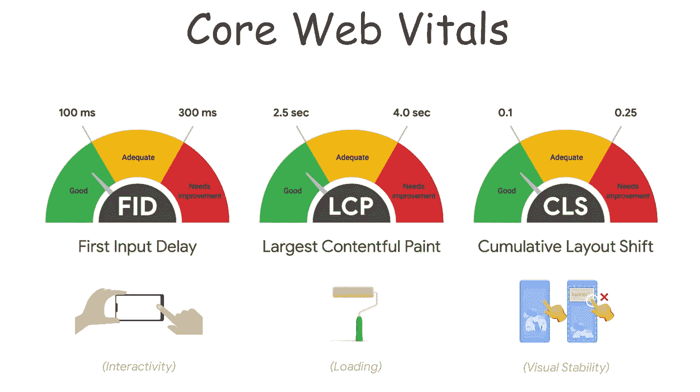
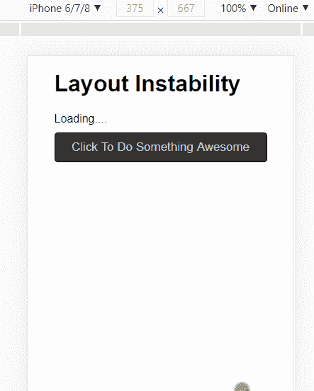
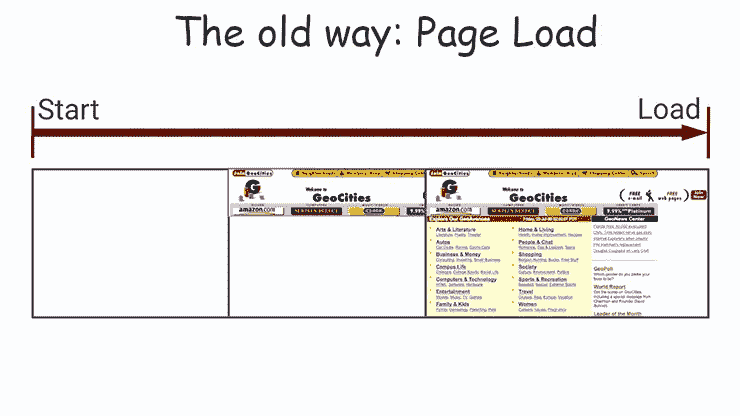
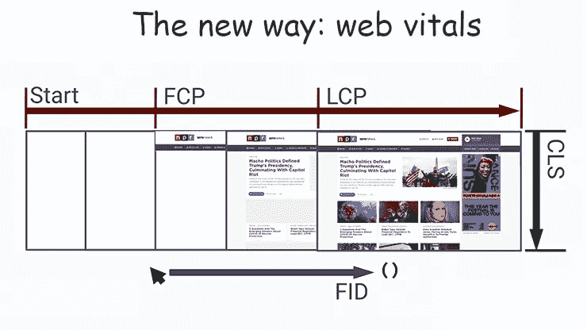
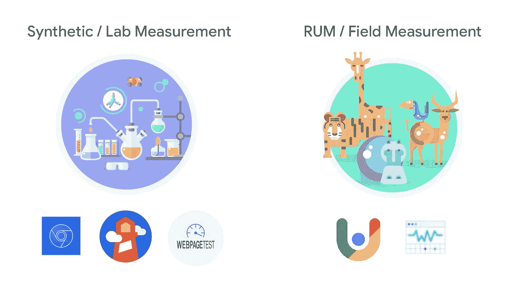
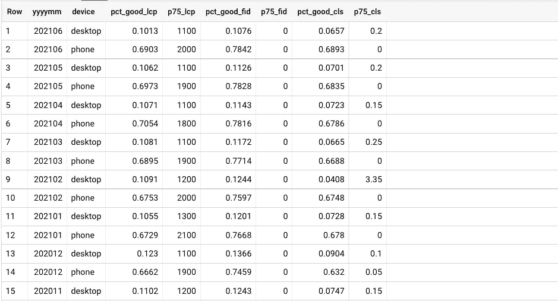

# 网络生命:它们是什么，如何衡量它们

> 原文：<https://betterprogramming.pub/web-vitals-guide-b56e28798e7f>

## [网页性能](https://rakiabensassi.medium.com/list/software-engineering-7a179a23ebfd)

## 谷歌用来影响你的网络应用排名的基本性能指标指南



核心网站生命体征([原始图片来源](https://www.youtube.com/watch?v=evrNn54UkHQ&list=RDCMUCnUYZLuoy1rq1aVMwx4aTzw&index=7)

杰克是一名年轻的软件工程师，他热爱自己的工作。一天早上，当他坐在桌子上把头放在拳头上休息时，他想到了一个绝妙的主意，一个新的 web 应用程序可以让他获得巨大的突破。他感到非常热情，没有浪费时间，他就开始了这个项目的工作。每天，他都长时间坐在电脑前，用手指在键盘上敲击。他实现了复杂的功能，修复了棘手的错误，并不断清理代码以提高其质量。

他也知道网页性能有多重要——缓慢的网页让用户感到沮丧，让他们不太可能停留下来，尽管他们等待 Gmail 这样的应用程序，有时需要 6 秒或更长时间才能加载。但他的应用不是 Gmail，因此他应该提供更好的体验，加载时间更短。

他彻夜不眠，研究这个问题，并采用了如下技术:

*   推迟 JavaScript 的工作，
*   懒惰装载，
*   异步脚本加载器，
*   客户端渲染，
*   和动态内容。

几个月过去了，Jack 对完成实施后上线感到非常兴奋。他启动了与 FTP 服务器的连接，并成功进行了部署。

部署几周后，他收到了沮丧的用户的反馈，他们对应用程序的响应不满意。当他们试图点击特定的按钮时，一些后期加载和渲染的内容按下了重要的按钮:



累积布局偏移示例

谷歌也惩罚了杰克，在搜索结果页面上把他的排名降了下来。

杰克很困惑；他的应用程序有一个非常有竞争力的页面加载时间，他对此感到自豪。但是他没有注意到的是，页面加载并不能完全反映一个网站是否感觉 ***快*** 。更糟糕的是，他所采用的技术，如延迟加载、异步内容和动态组件，通常会改善页面加载时间，但从最终用户的角度来看，会带来更慢的体验。

这是一个陡峭的斜坡，可能会导致不好的结局。杰克很伤心，他的心都碎了。但他想修复他的应用程序。

在接下来的部分中，我们将向他解释他所忽略的三个基本性能指标，并展示衡量和理解它们的不同技术，这样他就可以开发出健康的应用程序，而无需成为 web 性能专家。

如果你想锻炼你的网络表现肌肉，你可以加入我们，和杰克一起学习。

```
**Table of Contents**[Why PageLoad Time Is Not Enough?](#b604)
[The Core Web Vitals](#5e81)
   ∘ [Largest Contentful Paint (LCP)](#a1b7)
   ∘ [Cumulative Layout Shift (CLS)](#9d05)
   ∘ [First Input Delay (FID)](#ea20)
[How to Gather These Metrics?](#0e9e)
   ∘ [Lab data](#421c)
   ∘ [Field data](#d3f1)
[Interpreting Performance Data](#36b7)
   ∘ [The average](#35f8)
   ∘ [Percentiles](#2e2c)
[Case Study: Edeka](#a027)
[Final Thought](#264e)
```

# 为什么页面加载时间不够？

今天，我们不能再使用单一指标来了解性能或确保网页快速，因为它可能以不同的方式变慢:

*   启动缓慢
*   完成缓慢
*   反应迟钝
*   跳来跳去
*   更多

如果你打开任何网站 Chrome DevTools 中的 Lighthouse 选项卡，然后点击“生成报告”按钮，你可以在“性能”部分看到 6 个指标。这些指标通常被流行的性能工具所使用。


6 个常见的 web 性能指标(图片由作者提供)

但为了避免迷失在 DevTools、Google Analytics 和其他平台提供的所有指标中，Google 引入了 Web Vitals，帮助开发人员专注于一些基本分数，以提供出色的用户体验。

# 核心网络活力

核心网站要素描述了缓慢的性能影响网页的不同方式。谷歌将它们作为搜索排名因素。



2020 年，[谷歌推出了](https://blog.chromium.org/2020/05/introducing-web-vitals-essential-metrics.html)一套衡量网站实际表现的指标(web vitals)。(原始图像来源)

## 最大含量涂料(LCP)

有些网页看起来加载很快，但所有有意义的内容仍在等待加载。大型内容可以是在 UI 中占据大量空间的任何元素(文本或图像)。

最大内容绘画是指浏览器需要多长时间才能将最大量的内容呈现到屏幕上，以便用户可以相信页面是有用的。

**LCP 不良的原因:**

*   缓慢的服务器响应时间
*   呈现阻塞 JavaScript 和 CSS
*   缓慢的资源加载时间
*   [客户端渲染](/programming-buzzwords-9e94a3544eed)

> 您的 LCP 应小于 **2.5 秒**且不大于 **4.0 秒**。

## 累积布局偏移(CLS)

你可能还记得一些网页不停地移动，画出新的内容，把你想与之互动的东西推下去。这些网页有很多布局变化。

每当添加到页面的新元素移动其他元素的位置时，就会发生布局移动，例如在您想要阅读的文本或您想要点击的按钮上呈现的广告。大量的异步内容增加了布局变化的次数。

累积布局偏移(CLS)是页面上发生的影响用户体验的所有布局偏移的总和。以下布局变化不计入 CLS:

*   布局在这些用户输入之后改变:点击和轻击、按键、调整视口大小。
*   用户输入 500 毫秒内发生的布局变化。
*   折叠下方[的不可见布局偏移。](https://bettermarketing.pub/digital-marketing-buzzwords-2eefd685c54a)


布局偏移只有在可见时才计入 CLS(原始图像 source⁴)

**CLS 差的原因:**

*   没有尺寸的图像
*   无尺寸的广告、嵌入、iFrames
*   动态注入的内容
*   导致 FOIT/FOUT 的网络字体

要提高 CLS，您需要:

*   避免在用户看到内容后移动内容，并尽量减少后期呈现的内容。
*   为你的[动态内容](/angular-library-dynamic-stepper-2ba05ab40228)预留足够的空间，比如广告或宣传片。
*   在现有内容之上插入新内容，以防它是对用户交互的响应。

> 你的 CLS 分数应该少于 0.1 秒，不差于 0.25 秒。

## 第一输入延迟(FID)

如果你的网页加载了大量的 [JavaScript](/javascript-history-and-future-71b0ceb737aa) 、跟踪像素和资产依赖，你必须记住这些资产中的每一个都必须被下载、解析、编译、执行和绘制。如果当用户第一次尝试使用您的页面时，浏览器忙于完成这项工作，那么在它能够处理用户输入或触发单击事件之前，会有一个延迟。

首次输入延迟(FID)衡量这种延迟，即当用户首次尝试与页面交互时，页面忙碌的时间。这个指标不是指事件处理程序代码，而是指浏览器因为忙而延迟处理事件的时间。

开发人员通常通过显示一个微调器(加载屏幕)来解决这个问题，直到内容准备好，但是这种方法延迟了第一次输入，而不是解决加载大量内容的问题。

**FID 不良的原因:**

*   长期任务
*   JavaScript 执行时间长
*   大型 JavaScript 包
*   呈现阻塞 JavaScript

> 你的 FID 应该**小于 100 毫秒**且不差于 **300 毫秒**。

# 如何收集这些指标？

衡量 web 性能有不同的方法，它们返回不同的结果，解决不同的问题。但是他们使用两种主要技术:合成监控和真实用户监控。



实验室测量和现场测量工具

## 综合监控

合成监控是一种模拟真实用户从网络上的指定位置与您的网站进行交互的方法。用这种方法收集的数据被称为**实验室数据**，因为它测量的是连接到网络的已知设备的[性能](/angular-onpush-change-detection-f629cbce0bfa)，而不是任何用户的实际性能。这是对性能的估计。

综合监控有助于在问题影响您的最终用户之前发现并解决问题，还有助于监控复杂的交易和业务流程。

可以使用以下工具进行综合测试:

*   Lighthouse —在 [Chrome DevTools](/build-me-an-angular-app-with-memory-leaks-please-36302184e658) 上可用。
*   网页测试

## 真实用户监控

真实用户监控(RUM)通过描述终端用户在运行的网站上体验到的实际性能，避免了猜测。它捕获并分析每个用户*的每个*交易*。用这种方法收集的数据称为**现场数据**。*

RUM 可以很容易地确定问题出在哪里。它可以揭示如下场景:

*   一个用户在结帐过程进行到一半时，点击了另一个页面。
*   否则几乎不可能提前预测和测试的意外行为。

RUM 工具包括:

*   [谷歌搜索控制台](https://javascript.plainenglish.io/google-search-console-api-8b13128da267)
*   症结:Chrome 用户 Experience⁵

您还可以使用 GitHub 上的`[web-vitals](https://github.com/GoogleChrome/web-vitals)`库来测量和记录您真正的核心网络生命体征。下面是如何使用它的一个简单示例:

使用 web-vitals 库监控真实用户的核心 web vitals 指标

# 解释性能数据

因为现场数据包括每个网站用户的数据，所以会生成大量数据，但并非所有数据都是相关的。为了理解这个结果，您将使用*统计数据。*

## **平均值**

计算平均值是理解数据集的简单方法。但是由于不寻常的性能分布，平均值可能会产生误导。例如，如果六个用户体验了 99、97、95、65、63 和 60 的性能，平均值将是***【80】***，这是一个很好的百分比，而实际上，该网站一半的用户表现很差。

## 百分位数

在性能测量中，我们经常使用“*最多用户*”、“*典型用户*”和“*最差用户*”的性能指标。或者，p50、p75 和 p95 分数:

*   p50 是第 50 个百分点，因为 50%的用户体验更快，得分更高。p50 又称 ***中位数*** 。
*   p75 是第 75 百分位。
*   p90 是第 90 百分位。

# 案例研究:Edeka

下面是一个从 CrUX 查询德国食品供应商 origin [Edeka](https://www.edeka.de/) 的核心 Web Vitals stats (p75)的例子。将返回从 2020 年 1 月 1 日开始的数据:

使用 BigQuery 从 CrUX 返回真实用户的性能指标

我们可以通过使用`device_summary`表而不是`metrics_summary`表来进一步分析上面的结果，以便查看使用特定设备(`desktop`或`phone`)的用户的百分比:

使用 BigQuery 从 CrUX 返回每个设备的真实用户性能指标拆分器

这是结果的摘录:



自 2020 年以来，每台设备的网络生命体征(LCP、FID、CLS)来自 Edeka 的 CrUX(图片由作者提供)

你可以自己尝试使用 BigQuery 从 Chrome UX 报告中挖掘不同来源、设备和日期的深刻数据。

在下面的视频中，我展示了如何使用 3 种工具来衡量 Edeka 的 Web Vitals 性能指标:

*   Chrome DevTools(灯塔和性能时间线)，
*   网页测试，
*   和 BigQuery 从 Chrome 用户体验报告(CrUX)中获取结果。

使用 DevTools 和 WebPageTest，我检查了实验室数据，但使用 CrUX，我收集了真实用户的指标(现场数据):

# 最终想法

就像许多开发人员一样，您可能已经使用或见过许多工具来度量性能，并且发现工具和度量标准的丰富性很难跟上。核心 Web Vitals 旨在简化景观，并帮助您关注最重要的指标:最大内容油漆(LCP)、累积布局偏移(CLS)和首次输入延迟(FID)。

我希望通过今天的解释，您可以更轻松地了解不同的性能监控技术，并针对您的情况使用正确的解决方案。

🧠💡我为一群聪明、好奇的人写关于工程、技术和领导力的文章。 [**加入我的免费电子邮件简讯，独家获取**](https://rakiabensassi.substack.com/) 或在此注册 Medium。

# 参考

[针对核心网站重要指标进行优化](http://youtube.com/watch?v=AQqFZ5t8uNc&list=RDCMUCnUYZLuoy1rq1aVMwx4aTzw&index=1)

[使用网络生命体征优化交互性(FID/TBT)](https://www.youtube.com/watch?v=WxYpdw5ELrU&list=RDCMUCnUYZLuoy1rq1aVMwx4aTzw&index=3)

[衡量 2021 年的网络表现](https://requestmetrics.com/web-performance/measure-web-performance)

⁴ [解决常见的网络问题](https://www.youtube.com/watch?v=IB3e8SAdBaE&list=RDCMUCnUYZLuoy1rq1aVMwx4aTzw&index=7)

⁵ [Chrome 用户体验报告](https://developers.google.com/web/tools/chrome-user-experience-report/)

⁶ [在 BigQuery 上掌握 Chrome UX 报告](https://www.youtube.com/watch?v=YGcA-h4YM6w)