# 使用 Lens 协议和 ChainSafe 的 Unity SDK 开发 Web3 游戏

> 原文：<https://betterprogramming.pub/web3-game-development-with-lens-protocol-and-chainsafes-unity-sdk-f4b502bdfa02>

## 使用 Lens 协议和 Chainsafe 的 Unity SDK 构建区块链游戏

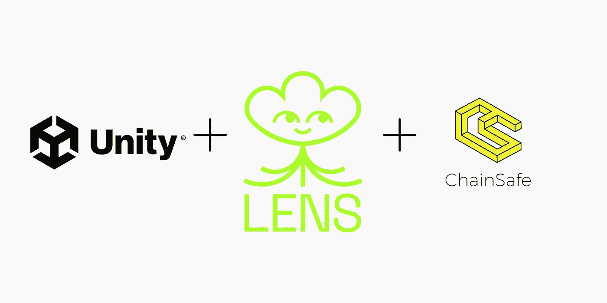

很多人都知道 Lens Protocol 是一个分散的社交图，它让任何人都可以轻松地在区块链上建立社交网络。因此，我们已经看到许多开发者在 Lens 上构建令人兴奋的社交应用。

我发现其中一些有趣的是 [Lenster](https://lenster.xyz/) (一个去中心化、无权限的社交媒体应用) [Lenstube](https://lenstube.xyz/) (一个去中心化的视频分享社交媒体平台)和 [Lensdrop](https://www.lensdrop.xyz/) (一个让你向你的追随者和那些关注你帖子的人空投代币的应用)。

然而，一个很酷的用例是 Web3 游戏，它还没有被开发者真正探索过。我最近在 EthGlobal 的 HackFS 2022 黑客马拉松上赢得了一个[奖](https://ethglobal.com/showcase/lensgame-w2yr6)，因为我在 Lens Protocol 上构建了一个 [Web3 游戏和游戏市场](https://lensgame-marketplace.vercel.app/)。因此，我决定为其他开发者创建这个教程，以了解他们如何也可以在 Lens 上构建自己的区块链游戏。

在本教程结束时，您应该对 Chainsafe 的 Unity SDK 的工作原理有了基本的了解，并且能够将镜头协议集成到您的 Unity 游戏中。

# 项目初始化和安装依赖项

对于这个项目，我们将建立一个令牌门控游戏，只能由那些收集了我们在 Lens 上的出版物的人玩。如果您不熟悉收集模块，这里有一个来自镜头文档的简单解释。

> 收藏允许创作者将他们的内容货币化。因为创作者通过 Lens 协议拥有他们的内容，所以他们能够允许他们的追随者购买该内容。
> 
> 当用户将[出版物](https://docs.lens.xyz/docs/publication)发布到他们的[个人资料 NFT](https://docs.lens.xyz/docs/profile) 时，他们可以选择设置收集模块。这个模块将允许其他用户创建链接到发布内容 URI 的 NFT。这个模块可以包含任意的逻辑来应用到铸造过程和产生的 NFT。

## 安装 Chainsafe Unity SDK

Chainsafe 的 Unity SDK 可以让开发者在 Unity 上轻松构建支持区块链的游戏。完成以下步骤来安装 SDK。

1.  访问 Chainsafe 的 web3.unity [发布页面](https://github.com/ChainSafe/web3.unity/releases)。
2.  点击 **web3.unitypackage** 进行安装。

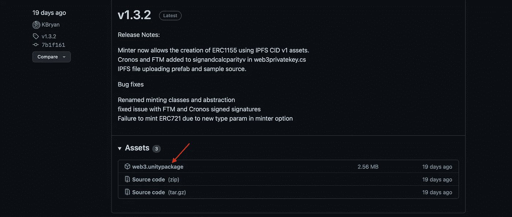

Chainsafe unity SDK 安装

## 下载游戏资产

*如果你想从头开始构建你的游戏，或者已经有了一个游戏，想把镜头协议和链锯集成在一起，你可以跳过这一部分。*

为了避免从头开始构建游戏，我们将使用来自 Unity 资产商店的[样本游戏](https://assetstore.unity.com/packages/templates/tutorials/adventure-sample-game-76216)。前往 [Unity 资产商店](https://assetstore.unity.com/packages/templates/tutorials/adventure-sample-game-76216)，然后点击**添加到我的资产**将游戏套件添加到您在 Unity 上的资产。

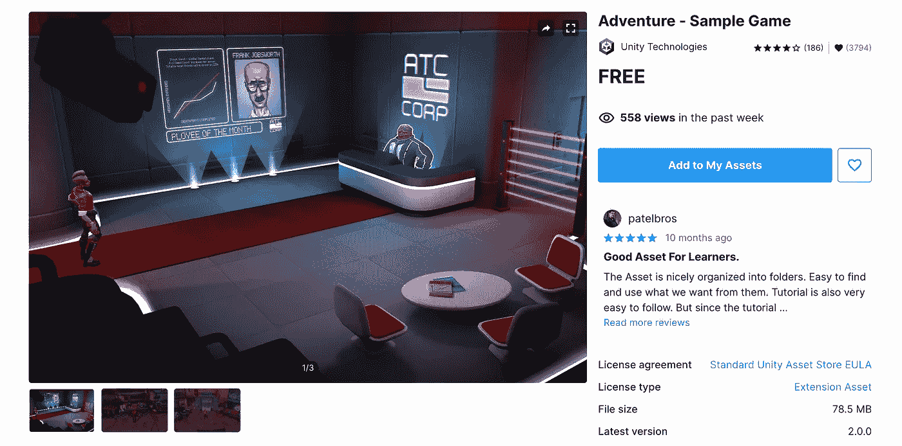

## 创建您的 Unity 游戏

*你需要安装 Unity 来学习本教程。如果你还没有安装它，你可以在这里安装***。**

1.  *打开电脑上的 Unity Hub 应用程序。*
2.  *导航到**项目**目录，点击**新建项目***

*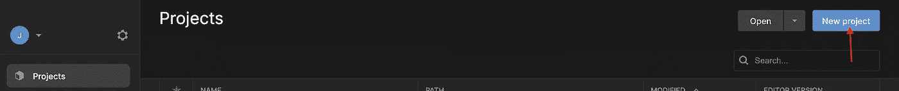*

*3.之后，命名您的项目并点击**创建项目**。这将为您在 Unity 中打开一个新项目。*

*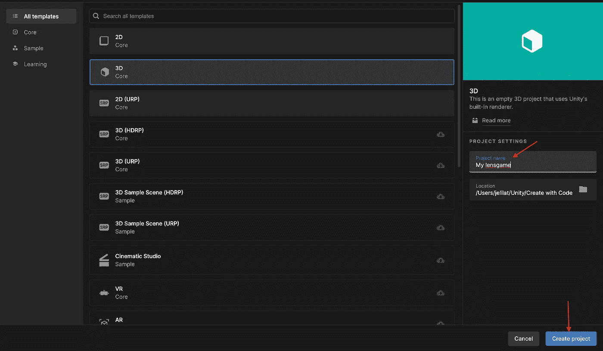*

## *导入游戏资产*

*1.在 Unity 编辑器中，进入**窗口>软件包管理器**。这应该显示包管理器模式。*

*2.导航到软件包管理器上的**我的资产**部分，查看您的资产。*

*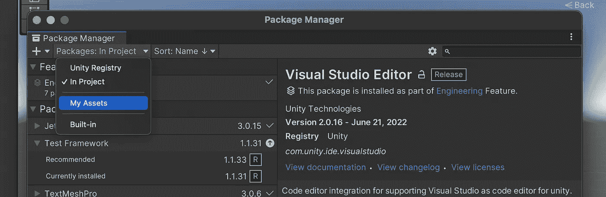*

*3.点击 **2D 游戏工具包**，下载资产(如果您还没有这样做)，然后点击**导入**将其添加到您的项目中。*

*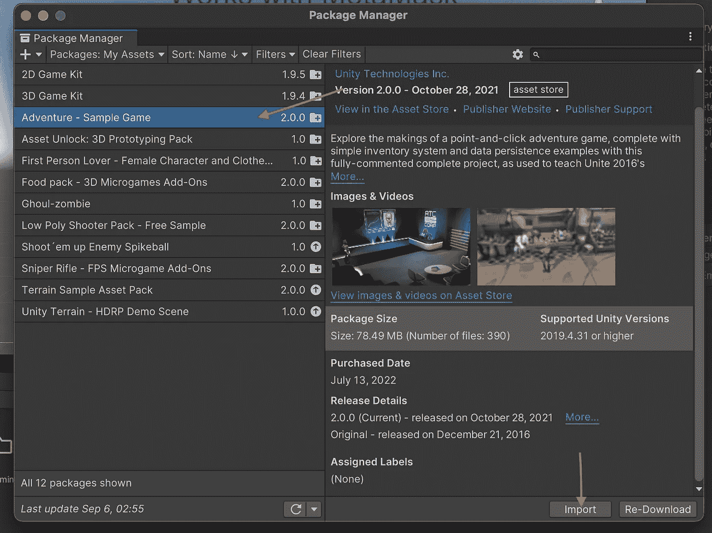*

*4.进入**资产>导入包>自定义包**，然后导入你之前安装的**web 3 . unity 包**。这会将 Chainsafe 的 Unity SDK 导入到您的游戏中。*

*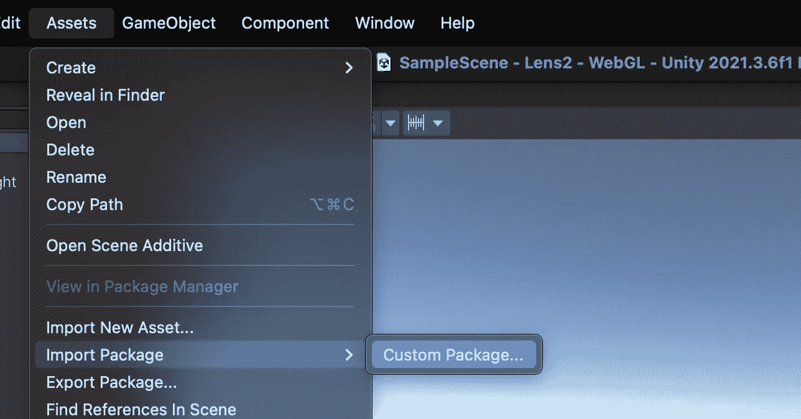*

# *张贴关于镜头协议的可收集出版物*

*由于我们将构建一个只能由收集我们出版物的人访问的游戏，我们需要创建一个关于 Lens Protocol 的可收集出版物。有几种方法可以做到这一点。*

## *镜头 API*

*您可以使用 Lens API 自己发布可收藏的出版物。您可以查看[文档](https://docs.lens.xyz/docs/publication-1)了解更多详情。*

## *伦斯特*

1.  *进入 [Lenster](https://lenster.xyz/) ，然后连接你的钱包，用 Lens 登录。*
2.  *为您的收藏品输入描述并上传图像。这个图像将显示在 OpenSea 和其他 NFT 市场。*

*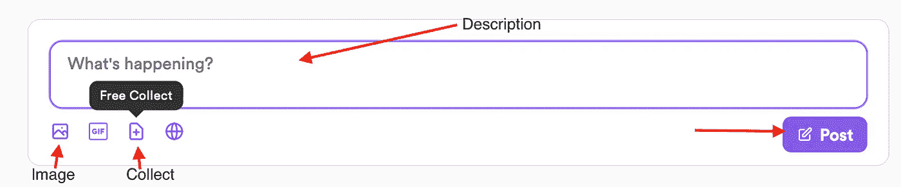*

*3.单击收集图标选择一个收集模块。如果您不确定选择哪个模块，您可以将鼠标悬停在信息图标上或访问[镜头文档](https://docs.lens.xyz/docs/icollectmodulesol)以了解每个模块的更多信息。*

*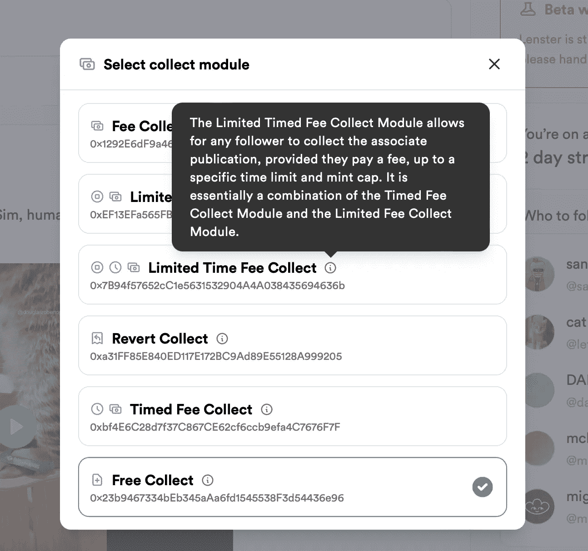*

## *透镜游戏市场*

1.  *进入 [Lensgame Marketplace](https://lensgame-marketplace.vercel.app/list) ，然后连接你的钱包，用 Lens 登录。*
2.  *为您的收藏品输入标题、描述并上传图像。*

*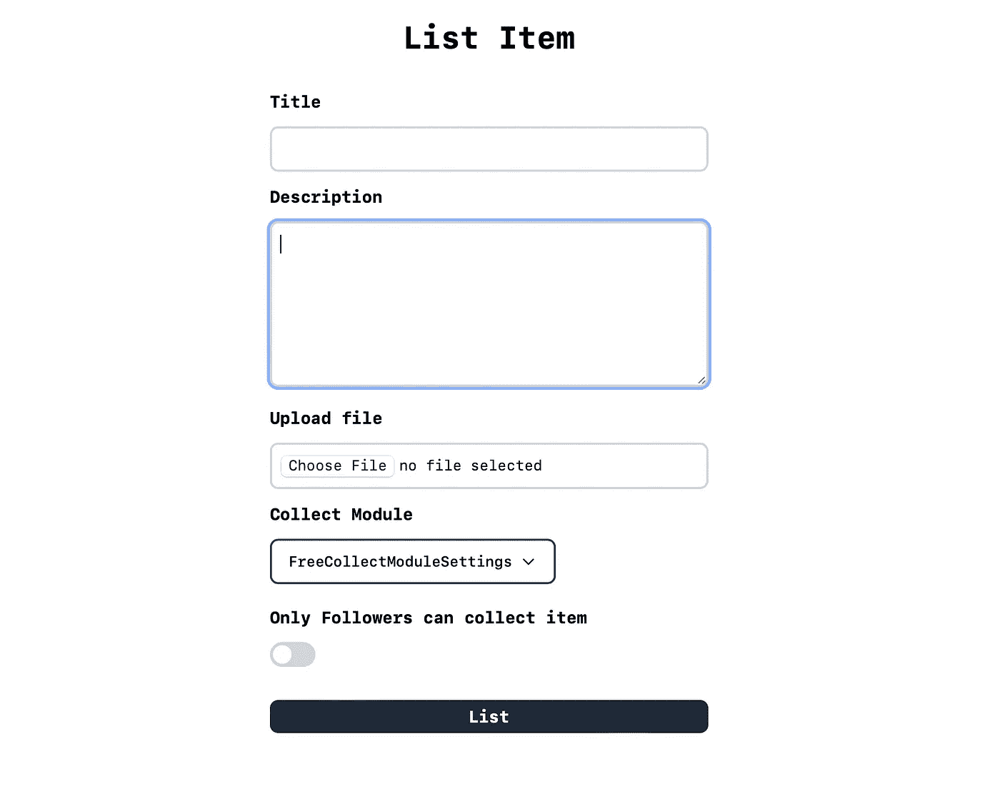*

*4.选择一个收集模块，并在完成表格后继续列出您的项目。*

**PS:lens game 市场仍在发展中，目前发布出版物最有效的方式是****Lenster****。**

# *令牌门控您的 Unity 游戏*

## *收集出版物*

*在 Lenster 上打开出版物，然后点击收集图标收集出版物。收集出版物后，它应该会出现在您的 OpenSea 个人资料中。*

*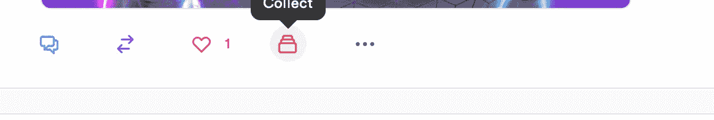*

## *将出版物添加到游戏*

1.  *在项目目录中，右键点击**资产**，进入**创建>场景**创建一个新场景。你可以随意命名这个场景，但是我把我的场景命名为 **BalanceVerification。双击新场景进行查看。***

*2.转到`Assets>Web3Unity>Prefabs>ERC721`，然后拖拽`BalanceOf721` 进入场景。双击`ERC721BalanceOfExample`脚本，它会自动在你的代码编辑器中打开文件。*

*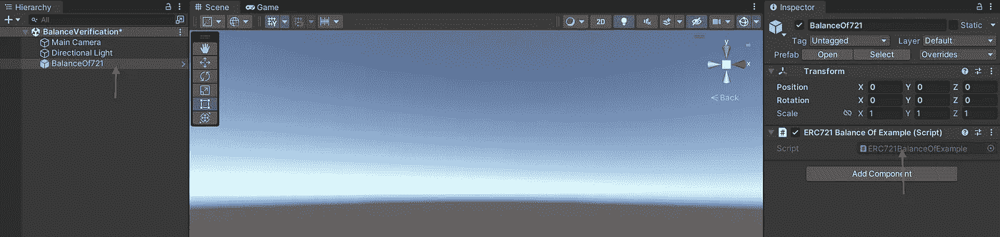*

*您应该会看到类似这样的内容:*

*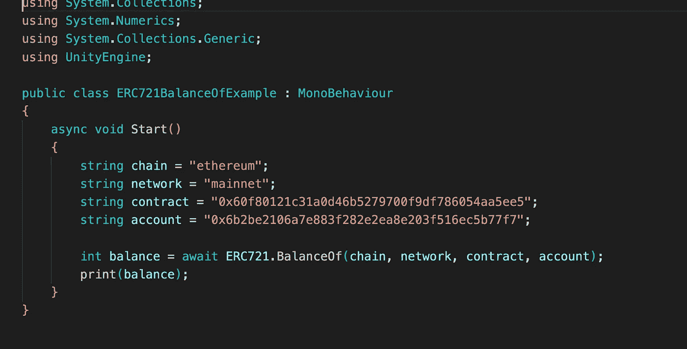*

*3.现在，转到你在 OpenSea 上的个人资料，点击收集的出版物。对于本教程，我使用的是 Yoginth 发布的[出版物](https://lenster.xyz/posts/0x0d-0xd4)。*

**如果您在您的 OpenSea 个人资料上找不到收集的出版物，请转到* ***更多>隐藏*** *，您应该可以在那里找到。**

*转到 NFT 页面上的详细信息并复制合同地址。*

*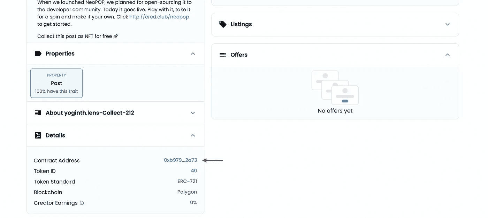*

*4.回到 VSCode 上的`ERC721BalanceOfExample` 脚本，编辑如下。*

*5.转到`Web3GL Templates>Web3GL-2020x`，然后在你的代码编辑器中打开`network.js` 文件，将链 id 改为 137，这是多边形网络的 id。*

*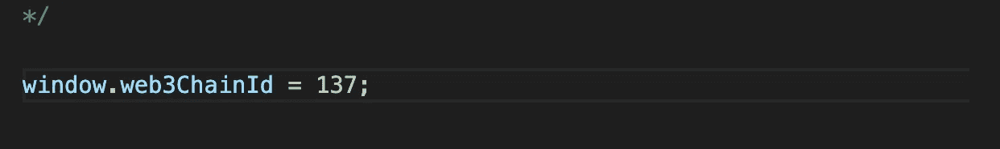*

*6.添加一个带有文本**“令牌余额不足”**的画布到你的场景中。确保取消选中它，这样它在默认情况下是不活跃的。*

*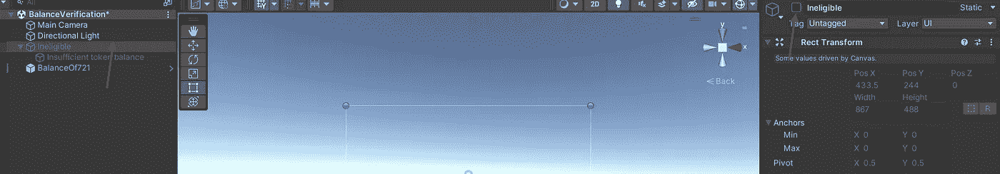*

*7.进入`Web3Unity>Scenes` ，双击`WebLogin` 编辑您的登录场景。你可以随意修改它，所以它对你的游戏来说更有视觉吸引力。*

# *发布您的游戏*

*现在，您已经添加了令牌门功能，是时候发布您的游戏了。在菜单中，转到`File>Build Settings`。*

1.  *点击“添加开放场景**”**按钮，将`WebLogin`和`BalanceVerification`场景添加到游戏中。添加后，将场景拖放到顶部，使它们分别位于索引 0 和 1 处。*

*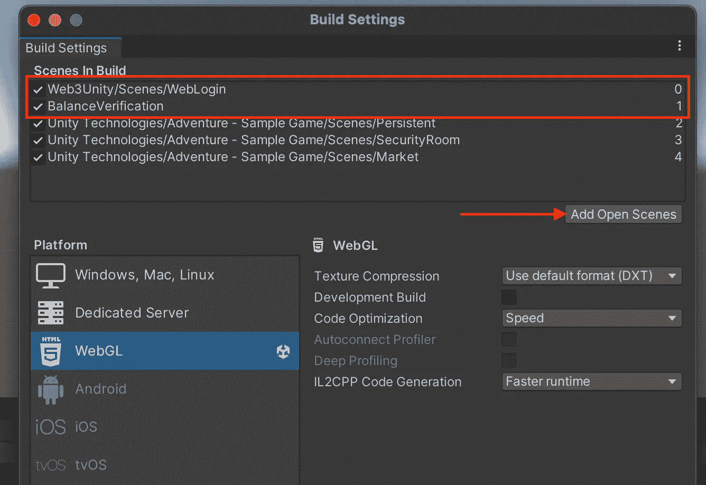*

*2.在平台菜单上，点击" WebGL "，然后点击按钮切换平台。*

*3.进入“播放器设置”，然后选择`Web3GL-2020x` 作为 WebGL 模板。*

*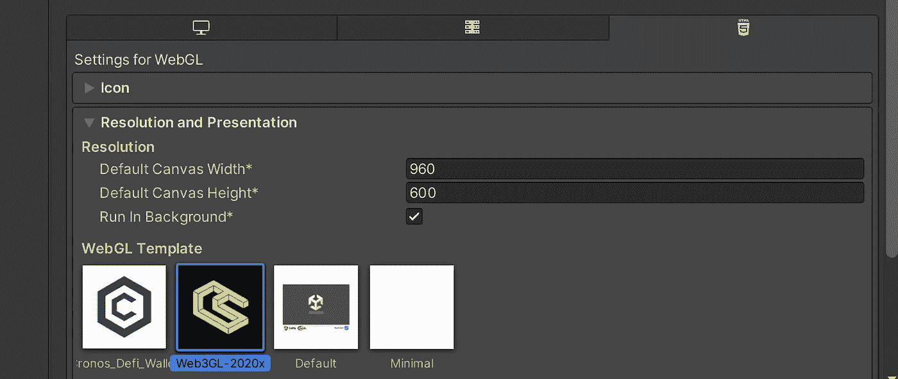*

*如果您遇到任何错误，请转到“其他设置**”**，然后删除折旧的 WebGL 1。*

*4.回到你的构建设置，点击“构建并运行”来玩你的游戏。*

*现在你的游戏已经准备好了，你可以在 itch.io 和其他类似的网站上发布了。*

*瞧啊。您已经成功构建了一个基于 Lens 协议的 Web3 游戏。分享您的游戏并接收玩家的反馈。*

**PS:与本教程相关的代码可以在* [*这里*](https://github.com/jelilat/Lens-Tutorial) *找到。如果你喜欢看视频教程，你可以看看这个。**