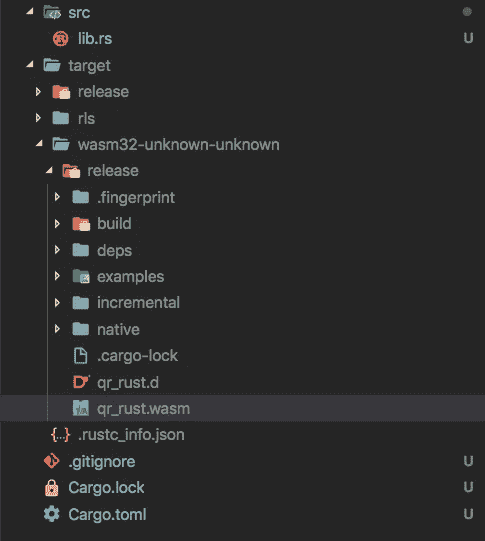
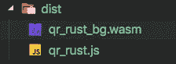
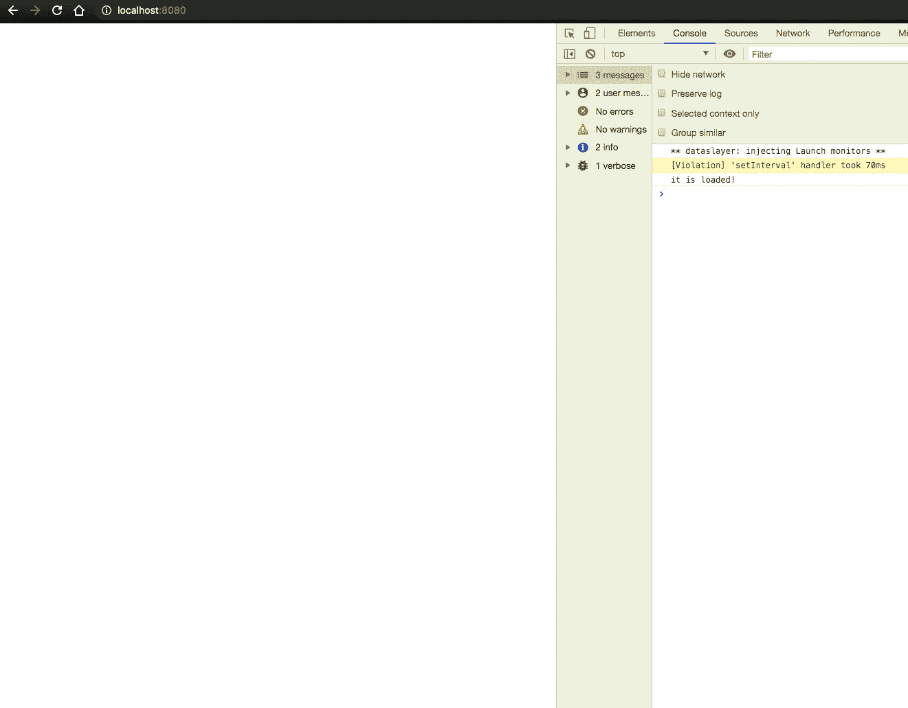
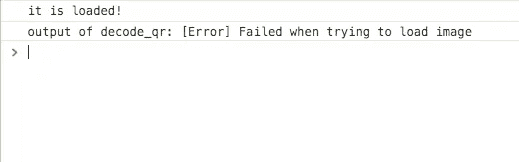
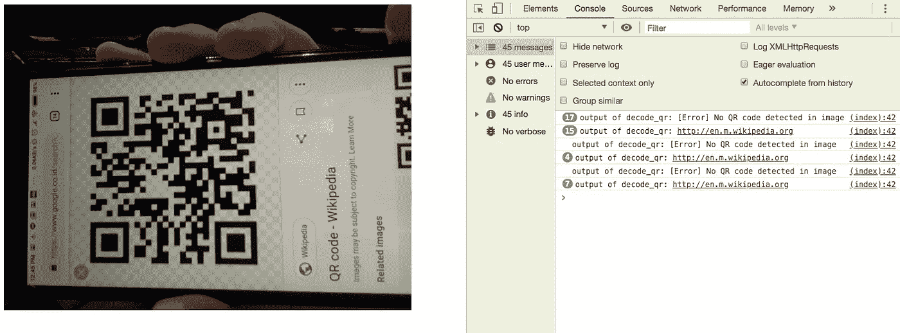
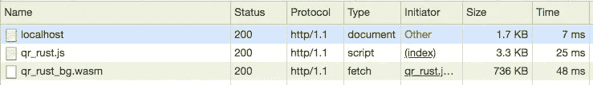

# web assembly——有听起来那么可怕吗？

> 原文：<https://betterprogramming.pub/webassembly-is-it-as-scary-as-it-sounds-b0c38fb2d9c8>

## 学习 WebAssembly，同时为浏览器构建基于 Wasm 的 QR 解码器


[web assembly](https://webassembly.org/)**(Wasm)**已经在左右两年了。还是比较新的技术。****

****出于某种原因，它总让我感到害怕。也许是因为它在中有*装配* 而得名？或者可能是必须用一种与 JavaScript 非常不同的语言来编码？****

****不管是什么，我是一个好奇的人，在看了[wasm_bindgen当我们使用这个函数时，我们希望它被暴露给我们的 JavaScript。这个信息被`wasm-bindgen`用来为我们创建合适的绑定。](https://medium.com/u/2d30b2439b4b#[wasm_bindgen]</code>属性告诉<code class=)****

```
**[#[wasm_bindgen]
pub fn decode_qr(bytes: &[u8]) -> String {](https://medium.com/u/2d30b2439b4b#[wasm_bindgen]</code>属性告诉<code class=)**
```

****[然后我们使用由`image` crate 提供的`load_from_memory`方法从这个数组中创建一个图像。](https://medium.com/u/2d30b2439b4b#[wasm_bindgen]</code>属性告诉<code class=)****

****[因为这个操作可能会失败，所以我们使用`match`关键字，并在方法返回`Ok`和`Err`结果时处理案例。](https://medium.com/u/2d30b2439b4b#[wasm_bindgen]</code>属性告诉<code class=)****

****[出错时，我们将把字符串`“[Error] Failed when trying to load image”`返回给 JavaScript 端。](https://medium.com/u/2d30b2439b4b#[wasm_bindgen]</code>属性告诉<code class=)****

```
**[let img = match image::load_from_memory(&bytes) {
        Ok(v) => v,
        Err(_e) => return format!("{}", "[Error] Failed when trying to load image"),
    };](https://medium.com/u/2d30b2439b4b#[wasm_bindgen]</code>属性告诉<code class=)**
```

****[然后，我们将该图像转换为灰度图像，然后将其提供给 rqrr。](https://medium.com/u/2d30b2439b4b#[wasm_bindgen]</code>属性告诉<code class=)****

```
**[let img = img.to_luma();](https://medium.com/u/2d30b2439b4b#[wasm_bindgen]</code>属性告诉<code class=)**
```

****[您可能会想:“所有这些方法名是从哪里来的？”](https://medium.com/u/2d30b2439b4b#[wasm_bindgen]</code>属性告诉<code class=)****

****[这些方法以及其他信息可以在板条箱文档页面中找到。](https://medium.com/u/2d30b2439b4b#[wasm_bindgen]</code>属性告诉<code class=)****

****[我已经链接到上面的文档页面，但我会再次提供，以防您错过。](https://medium.com/u/2d30b2439b4b#[wasm_bindgen]</code>属性告诉<code class=) [rqrr 文件](https://docs.rs/rqrr/0.2.0/rqrr/)、[图像文件](https://docs.rs/image/0.21.2/image/)、 [wasm_bindgen 文件](https://docs.rs/crate/wasm-bindgen/0.2.8)。****

****现在，我们准备图像，然后将它和案例处理一起提供给 rqrr。****

****最后，我们将`String`返回到 JavaScript 端。****

# ****编译到 Wasm****

****现在我们有了 Rust 代码，我们可以使用以下命令轻松地将其编译成 Wasm:****

```
**cargo build --target wasm32-unknown-unknown --release**
```

****这将在`target/wasm32-unknown-unknown/release`中生成一个 Wasm 文件。****

********

****我们创造了第一个。wasm 文件！🎉****

****注意，文件名是`qr_rust.wasm`。这是因为我的包名是`qr-rust`，所以输出文件也相应命名。****

****然而，我们还没有完成。由于我们正在使用`wasm-bindgen`，我们需要对这个 Wasm 文件运行`wasm-bindgen`来生成另一个 Wasm 文件。这将包含一个 JavaScript 文件，其中包含帮助我们轻松使用 Wasm 文件所需的绑定。****

****为此，请运行以下命令:****

```
**wasm-bindgen target/wasm32-unknown-unknown/release/qr_rust.wasm --out-dir ./dist --no-modules --no-typescript**
```

****您现在应该在`dist`目录中看到两个新文件。****

********

****使用 wasm-bindgen cli 创建绑定后的输出文件****

****如果你试着观察。js 文件，您将看到由`wasm-bindgen`生成的一堆代码，这样我们就可以轻松地使用 Wasm 模块。****

****它为我们做了两件值得注意的事情:****

1.  ****它帮助我们在`init()`函数中实例化 Wasm 模块:****

****初始化 wasm 模块****

****2.它提供了在 JavaScript 和 Wasm 之间传递数据所必需的东西:****

****如果我们不使用`wasm-bindgen`，我们将不得不自己编写这些东西。****

# ****尝试一下****

****首先，让我们创建一个简单的 HTML 文件，其中包含由`wasm-bindgen`生成的 JavaScript 绑定。****

****在我们可以对 Wasm 模块做任何事情之前，必须执行绑定。****

****让我们在`./dist`目录中创建这个`index.html`文件。****

```
**<html>
  <!-- the javascript bindings -->
  <script src="qr_rust.js"></script>
</html>**
```

****绑定在全局范围内创建了一个`wasm_bindgen`变量，我们可以用它来加载 Wasm 模块。****

****让我们尝试在本地提供这个 HTML 文件，看看会发生什么。****

****最简单的方法是使用`http-server` npm 模块并服务于我们的`./dist`目录。****

```
**npm install http-server -g
http-server ./dist -g**
```

****打开网址。如果一切正常，您应该会在浏览器控制台中看到`It is loaded!`。****

********

****我们在浏览器上加载了 Wasm 模块！****

****我们在 Rust 中编写的函数可以从全局`wasm_bindgen`变量中访问。****

```
**const { decode_qr } = wasm_bindgen;**
```

****此时，我们可以将一个无符号 8 位整数数组传递给函数，并记录输出。****

****在这里，我将`new Uint8Array([1,2,3,4,5]);`传递给函数。****

********

****失败了！****

****显然，它无法加载图像。这是意料之中的，因为我们只是传递一个不代表图像数据的随机数组。****

****让我们创建一个`<video />`元素来获取图像数据。****

****如果您刷新浏览器，您的浏览器现在应该会请求使用相机的权限。允许的话，你应该可以在浏览器中看到你的摄像头。****

********

****我，在网络摄像头前拿着一个二维码图片****

****接下来，我们希望能够获取视频的当前帧，以无符号 8 位整数数组的形式获取图像数据，并将其发送给`decode_qr()`函数。****

****我们将在`canvas`和`FileReader`的帮助下完成这项工作。这里有一个`captureImage`函数可以做到这一点。****

****现在，我们只需要定期调用这个函数。我们可以用`setInterval`简单地做到这一点。我们将在视频流创建后开始间隔。****

```
**navigator.mediaDevices.getUserMedia({ video: true })
  .then(stream => {
    video.srcObject = stream; setInterval(captureImage, 300);
});**
```

****因此，我们最终的 HTML 文件应该是这样的:****

****刷新您的浏览器，是时候尝试一下了！****

********

****有用！二维码上写着“http://en.m.wikipedia.org”****

****有时，您可能会看到一条错误消息:“无法访问的代码”。****

****我还没弄明白为什么会这样。如果你知道原因，请告诉我！****

# ****接下来你可以尝试什么****

****我们拿了一个功能正常的二维码解码器，用 Rust 写的，编译成 WebAssembly，借助`wasm-bindgen`在浏览器中使用。****

****然而，如果你在 DevTools 中查看网络请求，你会发现这个 Wasm 文件非常大！****

********

****QR 解码器 736kb！？****

****请注意，我们没有进行任何压缩或优化。****

****你可以试试查`wasm-opt`优化尺寸。[这本指南](https://rustwasm.github.io/docs/wasm-bindgen/examples/add.html)会帮你解决这个问题。****

****然后，你可以用任何你想要的压缩算法把它压缩下来；常见的有`gzip`。看看 Wasm 文件有多小。我目前在 264 KB 的 gzipped。****

****接下来，您可以尝试将您的创作发布为 npm 模块，以便其他人可以轻松使用它。我自己也做过这个。****

****如果你想看看我的实现，你可以看看我下面的库。它包含了大部分与本文相同的代码。****

****[](https://github.com/jackyef/rqrr-wasm) [## jackyef/rqrr-wasm

### rust QR 解码器库“rqrr ”;编译到 WebAssembly。演示:https://jackyef.github.io/rqrr-wasm…

github.com](https://github.com/jackyef/rqrr-wasm)**** 

# ****结论****

****那么，WebAssembly 可怕吗？对我来说，答案是否定的。****

****一开始看起来如此恐怖的原因是，这是一项我不熟悉的神秘技术。作为一个主要用 JavaScript 编码的人，用 Rust 编码很奇怪。****

****在阅读和观看了关于 WebAssembly 的信息后，我再也不能忽视它，并决定我必须克服对 WebAssembly 的恐惧。克服恐惧的一个好方法是真正投入进去。****

****请注意，您甚至不必创建自己的 Wasm！越来越多的 Wasm 模块，由其他人创建，发布到 npm。我们可以在项目中使用这些模块。****

****这个练习的目的是让我们更好地了解 WebAssembly。实际上，我们可能不需要这样做，但是如果有一天你需要使用它，至少你已经对它的工作原理有了一个大概的了解。****

****WebAssembly 为 web 平台开辟了许多可能性，尤其是对于那些仅靠 JavaScript 无法完成的繁重任务。****

****您的用例可能不需要 WebAssembly。比如我们的 QR 解码器(经过一些优化)是 264 KB。还有[这个](https://github.com/jackyef/rqrr-wasm) QR 扫描仪，用 JavaScript 写的，只有~12.4 KB 的 gzipped。****

****根据您的用例，您可能会认为，即使有性能优势，WebAssembly 解决方案对于这个目的来说也是大材小用，您可能是对的。****

****关键是工具只是工具，而 WebAssembly 是我们工具箱的一个很好的补充。****

# ****资源****

*   ****你可以通过观看 2019 Google I/O 上的[这个演讲来了解更多关于 WebAssembly 的知识。](https://www.youtube.com/watch?v=njt-Qzw0mVY)****
*   ****你也可以在在线 IDE 中使用它: [webassembly.studio](https://webassembly.studio/) 。****