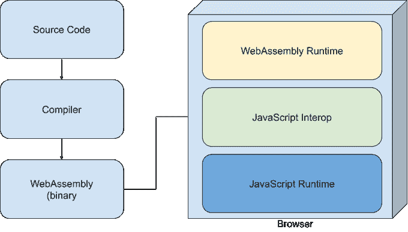

# 正如我们所知，网络组装是互联网的终结

> 原文：<https://betterprogramming.pub/webassembly-is-the-end-of-the-internet-as-we-know-it-9085a49cbc7b>

## 小心你的愿望

你是怎么上网的？就我而言，我喜欢私密和安全。

不幸的是，我们任何人怎么想都无关紧要。 [WebAssembly](https://webassembly.org/) ，一项令人兴奋的让浏览器运行本地低级代码的新技术可能会终结我们所知的互联网隐私和安全。

# 什么是 WebAssembly？

简而言之，WebAssembly 是一个让浏览器运行本机代码的运行时。我说的原生，是指用 C、C++、 [Rust](https://www.rust-lang.org/) 等低级语言写的代码。

这是 WebAssembly 原理的简图。编译器以符合 LLVM 的语言输入代码，并生成一个二进制文件`.wasm`。

这个文件由 JavaScript 互操作层加载并连接到现有的 JS 代码，然后由 WebAssembly 运行时执行`.wasm`文件。

WebAssembly 现在在所有主流浏览器中都得到了充分的采用和本机支持。

# WebAssembly 能做什么？

图片来自 [Pixabay](https://pixabay.com/?utm_source=link-attribution&utm_medium=referral&utm_campaign=image&utm_content=164063) 的 [PublicDomainPictures](https://pixabay.com/users/PublicDomainPictures-14/?utm_source=link-attribution&utm_medium=referral&utm_campaign=image&utm_content=164063)

WebAssembly 提供了卓越的性能。这意味着你的网站可以在浏览器之外和普通软件一样快地运行。

我怎么强调这是多么具有革命性都不为过。它允许浏览器运行以前由于性能问题而无法运行的软件和游戏。它将使复杂的网络虚拟现实体验成为可能。WebAssembly 可以让 Chromebooks 变得实际有用。

你会发现 WebAssembly 的一个非常有趣的应用是微软的 Blazor。微软所做的，基本上，是移植他们的整个。NET 平台到 WebAssembly，并在上面添加一个 UI 库。

这意味着，如果你是一名. NET 开发人员，你只是学习了 web 应用程序开发，而没有真正做任何事情。

# 怎么能剥削呢？

有很多方法。它们之所以成为可能，是因为`.wasm`文件的不可读性质。它们仍然可以被反编译和分析，但这并不像美化 JavaScript 那样容易。

一个小的跟踪脚本可能包含在一个网站使用的库中，没有人会知道它。于是，追踪保护，第一方(火狐)和第三方(插件)都会停止工作。

其次，性能的提高意味着网站现在可以更好地利用你的硬件。[比如加密货币挖掘](https://www.zdnet.com/article/half-of-the-websites-using-webassembly-use-it-for-malicious-purposes/)。再说一次，这将是出了名的难以阻挡。

最后，还有安全问题。有了如此强大的能力和低级别的访问权限，某些攻击(暴力攻击)和漏洞就变得可能了。我们只希望开源社区能够跟上。

# 结束语

所以，在广泛采用 WebAssembly 之后，互联网肯定不会是原来的样子了。

然而，后果会有多严重或多具灾难性，还有待观察。感谢您的阅读，并在评论中告诉我您对 WebAssembly 的看法！

# 资源

*   [MDN 的 WebAssembly 概念](https://developer.mozilla.org/en-US/docs/WebAssembly/Concepts)
*   [网络组装的阴暗面被病毒公告](https://www.virusbulletin.com/virusbulletin/2018/10/dark-side-webassembly/)
*   布拉索
*   [汇编脚本](https://docs.assemblyscript.org/)