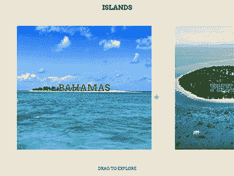

# WebGL 增强拖动滑块教程(第 1 部分)

> 原文：<https://betterprogramming.pub/webgl-enhanced-drag-slider-tutorial-with-curtains-js-part-1-17a11431fb94>

## HTML、CSS 和 JavaScript 入门

# 概观

在本教程中，我们将学习如何用 javascript 构建一个拖动滑块，并用强大的 WebGL 功能增强它。

滑块将由三部分组成。在第一部分中，我们将编写一个 Slider 类，它将创建一个简洁的响应拖动滑块。在第二部分中，我们将扩展它以添加 WebGL 效果。在第三部分，也是最后一部分，我们将学习如何通过删除所有不必要的回流或布局调用来提高整体性能。

WebGL 部分将由开源的香草 javascript 库[currents . js](https://www.curtainsjs.com/)处理。它在这里特别有用，因为它的主要目的是用 WebGL 效果增强 DOM 元素。只需几行 javascript，您就可以创建 WebGL 纹理平面，绑定到我们的滑块项目的 HTML 元素，并对整个场景进行后期处理。

我们很容易看出使用窗帘的好处。js:

*   干净和搜索引擎友好的 HTML 代码
*   您不必担心 WebGL 对象的大小和位置
*   大多数事情(比如调整大小)将由库在幕后处理。
*   在任何情况下，如果在 WebGL 初始化期间或在您的着色器中出现错误，滑块仍将工作！

我们将在第二部分中讨论所有这些内容。现在，让我们来看看 javascript 拖动滑块。

这是我们在第一部分结束时看到的:

# 第一部分。HTML 和 CSS

## 超文本标记语言

HTML 非常简单。我们将在主体结束标记之前添加一个 slider.steup.js javascript 文件，这是放置 javascript 代码的地方。

# 半铸钢ˌ钢性铸铁(Cast Semi-Steel)

CSS 也很简单。我们的#planes div 使用 flexbox 来显示它的子元素。我们根据幻灯片的宽度和数量来设置横向模式的宽度。在纵向模式下，我们重置其宽度，并将伸缩方向改为列。

我们将在拖动过程中添加一些 CSS 属性，防止文本选择和一些动画。

# 第二部分。拖动滑块 Javascript

现在让我们建立我们的滑块。

总而言之，这个滑块有三个步骤:

*   *在鼠标按下*时，我们将开始拖动我们的滑块，并得到我们的拖动开始位置。滑块开始平移。
*   *在鼠标抬起时*，我们将得到鼠标拖动的结束位置，用于下一次拖动。请注意，滑块仍在平移，直到我们的线性插值完成。
*   我们将*在滑块的当前平移和鼠标拖动位置之间连续插入滑块的位置。我们将建立一个请求动画帧循环来处理这个问题。*

我们将首先创建一个 slider 类来处理我们的 Slider 并初始化它的变量。

我们编写了三个辅助函数来插值、检索鼠标和触摸位置，以及设置滑块方向和边界。然后我们添加几个钩子——稍后当我们扩展 Slider 类来添加 WebGL 部分时，这些钩子会很有用:

接下来，我们负责动画和翻译。我们使用一个请求动画帧循环来更新滑块在每个 tick 的平移，并设置所需的钩子。

在下一部分中，我们将编写绑定到事件侦听器的方法。我们将在这里编写我们已经看到的三个主要步骤。我们还将添加一个在调整大小时调用的方法。

好了，我们差不多完成了拖动滑块。

我们只需要创建一个设置函数来注册我们所有的事件监听器并开始动画循环。我们将在构造函数中调用它。

我们还将创建一个函数来彻底销毁我们的滑块，这意味着删除所有事件侦听器并取消我们的请求动画帧:

暂时就这样了。我希望到目前为止你喜欢它。

在下一部分中，我们将修改 HTML 和 CSS，然后通过扩展 Slider 类添加到 WebGL 部分。