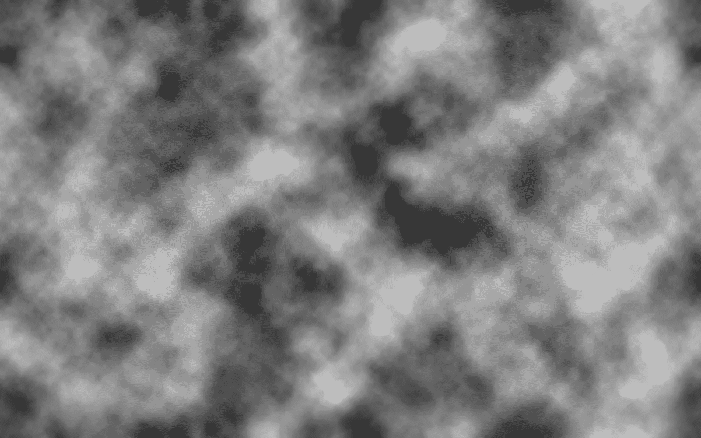
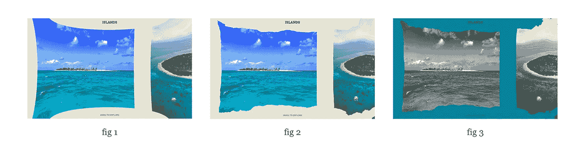

# WebGL 增强的 Drag Slider Tutorial With curtains . js—第 2 部分

> 原文：<https://betterprogramming.pub/webgl-enhanced-drag-slider-tutorial-with-curtains-js-part-2-bf32aa5a15c0>

本文是教程的第二部分。在[的第一部分](https://medium.com/swlh/webgl-enhanced-drag-slider-tutorial-with-curtains-js-part-1-17a11431fb94)，我们创建了一个 JavaScript 拖动滑块。我们现在要写 WebGL 部分了。

以下是您将得到的结果:

提醒一下，我们将使用[窗帘. js](https://www.curtainsjs.com/) 来添加与 WebGL 相关的所有内容。

[curtains.js](https://www.curtainsjs.com/?source=post_page---------------------------) 是一个开源的[香草](http://vanilla-js.com/) JavaScript 库。它在这里特别有用，因为它的主要目的是用 WebGL 效果增强 DOM 元素。

通过几行 JavaScript，您将能够创建 WebGL 纹理平面，绑定到我们的滑块项目的 HTML 元素，然后对整个场景进行后期处理。

使用 drawings . js 的优势变得显而易见:

*   干净和搜索引擎友好的 HTML 代码。
*   你不必担心你的 WebGL 对象的大小和位置，因为大多数东西(比如调整大小)将由库来处理。
*   如果在 WebGL 初始化期间或在您的着色器中出现错误，滑块仍将工作。

尽管我们将使用完全注释的代码一步一步地查看这是如何工作的，但是如果您不熟悉这些概念，您可能希望了解更多关于 [WebGL](https://webglfundamentals.org/webgl/lessons/webgl-fundamentals.html) 和[着色器](https://thebookofshaders.com/)的信息。

你可能还想看一下[窗帘. js API 文档](https://www.curtainsjs.com/documentation.html) 或者检查一下它的 [GitHub repo](https://github.com/martinlaxenaire/curtainsjs) 。

我们还将使用 [anime.js](https://animejs.com/) 作为我们动画的补间引擎。

# 第 1 部分— HTML 和 CSS

要实现 WebGL，我们必须对 HTML 和 CSS 做一些修改。

## 超文本标记语言

HTML 没有太多变化。

我们将添加一个`div`容器来保存图像标签上的 WebGL `canvas`和数据采样器属性；它将被用作片段着色器中的纹理采样器名称。

我们还将在主体结束标记之前添加我们的库和主 JavaScript 文件。

## 半铸钢ˌ钢性铸铁(Cast Semi-Steel)

因为我们的图像将在画布中显示为 WebGL 平面，所以我们必须隐藏原始图像。

每次创建一个平面，我们将添加一个`loaded`类到它的父 HTML 元素中，以动画显示相应标题的不透明度。

最后，我们将在 WebGL 初始化期间捕获错误(或编译着色器时的任何问题),并将一个`no-curtains`类添加到文档主体。

因此，我们需要在 CSS 中处理这种情况，以再次显示我们的原始图像:

就这样，没什么难的。现在让我们转到 WebGL！

# 第 2 部分—着色器

在我们扩展 slider 类来添加所有与 WebGL 相关的 JavaScript 之前，我们将编写我们的着色器。

我们有两个不同的元素:我们的平面(将使用相同的着色器)和我们的着色器通道。然后，我们必须编写两对着色器。

着色器将被放在`<script>`标签中，就在我们的主体结束标签之前。注意它们的`ID`属性——我们稍后将在 JavaScript 中使用它们。

# 飞机

## 平面顶点着色器

由于库生成的投影和视图矩阵，平面顶点着色器相对于它们的 HTML 元素定位我们的平面。

它还会将新的纹理坐标传递给我们的片段着色器。通过使用*纹理矩阵* uniform 来计算新的纹理坐标，我们确保纹理将始终适合平面，而不会破坏其自然纵横比。

## 平面片段着色器

我们将把我们的纹理映射到我们刚刚传递的纹理坐标，并根据我们的`uOpacity`制服，以及从每个像素到左边缘的距离，制作它的不透明度的动画:

# 后加工

着色器过程使用*帧缓冲对象*将整个场景渲染到纹理，应用着色器，然后将该纹理渲染回画布。

大多数后期处理效果将发生在我们的片段着色器内部。我们将使用一个位移纹理来增加整体效果的趣味。我们将使用这张黑白图像的 RGB 值来计算我们将应用于每个像素的位移量。

我们将重复和偏移这个纹理，使它看起来像是在跟随我们的平面。然后，我们使用一个模式图像来获得无缝效果。

这是我们将使用的图像:

在我们详细了解这些着色器之前，让我们分解一下着色器中会发生什么:

*   在我们的顶点着色器中计算鼠标相对于纹理坐标的位置，并将其作为变量传递给我们的片段着色器。
*   基于我们的`uDragEffect`制服和鼠标到远边的距离，计算一个从零到一的`spreadFromMouse`浮动(就像我们对平面的不透明度所做的那样)。
*   基于`spreadFromMouse`应用一种鱼眼效果(离鼠标越远，我们得到的扭曲越多)。参见图 1。
*   基于我们的置换贴图 RGB 值和`spreadFromMouse`应用置换(离鼠标越远，置换越多)。参见图 2。
*   基于`spreadFromMouse`应用灰度和背景色效果。参见图 3。

## 后处理顶点着色器

着色器过程不使用投影和模型视图矩阵，因为渲染纹理(表示画布上实际绘制的内容)和画布始终具有相同的大小和位置。

出于同样的原因，你不需要在渲染纹理坐标上使用纹理矩阵。

然而，我们将需要使用我们的位移图像纹理矩阵来计算其精确的纹理坐标:

## 后处理片段着色器

在这里你会发现我们上面定义的所有步骤。

有些效果取决于滑块方向；我们将计算两种效果，并根据滑块方向选择正确的效果。

我们本可以使用`if`和`else`语句，但是它们会降低 [GLSL](https://www.opengl.org/sdk/docs/tutorials/ClockworkCoders/glsl_overview.php) 的性能，应该谨慎使用。

# 第 3 部分 WebGL

让我们回到 JavaScript 并添加 WebGL 部分。

我们将扩展`Slider`类(在继续之前，请务必插入在[上一篇文章](https://medium.com/@martin.laxenaire/webgl-enhanced-drag-slider-tutorial-with-curtains-js-part-1-17a11431fb94)中看到的`Slider`类代码。)并使用几乎相同的代码结构:构造函数、助手、钩子、设置和销毁方法。唯一的区别是，为了清楚起见，我们将在助手和钩子之前编写所有的设置函数。

# 初始化

让我们从创建一个新的*窗帘*实例开始。我们需要将包装画布的 div 的 ID 作为参数传递。

这将无声地添加一个画布，获取我们的 WebGL 上下文，开始一个`requestAnimationFrame`循环，绘制我们的场景，等等。它将返回一个对象，我们稍后将使用它来添加我们的平面和着色器过程。

如您所见，我们在 init 函数中调用了`setupPlanes`和`setupShaderPass`方法。我们现在就要给它们编码。

# 添加平面

为了添加我们的平面，我们将使用窗帘对象的`addPlane`方法。

这个方法有两个参数:

*   将绑定到平面的 HTML 元素。该平面将复制其 CSS 大小和位置。在窗口大小调整事件中，它将更新到新的大小和尺寸。它还会自动为该元素的所有图像、画布和视频的子元素创建纹理。在我们的例子中，我们只有一个图像。
*   一个参数对象。在这里我们将指定着色器的脚本 id 和我们的制服。

一旦创建了平面，我们将把它放入我们的平面数组供以后使用。

平面有一个方便的`onReady`事件，一旦创建了所有的初始纹理，就会触发该事件——这就是我们要制作它们的不透明度动画并将`loaded`类添加到其父 HTML 元素的地方。

# 添加着色器过程

接下来是着色器阶段。

由于窗帘对象的`addShaderPass`方法，添加一个着色器过程比添加一个平面更容易。

它不需要绑定到 HTML 元素，因为它将绑定到我们的画布。它只需要一个参数对象与着色器的脚本 id 和制服。

一旦它被添加，我们将使用`loadImage`加载位移图像。

这个方法接受图像的 HTML 元素作为参数，所以我们首先需要创建一个。不需要监听图像的加载事件，库会处理的。

最后，我们将使用着色器的`onRender`事件来沿着次轴连续偏移我们的纹理。

# 使用钩子

我们已经设置了所有的 WebGL 对象。现在我们需要用我们在`Slider`类中声明的钩子将它们绑定到滑块上。我们将用新的方法来覆盖它们。

当您调整浏览器大小时，我们的平面会自动调整大小。这是因为 curtains.js 知道窗口大小调整事件何时发生，并且可以处理新大小和位置的计算。

然而，当你通过 CSS 或 JavaScript 移动你的平面时，库不能知道，我们确实在转换它们的父 div。

我们需要通过简单调用`updatePosition`方法来告诉我们的飞机更新它们的位置。我们将把它放入我们的`onTranslation`函数中。

我们还需要更新我们的各种助手和钩子处理程序中的着色器传递鼠标位置、拖动效果和滑块方向。

我们快完成了。

最后，我们将添加一种方法来彻底销毁滑块的 WebGL 部分，并覆盖我们的`Slider`类初始销毁方法:

这就是你令人敬畏的 **WebGL 拖动滑块**！

在最后一部分中，我们将看到**如何通过删除所有不必要的布局/回流调用来提高性能**。