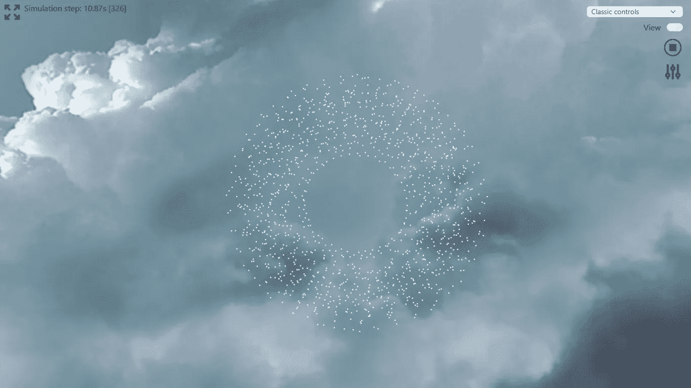

# 使用 Rust 和 WebGL 实现一个天空盒纹理

> 原文：<https://betterprogramming.pub/webgl-rust-webassembly-skybox-texture-cd3220bb1ebc>

## 模拟涡流粒子

Miramar 天空盒纹理应用于漩涡粒子模拟网页浏览器

这个故事着眼于使用 Rust 和 WebGL 实现一个*天空盒*纹理，用于[这个故事](https://julien-decharentenay.medium.com/implementing-a-webassembly-webgl-viewer-using-rust-a6d8a703153d)中描述的漩涡粒子模拟的 web 查看器。一个*天空盒*纹理是"*一个上面有纹理的盒子[……]看起来像是很远的地方，包括地平线*"([web gl2 fundamentals web gl2 天空盒](https://webgl2fundamentals.org/webgl/lessons/webgl-skybox.html))。

天空盒为 WebGL 场景提供了深度和上下文。使用的 skybox 图像由 Hipshot 命名为 *miramar* ，在此发布。

源代码可在 [GitHub](https://github.com/juliendecharentenay/vortexParticleSimulation/blob/main/rust/wasm/src/viewer/program_skybox.rs) 上获得，现场版本可在[CFD-webassembly.com](https://cfd-webassembly.com/vpm/index.html)上查看。

这个故事中表达的观点/意见是我自己的。这个故事与我的个人经历和选择有关，并提供了希望有用的信息，但没有任何担保。

我想提及使这一实施成为可能的以下来源:

*   [webgl 2 fundamentals webgl 2 SkyBox](https://webgl2fundamentals.org/webgl/lessons/webgl-skybox.html)章节和[源代码](https://github.com/gfxfundamentals/webgl2-fundamentals/blob/master/webgl/webgl-skybox.html)；
*   [Keith Lantz 使用 OpenGL 和 GLSL 的立方体贴图渲染天空盒](https://www.keithlantz.net/2011/10/rendering-a-skybox-using-a-cube-map-with-opengl-and-glsl/)——引导我使用了 *miramar* 天空盒纹理；
*   “如何在 Rust/WebGL 中加载纹理”为我提供了足够的信息来制作第一个工作版本；和
*   这个 [StackOverflow 问答](https://stackoverflow.com/questions/5314298/how-do-i-use-texsubimage2d-to-show-sprites-in-webgl)让我知道了如何成功地将一个图像的子集应用为纹理。

这个实现引发了对这个问题的思考:*图像应该用 JavaScript 加载，然后传输到 Rust/WebAssembly 还是直接在 Rust 中？*我选择了后者，将与 skybox 相关的代码保存在一个 Rust 文件中—[*program _ skybox . RS*](https://github.com/juliendecharentenay/vortexParticleSimulation/blob/main/rust/wasm/src/viewer/program_skybox.rs)*。*

## 预赛

由于天空盒渲染需要分别访问视图和投影矩阵，因此进行了以下更改(如有兴趣，请参见[此提交](https://github.com/juliendecharentenay/vortexParticleSimulation/commit/ee3e13c4318e064a986f001db323dfe5c0f2a22f)):

*   `*camera.rs*`修改为允许分别提取视图和投影矩阵；
*   对`View`特征方法`draw`和`redraw`进行修改，用`Camera`结构代替`Matrix4`结构。

## 履行

*天空盒*渲染在结构`ProgramSkyBox` *—* 文件`*viewer/program_skybox.rs*`—*—*中实现，并实现`View`特征。

由顶点和片段着色器组成的 WebGL 程序几乎一字不差地取自 WebGL2 SkyBox 的着色器，并使用之前构建的辅助函数进行编译。程序在第一次需要时被编译，然后被重用。

天空盒渲染在`redraw`方法中实现，因为渲染不依赖于模拟状态。

该实现遵循与 WebGL2 SkyBox 实现中描述的步骤相同的步骤，但略有不同，如下所示:

*   将 WebGL 程序设置为当前渲染上下文:

*   顶点数组缓冲区收集"*属性的状态，每个属性使用哪个缓冲区，以及如何从这些缓冲区中取出数据* " ( [WebGL2 基础知识](https://webgl2fundamentals.org/webgl/lessons/webgl-fundamentals.html))。它在第一次调用时被初始化和填充，并在后续调用中重复使用:

*   对于天空盒实现，我们不将 3D 空间坐标转换到视图空间，而是创建一个覆盖整个视图空间并直接使用视图空间坐标的四边形。基于观察方向和投影将纹理应用于该四边形。下面的代码摘录显示了这个 quad 的定义和赋值，它也非常类似于 WebGL2 SkyBox 实现。

*   应用于天空盒的纹理，又名立方体贴图，使用纹理层 0 定义和应用如下。下一节将提供更多关于纹理加载和`assign_textures`方法实现的信息。该步骤是仅在第一次`redraw`调用期间执行的最后一步。

*   以下代码在每次`redraw`调用时运行，因为它与每次`redraw`调用之间可能改变的摄像机方向有关。它使用视图矩阵来定义相机的方向，并将其与视图投影相结合来定义视图空间位置和纹理之间的关系——尽管我理解矩阵操作(例如，第 10 行到第 14 行交换了`y`和`z`坐标),但我并不完全理解投影和视图矩阵的乘积的反演如何与立方体贴图纹理相关联。因此，请参考 [WebGL2 SkyBox 文章](https://webgl2fundamentals.org/webgl/lessons/webgl-skybox.html)了解关于此主题的更多详细信息…

*   最后，根据 WebGL2 SkyBox 实现，在设置渲染参数后调用渲染函数。

这涵盖了 WebGL 渲染方面的实现，除了纹理加载和应用纹理时调用的`assign_texture` 方法。

## 纹理加载和分配

我之前提到纹理图像是直接加载到 Rust/WebAssembly 中的。文章“[如何在 Rust/WebGl](https://snoozetime.github.io/2019/12/19/webgl-texture.html) 中加载纹理”提供了一种使用`HtmlImageElement`元素及其关联的`on_load`回调元素的方法——同时提到闭包的删除需要仔细考虑，因为它“正在 Rust 中泄漏内存”。

我选择使用`fetch` [*API*](https://developer.mozilla.org/en-US/docs/Web/API/Fetch_API/Using_Fetch) 来加载图像内容，然后将这些内容转换成一个`ImageBitmap`。这些函数(以及其他函数)使用承诺来代替回调，因此减少了对丢弃闭包的需求。使用`wasm-bindgen-futures`箱将 JavaScript 承诺视为 Rust Future——参见`wasm-bindgen`指南中的[使用 JS 承诺和 Rust Future](https://rustwasm.github.io/wasm-bindgen/reference/js-promises-and-rust-futures.html) 。

图像获取和转换是在创建`ProgramSkyBox`对象的过程中进行的——它现在是一个异步函数。该函数的异步特性暴露给 JavaScript，以允许使用以下代码创建天空盒视图:

使用`fetch` *API* 加载纹理并转换为`ImageBitmap`如下所示。执行单个获取调用来加载单个图像，该图像组合了需要应用于立方体贴图的 6 个面的所有 6 个纹理。使用`CubeMapTexSxSySw` struct 存储图像中纹理的坐标。

加载的`ImageBitmap`与存储在`CubeMapTexSxSySw`对象中的`x`、`y`和`w`参数一起使用，以在`assign_textures`方法中识别并应用图像的相关部分到每个立方体贴图纹理。使用`HtmlCanvasElement`提取图像的相关部分。我最初尝试使用`texSubImage2d`方法，但是没有成功——类似于最初发帖者对 [StackOverflow](https://stackoverflow.com/questions/5314298/how-do-i-use-texsubimage2d-to-show-sprites-in-webgl) 的查询。

我发现给网页浏览器添加背景纹理非常有趣。它让我对承诺和未来有了更好的理解。我将简化与错误映射和导致转换的选项相关的样板代码——但这将是另一天的事情。