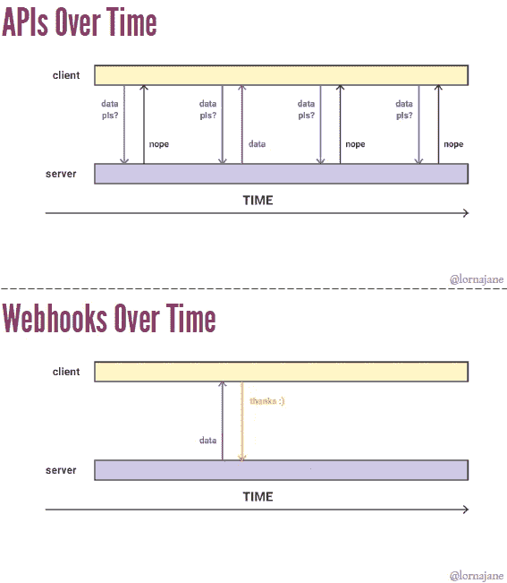

# 你和我的网钩

> 原文：<https://betterprogramming.pub/webhook-for-you-and-me-54b83f5e31d0>

## 你不会(也许)再问:“妈妈，什么是网钩？”

由[埃菲社](https://unsplash.com/photos/Rs5BQj5zbf8?utm_source=unsplash&utm_medium=referral&utm_content=creditCopyText)在 [Unsplash](https://unsplash.com/?utm_source=unsplash&utm_medium=referral&utm_content=creditCopyText) 上拍摄的照片

我是那种习惯用日常例子来解释专业术语的人，这样我就不需要仅仅把它们当成专业术语来记忆了。

也许这个过程在某些情况下过于简化了这个术语，但是谁在乎呢？只要我明白它是如何工作的，并且不费力去记住它，我想我很好。

如今，我们需要学习数以百万计的东西来让自己跟上时代，而做到这一点已经够难的了。所以，有些过于简单化也无妨。

因此，在我今天向你解释 webhooks 的尝试中，我将首先告诉你一个“敲门”的故事(不是一个笑话，这是一个严肃的故事)，然后我们将进入技术部分。

# 沃尔特的故事

有一个家伙，让我们叫他沃尔特·怀特先生。是的，电视剧《绝命毒师》里的好人。

怀特先生想开始自己的毒品生意，需要非法化学品来做。所以，他联系了一个叫 Tuco Salamanca 的歹徒，他答应给他化学品，他们做了笔交易。

几天后，怀特先生还没有收到化学药品。所以，他去了屠库的家:

敲门敲门。谁在那里？是我，沃尔特·怀特。
-你想要什么？
-我已经付了款，还没拿到。我知道。你很快就会得到它们。现在离开。

沃尔特·怀特知道这个家伙疯了，他不想激怒他，所以他立即离开。

又过了几天，他不耐烦了，回到屠库的家:

敲门敲门。谁在那里？我，沃尔特·怀特。
-你到底想要@#$@什么？我的东西在哪里？我已经告诉过你，你很快就会拿到的。多快？一个多星期了。你是说我是骗子吗？不，不。我只是想知道最新情况。
-包裹到达时我会通知你。不要再回来了。现在离开这里。
(怀特先生转身要走但屠库叫了出来:)
-嘿，你走之前，留下你的电话号码，我好给你打电话。

怀特先生留下了他的电话号码。第二天，他接到 Tuco 的电话，说包裹已经到了。

我们的小故事到此结束。

# Webhooks 的故事

让我们回到讨论 webhooks。

我们看到，在我们的故事中，Tuco 告诉 White 先生，他对“不要打电话给我，我会打电话给你”的哲学很满意。同样的理念也存在于 Webhook 概念的背后。

你看，当我们使用一个 [API](https://en.wikipedia.org/wiki/Application_programming_interface) 的时候，我们在需要的时候调用它。该流程以请求-响应的方式工作。我们将请求数据，API 将做出响应。

所以，如果有一个服务 API，你需要定期从它那里获取更新，你会经常调用它。你打电话越频繁，你得到的实时更新就越多。

这被称为 *API 轮询*。

然而，这不是一个好方法，因为在大多数情况下，你不会得到任何更新，因为没有任何。

此外，就资源使用而言，这对双方来说都是巨大的开销。

另一方面，如果这些服务有一个可用的 webhook，那么我们只需用它连接或“挂钩”我们的应用程序 URL，它就会在每次有数据可用时敲打我们。

就像屠库一样。包裹到达时，他打电话给怀特先生。就这么简单。

图片来源:[新闻来源](https://thenewstack.io/wonderful-world-webhooks/)

这就是你理解 webhook 如何工作所需要的。

由于互联网上的大多数通信都是通过 HTTP，API 和 webhook 都广泛使用它。

但是 webhook 不像 API 那样使用所有的`GET`、`POST`、`PUT`、`DELETE`方法。

它只向希望获得更新的侦听器或服务发出一个`HTTP POST`请求(也称为 HTTP 回调)。

对于 webhook，监听器将是一个简单的 URL，它将通过一个针对特定事件的`HTTP POST`请求来调用这个 URL。

# 你为什么需要一个网络钩子，你在哪里使用它？

Webhooks 主要用于需要针对某些事件进行实时通知或操作的情况，例如 Slack 通知、持续集成服务和其他集成。

Webhooks 可以用来在系统、系统内的组件或微服务之间交换数据——任何通过 HTTP 连接的东西。

比方说，你开发了一个应用程序，如果今天有可能下雨，它会向你发出警报，这样你就可以带雨伞了。或者，如果有人在您的项目存储库中提交了一个请求，而您希望在您的一个 Slack 通道中收到通知。

你看，在这些情况下，行动是在特定事件发生后发生的。因此，对于您的天气应用程序，您可以将它连接到一个天气服务 webhook，它只会在有可能下雨时向您发送通知。

如果你想在你的 Slack 通道中获得实时的提交更新，你需要将你的 [GitHub 账户](https://developer.github.com/webhooks/)连接到 [Slack incoming webhooks](https://api.slack.com/incoming-webhooks) ，这样它将在每次提交时接收消息。

# Webhooks 的优势

在互联网的早期，所有的 web 应用程序都在一个筒仓中工作，大多数仍然以同样的方式运行。随着 API 的兴起，这些应用程序之间出现了通信和集成。

但是正如我们在例子中看到的，这种交流的一个关键部分(即“事件驱动的交流”)缺失了——web hooks 来拯救我们。

希望这篇文章容易理解。您现在应该可以使用由花哨的 web 服务或应用程序提供的 webhooks 了。如果需要，您也可以构建自己的 webhook。

它们并不太复杂。感谢阅读！