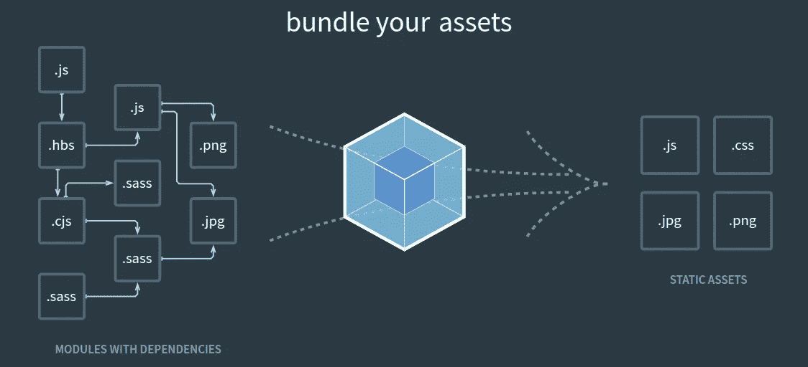

# Webpack 4 —完整指南

> 原文：<https://betterprogramming.pub/webpack-4-the-complete-guide-af1b1e2e3f7a>

## 该模块捆绑器的详细运行


Webpack 是一个模块捆绑器。换句话说，Webpack 接受一堆不同的资源或文件(如 CSS、JS、SASS、JPG、SVG、PNG……)，并将它们组合成包，每种类型一个单独的包。



# Webpack 安装

我们使用 npm 在项目目录中创建一个 *package.json* 文件:

```
npm init
```

然后，我们通过在终端中运行以下命令来安装 webpack:

```
npm install --save-dev webpack webpack-dev-server webpack-cli
```

注意: *save-dev* 将包保存为开发依赖项，- *save* 保存应用程序依赖项它将已安装的包写入 package.json 中的依赖项字段，而 *save-dev* 则写入 devDependencies。

创建 package.json 后，编辑脚本部分以启动 webpack。package.json 文件将如下所示:

```
{
   "name": "projectName", 
   "version": "1.0.0", 
   "private": true, 
   "description": "", 
   "main": "index.js", 
   "scripts": {
      "start" : "webpack"
   }, 
   "keywords": [], 
   "author": "", 
   "license": "ISC", 
   "devDependencies": {
      "webpack": "^4.2.6", 
      "webpack-cli": "^3.2.3"
   }
}
```

现在我们可以使用 *npm start 来启动我们的应用程序。*当应用程序启动时，webpack 将在/ *src* 目录中搜索 *index.js* 。确保在 */src* 目录中有 *index.js* 。Webpack 将 *index.js* 及其依赖项捆绑到一个文件中，该捆绑文件将在 */dist* 目录下创建为 *main.js* 。我们需要将我们的 *main.js* 添加到*index.html。*

Webpack 读取入口点并分析它的依赖项等等。它将入口点及其所有依赖项捆绑到一个文件中。

# 配置 Webpack

Webpack 4 是一个零配置模块捆绑器。它有一组默认值。如果我们想创建一个配置文件，在根目录中添加 *webpack.config.js* 。

## 进入

Webpack 需要一个入口点。我们只是在重新创造我们已经拥有的东西——*/src/index . js*对我们来说没有什么新东西。我们明确地告诉 webpack 在 */src* 目录中查找 index.js。

*Webpack.config.js*

```
module.exports = {
   entry: ‘./src/index.js’
};
```

我们可以有不止一个入口点。我们稍后将讨论这一点。

## 输出

在 Webpack 应该捆绑我们的输出的地方， */dist/main.js，*是默认路径。我们可以重命名输出文件名，并将“filename”放入输出中。路径决定了代码从哪里分离出来。

*Webpack.config.js*

```
**const** path = require(‘path’);
module.exports = {
   entry: ‘./src/index.js’,
   output: {
      path: path.resolve(__dirname, ‘dist’),
      filename: ‘main.js’
   }
};
```

现在编辑 *package.json* 文件中的脚本部分，如下所示:

```
“script” : {
   "start" : "webpack --config webpack.config.js"
}
```

## 方式

模式开发不会缩小输出文件。捆绑的输出文件对于开发来说是可读的。

```
**const** path = require(‘path’);
module.exports = {
   mode: "development",   
   entry: ‘./src/index.js’,
   output: {
      path: path.resolve(__dirname, ‘dist’),
      filename: ‘main.js’
   }
};
```

# 装载机

正如我们已经讨论过的，Webpack 不仅捆绑了 JavaScript 文件，它还捆绑了图像和其他静态文件。加载器是捆绑不同类型文件的关键——你可以在这里看到加载器列表[。](https://webpack.js.org/loaders/)

## CSS 加载程序

我们可以用模块对象中的一组规则定义一个加载器。现在在我们的项目中创建 *main.css* ，并使用该命令安装*风格加载器*和 *css 加载器*:

```
npm install --save-dev style-loader css-loader
```

现在更新 *webpack.config.js* 如下:

```
**const** path = require(‘path’);
module.exports = {
   mode: "development",   
   entry: ‘./src/index.js’,
   output: {
      path: path.resolve(__dirname, ‘dist’),
      filename: ‘main.js’
   },
   module:{
      rules:[
         {
            test: /\.css$/, 
            use: ["style-loader", "css-loader"]}]
   }
};
```

Webpack 从相反方向读取加载程序。它首先执行 *css-loader* ，然后执行 *style-loader* ，其中 *css-loader* 将 css 文件转换成普通的 JavaScript 代码，而 *style-loader* 将样式注入 DOM。

对于 sass，我们需要使用一个 *sass-loader* ，这个 *sass-loader* 需要 *node-sass* 。使用以下命令安装一个 *sass-loader* 。

```
npm install sass-loader node-sass webpack --sav-dev
```

现在用 *sass-loader* 更新 *webpack.config.js* 文件。

```
**const** path = require(‘path’);
module.exports = {
   mode: "development",   
   entry: ‘./src/index.js’,
   output: {
      path: path.resolve(__dirname, ‘dist’),
      filename: ‘main.js’
   },
   module:{
      rules:[
         {
            test: /\.css$/, 
            use: [
               "style-loader", // Injects style into DOM
               "css-loader",   // Turns CSS into JS
               "sass-loader"   // Turns SCSS into CSS
            ]
         }
      ]
   }
};
```

不要忘记将我们的*main.css/main.scss*导入到*index.html*中，并且*main.css/main.scss*中定义的样式将注入到 Html DOM 中。现在我们需要在独立的 CSS 中创建它。

# 缓存破坏和插件

浏览器可以缓存我们的代码，这样每次你做了更改，用户就不能重新下载文件了。在我们的例子中，当代码发生变化时， *main.js* 将会下载。我们可以使用一个特殊的散列函数将文件名改为*main . blabla . js*

下一次我们在代码中不做任何更改的情况下构建时，文件名保持不变:main.balbalabla.js。但是，如果代码中有一个字符发生变化，文件名就会变成 main.vnas28r9ysd.js，浏览器必须再次下载它。

当我们在项目中添加供应商代码时，这非常有用。我们不需要每次都下载供应商代码，因为我们并不总是对供应商文件进行任何更改，并且该文件可以缓存在浏览器中。

```
output : { 
   filename : "main.[contentHash].js"
}
```

现在的问题是如何将这个文件链接到*index.html*中。我们不能预测动态生成的文件名，因为 webpack 会这样做。Webpack 使用插件在 Html 的底部创建脚本标签。

# 插件

插件选项用于以多种方式定制 webpack 构建过程。这里可以看到插件列表[。](https://webpack.js.org/plugins/)

## Html webpack 插件

HtmlWebpackPlugin 简化了 HTML 文件的创建，以服务于您的 webpack 包。这对于在文件名中包含散列的 webpack 包尤其有用，散列会改变每次编译。

```
npm install --save-dev html-webpack-plugin
```

*webpack.config.js*

```
**const** path = require(‘path’);
module.exports = {
   mode: "development",   
   entry: ‘./src/index.js’,
   output: {
      path: path.resolve(__dirname, ‘dist’),
      filename: ‘main.js’
   },
   plugins: [ 
      new HtmlWebpackPlugin()
   ]
};
```

这为我们创建了一个*index.html*文件，并把它放到 dist 目录中，动态生成的 JS 文件包含在 Html 的底部。

*index.html*

```
*<!DOCTYPE html>* **<html>
<head> 
   <meta** charset=”UTF-8"**>
   <title>**Webpack App**</title>
</head>
<body>** <script type=”text/javascript” src=”main.170skb99wrjcb.js”></script>
**</body>
</html>**
```

这个新生成的 Html 文件没有我们的 Html 代码。为此，我们需要提供我们的模板。webpack 配置文件如下所示:

```
**const** path = require(‘path’);
module.exports = {
   mode: "development",   
   entry: ‘./src/index.js’,
   output: {
      path: path.resolve(__dirname, ‘dist’),
      filename: ‘main.js’
   },
   plugins: [ 
      new HtmlWebpackPlugin({ 
         template: './src/index.html'
      })
   ]
};
```

我们使用一个 css 加载器将我们的 css 注入到 DOM 中，实际上，我们需要独立的 css。为此，请使用 mini-css-extract-plugin:

```
npm install mini-css-extract-plugin
```

这个插件将 css 提取到一个单独的文件中。

*webpack.config.js*

```
**const** path = require(‘path’);
module.exports = {
   mode: "development",   
   entry: ‘./src/index.js’,
   output: {
      path: path.resolve(__dirname, ‘dist’),
      filename: ‘main.js’
   },
   module:{
      rules:[
         {
            test: /\.css$/, 
            use: [ 
               MiniCssExtractPlugin.loader,
               "style-loader", // Injects style into DOM
               "css-loader",   // Turns CSS into JS
               "sass-loader"   // Turns SCSS into CSS
            ]
         }
      ]
   },
   plugins: [ 
      new HtmlWebpackPlugin({ 
         template: './src/index.html'
      }), 
      new MiniCssExtractPlugin()
   ]
};
```

新生成的 css 文件会自动注入到 Html 中— `HtmlWebpackPlugin`会处理的。

# 分离代码开发和生产模式

这个模式是 webpack 4 引入的一个参数。我们将把 webpack 配置分为开发模式和生产模式。同时他们也分享了很多常用的东西。因此，我们有三个配置文件:用于共享开发和生产模式的公共文件，第二个用于开发模式，最后一个用于生产模式。

我们不会为 dev 模式构建 dist 目录——web pack-dev-server 将帮助我们从内存中加载文件。我们只需要缩小生产模式代码的最终版本。

再创建两个文件: *webpack.dev.js* 和 *webpack.prod.js.* 将 *webpack.config.js* 重命名为 *webpack.common.js* 。这些名称由您决定—使用您想要的任何名称。

现在，我们安装所需的 npm 软件包:

```
npm install --save-dev webpack-dev-server
```

Webpack-dev-server 提供实时重载。它还提供了对 webpack 资产的快速内存访问。这应该用于开发模式。

```
npm install --save-dev webpack-merge
```

Webpack-merge 提供了一个合并函数，它连接数组并合并对象，从而创建一个新的对象。它再次返回函数中的包装值。

现在我们将开发和生产模式的代码分开。对于常见的配置，我们不需要模式参数和输出。我们也不想为开发模式添加内容哈希。这三个文件的最终版本将如下所示:

*webpack.common.js*

```
const path = require(“path”);
var HtmlWebpackPlugin = require(“html-webpack-plugin”); module.exports = { 
   entry: “./src/index.js”, 
   plugins: [ 
      new HtmlWebpackPlugin({ 
         template: “./src/template.html” 
      }) 
   ], 
   module: { 
      rules: [ 
         { 
            test: /**\.**scss$/, 
            use: [ 
               “style-loader”, // Inject styles into DOM 
               “css-loader”,   // Turns css into commonjs 
               “sass-loader”   // Turns sass into css 
            ] 
         } 
      ] 
   }
};
```

*webpack.dev.js*

```
const path = require(“path”);
const common = require(“./webpack.common”);
const merge = require(“webpack-merge”);module.exports = merge(common, { 
   mode: “development”, 
   output: { 
      filename: “main.js”, 
      path: path.resolve(__dirname, “dist”) 
   }
});
```

*webpack.prod.js*

```
const path = require(“path”);
const common = require(“./webpack.common”);
const merge = require(“webpack-merge”);module.exports = merge(common, { 
   mode: “production”, 
   output: { 
      filename: “main.[contentHash].js”, 
      path: path.resolve(__dirname, “dist”) 
   }
});
```

现在我们必须配置 webpack-dev-server。我们还需要在我们的 *package.json* 上添加开发模式和生产模式。像这样编辑 *package.json* 中的脚本部分:

```
“script” : {
   "start": "webpack-dev-server --config webpack.dev.js --open",
   "build": "webpack --config webpack.prod.js"
}
```

使用`npm start`作为开发模式，使用`npm run`作为生产模式。现在，您可以在构建目录中看到捆绑的生产模式的缩小文件。开发模式的内存更改。*-打开*准备好后会自动打开浏览器窗口。

哎呀，我们需要锯多个入口点！别担心，设置起来并不困难——我们有 bootstrap 之类的供应商脚本。我们需要为 *main.js* 和 *vendor.js* 准备两个独立的包。那么 webpack.common.js 中的入口点将如下所示:

```
module.exports = { 
   entry: {
      main: “./src/index.js”, 
      vendor: "./src/vendor.js"
   }
}
```

我们还必须对输出进行更改，以生成两个不同的包:用于开发和生产模式的配置文件。

*webpack.dev.js*

```
module.exports = merge(common, { 
   mode: “development”, 
   output: { 
      filename: “[name].bundle.js”, 
      path: path.resolve(__dirname, “dist”) 
   }
});
```

*webpack.prod.js*

```
module.exports = merge(common, { 
   mode: “production”, 
   output: { 
      filename: “[name].[contentHash].js”, 
      path: path.resolve(__dirname, “dist”) 
   }
});
```

这会在开发和生产模式下生成两个不同的包。您可以在开发模式下看到包 main.bundle.js 和 vendor.bundle.js。在生产模式下 main.275hsossba83k.js 和 vendor.934jsdpaczl83.js

# 结论

我们还在项目中使用图像和其他类型的资产。为此，我们需要将所需的包添加到 webpack 中，否则您将在 webpack 中看到错误“您可能需要一个合适的加载程序来处理此文件类型”。