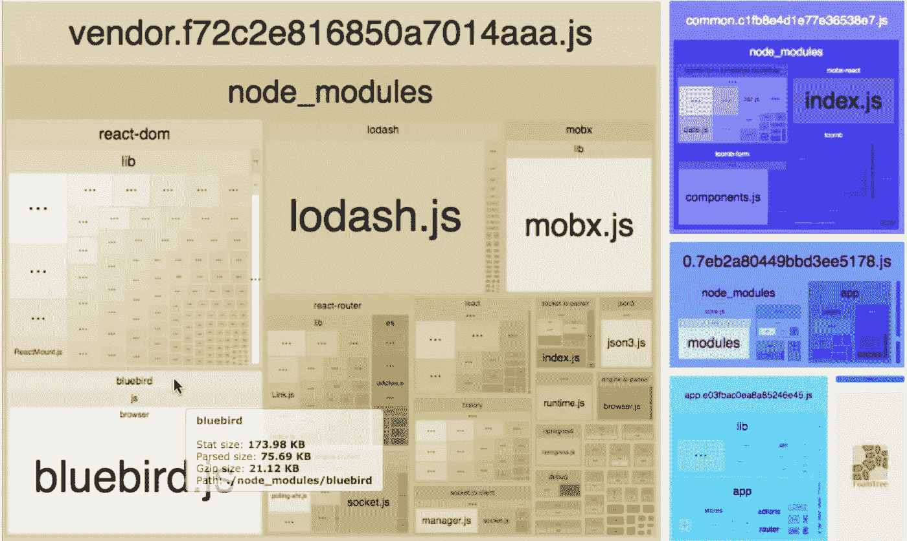

# web pack Essentials—2020 年更新

> 原文：<https://betterprogramming.pub/webpack-essentials-updated-for-2020-4a0aa019ca3>

## webpack 的最新版本


# **什么是 webpack？**

如果你在到达这个页面之前没有 [webpack](https://webpack.js.org) 的知识，让我在几个方面帮助你。这是一个模块捆扎机。它的主要目的是捆绑 JavaScript 文件以便在浏览器中使用，但是它也能够转换、捆绑或打包。您可以使用 webpack 使您的包更有效率。我说的富有成效是什么意思？取决于您项目的需求。以缓存静态数据为例。如果我们不更新文件路径，那么浏览器仍然会为用户提供缓存的资源。

# **散列法**

现在，我们使用 webpack 来构建我们的资源，因为它非常容易使用。所以在 webpack 中出现了散列的概念，它允许我们在新的构建中为每个块生成新的散列。您可以设置一个基本的 webpack 配置来完成以上工作。

哈希:9dsn348s34378y99

版本:webpack 1.10.1

时间:76 毫秒

资产大小块块名称

主要的。9 DSN 348s 34378y 99 . js 1.43 kB 0[已发出] main

供应商。9 DSN 348s 34378y 99 . js 1.43 kB 1[已发出]供应商

[0] ./src/index.js 46 字节{ 0 }[已建立]

[0] ./src/vendor.js 40 字节{ 1 }[已建立]

这个配置实现有什么问题？每次构建时，将使用另一个随机散列重新创建散列 9dsn348s34378y99。为了提高我们的应用程序的性能，我们只能更新以前在开发端更改过的块，这样下次用户在新部署后打开我们的应用程序时，用户就不必再次从服务器下载所有资产。它们应该只获取我们已经对其进行了更改的资源。

Webpack 提供三种类型的散列:

*   混杂
*   `chunkHash`
*   `contentHash`

我将简单解释一下这些散列之间的区别。

## 混杂

哈希对应于构建。在整个构建过程中，每个块都将获得相同的哈希。如果您的构建中有任何变化，相应的散列也会发生变化。

## chunkHash

`chunkhash`是基于 webpack 的入口点。定义的每个条目都有自己的散列。如果这个特定的入口点发生了任何变化，那么只有相应的散列会发生变化。

## 内容哈希

`contenthash`是在`ExtractTextPlugin`中创建的一种特定类型的哈希，通过提取的内容而不是完整的块内容来计算。

# 代码分割

您在 CLI 中看到过这条消息吗？

> *“入口点大小限制警告:以下入口点组合资产大小超过建议限制(244 KiB)。这可能会影响网络性能。”*

如果是，可能您的包大小存在性能问题——web pack 试图告诉您您的包太大了。我们如何继续利用您的应用程序的性能并避免这种警告？分析包的大小是正确的方法。

你需要做的第一件事是测量你的包的大小。我们如何做到这一点？

在陷入一些过早的优化之前，你应该总是衡量一个问题的影响。我们可以在`webpack.config.js`中使用`devtool`来让`[source-map](https://webpack.js.org/configuration/devtool/)`检查我们的 JavaScript 包，然后采取相应的行动，例如:

给你的`package.json`添加一个名为`analyze`的脚本，例如:

然后我们可以运行:

```
npm run build
npm run analyze
```

您可能会看到类似这样的内容:



正如您在 bundle 文件中看到的， [Bluebird](https://www.npmjs.com/package/bluebird) 、 [Lodash](https://lodash.com/) 和 [MobX](https://mobx.js.org/README.html) 是您的应用程序中的重量级组件。这是一个很好的起点，可以检查哪些脚本需要从您的包文件中进行代码拆分，并生成不同的包文件。对你的应用进行代码分割可以帮助你延迟加载用户当前需要的东西，这可以极大地提高你的应用的性能。虽然你没有减少应用程序中的总代码量，但你避免了加载用户可能永远不需要的代码，并减少了初始加载期间所需的代码量。

因为这篇文章是关于 webpack essentials 的，所以我不会深究代码分割。这篇文章仅仅是对 webpack 中有用的东西的一个简单解释，但是我保证我会专门写一篇关于代码分割的文章。

# **开发与生产模式**

webpack 使得部署多个环境(开发、测试和生产)变得更加容易，只需要每个环境特别需要的代码和数据。从 webpack v4 开始，我们可以使用`mode`的功能，它相应地使用了一组内置的配置优化。您可以在 CLI 中将它作为参数传递。

webpack —模式=开发

根据 webpack 官方网站的说法，当您相应地设置选项时，会出现以下情况:

**开发** —将 `DefinePlugin`上的`process.env.NODE_ENV`设置为值`development`。启用`NamedChunksPlugin`和`NamedModulesPlugin`。

**生产** —将`DefinePlugin`上的`process.env.NODE_ENV`设置为值`production`。启用`FlagDependencyUsagePlugin`、`FlagIncludedChunksPlugin`、`ModuleConcatenationPlugin`、`NoEmitOnErrorsPlugin`、`OccurrenceOrderPlugi`、`SideEffectsFlagPlugin`和`TerserPlugin`。

# **网络包树晃动**

树抖动，至少是 webpack 对该特性的实现，在尽可能多地消除不使用的代码方面做得很好。比如淘汰进口但不用的进口。

在上面的例子中，只有`divide`函数被调用。从未使用过`subtract`功能，将在最终包中移除。

即使导入对象中从未被访问过的特定属性也会被删除。

然而，树抖动并不能消除所有未使用的代码。什么被删除，什么不被删除的细节超出了本文的范围，但是应该注意的是，使用树抖动并不能完全解决未使用代码的问题。

## 副作用

副作用是代码在导入时执行一些不一定与任何导出相关的操作。副作用的一个很好的例子是聚合填充物。聚合填充通常不提供在主脚本中使用的导出，而是作为一个整体添加到项目中。

树摇不能自动分辨哪些脚本是副作用，所以手动指定很重要，下面我们会看到。

## 我们如何使用它？

您可以简单地在您的`webpack.config.js`配置文件中设置生产模式，或者使用 CLI 中的参数，正如我上面提到的。在其他优化中，这将启用树抖动。

webpack 是一个强大的工具，可以帮助我们开发更健壮的应用程序。有大量的功能。在这篇文章中，我试图提到最重要的方面，而不深入到任何其他方面。

可靠消息来源:[https://webpack.js.org/](https://webpack.js.org/)