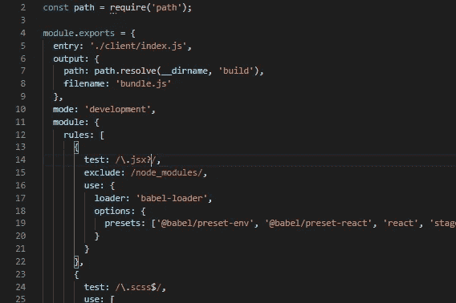

# Webpack 的小秘密

> 原文：<https://betterprogramming.pub/webpacks-little-secret-f4b55f6baf8c>

## 介绍 auxpack

网络包

[Webpack](https://webpack.js.org/) 是……很多。

它非常健壮，捆绑我们的项目需要*吨*……非常多。因为 Webpack 非常庞大，所以它可能是构建项目的一个令人望而生畏且可能令人困惑的部分。

在我们进入 Webpack 做什么以及我们如何充分利用它之前，让我们首先快速回顾一下为什么我们首先要捆绑项目。

简而言之，捆绑我们的项目使得更大的模块化代码库成为可能。

例如，如果我们有一个 JavaScript 文件调用一个单独的。js 文件，我们需要将这些脚本以正确的顺序插入到我们的 HTML 文件中。

将这一点推广到有几十个脚本或外部编写的模块的大型项目中，就很容易理解为什么捆绑是必要的了。

还需要将 React、 [Vue](https://vuejs.org/) 或 Angular 等框架(*和库*)中编写的代码转换成普通的 JavaScript，供浏览器阅读。

输入 Webpack。正如我们已经提到的，它做了很多。在 Webpack 看似无限的深度中，它管理大量外部工具，不仅将模块化代码捆绑到我们 HTML 的单个脚本中，而且还将我们的 React JSX(或其他框架代码，我没有偏见)进行转换。

这是一个打包和传输的一站式商店，除了其他有用的工具，如 uglify 和 minify，使我们的包文件尽可能轻量级。

这并不是说它在自己的领域里独树一帜；在捆绑项目时有几个选择，但凭借惊人的 900 万周下载量，Webpack 显然是领先者。

它的同行包括周下载量为 28，000 次的[包](https://parceljs.org/)，以及周下载量约为 100 万次的[卷](https://github.com/rollup)。注意:当我在 2019 年底写这篇文章时，这些统计数据来自 [npm](https://www.npmjs.com/) 。

可以肯定地说，Webpack 是某种行业标准，这说明了它为开发人员提供了什么。它还会定期维护和更新，确保一致的性能和工具。

示例 webpack.config.js

所以，Webpack 相当棒，有什么意义呢？……你可能会问。好吧，一般的开发者并不是 Webpack 专家。相信我，在写这篇文章之前，我调查了大约 20 个同行。

使用 Webpack 需要一个经常令人困惑的`webpack.config.js`配置文件，并且所有的工作都在幕后进行。为什么这是一个问题？

假设你已经把你的项目打包成一个透明的、缩小的、丑陋的`bundle.js`文件。你如何确定它发挥了真正的优化潜力？

也许文件很重，也许花了一些时间来构建，也许你的项目中有一些东西可能被禁止。一个人如何知道事情可以改进的地方？

对于创建简单 SPA(单页应用程序)的较小的开发人员来说，这可能不是重要的信息，但是对于较大的项目，或者对于希望节省运行构建的时间，或者确保部署最有效的捆绑包版本的公司来说，这可能是有用的。

实际上，web pack*确实提供了这些信息，只是不太容易获取。幸运的是，可以安装一些工具来简单地检索一些构建数据。*

*[Auxpack](https://github.com/Auxpack/Auxpack) 是一个轻量级仪表板，可以很容易地 [npm 安装](https://www.npmjs.com/package/auxpack)并放入你的`webpack.config.js`。*

*这个最小配置就绪后，每次运行构建时，auxpack 仪表板都会弹出，显示在 Webpack 构建过程中收集的更有用的统计信息。*

*虽然这对于较小的应用程序来说似乎微不足道，但我鼓励更小的开发人员看看这些统计数据。监视构建空间的使用情况是很有用的。*

*除了 Dashboard，Webpack 生成的隐藏信息是许多开发人员没有意识到的另一个强大的资产。*

*Webpack 效用的深度还有待观察，但是通过对这些统计数据的一点额外关注，我们有望实现一个更优化、更明智的构建过程。*

*PS。auxpack 是一个开源项目，因此任何人都可以查看代码库并提出改进请求。*