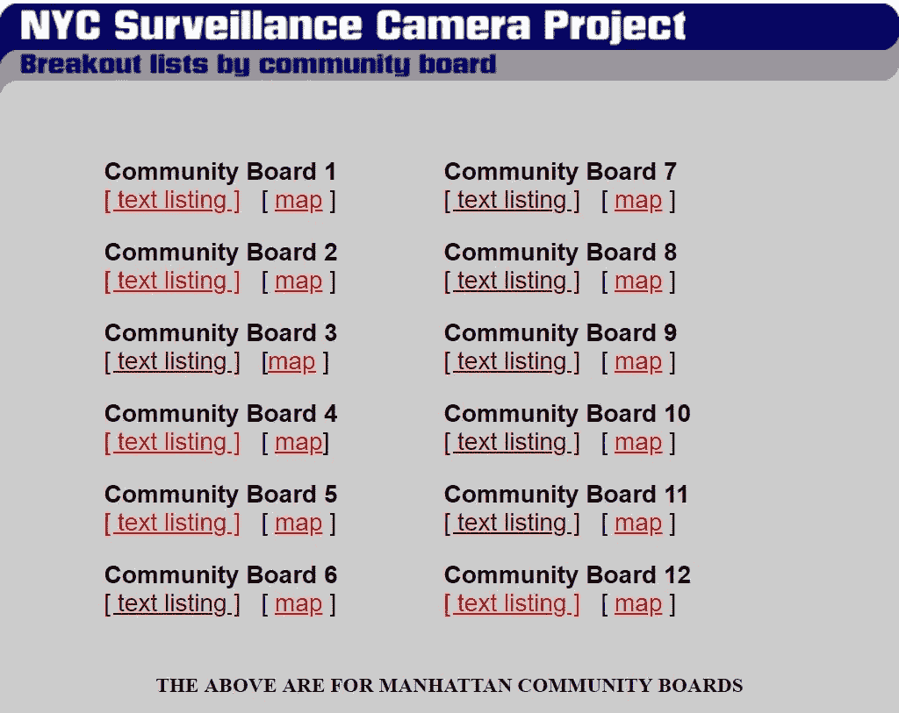

# 用蟒蛇皮刮网，汤很美

> 原文：<https://betterprogramming.pub/webscraping-in-python-with-beautiful-soup-part-1-into-the-miso-soup-5115ff34192f>

## 第一部分——加入味噌汤


Siarhei Horbach 在 [Unsplash](https://unsplash.com/search/photos/security-camera?utm_source=unsplash&utm_medium=referral&utm_content=creditCopyText) 上拍摄的照片

关于数据分析和数据科学，我最喜欢的事情之一是，只要有数据要分析，人们使用它的工具集就可以研究几乎任何领域或问题。虽然有大量的数据集可供探索，但经常会出现这样的情况，即您想要研究的主题还没有现成的数据集，或者数据无法以可用的格式访问。这就是网络抓取派上用场的地方。简而言之，网络抓取是从网站提取数据的过程，通常是为了编译数据并将其存储在本地数据库中。网络抓取是你工具包中的一个很好的工具，因为它本质上使你能够创建你自己的关于任何你能在网上找到信息的主题的数据集。

虽然网络抓取本身提出了一些道德和法律问题，但我的观点是，如果一个网站上有公开可用的数据，我可以手动访问和记录这些数据以编译数据集，那么我通过抓取该网站所做的一切就是使用代码来自动完成我原本可以手动完成的任务。然而，我应该提到，检查一个网站的 robot.txt，看看他们是否允许网络抓取，通常是一个好主意。

在最近的一个分析项目中，我在研究[纽约市监控摄像头项目](http://www.mediaeater.com/cameras/locations.html)的工作，这是一个从 20 世纪 90 年代末到 21 世纪初的公民测绘项目，通过收集全市社区委员会中视频监控摄像头的位置，提高了人们对纽约市越来越多的监控基础设施的认识。



我感兴趣的是搜集所有已识别的摄像机的位置，以便创建一个截至 2006 年曼哈顿所有摄像机位置的地图。点击其中一个*文本列表*链接，会出现一个如下所示的页面:


如你所见，摄像机位置的格式通常非常相似。位置要么以十字路口(州街和大桥街)的形式给出，要么以街区面(州街和白厅街之间的大桥街)的形式给出。其后是冒号(:)、摄像机数量，然后是下一行的具体位置信息。

现在我知道了我要找的信息存储在网站上的什么地方，以及这些信息的一般格式，我只需要写一些代码来自动执行转到每个社区公告板的`text_listing`链接并提取每个摄像机位置的过程。

对于这个任务，我将导入`pandas` 和`numpy`(三个常见的嫌疑对象中的两个)，以及`requests`和`BeautifulSoup`，这两个 Python 库用于访问网站和解析 HTML。

然后，要使用`requests`库，我需要提供一个到网站的链接。在这里，我将链接分成两部分:`url`和`locations`。这种拆分的原因稍后会变得更清楚，但我决定以这种方式拆分链接，以便稍后当我希望访问网站上的其他页面时重用`url`。

接下来，我可以通过对从`requests`调用返回的内容调用`BeautifulSoup`来使用`BeautifulSoup`解析 HTML。

```
soup = BeautifulSoup(res.content, ‘lxml’)
```

`soup`对象现在包含了第一个网页的所有 HTML:

不太漂亮的汤

这里的部分挑战是识别你要寻找的信息存储在 HTML 的什么地方。虽然有一些方法可以加快这个过程，比如右键单击页面并选择 *Inspect* 来识别引用特定元素的 HTML 部分，但是我发现自己浏览一些 HTML 对于理解我在做什么是一个有用的练习。

向下滚动到 HTML 中的第 20 行，我可以看到每个社区公告板有两行，如下所示:

```
<b>Community Board 1</b><br/>
<a href="info/cb-01.html">[ text listing ]</a>   [ <a href="maps/nyc.pdf">map</a> ]<p>
```

由于我要寻找的位置信息存储在每个社区板的信息页面上，我想检查(超链接)部分并提取`href`(指定链接目的地的属性)。在这个例子中，我想要的`href`是`info/cb-01.html`，它是社区公告板信息页面的 URL 结尾。

为了访问我正在寻找的 HTML 部分，我可以使用 BeautifulSoup 的`.*find()*`方法来搜索一个标签和我想要指定的任何附加属性；这将返回 HTML 中标记的第一个实例(具有指定的属性)。在这种情况下，我可以看到有一个包含所有社区板`hrefs`的`table`部分，从第 16 行开始，到第 51 行结束。然而，如果我尝试使用`soup.find(“table”)`，那么将返回从第 7 行开始的表，一个包含我尝试引用的表的更大的表。我仍然可以通过这种方式获得信息，但是通过更具体地查询，我可以让`find`只返回我正在寻找的表。因为我可以看到我想要的表有一个等于 450 的`width`属性，而较大的表有一个 585 的`width`，所以我可以使用`soup.find(‘table’, attrs = {‘width’:”450"})`。这将返回:

正是我想要的部分。我将把它保存为`cb_table`，这样我现在可以只在那个部分中搜索，而不是整个`soup`对象。所以我写道:

`cb_table = soup.find(‘table’, attrs = {‘width’:”450"})`

现在我可以使用 BeautifulSoup 的`find_all()`方法来搜索一个 HTML 标签并返回所有匹配的标签对象。因为我想要所有的超链接，所以我可以使用`.find_all(‘a’)`。所以现在行`cb_table.find_all(‘a’)`返回:

我将把它保存为`cb_links`,因为这是我在这一点上需要引用的该页面的唯一部分。现在`cb_links`是一个漂亮的组`ResultSet`，一个行为很像列表的对象。为了了解如何访问这个`ResultSet`中的`hrefs`，我可以尝试用`cb_links[0]`访问第一个元素。这将返回:

```
<a href="info/cb-01.html">[ text listing ]</a>
```

这是一个漂亮的 Soup `Tag`对象，所以我可以使用`cb_links[0].attrs`返回标签属性的字典，而`cb_links[0].text`将返回为那个`Tag`存储的文本。由于我需要`href`信息，我可以使用`cb_links[0].attrs[‘href’]`返回`info/cb-01.html`，但是由于`cb_links`中有两种类型的`a`标签，我想使用为信息`hrefs`存储的文本作为识别这些标签的方法。我可以在`cb_links`中看到，所有的信息`hrefs`都有相同的文本`[ text listing ]`，因此我可以编写一个 for 循环来遍历 *cb_links* 以检查文本是否等于`[ text listing ]`，如果相等则返回`href`。对于这样的简单循环，我更喜欢使用列表理解，所以下面的代码行将完成这个任务:

`cb_hrefs = [link.attrs[‘href’] for link in cb_links if link.text == ‘[ text listing ]’]`

现在，我有了一个列表，其中仅列出了社区公告板信息页面的 URL 结尾，如下所示:

```
['info/cb-01.html',
 'info/cb-02.html',
 'info/cb-03.html',
 'info/cb-04.html',
 'info/cb-05.html',
 'info/cb-06.html',
 'info/cb-07.html',
 'info/cb-08.html',
 'info/cb-09.html',
 'info/cb-10.html',
 'info/cb-11.html',
 'info/cb-12.html']
```

不错！现在，类似于我如何将`locations.html`追加到原始 URL、`[http://www.mediaeater.com/cameras/](http://www.mediaeater.com/cameras/,)`、[、](http://www.mediaeater.com/cameras/,)中，我可以将这些`hrefs`追加到原始 URL 中以访问信息页面，并重复我在开始时使用 requests 和 BeautifulSoup 来访问每个社区板的信息页面的过程。

在第一个`href`上测试这个过程，我可以看到信息页面的结构:

> `test_url = url+cb_hrefs[0]
> res = requests.get(test_url)
> soup = BeautifulSoup(res.content, ‘lxml’)`

现在 HTML soup 明显更长了(大约 579 行)，所以我不会在这里展示它，但是正如我必须浏览上一个 HTML soup 来找到我想要的信息一样，我可以浏览这个 HTML 来找到相机位置存储在哪里。

由于这篇文章有点长，我将在这里把它剪掉，在我的下一篇文章中继续剖析这个网站。我将通过类似的过程从第一页中提取摄像机位置，然后我将概括我的方法，这样我可以编写一个 for 循环来在所有社区公告板信息页面上执行相同的过程。敬请关注。