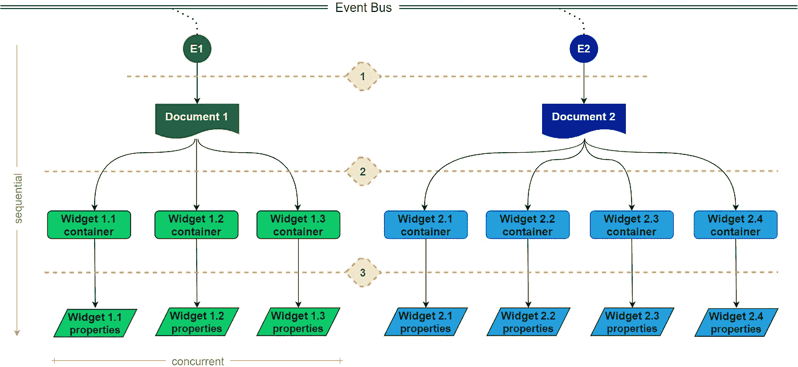
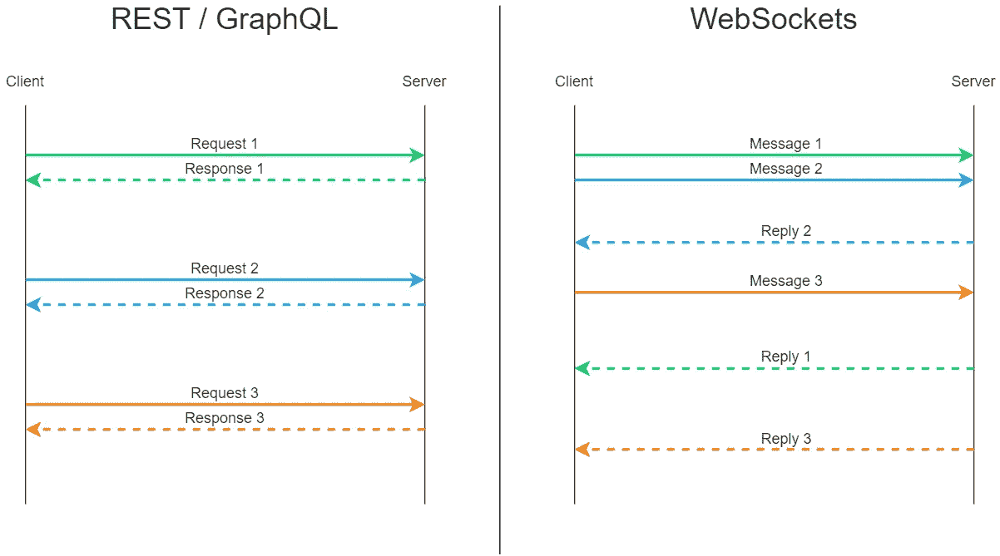

# WebSockets 和 AsyncIO:超越 5 行示例(第 1 部分)

> 原文：<https://betterprogramming.pub/websockets-and-asyncio-beyond-5-line-samples-part-1-ddf8699a18ce>

## 关于 Python 异步并发编程的思考

在 [Unsplash](https://unsplash.com/s/photos/software-development?utm_source=unsplash&utm_medium=referral&utm_content=creditCopyText) 上[海拉戈斯蒂奇](https://unsplash.com/@heylagostechie?utm_source=unsplash&utm_medium=referral&utm_content=creditCopyText)的照片

我的团队最近被分配了一项任务，包括编写一个 Python 客户端来与特定的 WebSockets API 进行交互。它让我们学习新的东西，这篇文章的目标是分享我们的进步。我们相信总有改进的空间，所以请随时发表评论，并提出您的专业意见。

当我们说“超越 5 行样本”时，我们的意思是我们在与同事交谈和搜索互联网时找到了指南，但我们错过了将相关技术、设计技巧、编程库和质量保证问题结合在一起的参考资料。我将在接下来的章节中解决这些问题。

这篇文章分为两部分。这是介绍部分。在这里，我总结了一些相关的 WebSocket 方面，以及它们如何通过`websockets`库适应 Python。在第二部分中，我将注意力转移到异步和并发编程上，更深入地探索`asyncio`内置库。

技术讨论发生在一个虚构的用例之上，引导我涵盖上述主题。

# 工作范围

让我从虚构的用例提案开始:自动检查公司级文档，例如演示幻灯片或 BI 仪表板，以进行进一步的法规遵从性分析。它类似于我的团队曾经工作过的那个。

您可以将合规性分析视为检查哪些数据源用于填充构成文档的图表和表格。在此基础上，可以使用算法根据文件给个人数据暴露带来的风险对文件进行评分，这符合 GDPR 和 CCPA 等监管计划。

研究评分算法看起来很酷，但在这里我们将专注于前一步:提取为它们提供信息。这将帮助我们建立一个工作范围，以及编写和测试一些客户端代码。

***旁注*** *:在激发本文的实际挑战中，使用 WebSockets API 是获得详细文档信息的唯一方法。我们已经用它进行了阅读操作；但是，API 也支持编程文档的创建和维护，例如添加/删除组件和刷新演示数据。同时，它允许前端开发人员构建 ui，为用户提供生动的体验。虽然没有充分利用 WebSockets 的全部功能，但是所提议的文档检查用例足以展示本文所涵盖的概念。*

任意事件会启动工作负载。由`E1`和`E2`表示的这些事件带来要检查的文档的标识符。在这个场景中，文档由更小的组件组成，正式名称为[图形小部件](https://en.wikipedia.org/wiki/Graphical_widget)。检查它们包括多个步骤:

1.  发送 WebSocket 消息以获取一般文档信息。
2.  发送 *n* 消息来获取详细的小部件容器信息——它们的布局、位置，更重要的是嵌套的小部件标识符。
3.  最后，发送 *n* 消息来获取特定于小部件的属性，比如类型(图表、表格还是标签？)、调色板、字体大小，以及实际上给当前用例带来价值的东西:底层数据库连接、电子表格链接和 SQL 语句。

你可以在下图中看到工作流程。阅读时，请记住垂直箭头表示顺序处理，而水平方框表示并发。

图一。虚构的“自动文件检查”工作流程

从步骤 2 开始，我们可以利用并发性来获取信息并减少文档检查时间。一旦第一步完成，小部件容器的 id 就已知了，我们可以使用它们同时构建后续(也称为后续)消息。

为了简单起见，事件处理本身不在讨论范围之内。因此，总而言之，我们需要这样的代码:给定一个文档的 ID，以数组的形式返回其可视组件的详细信息。

# 技术背景

## WebSockets

在加入这个项目之前，我们已经使用过 REST 和 GraphQL APIs。我们也听说过 WebSockets，但并没有与之合作。

> WebSocket 通过单个 TCP 连接提供全双工通信通道。它支持客户端应用程序和 web 服务器之间的交互，开销比 HTTP 轮询等半双工方式更低，有助于服务器之间的实时数据传输。
> 
> [—维基百科](https://en.wikipedia.org/wiki/WebSocket)

记住这些基本的描述，是时候寻找一个 Python 库来连接 API 了。我们已经使用了`requests`库来处理 REST 和 GraphQL，但是它不能处理 WebSockets。

## Python 库

可用的不止一个，我们选择了[a Augustin](https://github.com/aaugustin)/[web sockets](https://github.com/aaugustin/websockets)，因为:

*   使用起来相当简单。
*   它建立在 Python 的标准异步 I/O 框架`asyncio`之上。
*   它的 GitHub 库比“竞争对手”有更多的明星，比如[web socket-client](https://github.com/websocket-client)/[web socket-client](https://github.com/websocket-client/websocket-client)，这暗示了一种社区偏好。

切记`websockets`库要求 Python ≥ 3.6.1。这对我们来说不是问题，因为该项目还有其他依赖项需要相同的次要版本。相反，`websocket-client`适用于旧版本——根据他们的文档，它是在 Python 2.7 和 Python 3.4+上测试的。看起来 Python 3 的支持仍在进行中。

# 数据交换规范

WebSocket 消息可以携带文本数据、二进制数据和[控制帧](https://tools.ietf.org/html/rfc6455#section-5.5)。

> 控制帧不是用于承载应用的数据，而是用于协议级的信令，例如发出应该关闭连接的信号。
> 
> [—](https://en.wikipedia.org/wiki/WebSocket)[web socket 协议](https://tools.ietf.org/html/rfc6455#section-1.2)

我不打算讨论控制框架的细节，因为它们是由`websockets`库内部处理的。另一方面，这取决于服务器和客户机是否同意它们用来交换数据的标准。这是本节的目的。

JSON 和 [STOMP](https://stomp.github.io/) 似乎是文本数据交换最常用的格式。为了简单起见，我将使用前者，它被广泛使用，当然也更广为人知。

让我们假设服务器指定了一个简化的模式来处理虚构用例的所有传入消息:

**代码片段 1。** JSON 模式用于处理所有服务器传入的消息

然后，为了请求一般的文档信息(检查工作流的步骤 1 ),客户端需要以这种方式完成传出消息:

**代码片段 2。**获取一般文档信息的 JSON 示例

要询问小部件容器信息(步骤 2):

**代码片段 3。**获取小部件容器信息的 JSON 示例

诸如此类。我希望我已经通过例子解释清楚了服务器传入消息模式，而不是一个正式的模式！

您可能注意到我没有在 WebSockets 通信范围内使用请求/响应。这是为了避免与 REST 或 GraphQL 请求/响应混淆。由于 WebSockets 提供了用于多种目的的双工通信通道，并且消息可以在各种环境中来来去去，因此将它们称为传出/传入消息，甚至消息/回复更有意义。

无论是在我用作参考的实际用例中，还是在虚构的用例中，客户端都希望收到对发送的每条数据消息的回复。这就是我们在每条消息上包含一个`id`字段的原因。WebSocket 协议本身并不保证每条消息都有回复。偶尔的回复也不会按照服务器接收相关消息的顺序出现。因此，在消息中包含一个`id`是服务器和客户机之间实现简单消息/回复跟踪机制的又一个协议。

也就是说，带有`id = 1`的`GetDocument`消息可以回复如下:

**代码片段 4。**带有一般文档信息的 JSON 示例

在继续下一步之前，您必须了解:

*   我们的目标是连接到一个指定 JSON 作为数据交换格式的 WebSocket 服务器。
*   WebSocket 连接通常使用单个 URI，例如`wss://documents.example.com` — [查询字符串和请求头](https://tools.ietf.org/html/rfc6455#section-3)在建立连接时有效。
*   所有通信参数，包括方法和输入参数，都通过消息体发送。

# 空谈是廉价的——给我看看代码

是时候看看 Python 的东西了！完整示例可在 [GitHub](https://github.com/ricardolsmendes/websockets-asyncio/blob/main/document_inspector.py) 上找到。

让我们从`websockets`库使用开始浏览吧。如前所述，这个库使得实例化客户端以及通过双工通道发送和接收消息变得非常简单。

下面的代码片段总结了如何使用它:

**代码片段 5。** Python websockets 库的简单用法

你会在[完整示例](https://github.com/ricardolsmendes/websockets-asyncio/blob/main/document_inspector.py)中找到类似的陈述。

请注意，消息和回复是分开处理的。如果您使用过 REST 或 GraphQL API，您会知道这是一种不同的行为。REST 和 GraphQL 使用 HTTP，所以我们在发送请求后会立即得到响应。当使用 WebSockets 时，你可以发送 *n* 条消息，等一会儿，然后接收回复——或者不接收。这幅图说明了我的意思:

图二。REST/GraphQL 和 WebSockets 比较

# 下一步是什么？

并发任务帮助我们处理 WebSocket 异步通信通道中的消息和回复，尽管存在复杂性权衡。因此，在文章的第二部分[中，它们与`asyncio`一起被详细地覆盖。](https://medium.com/better-programming/a-deeper-look-at-async-and-concurrent-programming-in-python-9f2a84adbdd2)

感谢您读到这里！

# 参考

*   WebSocket 协议:[https://tools.ietf.org/html/rfc6455](https://tools.ietf.org/html/rfc6455)
*   WebSocket |现代 JavaScript 教程:[https://javascript.info/websocket](https://javascript.info/websocket)