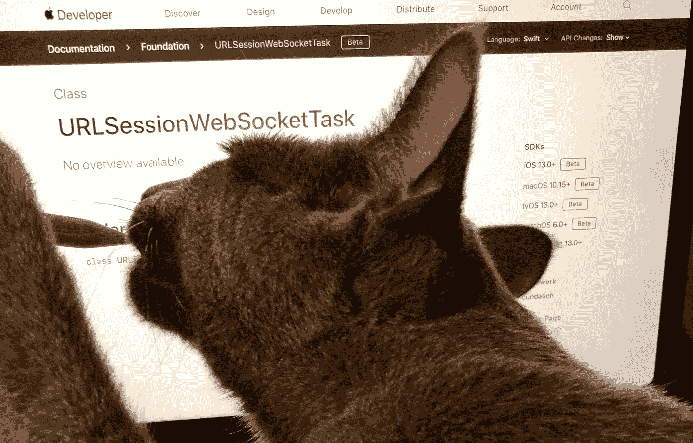

# iOS 13 中使用 Swift 和 Xcode 11 的 Websockets

> 原文：<https://betterprogramming.pub/websockets-in-ios-13-using-swift-and-xcode-11-18fa3000d802>

## 苹果终于将 Websockets 作为一等公民加入了它的平台



iOS 13、macOS 10.15、tvOS 13、watchOS 6、Mac Catalyst 中的 Websockets 在网络栈中获得了一等公民地位。苹果终于为他们的平台在 [URLSession](https://developer.apple.com/documentation/foundation/urlsessionwebsockettask) 和 [Network.framework](https://developer.apple.com/documentation/network/nwprotocolwebsocket) 中增加了对低层的支持。

这一次我们将关注使用 URLSession 功能实现 Websockets。

# iOS 13 之前

以前，如果你想在苹果平台上使用 Websockets，你必须依赖于 iOS 2.0 中添加的 [CFNetwork](https://developer.apple.com/documentation/cfnetwork) 。这是使用基于 C 的基础流。然后你必须处理指针和内存分配问题，这在 C 语言中很常见。

另一种方法是使用第三方解决方案，如[红蜘蛛](https://github.com/daltoniam/Starscream)，我在之前已经[描述过了。](https://kristaps.me/websockets-swift/)

# 使用 URLSession 的 Websockets

以下是使用由 [URLSession](https://developer.apple.com/documentation/foundation/urlsession) 提供的[URLSessionWebSocketTask](https://developer.apple.com/documentation/foundation/urlsessionwebsockettask)类构建 Websocket 的三种方法:

```
func webSocketTask(with: URL) -> URLSessionWebSocketTask
func webSocketTask(with: URLRequest) -> URLSessionWebSocketTask
func webSocketTask(with: URL, protocols: [String]) -> URLSessionWebSocketTask
```

# 打开连接

要创建和打开 Websocket 连接:

```
let urlSession = URLSession(configuration: .default)
let webSocketTask = urlSession.webSocketTask(with: "wss://echo.websocket.org")
webSocketTask.resume()
```

# 发送消息

建立连接后，您可以使用[urlsessionwebsockettask . send](https://developer.apple.com/documentation/foundation/urlsessionwebsockettask/3281790-send)功能发送`Data`或`String`消息。您需要用 [URLSessionWebSocketTask 构造一个消息。消息](https://developer.apple.com/documentation/foundation/urlsessionwebsockettask/message)枚举类型。

```
let message = URLSessionWebSocketTask.Message.string("Hello World")   
webSocketTask.send(message) { error in
  if let error = error {
    print("WebSocket couldn’t send message because: \(error)")
  }
}
```

# 接收消息

要从服务器接收消息，您需要使用[urlsessionwebsockettask . receive](https://developer.apple.com/documentation/foundation/urlsessionwebsockettask/3281789-receive)方法。它接受完成处理程序，该处理程序是[消息](https://developer.apple.com/documentation/foundation/urlsessionwebsockettask/message)类型的[结果](https://developer.apple.com/documentation/swift/result)。

```
webSocketTask.receive { result in
  switch result {
  case .failure(let error):
    print("Error in receiving message: \(error)")
  case .success(let message):
    switch message {
    case .string(let text):
      print("Received string: \(text)")
    case .data(let data):
      print("Received data: \(data)")
    }
  }
}
```

请注意，如果您想连续接收消息，您需要在接收完消息后再次调用此函数。一种方法是将它包装在一个函数中，递归地调用同一个函数。

```
func receiveMessage() {
  webSocketTask.receive { result in
    switch result {
    case .failure(let error):
      print("Error in receiving message: \(error)")
    case .success(let message):
      switch message {
      case .string(let text):
        print("Received string: \(text)")
      case .data(let data):
        print("Received data: \(data)")
      }

      self.receiveMessage()
    }
  }
}
```

# Pings 和 Pongs

要保持与服务器的连接，最好间隔一段时间发送 PING 消息。你可以用[urlsessionwebsockettask . send ping](https://developer.apple.com/documentation/foundation/urlsessionwebsockettask/3181206-sendping)函数来实现。

```
func sendPing() {
  webSocketTask.sendPing { (error) in
    if let error = error {
      print("Sending PING failed: \(error)")
    }

    DispatchQueue.main.asyncAfter(deadline: .now() + 10) {
      self.sendPing()
    }
  }
}
```

同样，您需要负责发送给您自己的下一个 PING。最简单的方法是只使用`DispatchQueue`或`Timer`功能。

# 紧密联系

一旦你完成并想要关闭 Websocket 连接，你需要发送一个关闭代码，这是一个 [URLSessionWebSocketTask。CloseCode](https://developer.apple.com/documentation/foundation/urlsessionwebsockettask/closecode) 枚举类型。

```
webSocketTask.cancel(closeCode: .goingAway, reason: nil)
```

# 正在检查连接状态

要监控连接状态，您可以使用[URLSessionWebSocketDelegate](https://developer.apple.com/documentation/foundation/urlsessionwebsocketdelegate)协议。您可以在连接打开或关闭后进行检查。

```
/// connection disconnected
func urlSession(_ session: URLSession,
  webSocketTask: URLSessionWebSocketTask,
  didCloseWith
  closeCode: URLSessionWebSocketTask.CloseCode,
  reason: Data?)// connection established
func urlSession(_ session: URLSession,
  webSocketTask: URLSessionWebSocketTask,
  didOpenWithProtocol protocol: String?)
```

# TL；速度三角形定位法(dead reckoning)

苹果终于将 Websockets 作为一等公民加入了它的平台。当然，还有一些小问题和不完善的地方——例如，您不能连续接收消息——但是您不需要再去构建 Websocket 框架了，这是一个巨大的胜利。

目前，它只适用于最新的测试版，如果你支持旧版本的 iOS、tvOS、watchOS 或 macOS，你需要考虑向后兼容性。

# 链接

*   [URLsession 文档](https://developer.apple.com/documentation/foundation)
*   [URLSessionWebSocketTask 文档](https://developer.apple.com/documentation/foundation/urlsessionwebsockettask)
*   [URLSessionWebSocketDelegate 文档](https://developer.apple.com/documentation/foundation/urlsessionwebsocketdelegate)
*   [由应用程序发布的博客](https://appspector.com/blog/websockets-in-ios-using-urlsessionwebsockettask)
*   [我之前关于使用 Websockets 的博文](https://kristaps.me/websockets-swift/)