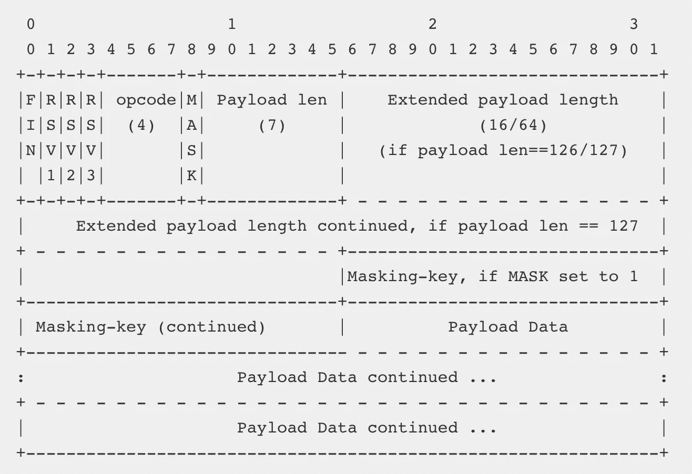

# 使用 Swift 的 iOS 中的 WebSockets

> 原文：<https://betterprogramming.pub/websockets-in-ios-using-swift-a176791e139f>

## WebSockets 允许极快的双向网络通信


由[克里斯托弗·高尔](https://unsplash.com/@cgower?utm_source=unsplash&utm_medium=referral&utm_content=creditCopyText)在 [Unsplash](https://unsplash.com/search/photos/computer?utm_source=unsplash&utm_medium=referral&utm_content=creditCopyText) 上拍摄的照片

WebSockets 允许极快的双向网络通信，这让您可以更快、更频繁地发送和接收更新，更不用说安全了。

WebSocket 是一种使用套接字的通信协议，通过单个 TCP 连接提供双工通信。它在 2011 年由 IETF 标准化，是一种不同于 HTTP 的协议。

WebSockets 广泛应用于聊天应用、流式实时通知和股票价格。

# WebSocket 生命周期

## 与服务器握手

[握手](https://tools.ietf.org/html/rfc6455#section-4)应用是 WebSockets 中的 web 部件。它是从 HTTP 到 WebSocket 的桥梁。客户端发送一个非常标准的 HTTP `GET` [请求](https://tools.ietf.org/html/rfc6455#section-4.2.1)给服务器:

```
GET /chat HTTP/1.1
Host: example.com:8000
Upgrade: websocket
Connection: Upgrade
Sec-WebSocket-Key: dGhlIHNhbXBsZSBub25jZQ==
Sec-WebSocket-Version: 1
```

这里最有意思的是`Sec-WebSocket-Key`，出于安全考虑需要，按照 [WebSocket 标准](http://tools.ietf.org/html/rfc6455#page-7)生成。

服务器验证请求，如果一切正常，就发回一个 HTTP [响应](https://tools.ietf.org/html/rfc6455#section-4.2.2):

```
HTTP/1.1 101 Switching Protocols
Upgrade: websocket
Connection: Upgrade
Sec-WebSocket-Accept: s3pPLMBiTxaQ9kYGzzhZRbK+xOo=
```

## 交换信息

在任何时候，服务器或客户端都可以发送遵循以下特定格式的数据:



WebSocket 帧格式

我不会详细介绍每一部分，但是您可以在[标准](https://tools.ietf.org/html/rfc6455#section-5.6)中找到更多信息。

## Pings 和 pongs

在任何时候，客户端或服务器都可以发送一个 [ping](https://tools.ietf.org/html/rfc6455#section-5.5.2) ，而另一方必须发回一个 [pong](https://tools.ietf.org/html/rfc6455#section-5.5.3) 。

## 关闭

任何一方都可以通过发送[指定的控制序列](https://tools.ietf.org/html/rfc6455#section-5.5.1)来关闭连接。

# 在 iOS 中实现 WebSockets

在 iOS、macOS、tvOS 或 watchOS 中实现 WebSockets 并非易事。新的 [Network.framework](https://developer.apple.com/documentation/network) 可以简化这一点，但你仍然需要处理底层任务，比如升级连接和建立 WebSocket 框架。

# 红蜘蛛

Swift WebSocket 客户端库 [Startscream](https://github.com/daltoniam/Starscream) 简化了所有繁重的任务。安装库并将其导入任何 Swift 文件。

```
import Starscream
```

# 创建连接

之后，创建一个连接并设置代理。

```
let url = URl(string: "ws://echo.websocket.org")!
  let request = URLRequest(url: url)
  let websocket = WebSocket(request: request)
```

# 设置委托

然后，我们需要设置 delegate 并使用 event `WebSocketEvent`类型实现`didReceive`方法。

```
func didReceive(event: WebSocketEvent, client: WebSocket) {
    switch event {
    case .connected(let headers):
      print("connected \(headers)")
    case .disconnected(let reason, let closeCode):
      print("disconnected \(reason) \(closeCode)")
    case .text(let text):
      print("received text: \(text)")
    case .binary(let data):
      print("received data: \(data)")
    case .pong(let pongData):
      print("received pong: \(pongData)")
    case .ping(let pingData):
      print("received ping: \(pingData)")
    case .error(let error):
      print("error \(error)")
    case .viabilityChanged:
      print("viabilityChanged")
    case .reconnectSuggested:
      print("reconnectSuggested")
    case .cancelled:
      print("cancelled")
    }
  }
```

一旦完成，我们就可以开始连接了。握手和升级连接由库在幕后完成。

```
socket.connect();
```

# 发送数据

发送数据有几种方式:

*   二进制的
*   线
*   砰
*   恶臭

最简单的方法是只发送一个字符串:

```
socket.write(string: "Hi Server!")
```

# 关闭连接

在任何时候，如果不再需要，我们都可以选中关闭它。

```
websocket.disconnect(closeCode: CloseCode.goingAway.rawValue)
```

# TL；速度三角形定位法(dead reckoning)

WebSocket 在 iOS、macOS、tvOS、watchOS 都不是一等公民。实施、使用和理解它可能会非常困难，但 Swift library 红蜘蛛可以帮助您完成所有这些任务。

# 链接

*   [web socket 协议](https://tools.ietf.org/html/rfc6455)
*   [编写 WebSocket 服务器](https://developer.mozilla.org/en-US/docs/Web/API/WebSockets_API/Writing_WebSocket_servers)
*   [红蜘蛛 Swift WebSocket 库](https://github.com/daltoniam/Starscream)
*   [Swift 中的 Websocket 框架实施](https://github.com/ZewoGraveyard/WebSocket/blob/master/Sources/WebSocket/Frame.swift)
*   [WebSockets 101](http://lucumr.pocoo.org/2012/9/24/websockets-101/)
*   [WebSocket 安全](https://devcenter.heroku.com/articles/websocket-security)