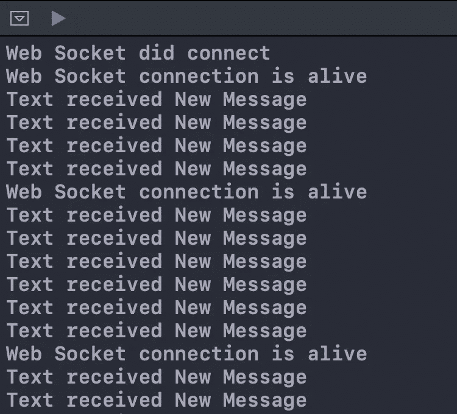

# 使用 URLSession 的 WebSocketTask 的 Swift 中的 WebSockets

> 原文：<https://betterprogramming.pub/websockets-in-swift-using-urlsessions-websockettask-bc372c47a7b3>

## 没有第三方库的 WebSockets

由 [Marvin Meyer](https://unsplash.com/@marvelous?utm_source=medium&utm_medium=referral) 在 [Unsplash](https://unsplash.com?utm_source=medium&utm_medium=referral) 上拍摄的照片

WebSockets 允许在不同方之间建立非常快速的双向安全网络连接。这不同于 HTTP 协议，仅在我们需要实时更新时使用。例如，您使用的所有聊天应用程序都是使用 WebSockets 构建的。使用相同的协议显示股票市场更新。

我们可以简单地使用 URL 连接到一个`WebSocket`频道，并可以监听来自该频道的所有更新。例如，如果我们连接到某个特定实体的股票频道，我们将会收到关于该股票价格的及时更新。我们可以随时关闭连接。

不止一个客户端可以连接到一个`WebSocket`通道，WebSockets 的职责是向所有连接到它的客户端发送更新。

为了测试 WebSocket 连接，我们使用了两个不同的术语:`PING`和`PONG`。客户端将向 WebSocket URL 发送一个`PING`，作为响应，通道将向客户端发回一个`PONG`。这个循环建立了客户和渠道之间的持续连接。

# iOS 中的 WebSockets

直到 iOS 12，还没有对 WebSockets 的第一手支持，尽管我们可以在我们的项目中使用第三方库来使用 WebSockets。最常见的开源库之一是[红蜘蛛](https://github.com/daltoniam/Starscream)。

你可以看看文档，如果你愿意，在你的应用程序中支持 iOS 12 或以前的 iOS 版本。但是在本文中，我们将了解 iOS 库中用于直接处理 WebSockets 的新功能。

我们将从创建一个新的空操场开始(所有这些在 Xcode 项目中也会起作用)。

## URLSessionWebSocketDelegate

该协议包含两种不同的方法，可用于检查我们是否建立了与通道的连接或断开了通道。

我们已经创建了一个类`WebSocket`，它将符合`URLSessionWebSocketDelegate`协议。

这个协议有两个我们将使用的方法:第一个方法在客户端与通道建立连接时调用，第二个方法在客户端与通道断开连接时调用。每当我们的客户机与 web socket 通道连接或断开时，我们将简单地打印出`Web Socket did connect`和`Web Socket did disconnect`。

## 建立连接

我们已经使用`URLSession`创建了一个具有`default`配置的`session`，我们的`WebSocket`类作为代理，以及`OperationQueue`。我们使用了一个免费的`WebSocket`频道网址`wss://echo.websocket.org`。任何人都可以使用 WebSockets 发送和接收消息。

iOS 13 在`URLSession`中有一个名为`webSocketTask`的新任务——它主要用于创建一个使用给定 URL 连接到`WebSocket`频道的任务。在最后一行，我们简单地`resume()`了 WebSocket 任务，这样我们就可以与通道建立连接。

调用`webSocketTask.resume()`后，我们将与通道建立连接，我们的委托方法将被调用。请记住，我们使用了两个委托方法，这次我们建立了一个通道，因此将调用第一个方法。它将在调试控制台中打印出`Web Socket did connect`。

## 乒乓球

建立连接后，及时检查我们的连接是否仍然建立是一个非常好的做法。这可以通过向通道发送一个`PING`来完成，作为响应，通道将向我们发回一个`PONG`。

我们已经创建了一个新方法，`ping`，它将用于每五秒钟测试一次我们与通道的连接。

`webSocketTask`为我们提供了`sendPing`，它会自动向频道 URL 发送一个`ping`，如果我们没有从频道收到一个`PONG`返回，它会给我们一个带有错误的响应。我们只是打印出错误，以防我们的连接不再建立。在生产中，如果由于某种原因丢失了连接，我们可以使用它来再次创建连接。

如果我们成功地从通道接收到一个`PONG`，我们在五秒钟后使用全局队列再次调用`ping`方法。这将确保我们每五秒钟检查一次连接，如果连接断开，我们将打印错误并停止。

一个好的做法是一旦连接建立就开始 ping 通道，所以我们将从一个在连接建立后调用的委托方法中调用`ping`方法。

## 关闭连接

出于某种原因，如果我们希望在我们的应用程序进入后台或用户关闭应用程序时关闭连接，那么从客户端关闭连接并通知通道此连接关闭的原因是一个好的做法。

我们将首先创建一个`reason`字符串并将其转换为`Data`，然后我们将简单地调用`cancel`，提供我们刚刚创建的原因。这将简单地关闭我们与通道的连接。

## 发送/接收消息

使用 WebSockets 发送和接收消息的最重要部分来了。由于我们使用的是示例通道`WebSocket`，我们自己必须发送和接收相同的消息。但是在现实世界中，通道可以向客户端发送消息，反之亦然。

我们创建了两种不同方法:`send`和`receive`。让我们逐一了解。

`webSocketTask.send`可用于向通道发送`String`消息或`Data`消息。在本演示中，我们只发送一条`String`消息。我们已经使用全局队列在一秒钟后一次又一次地调用`send()`方法。这将确保我们每秒钟都在发送和接收消息。如果发送消息时出现错误，回调将被错误调用，我们可以诊断错误。但是我们不会在这个演示中这样做。

`webSocketTask.receive`用于从我们连接的频道接收消息。在`success`的情况下，它要么给我们发送一个`String`消息，要么发送一个`Data`消息。在`failure`的情况下，它会简单地给我们发送一个错误消息。

有一点需要注意的是，为了继续从通道接收消息，我们必须一次又一次地调用`receive`方法。所以每次我们收到一条消息，我们都要再次调用`receive`方法，这将确保我们也收到所有未来的消息。

最后一件事:我们将从我们的委托方法中调用`send()`和`receive()`，这样我们就可以开始使用`WebSocket`通道接收消息。

现在，如果您运行 Playground，您将在调试控制台中看到这些消息。

# 包扎

感谢你阅读这篇文章。希望你通过这篇文章获得了一些知识。

你可以从 [GitHub](https://github.com/samarth4487/WebSocketsDemo) 下载完整的源代码。