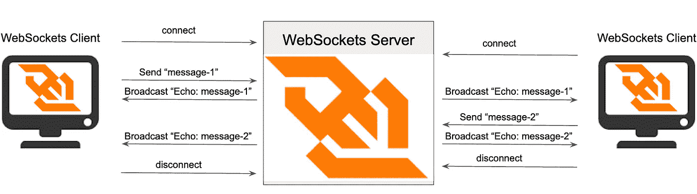
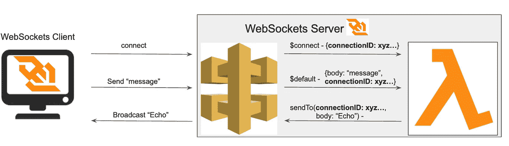
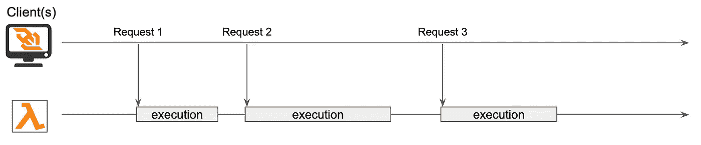
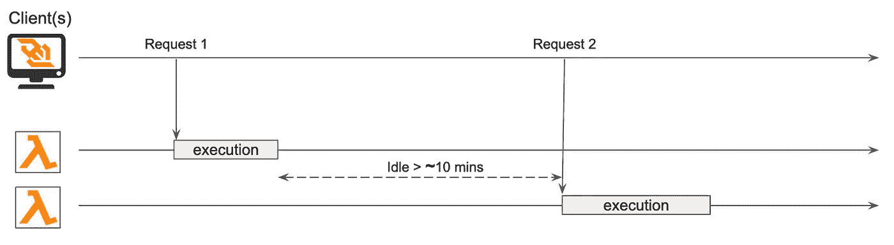
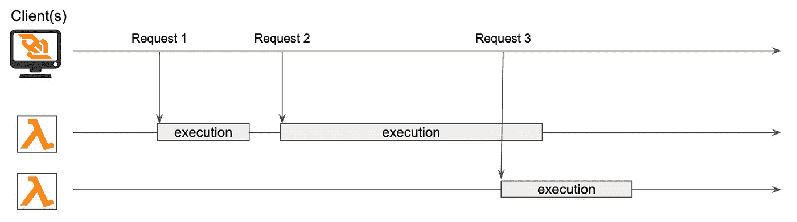
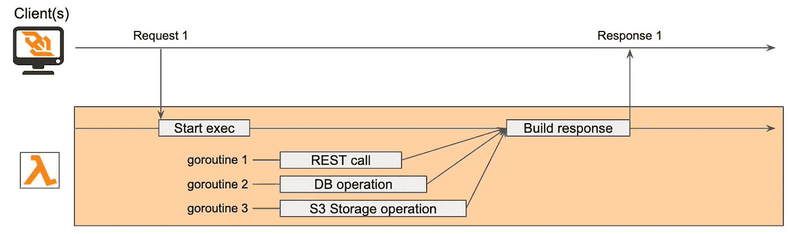

# WebSockets on Demand 采用 AWS Lambda、无服务器框架和 Go

> 原文：<https://betterprogramming.pub/websockets-on-demand-with-aws-lambda-serverless-framework-and-go-616bd7ff11c9>

## Lambda 函数和 web sockets——对立面如何在云中相遇

图片来源:作者

[Lambda 函数](https://aws.amazon.com/lambda/)和 [WebSockets](https://en.wikipedia.org/wiki/WebSocket) 可以看作是难以调和的概念。兰达本质上是短暂的。它们在被调用时出现，然后在完成工作后的某个时候消失。相反，WebSockets 在一台服务器和许多客户机之间保持稳定、长期的连接。

[AWS APIGateway](https://aws.amazon.com/api-gateway/) 提供了将这两者结合在一起的可能性，结合了 Lambda 按需模型的优势和 WebSockets 实时双向通信的能力。

在本文中，我们描述了如何使用 AWS API 网关和 Lambda 函数实现 WebSocket 服务器。我们将使用[无服务框架](https://www.serverless.com/)来建立基础设施和部署解决方案，并将 [Go](https://golang.org/) 作为编程语言。

之所以选择无服务器，是因为它是一种将基础设施定义为代码的简单且记录良好的方法。选择 Go 是因为它保证了它有潜力优化 Lambda 成本，并提供低冷启动延迟，这是实现这种模型的一个重要特征。

# 一个简单的 WebSocket 服务器和客户端可以做什么

具体来说，我们将实现一个简单的 WebSocket 服务器。该服务器的目标是将从一个客户端收到的每条消息作为回应广播给所有连接的客户端。

回声广播服务器

正如我们从图中看到的，每个客户端连接到服务器，发送消息由服务器广播到所有连接的客户端，最后，从服务器断开连接。

换句话说，客户端可以触发三种类型的事件:

*   **将**连接到服务器
*   **断开**与服务器的连接
*   **向服务器发送消息**

另一方面，服务器必须对这些事件做出适当的反应。它的反应方式用 Lambda 函数编码。

# 云中组件的设置

既然我们已经了解了客户端可以做什么以及服务器需要做什么，我们就可以开始在云中构建基础设施了。正如我们所说的，我们将使用无服务器框架来做到这一点。

API 网关和 Lambda 函数的配置非常简单。我们开始将 Lambda 函数与要求它们管理的事件类型联系起来。这是定义这种链接的无服务 yaml 配置。

无服务器配置 yaml

在上面的代码片段中，我们定义了一个服务、一个提供者和一个当 WebSocket 事件到达服务器时要执行的 Lambda 函数。属性将一个事件链接到它的函数，这意味着当事件发生时，函数被触发。`handler`属性指向 Lambda 函数将要执行的代码，在本例中是`bin/handleRequest`，一个 Go 编译的可执行文件。

在这个例子中，相同的功能(由`bin/handleRequest`实现)管理`connect`、`disconnect`和`default`事件。我们可以定义不同的函数来管理不同的事件，但是为了简单起见，我们选择了单一的函数，并允许一些优化形式，我们将在后面讨论。

让我们回到事件上。我们知道`connect`和`disconnect`是什么。但是什么是`default`？

当客户端向服务器发送消息时，消息的含义(即语义)被嵌入到其有效负载的内容中。例如，如果消息携带 JSON 有效负载，那么 JSON 可以有一个属性`action`来标识消息应该触发的逻辑。然后，我们可以配置 AWS API Gateway，用不同的 Lambda 函数对具有不同语义的消息做出反应。换句话说，我们可以将不同的 Lambda 函数附加到`action`字段的不同值上(如果我们遵循上面的例子)。如果没有找到匹配，那么系统返回到`default`事件和与之链接的 Lambda 函数。

在我们的例子中，我们对所有类型的事件使用相同的 Lambda 函数，所以没有定义`custom`事件，只配置了`$default`事件。

# Go 实现结构

API 网关 WebSocket 服务使用的 Lambda 函数的 [Go 实现的结构也非常简单。](https://docs.aws.amazon.com/lambda/latest/dg/golang-handler.html)

我们需要在`main`包中定义一个`main`函数。`main`函数简单地调用`lambda.Start(handleRequest)`。

因为在我们的例子中，一个单一的 Lambda 函数管理所有类型的事件，我们需要找到识别事件类型的方法，并基于它实现一些开关逻辑。`handleRequest`通过查询作为参数传入的事件结构的`RequestContext`的`RouteKey`字段，知道它正在处理哪种类型的事件，事件结构的类型为`APIGatewayWebsocketProxyRequest`。根据事件的类型，执行适当的逻辑。

# $connect，$disconnect 和 connectionIDs

WebSocket 服务器能够向特定客户端发送目标消息。这意味着每个连接的客户端需要有一个唯一的`connectionID`，并且服务器需要跟踪这样的`connectionID`

当客户端连接到服务器时，API 网关负责为每个客户端分配一个唯一的`connectionID`。在每次调用`handleRequest`函数时，`connectionID`都作为参数传递。

WebSocket 服务器需要为活动的`connectionID`提供某种形式的存储。当接收到`$connect`事件时，`connectionID`将被添加到存储中。当`$disconnect`事件发生时，`connectionID`将从存储中删除。

考虑到 Lambda 函数的短暂特性，我们不能使用它的内部内存来存储`connectionID` s，但是我们需要依赖一些持久的外部系统，例如数据库。

ConnectionIDs 存储

通常我们会考虑使用 AWS Dynamo DB，但任何永久存储机制都可以(在提供的代码中，我们实际上使用了 Atlas 上的 [MongoDB](https://www.mongodb.com/) ，只是为了给示例添加一个不寻常的位)。因此，为了保持实现的开放性，我们定义了一个接口`connectionStorer`，来描述我们所期望的行为，并将特定实现的决策委托给一些依赖注入机制。

connectionStorer 接口

管理$connect 和$disconnect 事件

# $default，动作发生的位置

实际上，在我们的例子中并没有发生什么。逻辑非常简单。收到的每条消息都会被回显给所有连接的客户端。这个简单的逻辑由`$default`案例触发，并委托给`echo`功能。

管理$default 事件

Lambda 函数的作用类似于 API 网关的客户端，它创建网关的一个实例，并向该实例发送回显的消息，每个活动连接发送一个消息。

实现中还有一个小技巧。如果从客户端收到的消息代表一个整数，那么这个值被用来模拟一个使用`time.Sleep`的长时间运行的流程。稍后我们将使用这个技巧来测试 Lambda 如何对来自不同客户端的并发请求做出反应。

# 优化策略

值得注意的是，我们使用全局变量`apigateway`在 Lambda 函数的整个生命周期中存储一个网关实例。这种选择背后的原因是 Lambda 函数的一个实例可以服务于多个后续请求。因此，虽然 Lambda 函数确实可以按需实例化，但当请求到达时，该实例在一定时间内保持活动并准备好为其他请求服务也是事实(简单的经验测量表明该时间大约为 10 分钟)。我们可以定义全局变量来保存我们希望在后续请求处理中重用的资源，例如 API 网关实例。

类似地，我们在一个全局变量中保存 MongoDB 连接，因为创建它是一个开销很大的操作，我们希望每个 Lambda 函数实例化只执行一次。这就是为什么用一个单一的`handleRequest`功能来管理所有的事件——`$connect`、`$disconnect`和`$default`——在效率方面带来优势的原因。所有这些事件都需要连接到 MongoDB，所有这些事件的单个处理程序意味着单个 Lambda 函数，因此需要为所有事件打开单个数据库连接。

# 同一个 Lambda 函数可以服务多少个请求

λ函数是短暂的，但不会太短暂。Lambda 函数的同一个实例化可以服务于多个请求。让我们研究几个不同的案例。

## 由同一个 Lambda 函数服务的顺序请求

一个 Lambda 函数实例服务于更多的请求

一些请求被顺序发送到同一个 Lambda 端点。Lambda 函数速度很快，在下一个请求到来之前完成一个请求的执行。在这种情况下，我们只能期望 Lambda 函数的一个实例服务于所有的请求。(只需在设置全局变量时记录日志，并验证这种情况只发生一次，就可以检查这一点。)

## 两个后续请求之间的长空闲时间

Lambda 函数空闲时间过长，已被终止

另一方面，如果我们让 Lambda 函数闲置太长时间，那么 Lambda 函数最终会终止。当下一个请求到达时，会创建一个新的 Lambda 函数来执行新的请求。同样，这可以通过记录全局变量的创建来检查。

## 并发请求

两个并发请求由两个不同的 Lambda 函数处理

最后一种情况是并发请求。当下一个请求到来时，Lambda 函数实例仍在处理该请求。在这种情况下，Lambda 函数的另一个实例被分离出来，因为根据 [AWS Lambda 文档](https://docs.aws.amazon.com/lambda/latest/dg/golang-handler.html)，“Lambda 函数的单个实例永远不会同时处理多个事件”。这可以使用`echo`功能的睡眠功能进行测试。

了解这些行为很重要，因为这让我们有可能实现一些优化，比如数据库连接的缓存。另一方面，当使用这种技术时，我们需要谨慎，因为许多细节没有被记录，例如，Lambda 函数在被终止之前可以保持空闲的时间，并且我们不能在我们的逻辑中盲目地依赖它们。

# 为什么要去？

我们已经看到，一个 Lambda 函数一次只能服务一个请求。所以我们不能使用 goroutines 的能力来同时处理更多的请求。管理不同请求之间的并发性是 API Gateway 和 Lambda 的工作。

尽管如此，如果有意义的话，我们仍然可以在单个请求的流程中利用 Go 并发性。在很多情况下，这是有意义的。

利用 Go 并发的 Lambda 函数

让我们考虑上面的例子，其中单个请求的处理需要不同的 I/O 操作，例如，调用 REST API、访问 DB、对存储做一些事情。在这种情况下，我们可以通过并发执行所有 I/O 操作来充分利用 Go，从而减少 Lambda 处理的总时间，最小化响应时间，并潜在地优化成本，因为 Lambda 也是由处理时间定价的。

Go 作为一种编译语言，如果我们想要高效地使用内存，也是一个很好的选择。内存是影响执行 Lambda 函数成本的另一个因素。

最后，如果我们希望有一个低的[冷启动延迟](https://levelup.gitconnected.com/aws-lambda-cold-start-language-comparisons-2019-edition-%EF%B8%8F-1946d32a0244)，即启动一个还没有执行上下文的 Lambda 函数所需的时间，Go 似乎也是一个不错的选择，即使这个方面的基准[有所不同](https://mikhail.io/serverless/coldstarts/aws/)。

# 构建、部署和测试

最后，我们需要构建、部署和测试我们的 WebSocket 服务器。无服务器框架模板指导我们完成这些步骤，这些步骤无论如何都是非常简单的。

对于**构建**，我们需要运行以下命令:

`env GOOS=linux go build -ldflags="-s-w" -o ./bin/handleRequest ./handleRequest`

一旦构建完成，我们可以用下面的命令**部署**:

`sls deploy`

在 deploy 命令中，我们可以指定环境变量值，以防在实现中使用它们，例如，传递 db 连接字符串。

为了**手动测试**服务器功能，我们使用 [wscat](https://github.com/websockets/wscat) 通过以下命令启动交互式命令行基本会话:

`wscat -c wss://urlOfTheServer`

在提示符下，我们可以键入任何消息，然后按`enter`向服务器发送消息。

# 结论

我们已经经历了基于 AWS API 网关和 AWS Lambda 函数构建 WebSocket 服务器所需的步骤。我们使用了无服务器来设置云配置和部署，并对逻辑进行编程。

好消息是，按照无服务器的理念，这是一种相对容易的构建按需可用的 WebSocket 服务器的方法。

我们现在有了一个强大的额外工具来解决我们希望提供丰富、交互式、多对多平台的用例，而不会产生设置和管理专用服务器或集装箱解决方案所涉及的复杂性和成本。

你可以在 GitHub 上找到例子的所有[代码。](https://github.com/EnricoPicci/lambda-websockets)