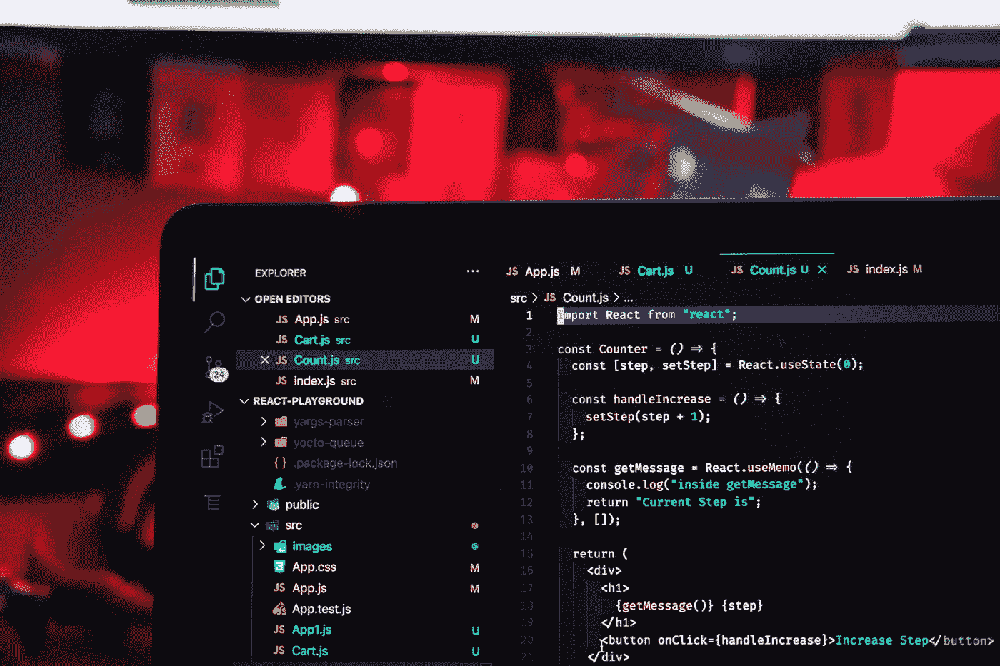
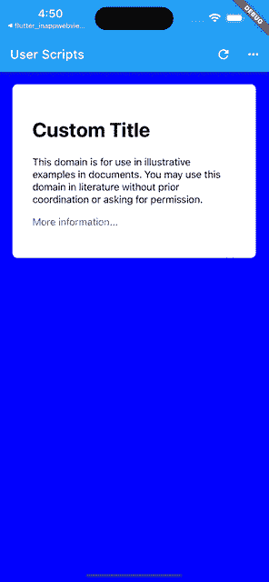

# 用用户脚本在 Flutter Web 视图中注入 JavaScript

> 原文：<https://betterprogramming.pub/webview-javascript-injection-with-user-scripts-flutter-inappwebview-6-46d9969353a4>

## 了解如何利用 Flutter 的 InAppWebView 6 插件



照片由 [Rahul Mishra](https://unsplash.com/@rahuulmiishra?utm_source=medium&utm_medium=referral) 在 [Unsplash](https://unsplash.com?utm_source=medium&utm_medium=referral) 上拍摄

有时，您可能希望在加载网页之前或之后注入 JavaScript 代码，以便添加、替换或删除网页内容，或者更改某些网页逻辑。

在本文中，我们将了解什么是用户脚本，以及如何使用它们在特定时间使用`[flutter_inappwebview](https://github.com/pichillilorenzo/flutter_inappwebview)`插件在 WebView 中注入自定义 JavaScript 代码。

# UserScript 类

`UserScript`类相当于`[WKUserScript](https://developer.apple.com/documentation/webkit/wkuserscript)`本地类。它表示 WebView 注入到网页和任何其他后续导航网页中的 JavaScript 代码。

使用用户脚本而不仅仅是注入一些 JavaScript 代码(例如`evaluateJavascript`方法)有什么好处？

一个`UserScript`让你有可能在加载网页的其他资源之前注入一个 JavaScript 代码，将`injectionTime`属性设置为`UserScriptInjectionTime.AT_DOCUMENT_START`。

对于每一个`UserScript`，可以设置一个可选的[内容世界](https://inappwebview.dev/docs/webview/javascript/content-worlds/)，设置是否使用`forMainFrameOnly`属性将脚本注入主框架(仅限 iOS/macOS)，以及一组允许原点的匹配规则(仅限 Android)。

## Android 的注意事项

遗憾的是，在 Android 上，使用`UserScriptInjectionTime.AT_DOCUMENT_START`时，如果不支持`WebViewFeature.DOCUMENT_START_SCRIPT`，由于对应的原生类/特性不存在，无法保证在加载其他资源之前已经注入了 JavaScript 代码，所以`InAppWebView`试图尽快注入那个`UserScript`。

要将一个`UserScript`添加到一个`WebView`中，可以使用`WebView.initialUserScripts`属性:

```
InAppWebView(
  initialUrlRequest: URLRequest(url: WebUri('https://flutter.dev')),
  initialUserScripts: UnmodifiableListView<UserScript>([
    UserScript(
        source: "var foo = 49;",
        injectionTime: UserScriptInjectionTime.AT_DOCUMENT_START),
    UserScript(
        source: "var bar = 2;",
        injectionTime: UserScriptInjectionTime.AT_DOCUMENT_END),
  ]),
  onLoadStop: (controller, url) async {
    var result = await controller.evaluateJavascript(source: "foo + bar");
    print(result); // 51
  },
),
```

对于每个`UserScript`，您可以设置以下属性:

*   `groupName`:剧本的组名。
*   `source`:脚本的源代码。
*   `injectionTime`:将脚本注入 WebView 的时间。可以是`UserScriptInjectionTime.AT_DOCUMENT_START`也可以是`UserScriptInjectionTime.AT_DOCUMENT_END`。
*   `forMainFrameOnly`:布尔值，表示是否将脚本注入主框架。指定 true 仅将脚本注入主框架，或指定 false 将脚本注入所有框架。默认值为`true`。
*   `allowedOriginRules`:允许原点的一组匹配规则。仅在 Android 上可用，并且仅在支持`WebViewFeature.DOCUMENT_START_SCRIPT`功能时可用。
*   `contentWorld`:评估脚本的执行范围，以防止不同脚本之间的冲突。

查看每个特定属性的代码文档，了解哪个平台支持该特性。

运行时添加或删除用户脚本，也可以使用相应的方法，如`InAppWebViewController.addUserScript`、`InAppWebViewController.removeUserScript`等。

请注意，在运行时添加或删除用户脚本，在一个网页加载后，将不会生效，直到下一个网页加载。

此外，对于每个`UserScript`，您可以定义一个`groupName`，例如，使用`InAppWebViewController.removeUserScriptsByGroupName`方法删除一组用户脚本。

这是向 WebView 添加基本用户脚本的简单概述。

但是，用户脚本能做什么呢？

它可以做网页上普通脚本能做的任何事情，比如修改 HTML 文档结构，监听`[onload](https://developer.mozilla.org/en-US/docs/Web/API/Window/load_event)`之类的事件，加载外部资源(图片， [XMLHttpRequest](https://developer.mozilla.org/en-US/docs/Web/API/XMLHttpRequest) ， [fetch](https://developer.mozilla.org/en-US/docs/Web/API/Fetch_API/Using_Fetch) 等……)。您还可以与 Flutter/Dart 端进行通信(查看[官方 JavaScript 通信文档](https://inappwebview.dev/docs/webview/javascript/communication)了解更多信息)。

让我们用一个例子把我们学到的东西付诸实践吧！

# 用户脚本示例

在这个例子中，我们用 3 个自定义用户脚本加载了[https://example.com](https://example.com)网页，以改变一些 CSS 样式，并使用 javascript 处理程序添加一些逻辑，用于与 Flutter/Dart 端的双向通信。

```
import 'dart:async';
import 'dart:collection';
import 'package:flutter/foundation.dart';
import 'package:flutter/material.dart';
import 'package:flutter_inappwebview/flutter_inappwebview.dart';

final userScript1 = UserScript(
    groupName: "myUserScripts",
    source: """
window.addEventListener('load', function(event) {
  document.body.style.backgroundColor = 'blue';
  document.body.style.padding = '20px';
});
""",
    injectionTime: UserScriptInjectionTime.AT_DOCUMENT_START);

final userScript2 = UserScript(
    groupName: "myUserScripts",
    source: """
var h1 = document.querySelector('h1');
h1.addEventListener('click', function(event) {
  window.flutter_inappwebview.callHandler('h1Click', h1.innerText);
});
""",
    injectionTime: UserScriptInjectionTime.AT_DOCUMENT_END);

final userScript3 = UserScript(
    groupName: "myUserScripts",
    source: "document.querySelector('h1').innerHTML = 'Custom Title';",
    injectionTime: UserScriptInjectionTime.AT_DOCUMENT_END);

Future main() async {
  WidgetsFlutterBinding.ensureInitialized();
  if (!kIsWeb &&
      kDebugMode &&
      defaultTargetPlatform == TargetPlatform.android) {
    await InAppWebViewController.setWebContentsDebuggingEnabled(kDebugMode);
  }
  runApp(const MaterialApp(home: MyApp()));
}

class MyApp extends StatefulWidget {
  const MyApp({Key? key}) : super(key: key);

  @override
  _MyAppState createState() => _MyAppState();
}

class _MyAppState extends State<MyApp> {
  final GlobalKey webViewKey = GlobalKey();

  InAppWebViewController? webViewController;

  void handleClick(int item) async {
    switch (item) {
      case 0:
        await webViewController?.removeAllUserScripts();
        break;
      case 1:
        await webViewController?.addUserScript(userScript: userScript1);
        break;
      case 2:
        await webViewController?.removeUserScript(userScript: userScript1);
        break;
      case 3:
        await webViewController?.addUserScript(userScript: userScript2);
        break;
      case 4:
        await webViewController?.removeUserScript(userScript: userScript2);
        break;
      case 5:
        await webViewController?.addUserScript(userScript: userScript3);
        break;
      case 6:
        await webViewController?.removeUserScript(userScript: userScript3);
        break;
    }
  }

  @override
  Widget build(BuildContext context) {
    return Scaffold(
        appBar: AppBar(
          title: const Text("User Scripts"),
          actions: <Widget>[
            IconButton(
                onPressed: () {
                  webViewController?.reload();
                },
                icon: const Icon(Icons.refresh)),
            PopupMenuButton<int>(
              onSelected: (item) => handleClick(item),
              itemBuilder: (context) => [
                const PopupMenuItem<int>(
                    value: 0, child: Text('Remove User Scripts')),
                const PopupMenuItem<int>(
                    value: 1, child: Text('Add User Script 1')),
                const PopupMenuItem<int>(
                    value: 2, child: Text('Remove User Script 1')),
                const PopupMenuItem<int>(
                    value: 3, child: Text('Add User Script 2')),
                const PopupMenuItem<int>(
                    value: 4, child: Text('Remove User Script 2')),
                const PopupMenuItem<int>(
                    value: 5, child: Text('Add User Script 3')),
                const PopupMenuItem<int>(
                    value: 6, child: Text('Remove User Script 3')),
              ],
            ),
          ],
        ),
        body: Column(children: <Widget>[
          Expanded(
            child: Stack(
              children: [
                InAppWebView(
                  key: webViewKey,
                  initialUrlRequest:
                      URLRequest(url: WebUri('https://example.com')),
                  initialUserScripts: UnmodifiableListView<UserScript>(
                      [userScript1, userScript2, userScript3]),
                  onWebViewCreated: (controller) {
                    webViewController = controller;
                    controller.addJavaScriptHandler(
                        handlerName: 'h1Click',
                        callback: (arguments) {
                          final String h1InnerText = arguments[0];
                          showDialog(
                            context: context,
                            builder: (context) {
                              return AlertDialog(
                                title: const Text('h1 clicked'),
                                content: Text(h1InnerText),
                              );
                            },
                          );
                        });
                  },
                ),
              ],
            ),
          ),
        ]));
  }
}
```

使用右上方的操作按钮删除或添加用户脚本，然后重新加载网页以使更改生效。

结果如下:



WebView 用户脚本示例。

WebView 提供了操作 JavaScript 的强大工具，用户脚本功能就是其中之一。

今天就到这里吧！

如果这个项目以任何方式帮助了你，请考虑[捐款](https://inappwebview.dev/donate)！

你在用这个插件吗？通过[提交应用](https://inappwebview.dev/submit-app/)页面提交您的应用，并按照说明进行操作。
查看 [Showcase](https://inappwebview.dev/showcase/) 页面，看看谁已经在使用它了！

*本项目遵循* [*全供稿*](https://github.com/all-contributors/all-contributors) *规范(* [*供稿*](https://github.com/pichillilorenzo/flutter_inappwebview#contributors-) *)。我想感谢所有以任何方式支持这个项目的人。非常感谢你们所有人！*