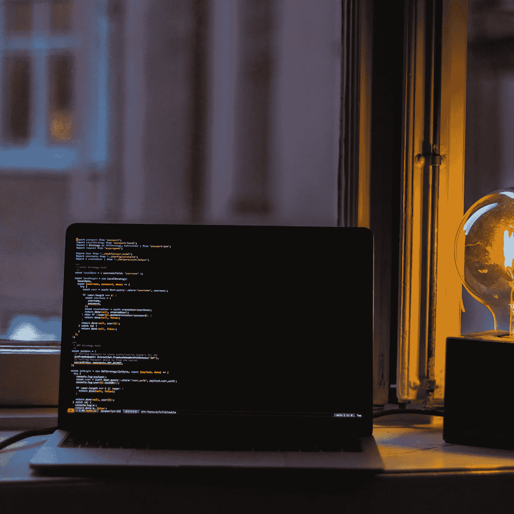

# 欢迎来到更好的编程

> 原文：<https://betterprogramming.pub/welcome-to-better-programming-85b9e2a8fba2>

奥斯卡·伊尔迪兹在 [Unsplash](https://unsplash.com/search/photos/code?utm_source=unsplash&utm_medium=referral&utm_content=creditCopyText) 上拍摄的照片

编程是一个令人惊叹的职业，因为对学习的追求融入了我们所做的一切。无论是编写更好的代码，提高你的管理技能，还是培养让你更有效率的习惯，这个领域都在不断变化。

欢迎来到更好的编程。我们想给你带来一种不同的出版物——一种涵盖作为一名程序员意味着什么的方方面面的出版物——我们迫不及待地想要开始。

我们为您带来在其他地方找不到的每日文章和可操作的内容，帮助您在工程游戏中保持最高水平。我们也深入研究工程中人的一面。我们将探讨如何成为一名更好的经理、谈判合同的策略、休息和锻炼对工作的重要性、如何向团队中的其他人推销你的想法等话题。

从你一直想学习的框架或语言的操作方法和教程，到关于最大流动状态下咖啡因定时的理想方法的文章，我们都能满足你。无论是人工智能、机器学习、区块链、Redux、Flutter，还是一种新语言的 Hello World，我们的目标都是帮助你快速学习，变得更聪明——无论道路、代码和职业将你带到哪里。

我是[扎克·夏皮罗](https://twitter.com/zackshapiro)。我是 Better Programming 的编辑，也是一名自学成才的工程师。我创建并出售公司。我在[凸起](http://sobump.com)处领导过工程，在[飞溅](http://splashthat.com)处领导过移动。我是[产品搜寻](http://producthunt.com)的第二工程师，我曾在 [Raise](http://raise.com) 、 [Holloway](http://holloway.com) 和 [Square](https://cash.app) 等公司工作过。

立即订阅—我们很高兴能一起构建更好的编程。