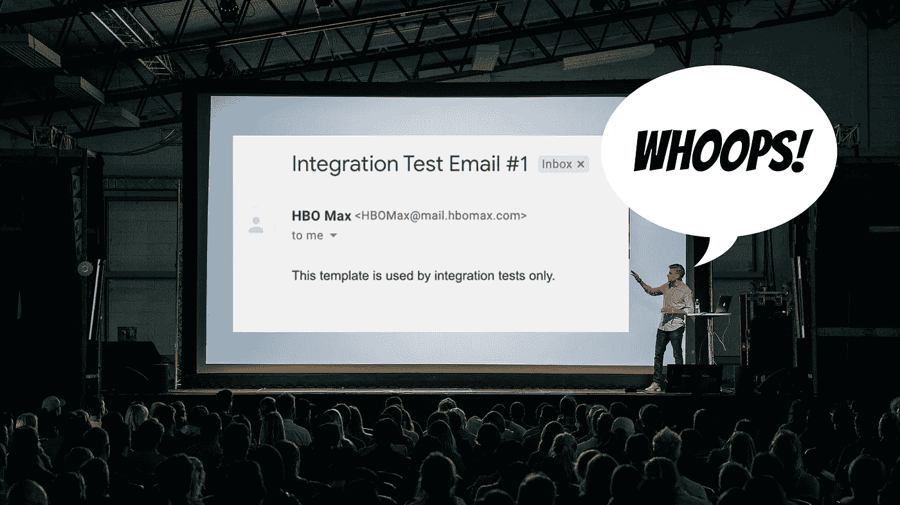
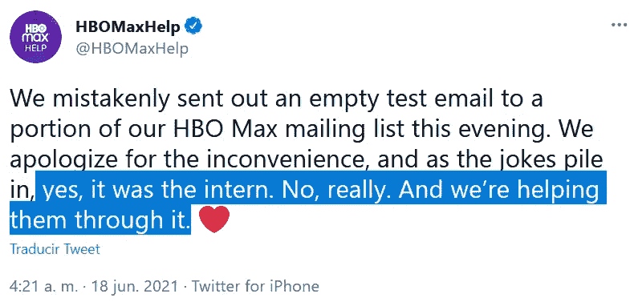

# 我们都曾在某个时候做过 HBO Max 实习生

> 原文：<https://betterprogramming.pub/weve-all-been-that-hbomax-intern-at-some-point-fabfbf39d088>

## 每个人都会犯错，但并不总是他们的错

[Teemu Paananen](https://unsplash.com/@xteemu?utm_source=unsplash&utm_medium=referral&utm_content=creditCopyText) 在 [Unsplash](https://unsplash.com/s/photos/public-speaking?utm_source=unsplash&utm_medium=referral&utm_content=creditCopyText) 上的原图(作者编辑)。

几天前，发生了一件非常有趣的事情:我们看到一家大公司搞砸了。这并不是没有听说过，但他们通常有适当的程序来避免如此开放和公开。

问题是一次集成测试出错(显然是在没有任何安全措施的情况下在生产中执行的)向许多 HBO Max 订户发送了以下电子邮件:

截图取自网络。

他们没有分享任何内部信息，也没有向客户发送侮辱性信息(老实说，这种情况很可能发生)。相反，他们发出了一个非常普通和无聊的测试信息。没什么大不了的，对吧？

实际上是，因为这表明他们有问题需要解决。毕竟，如果他们不能让一个简单的集成测试顺利运行，他们还有什么地方出错了呢？

这是他们的回答:

[推特截图](https://twitter.com/HBOMaxHelp/status/1405712235108917249)

他们承认自己犯了一个错误，并承认是一名实习生犯了这个错误。我们永远也不会知道那是真的还是他们只是在开玩笑。然而，最后一句话发出了正确的信息:“我们正在帮助他们度过难关。”

# 我们都是实习生

巧合的是，几天前，我记下了我在初级开发阶段所犯的错误。我们必须诚实面对自己:我们都犯过这样的错误。也许你从来没有重新命名过一个完整的待售产品数据库，但是我敢肯定你在某些方面搞砸了。

之后你有什么感觉？像垃圾一样，对吧？我知道我做了，而且我在为一家小公司工作时犯了那些错误。如果我在一家社交范围很广的大型跨国公司工作时搞砸了，我会当场尿裤子。

HBO Max 公开承认他们的错误，并承认他们正在帮助犯错的人从中吸取教训。无论是教他们还是支持他们，都是一种奇妙的反应。没有比这更好的了，不是吗？当然，如果他们撒谎并解雇了那个可怜的人，那就完全是另一回事了。

# 集成测试可以是一种尝试

单元测试很棒。如果它们写得正确，它们实际上不会影响任何东西。他们测试一段代码，一旦完成，就没有副作用。干净，快速，完美！

另一方面，集成测试可能是个问题。这是因为它们旨在测试平台的不同部分如何协同工作。有实际数据从一个系统发送到另一个系统。

您是否必须测试您是否确实将用户信息保存到数据库中？整合测试会有所帮助。

您是否必须测试电子邮件是否在接收端正确发送和呈现？集成测试应该会有所帮助。

那还有什么问题呢？这是配置的问题。您正在测试的代码需要是您想要部署的代码。这意味着您不能硬编码一个电子邮件地址，运行测试，删除该地址，并进行部署。这是一个愚蠢的例子，但是您可能会意外地删除超出您预期的内容，并在生产中引入一个 bug。

相反，在这个阶段测试的代码需要是被部署的代码。那么有什么变化呢？使用的数据。

这个实习生可能需要修改一个配置文件或者某种参数来让系统从一个开发数据库中提取数据。相反，它被指向生产，它提取每一封客户电子邮件，并与他们一起进城。

想象一下，如果他们不是发送电子邮件，而是测试一种新的大规模退订服务？结果可能会非常不同。

这就是为什么您需要使系统的配置依赖于环境。

## 依赖于环境的配置

这只是一种奇特的说法，“您使用的配置参数需要由一个逻辑根据您部署它的环境自动选择。”

这样的话，你不需要改变什么。在任何情况下，人的因素都是错误和问题的主要来源。

相反，您应该依赖同行评审和单元测试的逻辑。我是说，很难说出口:

我把这个场景过于简化了，但核心是，这是你需要做的。`env`变量从哪里获得它的值？通常是由您的 DevOps 团队在每个环境中预先配置的环境变量。这使得您的代码可以根据部署位置的不同而有不同的行为，而无需接触任何一行代码。

有时，您可能希望使用比 env 变量更安全的东西，比如秘密的保险库。通常，如果你在云环境中，你会有一些选项，如 [AWS 的秘密管理器](https://aws.amazon.com/secrets-manager/)、 [Azure 的密钥库](https://docs.microsoft.com/en-us/azure/key-vault/general/overview)和 [GCP 的秘密管理器](https://cloud.google.com/secret-manager)。也有其他替代方案，比如 HashiCorp 的 Vault 项目，如果你愿意，你可以下载并自己运行。

要点是:有选项，所以没有理由在每次您想要运行任何类型的集成测试时都要更改手动配置。

# 但这真的是实习生的错吗？

你已经看到了[推文](https://twitter.com/HBOMaxHelp/status/1405712235108917249)，虽然他们声称他们正在帮助他们处理刚刚发生的事情，但我不禁想知道:谁会让一个实习生——从定义上来说对平台知之甚少——去运行这样一个微妙且配置不当的集成测试？

当然，我不为 HBO Max 工作，也没有权限访问他们的系统，但人们会认为这种情况下会有一套安全措施。

## 文档是王道——通常如此

几乎没有什么比记录一个复杂的工作流程更好的了，这是我在这个特定场景中假设的。

有很多知识管理平台可供团队用来集中这类信息。一个复杂或精细的工作流程应该被“非常”地记录下来。仅仅说“点击这里，输入这个，然后运行测试”是不够的。

要明确，展示截图，解释可能出错的地方。换句话说，要做到“万无一失”请注意，我并不是说实习生(或这个特定的实习生)是傻瓜，但他们可能缺乏知道什么会出错的经验，所以通过使它“万无一失”，你也使它“无经验证明”。

## 约定胜于配置

这也是另一种方式:确保默认情况下上下文本身负责基本行为。

特定于环境的配置就是一个很好的例子。有了这样的配置加载逻辑，您就不需要担心运行集成测试的常见用例。你只需点击“运行”,会议就开始了。

它是否运行在正确配置的集成环境中？然后将加载正确的配置。别担心。

如果您出于任何特殊原因需要覆盖它，您将有办法绕过约定，提供您自己的自定义设置。非常好。可能不是实习生的用例，而是更有经验的开发人员的用例，他们知道自己在做什么。

## 伙伴计划或类似的辅导计划

也许这不是给实习生提供足够信息的问题，而是确保他们在需要帮助时有可靠的人可以寻求帮助。

配置可能会被错误覆盖，文档可能会被阅读和误解，但是在最初几次指导您完成该过程的同事的经验丰富的眼睛是难以击败的。

也许这就是我们的实习生所缺少的——能够指导他们完成集成测试过程的人。有人提醒他们在点击“运行”按钮之前，要做好所有的准备工作。

我们永远不会知道。

# 结论

不管是什么导致了这个问题，它做了两件事:

1.  这表明所有公司都有内部问题。我不是指实习生是一个“问题”，而是指允许这种情况发生的过程和工作流程。不管你是一家小公司还是大公司，你都有改进的空间。这种情况特别突出了 HBO Max 的一个。希望他们找到了一种方法来确保这种事情不再发生。
2.  这使得技术 Twitter 社区团结在实习生的身后，告诉他们每个人都会犯错，我们都经历过，事情会变得更好。如果你想看到一些温暖人心的支持，请阅读完整的 Twitter 帖子。

你有没有犯过像这样公开的错误？在评论中分享你的故事吧！