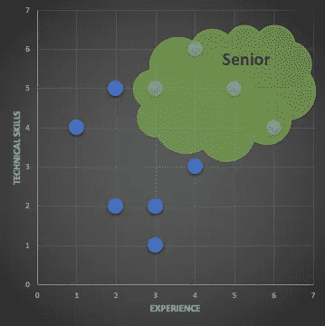
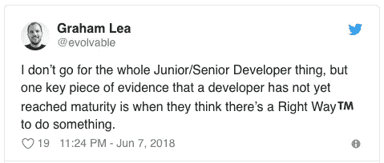
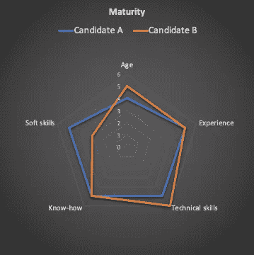

# 你还不是高级工程师

> 原文：<https://betterprogramming.pub/what-a-senior-dev-truly-means-to-me-1e1f3725e674>

## 我将如何选择提升开发人员，为什么

[MD 杜兰](https://unsplash.com/@mdesign85?utm_source=medium&utm_medium=referral)在 [Unsplash](https://unsplash.com?utm_source=medium&utm_medium=referral) 上的照片

# TL；速度三角形定位法(dead reckoning)

*   要成为一名高级开发人员，你需要多种技能——不仅是技术和经验，还有软技能。
*   在获得头衔之前，你应该在你的头脑中是资深的，并且被你的同事视为资深的。

# 动机

每个开发人员都曾经想过被提升为*高级*开发人员，因为一些原因(职业调动、工资上涨、日常任务变化等。).每个公司都有自己的用人方式，或多或少的平等和聪明。有时候，被提升*高级*只是为了拿到更好的薪水。有时候，人们甚至不知道自己为什么会被提拔，也不知道这是不是应得的。有时候，人们只是因为团队里有人升职了，就想升职。

所以我来列举几个**不足**声称被提拔为学长的理由。

## 年龄

> 我应该是资深的，因为我比团队中的任何人都老。

抱歉，但是如果这真的是你所想的，那么你永远不会成为一个高级开发人员。可能是公司最近录用了你，也可能是你最近十年一直在做支持，才来发展。年龄本身不是理由。如果你的经理认为这是一个需要考虑的原因，那么他/她自己可能不是一个开发人员。

## 经验

> 鉴于我有经验，我应该是资深的。

好吧，这已经比老了好多了。但是，经验在这里又意味着什么呢？公司内部的经历？当前研究领域的经验？经验因为你已经在几十家公司工作过？这个的混合？

我个人认为，经验是成为资深人士的关键，因为它给你必须解决的问题提供了距离，但重要的是要明白，经验本身并不等于资历。

## 技能

> 我应该是资深的，因为我是一个高技能的开发人员。

要回答的问题是你如何衡量自己的技能和工作质量。你认为你比你的队友更优秀吗？你认为你的交付接近完美吗？你的同事应该寻求你的帮助来改进他们的代码吗？如果你对上面的一个问题回答“是”，那么很抱歉，你没有抓住要点，尽管你可能是有史以来最好的开发人员。

然而，熟练的开发是非常重要的，因为它提供了可信度——它有助于解决困难的挑战，它提供了向队友提供提示的能力，它促进了代码审查，等等。所以，是的，一个高级开发人员肯定必须是熟练的，但不仅仅是熟练的。

资历的经典表述。但是，从长远来看，这种方法有效吗？

## 知识

> 如果我用正确的方式编码，我应该是高级的。

你有没有遇到过这样一种人，他总是知道如何从头到尾把事情做好，并且抱怨遗留系统糟糕的设计？这样的人通常会爱上一种特定的语言或技术，这当然比其他任何东西都要好。

老实说，我认为有这样一个开发人员来管理或工作是很糟糕的。他/她的判断对整个团队来说可能是一个重大问题。最后但同样重要的是，作为一名技术布道者的说教可能很快会让团队成员感到无聊。

另一方面，知道很多技术是好的，对开发中的良好实践有信念是好的，捍卫观点和礼貌地质疑提议的解决方案是好的——只要它保持*尊重*和*干净*。简而言之，知识是成为高管的先决条件，但要节俭，要有人情味。而且，只有当你明白正确做事的方法不只有一种，正如 Graham Lea 在推特上说的:

完全同意格雷厄姆·李的这条推文

## 软技能

> 鉴于我的为人品质、领导能力和沟通技巧，我应该是资深的。

你可能是对的——这些品质是被认为是高年级学生所必需的。如果你不擅长技术问题，对你来说可能不容易。最后，大部分致力于高级开发人员的任务都与技术特性紧密相关:你也需要技术娴熟。

但是请注意，一个不喜欢协作和会议的纯技术人员可能不会是团队领导、项目经理或直接队友眼中的好高管。

# 那又怎样？

以上任何一个理由都不足以成为一个好的学长。最好全部都有一点，不要一个很高，另一个很低。这是我个人对成熟的定义。

作为一名资深 dev，你选择哪个候选人？由于软技能，我肯定会选候选人 A。

你喜欢回答技术问题吗？你能教一个大三学生如何在公司正常工作吗？你能为你的同事提供帮助吗，包括离岸的，是否可以先暂停你的任务来帮助他们？你知道在开发一个特性之前写一个最小规格的好处吗？你能适应大量的上下文切换吗？确保回答这些问题中的每一个 y*es*to**T3，因为这很可能是这份工作的组成部分。**

## 个人考虑

我的建议是:不要指望仅仅为了官方利益而升职。这不是关于头衔或薪水的谈判，而更可能是最终导致升职的态度问题。

在你获得冠军之前，在你的队友和你的经理眼里，你应该已经是前辈了。

如果你的同事尊重你的专业技能、耐心、解释能力和经验，那么你的经理就很难否认你的头衔应该升级为高级。