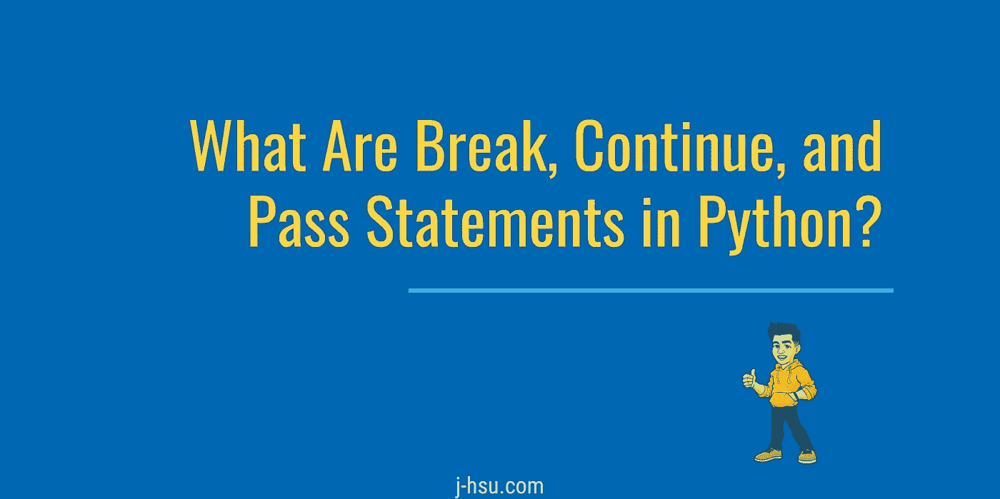

# Python 中的 Break、Continue 和 Pass 语句是什么？

> 原文：<https://betterprogramming.pub/what-are-break-continue-and-pass-statements-in-python-f739791fb762>

## 对这三个关键词的快速而直接的解释将回答这些关键词的作用以及何时使用它们的问题

当你学习 Python 时，关键字`break`、`continue`和`pass`肯定会分散在你查找的代码中。下面是对这三个关键词的快速而直接的解释，它将回答“它们是做什么的？”以及“我应该什么时候使用它们？”

# 让我离开这里！

对于 Python 来说,`break`语句并不是新的或独有的。该命令将退出迭代结构(循环),从而有效地停止该代码块的任何进一步执行。当不再执行循环时，使用 break 语句。我最喜欢的技术之一是打破用户输入的无限循环。

# 继续:往前走。这里没什么可看的…

与终止当前循环的`break`语句不同，`continue`结束当前迭代。有什么区别？循环将继续执行一个`continue`语句。在循环一组数据时，使用此关键字来标识异常。以下示例防止打印匹配的 *x，y* 坐标。

# Pass:即将推出！

根据你正在学习的代码类型(一步一步的教程和完整的语法)，你接触到的`pass`语句可能是有限的。那是因为它大多被用作占位符。被称为空语句的`pass`语句用于填充代码块，而实际上不做任何事情。让我们假设你正在计划你的程序，并且想要设计函数和伪代码控制结构。挑战在于 Python 使用缩进来表示代码块，所以解释器在某些语句后会有所期待。用`pass`安抚解释者，给自己自由，慢慢规划，慢慢搭建。

希望这个快速教程对初露头角的程序员有帮助！