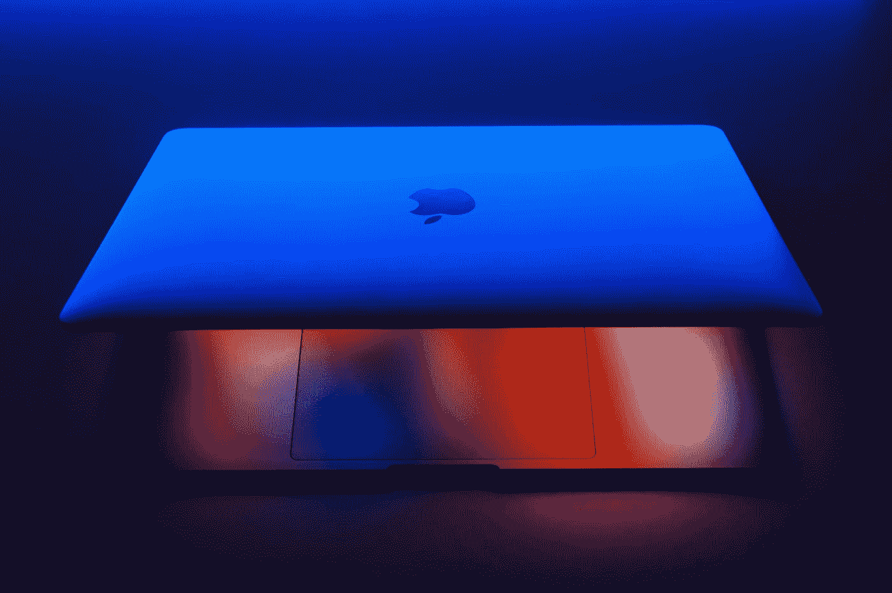
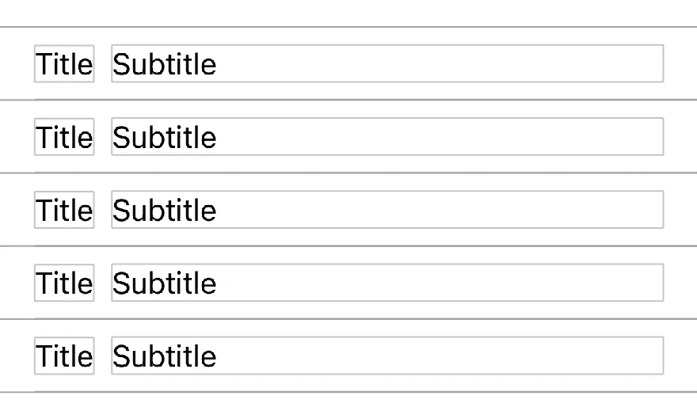
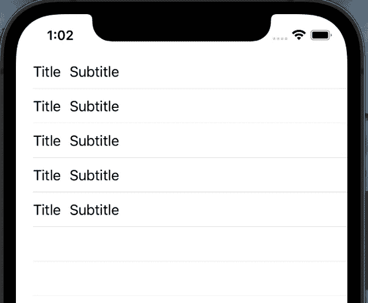
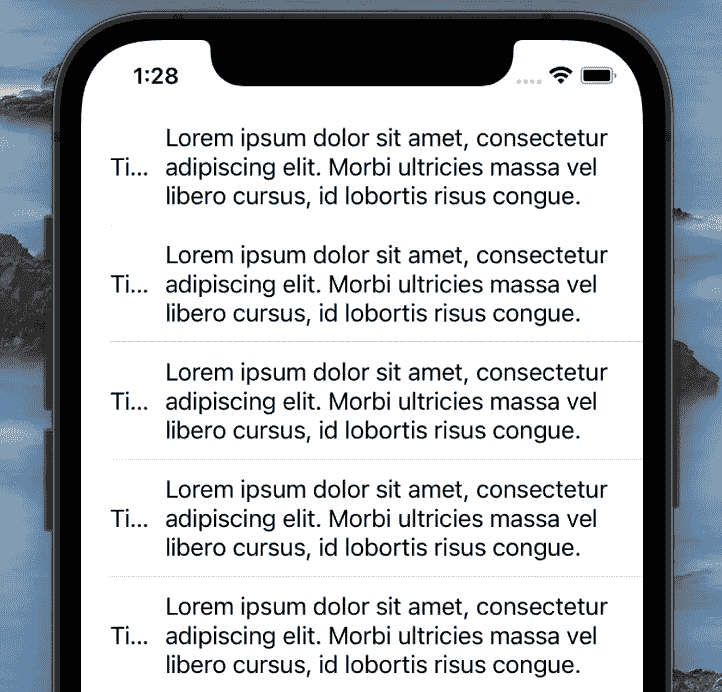
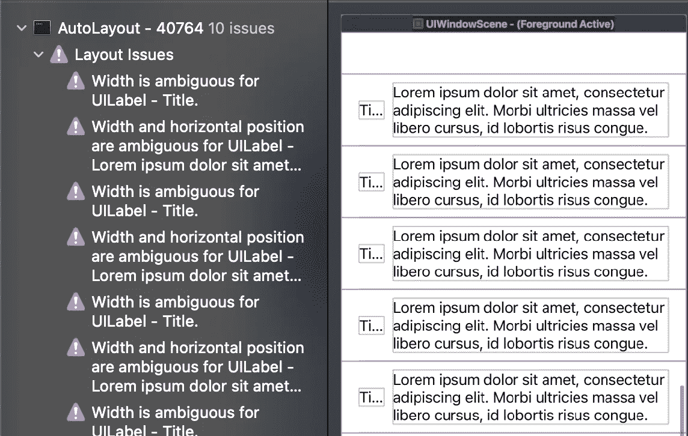
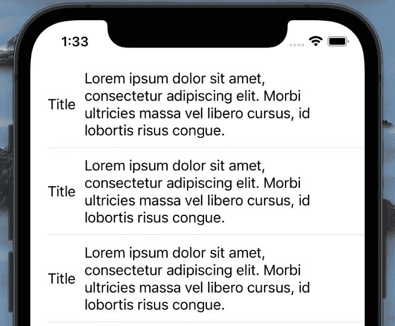
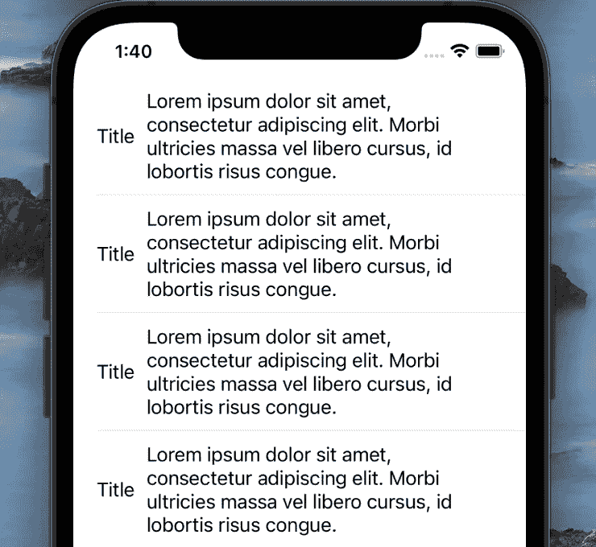
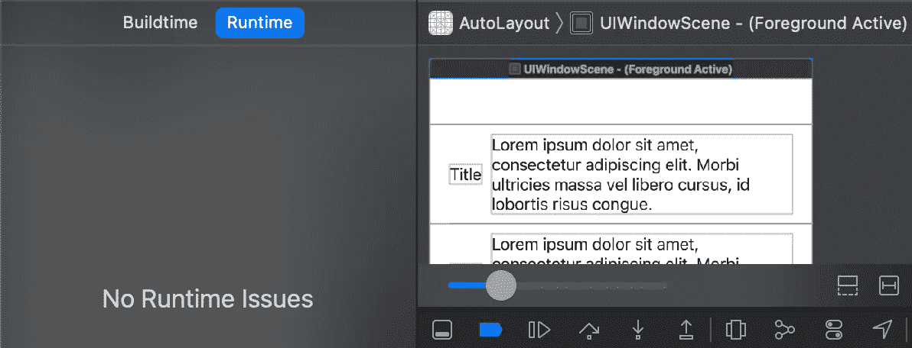
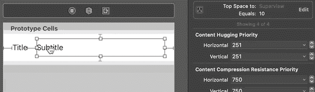
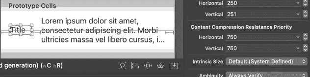

# Swift 中的内容拥抱和抗压是什么

> 原文：<https://betterprogramming.pub/what-are-content-hugging-and-compression-resistance-in-swift-60275f6dc69e>

## 使您的自动布局更具适应性和效率

照片由[穆罕默德·礼萨·阿里杜斯特](https://unsplash.com/@mralidoost?utm_source=medium&utm_medium=referral)在 [Unsplash](https://unsplash.com?utm_source=medium&utm_medium=referral) 上拍摄

在本文中，我们将学习如何利用 Auto Layout 提供的内容拥抱和抗压缩属性，使我们的 UI 布局更具适应性。简而言之，在本教程结束时，您将会学到以下内容:

*   如何以编程方式创建自适应布局。
*   如何利用内容拥抱来帮助自动布局决定要扩展的视图。
*   抗压性如何使视图更容易缩小到超出其固有大小。

示例项目的源代码可以在本文的底部找到。

# 我们开始吧

我们从一个几乎为空的`UITableViewController`子类开始:

`TableViewCell`有两个标签相邻放置，使用以下代码:

1.  一旦设置了`title`属性，我们就更新`titleLabel`。
2.  类似地，当我们设置`subtitle`属性时，`subtitleLabel`显示一个新值。
3.  在`setupUI()`方法中，我们将`titleLabel`放在左边，将`subtitleLabel`放在右边。由于我们计划有一个自调整`UITableViewCell`，我们在`subtitleLabel`上设置了顶部和底部约束。注意，当我们定义`titleLabel`时，我们将它的`numberOfLines`属性设置为 1。另一方面，`subtitleLabel`将包含未知数量的行，所以我们将属性值赋为 0。

现在项目已经准备好了，我们可以开始探索内容拥抱和抗压如何帮助我们创建一个自适应的布局。

# 满足拥抱

解释这个属性如何工作的最好方法是定义我们要实现的布局，然后看看哪里出错了。我们的目标是:

这里，`titleLabel`填充了完全显示文本所需的最小空间，而`subtitleLabel`扩展以填充剩余空间。

如果我们设置`title`和`subtitle`属性，然后构建并运行应用程序，我们将看到它根据需要显示 UI。代码如下:

然而，通过点击`Debug View Hierarchy`，我们可以看到自动布局显示的一些奇怪问题，如下所示:

问题是 Auto Layout 不清楚要拉伸什么标签，所以它试图自己解决这个问题。我们可以避免依赖不那么可预测的自动布局决策，并帮助它决定要延伸的*确切的*视图。这就是内容拥抱帮助我们的地方。

按如下方式设置`titleLabel`的内容拥抱优先级:

默认情况下，`titleLabel`和`subtitleLabel`的内容拥抱优先级都是 250。这就是为什么 Auto Layout 不知道影响哪个标签的原因。通过将`titleLabel`的优先级设置为 251，我们告诉自动布局拉伸`subtitleLabel`并保持`titleLabel`不变。

所以现在，如果我们运行应用程序并检查`Debug View Hierarchy`，我们将不会看到任何警告，如下所示:

太好了！现在让我们看看当`subtitleLabel`的文本超过它所能容纳的时候会发生什么。下面的代码将突出这一点:

如果我们运行应用程序，我们会发现用户界面不再好看:

另外，`Debug View Hierarchy`再次显示问题，如下图所示:

这就是抗压能力发挥作用的地方。

# 耐压力

我们希望我们的`titleLabel`完全显示，而`subtitleLabel`占据剩余的空间。

之前，我们在`titleLabel`上设置了较低的内容拥抱，告诉自动布局应该拉伸`subtitleLabel`。当副标题的内容比标签的尺寸小的时候，这是有效的。现在我们有一个不同的情况。我们的任务是告诉 Auto Layout: " *缩小`subtitleLabel`的*，这样我们就可以完全看到`titleLabel`"下面是帮助我们做到这一点的代码:

默认情况下，`titleLabel`和`subtitleLabel`的抗压强度均为 750。通过将`titleLabel`的属性设置为 751，我们告诉自动布局缩小`subtitleLabel`。

让我们构建并运行应用程序来看看结果。

除了实现 UI 目标，我们也没有出现`Debug View Hierarchy`中显示的问题。

# 总结

当内容尺寸*比视图尺寸*小时，无论哪个视图具有最低的内容拥抱集，都将*扩展*。类似地，当内容尺寸比视图尺寸大时，无论哪个视图具有最低的压缩阻力设置，都将收缩。

让我们使用界面构建器中的属性来更容易地展示效果。

这里，当`titleLabel`和`subtitleLabel`的水平内容拥抱都是 251 时，自动布局是混乱的，并且将约束高亮显示为红色。当我们将`titleLabel`的优先级设置为 250 时，标题标签扩大了。类似的，当我们把它设置为 252 时，`subtitleLabel`就展开了。

接下来，我们玩抗压，如下图所示:

当`titleLabel`和`subtitleLabel`的值都是 750 时，自动布局不确定收缩哪个标签。通过将`titleLabel`的优先级设置为 749，`titleLabel`被缩小了。然而，我们希望`subtitleLabel`收缩，这就是为什么我们将`titleLabel`的抗压强度设置为 751，它可以根据需要工作。

通过设置内容拥抱和压缩阻力，我们可以在内容大小小于和大于视图大小时保护这两种情况。这有助于我们构建更具适应性的用户界面。

# 资源

我希望你觉得这个教程有用。感谢阅读！示例项目可在 [GitHub](https://github.com/zafarivaev/content-hugging-compression-resistance) 上获得。