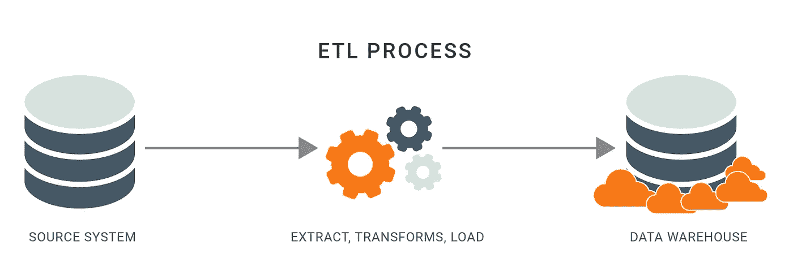
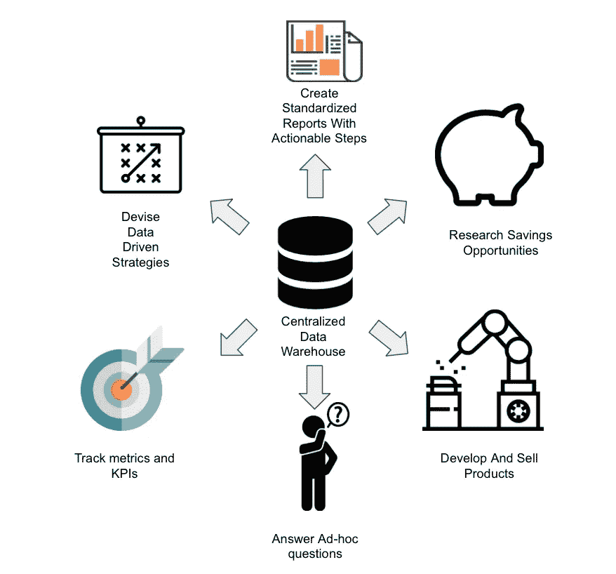

# 什么是 ETL，为什么它们很重要？

> 原文：<https://betterprogramming.pub/what-are-etls-and-why-are-important-b65b301607d1>

## 创造一个自助式分析的世界

由 [Unsplash](https://unsplash.com/s/photos/warehouse?utm_source=unsplash&utm_medium=referral&utm_content=creditCopyText) 上的 [chuttersnap](https://unsplash.com/@chuttersnap?utm_source=unsplash&utm_medium=referral&utm_content=creditCopyText) 拍摄

自助分析的兴起是商业智能领域的一个重要卖点。创建自助服务分析的部分目的是从您的组织中轻松访问数据。

问题是如何将来自外部应用程序数据源的数据转换成可用的格式？

答案是 ETLs。

如今，ETL(提取、转换、加载)是商业智能(BI)的一个重要方面。通过 ETL，可以将来自不同来源的数据集中到一个地方，供分析程序处理并实现关键的业务洞察。ETL 就在这里，它非常重要。

# 什么是 ETL(提取、转换、加载)？

[来源](https://wso2.com/library/article/2019/08/streaming-data-integration-the-evolution-of-etl/)

数据是现代商业世界的基础。数据本身并没有多大用处。最重要的是，数据通常存储在某种形式的应用程序数据库中，不容易用于分析。

这就是 ETL 工具必不可少的原因。ETL 从多个系统获取数据，并将它们合并到一个数据库(通常称为数据仓库)中进行分析或存储。

ETL 意味着数据从一个应用程序/数据库迁移到一个分析数据库。ETL 需要三个步骤将数据从数据库 A 转移到数据库 b。这三个步骤是:

*   提取物(E)
*   转换(T)
*   负载(升)

## 提取

extract 函数涉及读取数据库中数据的过程。这一阶段还包括数据收集和提取。根据系统的类型，提取物可能以几种不同的方式运行。它可以将数据提取到某种形式的平面文件中，或者直接从 API 中提取。这取决于与应用系统交互的风险、时间要求和其他一些技术限制。

## 改变

transform 函数将提取的数据转换成适当的格式，以便进行分析和存储。此过程包括将提取的数据从其旧结构更改为更非规范化的格式。这一步取决于终端数据库。例如，数据仓库有一个非常特殊的设计模式，需要重塑数据并实现缓慢变化的维度。

## 负荷

load 函数负责将转换后的数据写入新的应用程序/数据库。这可能需要几个步骤，因为每个阶段可能会不同地增加数据。标准设置是拥有原始、暂存和生产数据库。根据项目需要，还有其他配置。

# ETL 的主要用例

ETL 准备数据，并使其可访问并对分析有意义。有时，ETL 可以用于其他一些任务。

以下是 ETL 可以用于的三个主要任务:

*   数据集成
*   数据库
*   数据迁移

## 数据集成

在当今的商业世界中，集成数据是更常见的事情。连接的系统可以知道相邻数据库中的更新。这可能与具体应用没有直接联系，但它非常有价值——通过在产品之间建立桥梁，它可以帮助为应用提供新的特性和功能，以及新的见解。

## 数据库

数据仓库是创建仪表板和其他商业智能功能的关键组件。它们是来自多个应用程序的财务、营销、供应链和员工数据的中心。这使得业务经理可以跨部门提问并获得关键见解。

## 数据迁移

数据迁移是不可避免的灾难。如果你计划升级或更换系统，你必须移动数据。由于数据库和系统 100%相似，这通常需要大量的更改。反过来，这导致需要转换数据和改变功能以适应新系统。一旦建立，数据可以很容易地迁移。虽然数据迁移并不总是有趣的，但它是 ETL 的完美用例。你可以在这里了解更多关于 T2 数据迁移的信息。

# ETL 为什么重要？

无论公司规模、复杂程度和数据源数量如何，公司都将从更好地访问数据中受益。ETL 提供了对过程中发生的事情的访问。它们还提供了创建能够推动战略的报告和指标的能力。

这些报告和指标是与其他类似组织竞争的关键部分。

所以接下来的问题是:你的公司应该选择哪种类型的 ETL 工具？

# ETL 工具

有许多不同类型的 ETL 工具可供组织选择。选择一个标准的 ETL 工具集是重要的一步，因为它将影响您的团队未来的开发能力。选择一个非常合适的 ETL 框架会让你很难找到能够开发你的基础设施的开发人员。这里有两种关键类型的 ETL 工具。

*   第三方工具
*   基于库的框架

## 第三方工具

第三方 ETL 工具可能是大公司最常用的 ETL 工具。这是因为这些工具通常是按规模构建的，并且有强大的开发人员可以在其上进行构建。这些工具包括 Informatica、SSIS 和 Alooma。它们几乎都是拖放式的，让非程序员也能轻松地从应用程序中提取数据。

## 编程库工具

有很多新的库，特别是在 Python 中，被用作 ETL。你可能听说过气流，路易吉，或倭黑猩猩。这些都是用 python 为 ETL 创建的库。这些工具很棒，因为它们比第三方拖放工具更灵活。您可以在框架内轻松编写自己的定制函数和脚本。

# 最后

当今的企业需要方便快捷地访问数据。这导致越来越多的人要求将数据转换成可自我服务的系统。

ETL 在系统中起着至关重要作用。它们确保分析师和数据科学家能够访问来自多个应用系统的数据。这产生了巨大的差异，让公司获得了新的见解。