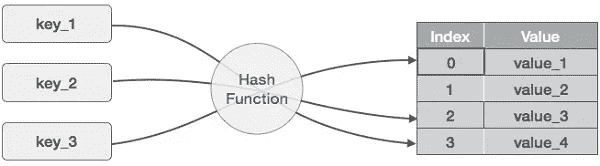

# 哈希表是什么，为什么很神奇？

> 原文：<https://betterprogramming.pub/what-are-hash-tables-and-why-are-they-amazing-89cf52246f91>

## 一个不假设你是开发者的解释

弗洛伦西亚·维亚达纳在 [Unsplash](https://unsplash.com?utm_source=medium&utm_medium=referral) 上拍摄的照片。

哈希表(俗称哈希表)简直太神奇了。它们存在于几乎每一种语言中，只是名称不同。如果你没有受过计算机科学的正规教育，那么你可能甚至没有意识到你一直在使用它们。

以下是流行语言中哈希表的一些实现:

*   Java 哈希表
*   Python 词典
*   JSON 对象
*   PHP 关联数组

哈希表不仅仅是为编程而保留的。在现实世界中，它们也在我们周围。您可以在以下位置找到哈希表:

*   身份证，如社会安全号码和驾驶执照
*   你当地图书馆的杜威十进制系统
*   电话号码

为了理解为什么哈希表如此神奇，我们将给出一个关于它们是什么的非技术性解释，然后探索使用哈希表的含义。

# 哈希是什么？

在我们充实什么是哈希表之前，让我们定义一下哈希。[根据 hackere earth](https://www.hackerearth.com/practice/data-structures/hash-tables/basics-of-hash-tables/tutorial/)的说法，“哈希是一种用于从一组相似对象中唯一识别特定对象的技术。”

换句话说，哈希是创建唯一标识符的过程。这是通过使用预定义的函数来完成的，该函数在给定相同输入的情况下，将总是产生相同的输出。

你曾经下载过安装文件，并在链接旁边看到 SHA1 或 MD5 校验和吗？这些是可执行文件的散列，因此您可以确信您正在安装的文件没有被篡改。

# 什么是哈希表？

既然我们知道散列只不过是一个可预测生成的标识符，让我们揭开什么是散列表的帷幕。

哈希表是由两部分组成的哈希函数的产物。

首先，散列的结果(也称为搜索关键字)充当保存数据的特定空间的标识符。以图书馆图书的杜威图书编号为例，它可以转化为一行和一个书架。在编程语言中，它被翻译成数组中的一个索引。

由 [tutorialspoint](https://www.tutorialspoint.com/data_structures_algorithms/hash_data_structure.htm) 拍摄。

当实现散列时，几乎可以保证两个值将产生相同的散列结果。这个事件称为冲突，解决冲突的方法是哈希函数定义的第二部分。

有各种不同的冲突解决技术。它们超出了本文的范围，但是主要的要点是该技术将影响哈希表伸缩的效率。

# 哈希表的影响是什么？

现在我们已经了解了什么是哈希表，我们可以探索哈希表如何影响我们的代码。哈希表的一个主要影响是它们恒定的时间复杂度 *O(1)* ，这意味着它们在算法中使用时伸缩性很好。

在诸如数组的数据结构上搜索呈现出线性时间复杂度 *O(n)* 。换句话说，随着数据结构大小的增加，搜索时间以线性方式增加。

简单地说，使用哈希表比搜索数组更快。

在[寻找第一个非重复字符](https://medium.com/better-programming/algorithms-find-the-first-non-repeating-character-eb77da094d84?source=friends_link&sk=4d86ee4e5a541cfe1ff2eadca10151a1)算法挑战中，我们使用哈希表作为与嵌套 for 循环相比的最佳解决方案，这是从 *O(n*n)* 到 *O(n)* 的复杂性降低。

哈希表的另一个影响是它们非常适合存储成对数据。这是我第一次以 JavaScript Object Notation (JSON)的形式介绍哈希表。对我来说，键值对是连接像`{ "First Name": "Jonathan" }`这样的两个字段的简单方法。

# 结论

最终，哈希表既方便又高效。它们有助于理解作为命名标识符的数据，并加快后端的速度。作为一种固有地降低时间复杂度的数据结构，哈希表近乎欺骗代码。

我希望这篇文章有助于解释散列表是如何工作的，以及它们为什么有价值。坚持练习，并在下面留下你的评论和反馈！

# 资源

*   [黑客地球:哈希表基础](https://www.hackerearth.com/practice/data-structures/hash-tables/basics-of-hash-tables/tutorial/)
*   [维基百科:哈希表](https://en.wikipedia.org/wiki/Hash_table)
*   [Princeton.edu:哈希表](https://algs4.cs.princeton.edu/34hash/)
*   [TutorialsPoint.com:数据结构和算法—哈希表](https://www.tutorialspoint.com/data_structures_algorithms/hash_data_structure.htm)
*   [哈希表的 SparkNotes.com 效率](https://www.sparknotes.com/cs/searching/hashtables/section1/)