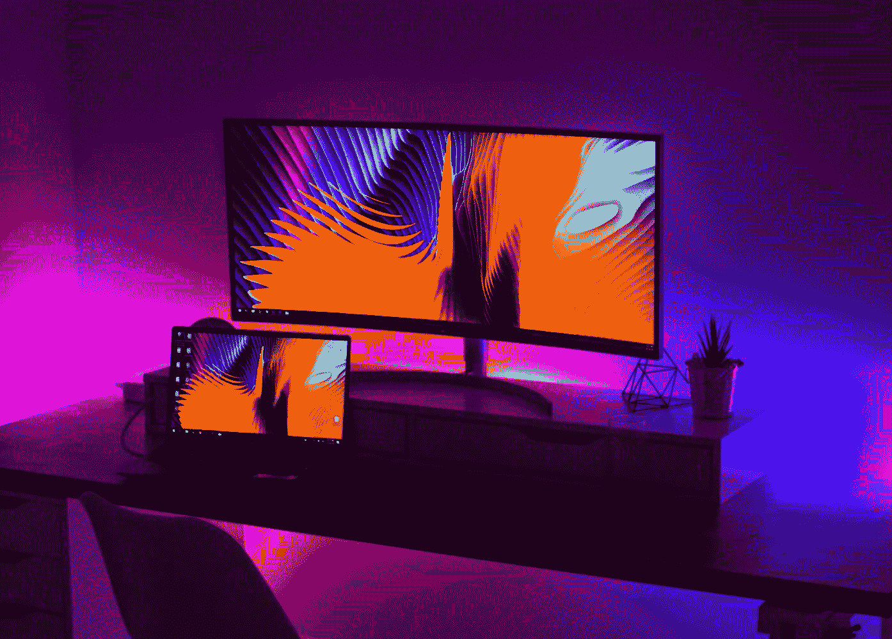
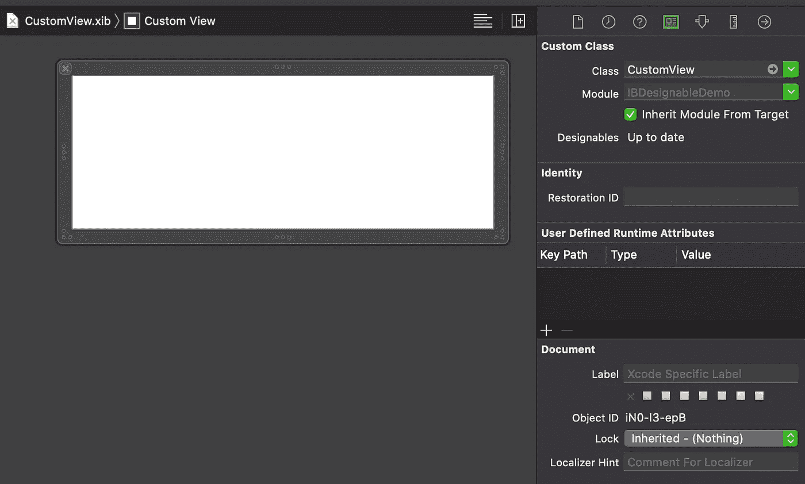
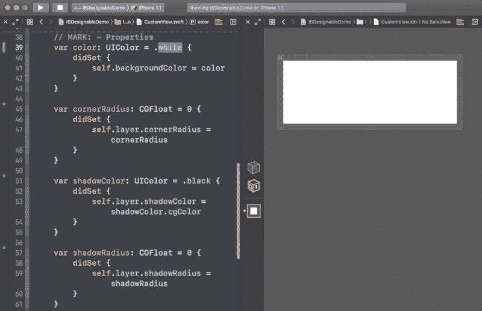
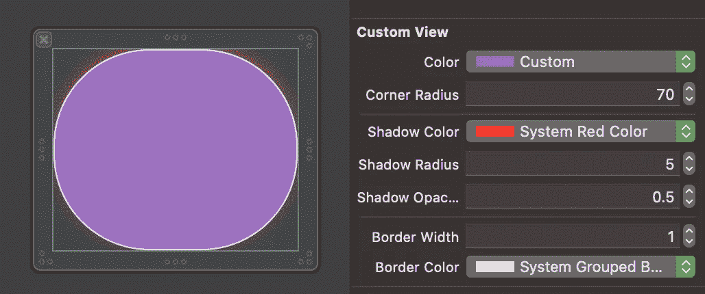

# Swift 中的@IBDesignable 和@IBInspectable 是什么？

> 原文：<https://betterprogramming.pub/what-are-ibdesignable-and-ibinspectable-in-swift-1e3440797d9>

## 使用界面构建器更快地创建自定义视图

照片由 [Alexandru Acea](https://unsplash.com/@alexacea?utm_source=medium&utm_medium=referral) 在 [Unsplash](https://unsplash.com?utm_source=medium&utm_medium=referral) 上拍摄

今天我们将学习如何在 Swift 中使用`@IBDesignable`和`@IBInspectable`快速轻松地创建自定义视图。

`@IBDesignable`提供了直接在故事板或`.xib`中实时呈现我们的自定义视图变化的功能。我们所要做的就是用一个`@IBDesignable`属性标记一个定制视图的类，并实现`prepareForInterfaceBuilder()`方法。

`@IBInspectable`允许我们在代码中创建属性，我们可以在故事板或`.xib`文件中分配这些属性。例如，当我们希望故事板中有一个`cornerRadius`属性时，我们在自定义视图中创建一个`cornerRadius`属性，并用`@IBInspectable`标记它。

这个项目的源代码可以在文章的底部找到。

# 我们开始吧

首先，我们创建一个名为`CustomView`的新类:

我们可以看到我们有以下可修改的属性:`color`、`cornerRadius`、`shadowColor`、`shadowRadius`、`shadowOpacity`、`borderWidth`和`borderColor`。

让我们从在名为`CustomView.xib`的`.xib`文件中呈现这个视图开始:

现在让我们将`@IBDesinable`签名添加到`CustomView`类，实现`prepareForInterfaceBuilder()`方法，并更新`init(frame:)`初始化器:

现在，如果我们更改`CustomView`的默认属性，我们将看到`CustomView.xib`正在更新:

最后一步是探索`@IBInspectable`属性。让我们用`@IBInspectable`标记`CustomView`的每个属性:

现在我们可以直接从`CustomView.xib`文件中设置这些属性:

# 资源

该项目的源代码可以在 GitHub 上找到:

 [## zafarivaev/IB-可设计-可检查

### 展示 Swift-zafarivaev/I b-Designable-Inspectable 中@IBDesignable 和@IBInspectable 用法的演示应用程序

github.com](https://github.com/zafarivaev/IB-Designable-Inspectable) 

要了解更多关于`@IBDesignable`和`@IBInspectable`的信息，请访问 Apple 官方教程:

 [## 实现自定义控件

### 在本课中，您将为 FoodTracker 应用程序实现一个自定义评级控件，并将其添加到场景中。

developer.apple.com](https://developer.apple.com/library/archive/referencelibrary/GettingStarted/DevelopiOSAppsSwift/ImplementingACustomControl.html) 

感谢阅读！