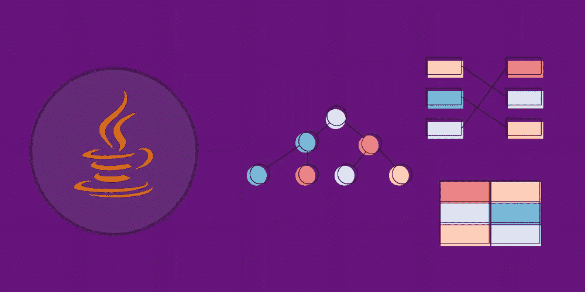
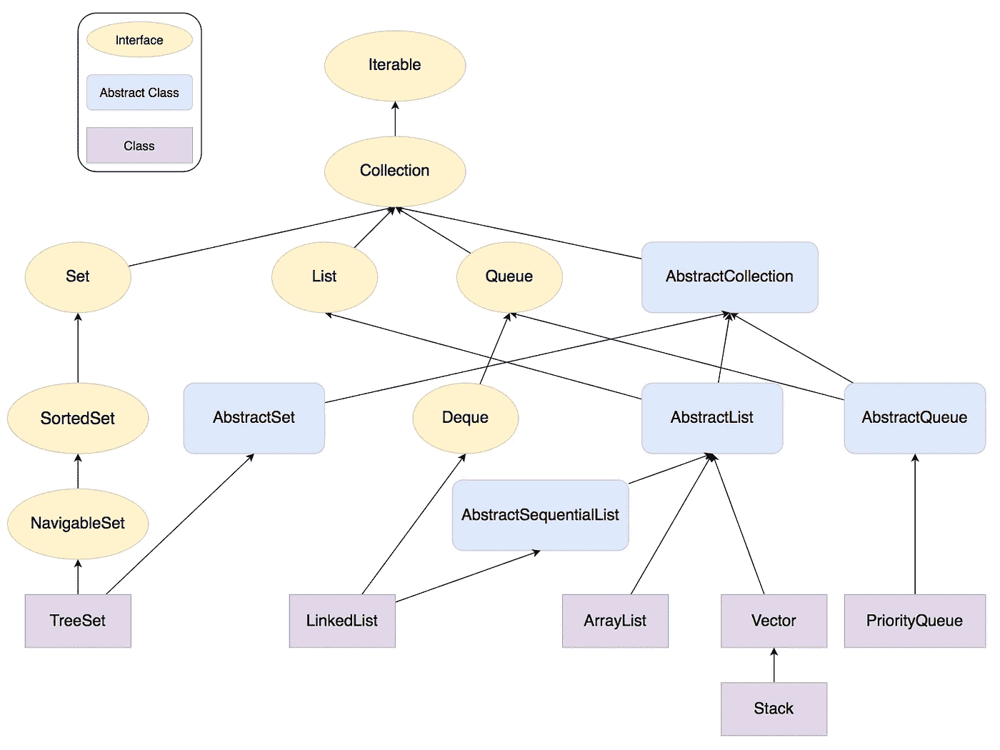
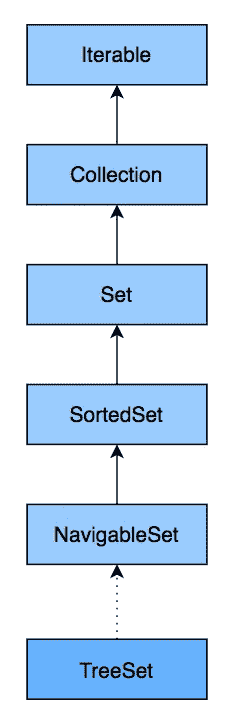

# 什么是 Java 集合？开始使用框架

> 原文：<https://betterprogramming.pub/what-are-java-collections-get-started-with-the-framework-4ea9233c35b5>

## 用 Java 实现各种数据结构



作者照片。

每种编程语言中都使用集合。它们是将多个元素组合成一个单元的对象。在[集合](https://docs.oracle.com/javase/8/docs/technotes/guides/collections/overview.html)框架之前，程序员很难写出适用于不同类型集合的算法。Java 附带了一些集合类，比如`Vector`、`Stack`、`Hashtable`和`Array`，但是它们有自己的缺点。

在 JDK 1.2 中，Java 开发者引入了集合框架，这是一个帮助你实现所有数据操作的重要框架。今天，我们将深入这个框架及其一些组件。

以下是我们今天要讲的内容:

*   什么是 Java 集合？
*   `ArrayList`在爪哇
*   `LinkedList`在 Java 中
*   `HashSet`在爪哇
*   `TreeSet`在爪哇
*   要研究的其他收藏

# 什么是 Java 集合？

根据文档的说法，Java 集合框架是一个“用于表示和操作集合的统一架构”它包含接口、它们的实现类以及处理存储在集合中的数据的算法。`Collection`接口由其他接口扩展，如`List`、`Set`和`Queue`。

*注意:也有一个* `*Map*` *接口，但是它没有实现* `*Collection*` *接口，因为它存储键-值对，而集合接口下的类只存储值。*

## **集合框架和集合之间的差异**

*   集合框架是一个接口，而`Collections`是一个类。
*   `Collection`接口为`List`、`Set`和`Queue`提供数据结构的标准功能。`Collections`类提供了标准的方法，可以用来搜索、排序和协调集合元素。
*   `Collections`是表示一组对象的对象(像`Vector`)，而集合框架可以表示和操作集合。

# Java 集合框架组件

## **接口**

这些接口提供抽象数据类型来表示集合。`java.util.Collection`是框架的根接口。它位于框架层次的顶端，包含重要的方法，如`size()`、`iterator()`、`add()`、`remove()`和`clear()`。

`Iterable`接口是整个集合框架的根。它允许迭代器遍历所有集合。所有的类和接口都使用这个接口。`Collection`接口扩展了 iterable 接口，由集合框架中的类执行。`List`接口禁止列表类型的数据结构，我们可以在其中存储有序的对象集合。

一些更重要的接口包括:

*   `Map`界面:`java.util.Map`
*   `Set`接口:`java.util.Set`
*   `Deque`接口:`java.util.Deque`

*注意:* `*Map*` *接口是唯一一个不从* `*Collection*` *接口继承，但是包含在集合框架中的接口。所有框架接口都在* `*java.util*` *包中。*

## **实现类**

框架为集合提供了实现类。您可以使用它们在 Java 程序中创建不同类型的集合。一些主要的集合类包括:

*   `ArrayList`
*   `LinkedList`
*   `PriorityQueue`
*   `HashMap`和`HashSet`
*   `TreeMap`和`TreeSet`

## **算法**

这些算法对集合执行重要的功能，比如排序列表。

收集框架的层次结构如下:



Java 集合框架层次结构

# Java 中的数组列表

`ArrayList`是`List`接口最常用的实现。它的一些功能包括:

*   按插入顺序存储元素。
*   允许存储重复的元素。
*   支持`null`元素。

一个`ArrayList`将数据存储在一个可调整大小的数组中。当你创建一个`ArrayList`时，你创建了一个大小为零的数组。当插入第一个元素时，数组大小变为 10。这就是所谓的*惰性初始化*，它节省了大量的内存。在向`ArrayList`添加元件之前，检查容量。如果数组已满，则创建一个大小为 *(n + n/2 + 1)* 的新数组。然后旧数组中的元素被复制到新数组中。

在 Java 中创建`ArrayList`有三种方法:

1.  `no-arg`构造函数——这个构造函数没有任何参数，将创建一个大小为零的列表。

```
List list = newArrayList();
```

2.获取初始容量的构造函数——您可以在创建`ArrayList`时给出一个初始容量。假设您知道您的`ArrayList`将包含最少 50 个元素。您可以创建大小为 50 的`ArrayList`，减少不断调整大小的需要。

```
List list = newArrayList(50);
```

3.现有的`Collection` —您可以使用现有的`Collection`创建一个`ArrayList`，列表将包含原始`Collection`中的所有元素，顺序相同。

```
List list = newArrayList(oldList);
```

这里有一个可以用 Java 执行的`ArrayList`的例子:

输出:

```
[1, 2, 3]The element at index two is 2The size of the List is 3
```

使用`ArrayList`可以做很多事情，包括:

*   使用`set(int index, E e)`方法更新元素。
*   使用`contains(Object o)`方法检查元件是否存在。
*   使用`removeAll(Collection<?> c)`方法移除给定`Collection`内的所有元素。
*   使用`replaceAll(UnaryOperator<E> operator)`更换所有元件。
*   等等。

# Java 中的 LinkedList

`LinkedList`类实现了`List`和`Deque`接口。它的一些功能包括:

*   按插入顺序存储元素。
*   支持重复元素。
*   允许任意数量的`null`元素。

`LinkedList`还有一个名为`Node`的静态内部类，包含三个字段:

1.  `item` —包含当前元素的值
2.  `next` —包含指向下一个元素的指针
3.  `prev` —包含指向上一个元素的指针

当一个元素被添加到一个`LinkedList`时，它会创建一个新的`Node`实例。根据添加新节点的位置设置`prev`和`next`字段。

在 Java 中创建`LinkedList`有两种方法:

1.  `no-arg`构造函数——这个构造函数没有任何参数，将创建一个大小为零的列表。

```
List<Integer> list = new LinkedList<Integer>();
```

2.现有的`Collection` —您可以使用现有的`Collection`创建一个`LinkedList`，列表将包含原始`Collection`中的所有元素，顺序相同。

```
List<Integer> list = new LinkedList<Integer>(oldList);
```

这里有一个可以用 Java 执行的`LinkedList`的例子:

输出:

```
[1, 2, 3][10, 1, 2, 3][10, 1, 20, 2, 3][10, 1, 20, 101, 102, 103, 2, 3]
```

你可以用`LinkedList`做更多的事情:

*   使用`get(int index)`方法获取特定索引处的元素。
*   使用`removeLast()`方法移除最后一个元件。
*   使用`sort()`方法对`LinkedList`进行分类。
*   等等。

# Java 中的 HashSet

`HashSet`是`java.util`包中实现`Set`接口的一个类。`HashSet`的一些功能包括:

*   不允许重复元素。
*   只允许一个`null`元素。
*   元素以随机顺序插入。
*   内部由一个`HashMap`支持。

有四种方法可以在 Java 中创建 HashSet:

1.  `no-arg`构造函数——这将创建一个初始容量为 16、装载系数为 0.75 的`HashSet`。

```
Set<Integer> set = new HashSet<>();
```

2.一个需要初始容量的构造函数——如果你知道你的`HashSet`将有超过 16 个元素，你可以设置一个更高的初始容量来减少调整大小的需要。它将使用默认的加载因子 0.75。

3.采用初始容量和负载系数的构造函数-您也可以在提供初始容量的同时提供初始负载系数。

4.一个将另一个`Set`作为参数的构造函数——您可以通过将另一个`Set`传递给构造函数来创建一个`HashSet`。它将具有与传递的集合相同的大小，并且默认加载因子为 0.75。

这里有一个可以在 Java 中执行的`HashSet`的例子:

输出:

```
Inserting 17 in the HashSet: trueInserting 34 in the HashSet: trueInserting 17 in the HashSet: false[17, 34]
```

上面的代码展示了将元素插入到`HashSet`中的`add(E e)`方法。如果插入的元素不在`HashSet`中，方法返回`true`。如果元素已经在`HashSet`中，方法返回`false`。

您可以使用`HashSets`做更多事情，例如:

*   使用`remove(Object o)`方法移除元件。
*   使用`isEmpty()`方法检查`HashSet`是否为空。
*   使用`contains()`方法从`HashSet`中获取一个元素。
*   等等。

# Java 中的树集

`TreeSet`类实现了使用树进行存储的`Set`接口。一些功能包括:

*   不允许重复元素。
*   不允许使用`null`元素。
*   快速访问和检索时间。
*   按升序存储的元素。

`TreeSet`层级如下:



树形层次结构

一辆`TreeSet`和一辆`HashSet`有什么不同？

`HashSet`允许一个空元素，而`TreeSet`不允许任何空元素。

元素在`HashSet`中随机排序，而在`TreeSet`中按顺序排序。

`HashSet`对于`add`、`remove`、`contains`、`size`等操作更快。

在 Java 中创建树集有四种方法:

1.  `no-arg`构造器。

```
Set<Integer> set = new TreeSet<>();
```

2.将`Comparator`作为参数的构造函数——如果您存储在`TreeSet`中的对象没有实现`Comparator`接口，或者如果您需要以降序存储元素，您可以在创建`TreeSet`的同时提供一个自定义的`Comparator`。这将按照`Comparator`的逻辑对元素进行排序。

3.带有`Collection`类型参数的构造函数——您可以从另一个`Collection`创建一个`TreeSet`。这些元素将以升序存储。

4.具有类型`SortedSet`参数的构造函数—该构造函数充当复制构造函数，并使用相同的元素和提供的排序集的相同顺序创建一个新的排序集。

这里有一个可以用 Java 执行的`TreeSet`的例子:

输出:

```
TreeSet elements in ascending order [11, 21, 32, 44, 54]TreeSet elements in descending order [54, 44, 32, 21, 11]
```

您可以使用`TreeSet`做更多事情，例如:

*   使用`tailSet(E fromElement)`方法获取大于给定元素的元素。
*   使用`subSet(E fromElement, E to Element)`方法获取元素的子集。
*   等等。

# 要研究的其他收藏

祝贺您迈出了 Java 集合框架的第一步！`Collection`是 Java 编程中最重要的主题之一，这个重要的框架将帮助你完成你所有的数据操作。

现在，您可以更深入地研究 Java Collections 框架，并了解更多主题，例如:

*   `LinkedHashMap`和`LinkedHashSet`
*   `SortedMap`和`SortedSet`
*   `toArray()`
*   `hasNext()`
*   等等。

快乐学习！