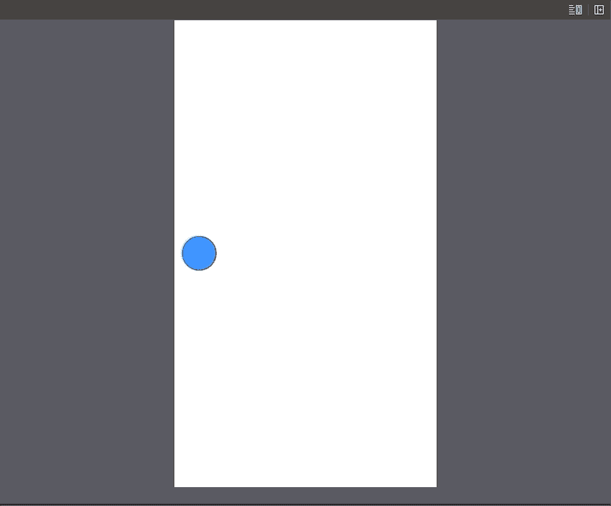
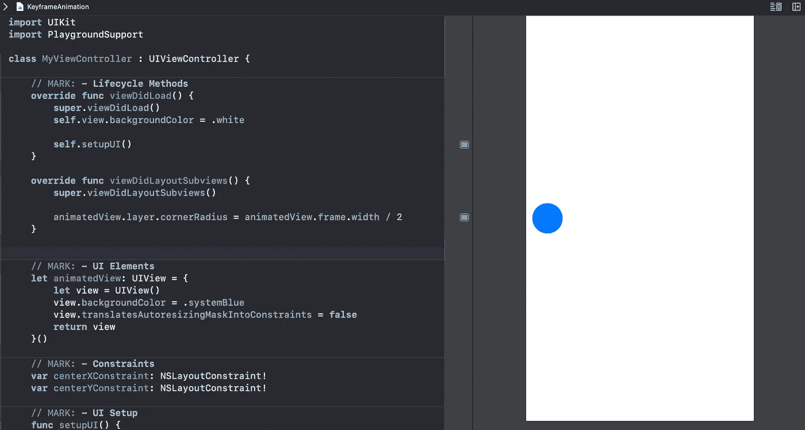
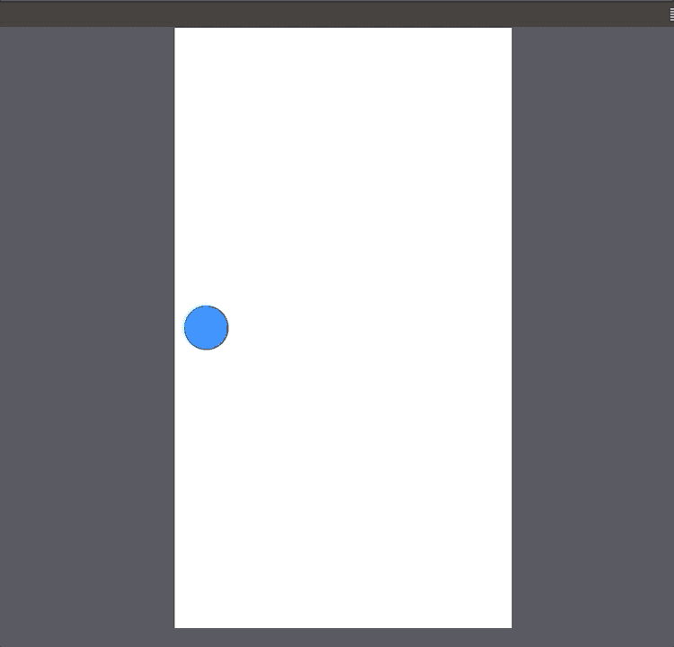

# Swift 5 中有哪些关键帧动画？

> 原文：<https://betterprogramming.pub/what-are-keyframe-animations-in-swift-5-55eaf04f7637>

## 如何将多个动画链接在一起

由 [boris misevic](https://unsplash.com/@borisview?utm_source=medium&utm_medium=referral) 在 [Unsplash](https://unsplash.com?utm_source=medium&utm_medium=referral) 拍摄的照片

今天我们将学习 Swift 中的关键帧动画。简而言之，它们允许我们在一个流程中组合几个`UIView`动画。这样，通过将动画分解成不同的小步骤，您可以轻松创建外观复杂的动画。

我们将在 Xcode 操场上快速试验一个关键帧动画。这是我们要实现的目标:

源代码可以在文章的底部找到。

# 我们开始吧

我们有一个简单的圆形`UIView`在一个`UIViewController`中垂直居中:

正如我们所看到的，我们引用了两个我们将要制作动画的`NSLayoutConstraint`。

目前，什么也没发生，循环静止不动:

让我们改变这一点。添加`performAnimations()`方法，并在`viewDidAppear()`方法中调用它:

我们实现了`animateKeyframes`方法，在这个方法中我们将添加所有的动画。我们给三秒钟来完成整个动画过程。

现在是时候添加单独的动画了。创建一个名为`addKeyframes(count:)`的新方法，它将生成许多关键帧动画，这些动画将改变约束的`constant`属性:

这里有一些要点:

*   `withRelativeStartTime`参数采用一个`Double`值，表示关键帧动画的相对开始时间。例如，如果我们将 0 作为参数传递，这个特定的动画将首先开始。
*   类似地，`relativeDuration`参数指定了所提供的关键帧将花费的相对时间。在我们的例子中，我们之前为整个动画链指定了三秒钟的时间。因此，当我们在这里传递 0.1 值时，这意味着这个特定的动画将花费 0.3 秒。

如我们所见，我们依次改变`centerXConstraint`和`centerYConstraint`，使圆圈向`x`和`y`两个方向移动。为了让实际的约束动画发生，我们在根`view`上运行`layoutIfNeeded()`方法。

现在让我们在`performAnimations()`内部调用这个方法:

我们传递八个动画，它们将占用三秒钟动画时间的 80%。

现在我们可以看到圆圈向右移动，同时上升到顶部:

让我们现在添加我们的工作的剩余触摸。

我们需要圆圈在上升到顶部后淡出，然后在它的路线开始时出现。我们也希望动画无限运行。这些动画将占用总共 3 秒钟的剩余 20%的时间。

像这样更新`performAnimations()`方法:

我们添加了两个额外的关键帧:

*   一个放置圆-从左边 20 点，并使其透明。
*   另一个把它带到左边+10 点，使它可见。

注意，我们还在完成处理程序中递归调用了`performAnimation()`方法。

最后，我们完成了我们的任务:

# 资源

源代码可以在[要点](https://gist.github.com/zafarivaev/032d6ac96225b8a5f11439569a149065)中找到。

感谢阅读！