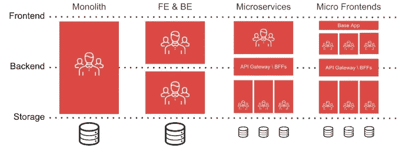

# 什么是微前端？有必要使用它们吗？

> 原文：<https://betterprogramming.pub/what-are-micro-frontends-is-it-even-necessary-to-use-them-f1393d65ef2f>

## 用小部件构建复杂的应用程序

图片来源:[https://medium . com/js-Dojo/micro-frontends-using-vue-js-react-js-and-hypernova-af 606 a 774602](https://medium.com/js-dojo/micro-frontends-using-vue-js-react-js-and-hypernova-af606a774602)

微前端架构是一种架构类型，在这种架构中，web 应用程序被视为由独立的团队所拥有的功能的组合。这种方法最适合复杂的应用程序，因为随着时间的推移，应用程序会变得有点混乱，难以维护。

在我们深入研究为什么要使用它们之前，让我们先来看看所使用的基本架构类型。

# 使用的架构模式的基本类型

*   **Monolith** —在这种类型的架构中，程序员通常是全栈开发人员。他们倾向于在前端和后端都工作。
*   **FE/BE**——这里有一个独立的程序员团队，他们关注前端开发，通常被称为前端开发人员/工程师。另一组从事后端和数据库工作，被称为后端开发人员/工程师。
*   **微服务** —微服务是一种架构风格，其中应用程序被分解为松散耦合的服务，并且有特定的团队研究每项服务，因为逻辑太复杂，为了易于使用，必须对其进行细粒度处理。
*   **微前端** —服务器逻辑趋于变得更加复杂。如今，随着应用程序的增长，甚至前端团队也需要类似的方法。简单来说，这些就是前端的微服务。

# 选择这种方法的主要优势

*   **独立团队** —每个团队都可以独立于其他团队工作，因为团队之间没有依赖性。整个团队负责开发一组特性，包括开发、测试和部署过程。
*   **技术不可知论** —不管其他团队用什么，每个团队都可以用自己的技术。说一个团队可以用 React，一个团队可以用 Angular，一个团队可以用 vanilla JS，以此类推。
*   **简单测试** —测试变得相当简单，即使是很小的变化，因为我们不必去测试整个应用程序——我们只需要测试团队的模块。
*   **更好的维护** —通过使用这种方法，维护应用程序代码变得非常容易，因为它很容易部署在小部件中，并且您还缩短了构建时间。

# 用于实现微前端的流行技术

*   **元框架** —有很多框架，其中一个就是单个单页面应用(SPA)。这个框架允许您在运行时组合多个 JavaScript 框架/库，而无需刷新页面。
*   **不同 URL 上的多个 SPAs**——这是目前最简单的拥有多个微前端的方式——当访问不同的 URL 时，有单独的 SPAs 呈现。应用程序使用 npm 组件来共享功能。
*   **iframe**—这里应用程序使用 iframe 来共享功能。iFrames 共享由其父窗口展示的 API，例如，Window.postMessage API 可用于在微前端之间进行协调。
*   **Web 组件** —在这种方法中，我们使用一个 JavaScript 包装器将 Angular/React 或任何其他组件转换成 Web 组件，并将它们并排提供。

# 我应该在什么时候选择这种方法？

答案相当简单。这取决于您的应用程序有多复杂。如果您认为您的应用程序很简单，那么您可以坚持使用单一的方法。

但是，如果您正在构建一个大型应用程序，如果您正在与大量人员/团队一起工作，或者如果您使用微服务作为后端架构，那么选择这种微前端方法是非常有益的。

# 结论

现在有很多方法可以接近微前端。我建议您在开始实现这种方法之前，检查各种模式和解决方案。目前还没有任何实现微前端的标准。通过选择这种方法，与单一方法相比，您肯定会有很多优势。

我希望这篇文章能让你对微前端有一个简单的了解。感谢阅读！