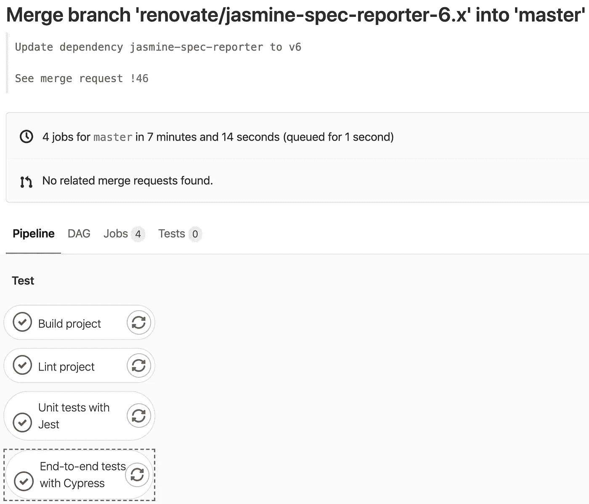

# NPM 的可选依赖项是什么？我们应该在什么时候使用它们？

> 原文：<https://betterprogramming.pub/what-are-npms-optional-dependencies-and-when-should-we-use-them-796a6a964e73>

## 加速构建并减少使用的磁盘空间

克里斯·利维拉尼在 [Unsplash](https://unsplash.com?utm_source=medium&utm_medium=referral) 上的照片。

许多 JavaScript 项目依赖于许多第三方包。其中一些是必需的(例如像 [Bootstrap](https://getbootstrap.com/) 这样的组件库)，而另一些只对开发有用(例如像 [ESLint](https://eslint.org/) 这样的工具)。许多包依赖于其他库，这些库经常在著名的关于`node_modules`文件夹有时太大的迷因中被引用。毕竟，有些项目包含了很少使用的依赖项(例如，对于一个定制的 NPM 脚本)，但是它们仍然每次都被安装。

来自 Reddit 的 Meme。

较大的项目不仅会消耗大量磁盘空间，其结果是安装时间会更长。一些流行的包，如 Puppeteer 或 Cypress，可能会下载大的二进制文件来运行。只要您不是每天都重置开发环境，并且有足够的磁盘空间，这可能根本不是问题。

然而，在像 GitLab CI 或 GitHub Actions 这样的持续集成工具上，这可能是一个更紧迫的问题:

*   如果您有许多开发人员和自动化程序(例如，为依赖关系更新创建 pull 请求的 Dependabot)推送代码，您可能会超出您的使用配额。许多 CI/CD 工具都有使用配额(例如每月 2000 分钟)，如果超过配额，您需要支付额外的使用费用或等到下个月。
*   安装项目的依赖项通常是执行一系列任务(如构建、林挺和测试应用程序)的先决条件。花费的时间越长，就需要等待越长的时间来发现代码中的潜在问题。

要安装或更新一个依赖项，您可以使用`npm install`命令，而理想情况下，您可以使用`npm ci`(从 NPM 版本 6 开始提供)来安装项目的所有依赖项。我在[之前写过](https://medium.com/better-programming/npm-ci-vs-npm-install-which-should-you-use-in-your-node-js-projects-51e07cb71e26)关于`npm ci`和`npm install`的区别。

# 存在哪种依赖关系？

JavaScript 项目有一个`package.json`，您可以在这里定义项目中使用的包。有不同种类的依赖关系:

*   `[dependencies](https://docs.npmjs.com/files/package.json#dependencies)`始终安装。通常，如果缺少依赖项，就会出现问题。例如:像 Bootstrap 这样的 UI 库或者像 React 这样的框架。NPM 建议不要在你的`dependencies`物品中放置测试装具或运输工具。
*   `[devDependencies](https://docs.npmjs.com/files/package.json#devdependencies)`通常是在开发中使用的包，但对于项目的实际功能不是强制性的。例如:像 ESLint 这样的 linters 和 Jest 这样的测试框架。
*   `[peerDependencies](https://docs.npmjs.com/files/package.json#peerdependencies)`是通常不会自动安装的软件包。在某些情况下，您希望表达您的包与另一个包的兼容性，而不包括您自己。当你错过`peerDependencies`时，NPM 会提醒你。示例:react-router 包依赖于 react 的安装。
*   `[bundledDependencies](https://docs.npmjs.com/files/package.json#bundleddependencies)`是在发布包时将被捆绑的包。
*   最后，`[optionalDependencies](https://docs.npmjs.com/files/package.json#optionaldependencies)`是不一定需要安装的依赖项。如果可以使用一个依赖项，但是如果找不到或者安装失败，您希望 npm 继续，那么您可以将它放在`optionalDependencies`对象中。

让我们假设您有一个 web 应用程序，持续集成和部署，以及一套使用 Cypress 的端到端测试。看一下下面的 CI 管道。它由四个不同的并行工作(构建、林挺、单元测试和端到端测试)组成，所有这些工作的第一步都需要安装项目依赖关系。然而，其中只有一个真正需要 Cypress，然而我们总是为每个任务安装所有的包。

作者照片。

因为运行应用程序不需要 Cypress，所以我们可以将它作为一个 dev 依赖项来安装。这已经是很好的一步，但我们可以更进一步。通过安装 Cypress 作为一个可选的依赖项，我们声明它是一个不一定需要安装的可选依赖项。

请注意，处理可选依赖项的缺乏仍然是您的程序的责任。因此，您需要评估一个依赖项是否真的是可选的，并且您可能需要在运行时检查一个可选的依赖项是否真的被安装了。你也应该把这些知识传播给你的同事。否则，经验较少的开发人员可能不理解为什么在他们建立项目或引入新的依赖项时会缺少某些依赖项。

# 如何使用可选的依赖项来加速安装

*   执行`npm install someDependency --save-optional`安装一个软件包作为可选的依赖项。安装包将被放入`optionalDependencies`。
*   当你想避免安装可选的依赖项时，你可以执行`npm ci --no-optional`(比如在像 GitLab CI 这样的 CI 工具上)。
*   使用`npm ci`安装所有的依赖项，包括可选的依赖项(例如在您的开发环境中)。

我在我的本地机器(一台 iMac 4K)和 GitLab CI 上测量了差异。该项目是一个中等规模的 Angular 项目，使用 Cypress 进行端到端测试。我做的唯一一件事是将 Cypress 从一个开发依赖项变成一个可选依赖项。您可以看到，与使用`npm ci`相比，执行`npm ci --no-optional`时安装软件包的时间和数量都大大减少了:

*   之前:使用`npm ci`在大约 67-72 秒内添加了 1，637 个包，以及存储在任何项目之外的大约 550 MB 缓存(在 Mac 上:`/Users/myusername/Library/Caches/Cypress`)。
*   之后:使用`npm ci --no-optional`在大约 27-38 秒内添加了 1，514 个包，没有任何由 Cypress 创建的缓存，因为这个包根本没有安装。

# 结论

感谢您阅读这篇短文。如您所见，NPM 允许我们指定在节点项目中如何使用依赖关系。可选地安装一个依赖项是加快节点项目安装过程的好选择。但是这也不是什么灵丹妙药，因为没有多少依赖项是真正可选的。

你如何使用可选的依赖关系？请在评论中告诉我。